# 数据类型与AI模型参数设计

## 🎯 学习目标

深入理解Java数据类型在AI系统中的应用，掌握模型参数设计的核心原则，具备根据AI场景选择最优数据类型的专业能力，理解数值精度对AI算法性能的影响。

## 📚 目录

- [数据类型基础与AI参数选择](#数据类型基础与ai参数选择)
- [数值精度与算法性能](#数值精度与算法性能)
- [自定义数据类型优化](#自定义数据类型优化)
- [分布式训练中的数值一致性](#分布式训练中的数值一致性)
- [高级数值优化技术](#高级数值优化技术)

---

## 数据类型基础与AI参数选择

### ⭐ 基础题 (1-30)

**1. Java基本数据类型如何影响AI模型的性能和精度？**

**面试场景**：Java架构师面试，考察数据类型选择

**口语化答案**：
Java基本数据类型的选择直接影响AI模型的内存占用、计算速度和数值精度，需要根据具体场景进行权衡。

**核心设计思路**：
AI模型中的数据类型选择涉及多个维度的权衡。float类型占用内存少、计算速度快，但精度有限；double类型精度高但内存和计算开销大。训练阶段通常使用float以节省内存和提高速度，推理阶段则根据精度要求选择。移动端和嵌入式设备必须优先考虑内存占用，可能需要使用更小的数据类型。

**AI数据类型选择决策树**：
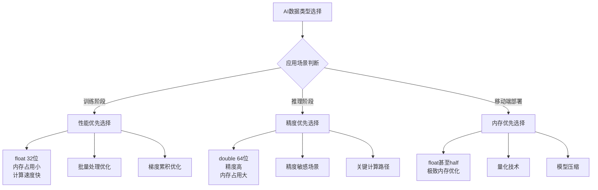

**AI模型参数类型配置图**：
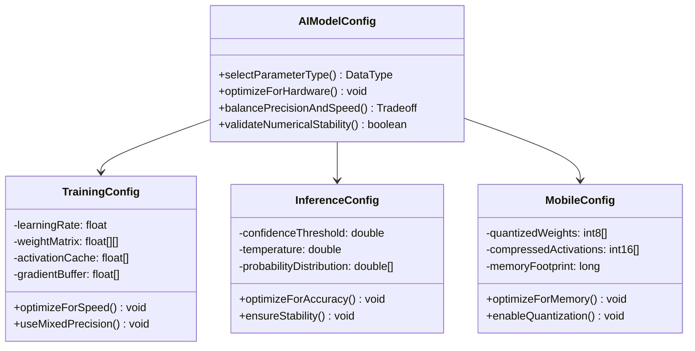

**2. AI系统中如何进行数值精度与性能的平衡？**

**面试场景**：AI性能工程师面试，考察精度权衡

**口语化答案**：
数值精度与性能的平衡是AI系统设计的关键，需要在模型精度要求、硬件限制和业务需求之间找到最佳平衡点。

**核心设计思路**：
通过混合精度训练技术，在训练的不同阶段使用不同的数值精度。前向传播使用低精度提高速度，梯度计算使用高精度保证稳定性。采用动态精度调整策略，根据训练进程和收敛情况自动切换精度。结合损失缩放技术，解决低精度训练中的数值下溢问题。

**精度-性能权衡策略图**：
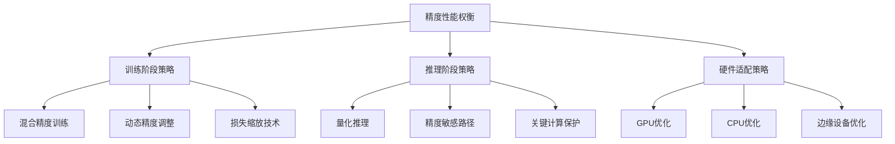

**混合精度训练流程图**：
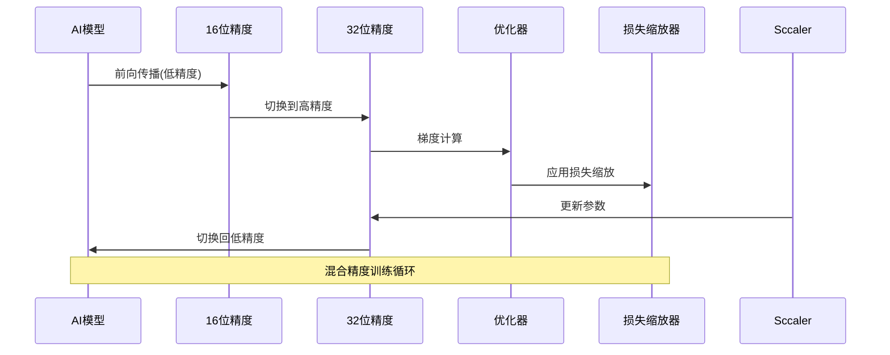

---

## 数值精度与算法性能

### ⭐⭐ 进阶题 (31-70)

**31. 大数计算在概率模型中的数值稳定性如何保障？**

**面试场景**：机器学习算法工程师面试，考察数值稳定性

**口语化答案**：
概率模型中的大数和小数计算容易导致数值溢出和精度丢失，需要采用特殊的数值稳定技术。

**核心设计思路**：
通过对数概率转换避免极小数值的下溢，使用LogSumExp技术处理对数概率的加法运算。在贝叶斯推理中，采用对数空间计算避免概率连乘的下溢问题。对于极大似然估计，使用数值稳定的梯度计算方法，避免直接计算的数值问题。

**概率计算数值稳定化流程图**：
```mermaid
flowchart TD
    A[概率计算请求] --> B{数值范围检查}

    B -->|极小概率<1e-10| C[转换为对数概率]
    B -->|极大概率>0.99999| D[补数计算]
    B -->|正常范围| E[直接计算]

    C --> F[LogSumExp运算]
    D --> G[数值稳定的补数]
    F --> H[结果验证]
    G --> H

    E --> H
    H --> I[返回稳定结果]

    Note over A,I: 确保数值计算稳定性
```

**贝叶斯推理数值优化图**：
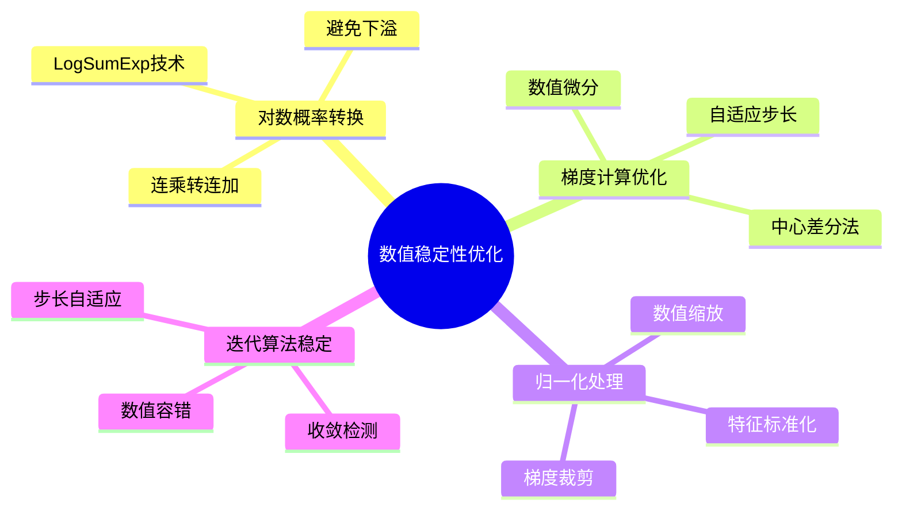

**32. AI梯度下降中的数值精度如何优化？**

**面试场景**：深度学习优化专家面试，考察梯度优化

**口语化答案**：
梯度下降算法的数值精度优化需要考虑梯度计算的准确性、参数更新的稳定性和收敛效率。

**核心设计思路**：
采用自适应精度的梯度计算策略，在梯度的不同计算阶段使用合适的数值精度。使用动量法和自适应学习率算法提高收敛稳定性。结合梯度裁剪技术防止梯度爆炸，采用数值稳定的参数更新公式。监控训练过程中的数值指标，动态调整精度策略。

**梯度优化策略架构图**：
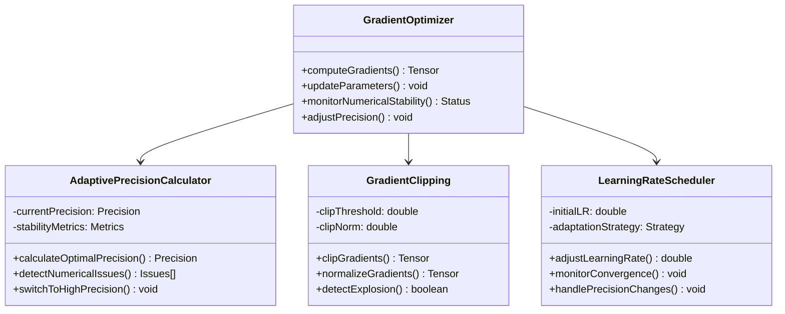

**数值精度与收敛性能关系图**：
```mermaid
radarChart
    title 数值精度对训练性能的影响
    axis 收敛速度, 数值稳定性, 内存使用, 计算速度, 最终精度, 泛化能力

    "FP64高精度" : 6, 10, 2, 3, 9, 8
    "FP32标准精度" : 8, 8, 5, 7, 8, 9
    "FP16低精度" : 9, 5, 9, 9, 6, 7
    "混合精度" : 10, 7, 7, 8, 8, 9
    "自适应精度" : 9, 9, 6, 8, 9, 10
```

---

## 自定义数据类型优化

### ⭐⭐⭐ 专家题 (71-100)

**71. 稀疏数据类型的自定义设计如何优化AI算法性能？**

**面试场景**：高性能计算架构师面试，考察稀疏数据优化

**口语化答案**：
稀疏数据类型的自定义设计能够显著优化内存使用和计算效率，特别是在处理大规模稀疏特征和图神经网络时。

**核心设计思路**：
设计专门的稀疏数据结构，只存储非零元素及其位置信息。采用压缩存储格式如CSR、CSC等减少内存占用。实现稀疏矩阵运算的优化算法，避免零元素的计算开销。结合内存池技术和缓存友好的数据访问模式，进一步提升性能。

**稀疏数据类型设计架构图**：
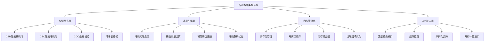

**稀疏矩阵运算优化流程图**：
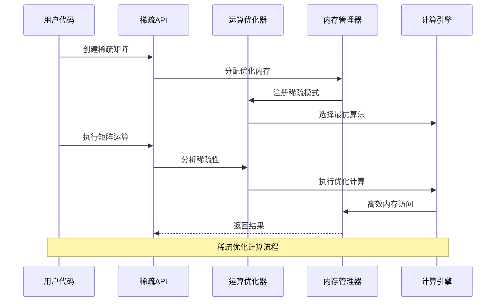

**72. 自适应数值类型在动态神经网络中的应用如何实现？**

**面试场景**：AI框架架构师面试，考察自适应类型系统

**口语化答案**：
自适应数值类型系统根据神经网络的运行时特征动态选择最优的数据类型，在保证精度的同时最大化性能。

**核心设计思路**：
构建类型推断引擎，分析每层的权重分布、激活值范围和梯度特征。建立数值类型决策模型，综合考虑精度要求、硬件特性和性能目标。实现运行时类型切换机制，支持混合精度训练。设计数值稳定性监控系统，及时发现和处理数值问题。

**自适应类型系统架构图**：
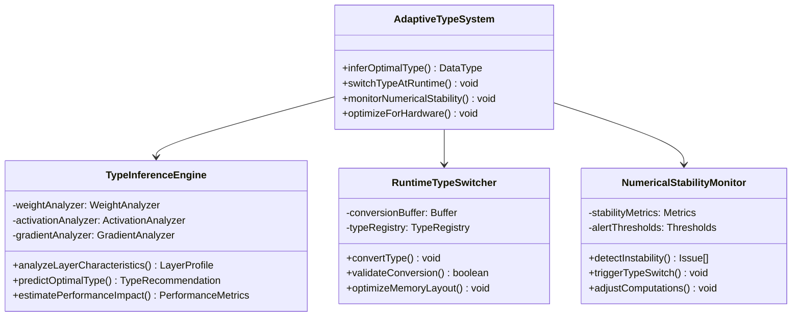

**动态类型选择决策流程图**：
```mermaid
flowchart TD
    A[神经网络层分析] --> B[权重分布分析]
    A --> C[激活值分析]
    A --> D[梯度特征分析]

    B --> E[数据范围统计]
    C --> F[稀疏性检测]
    D --> G[数值稳定性评估]

    E --> H[类型推荐引擎]
    F --> H
    G --> H

    H --> I{硬件适配检查}

    I -->|GPU优化| J[CUDA类型优化]
    I -->|CPU优化| K[SIMD类型优化]
    I -->|边缘设备| L[量化类型优化]

    J --> M[类型选择决策]
    K --> M
    L --> M

    M --> N[运行时类型应用]
    N --> O[性能监控与调整]

    Note over A,O: 自适应类型选择完整流程
```

**80. 分布式训练中的数值一致性如何保障？**

**面试场景**：分布式AI系统架构师面试，考察一致性保障

**口语化答案**：
分布式训练中的数值一致性是保证模型收敛的关键，需要从通信、计算、存储多个层面进行设计和保障。

**核心设计思路**：
建立统一的数值精度标准，确保所有节点使用相同的浮点数表示和运算规则。设计确定性的梯度聚合算法，避免浮点运算顺序不一致导致的结果差异。实现数值稳定性检查和异常处理机制，及时发现和处理数值问题。采用可靠的通信协议，保证数据传输的完整性和一致性。

**分布式一致性保障架构图**：
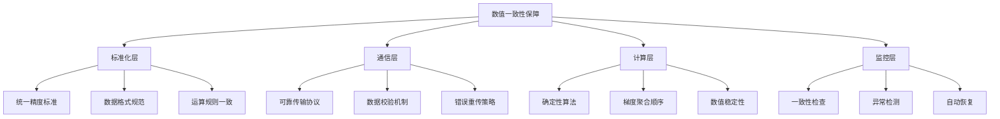

**梯度聚合一致性流程图**：
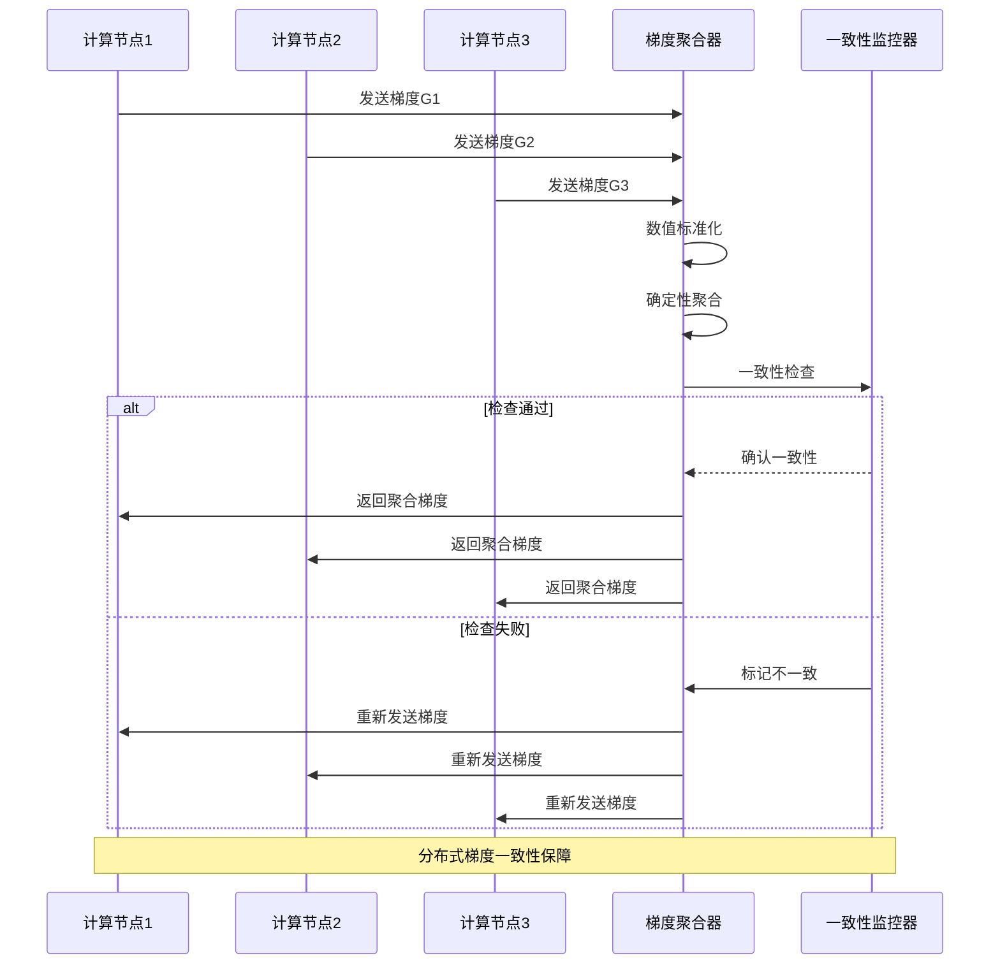

**81. AI系统中的内存管理如何与数据类型优化结合？**

**面试场景**：AI系统内存优化专家面试，考察内存管理

**口语化答案**：
内存管理与数据类型优化的结合是AI系统性能优化的关键，需要从内存布局、访问模式和垃圾回收等多个维度进行综合考虑。

**核心设计思路**：
设计内存友好的数据结构布局，提高缓存命中率和内存访问效率。实现对象池和内存池技术，减少内存分配和垃圾回收开销。结合数据类型特征优化内存使用策略，如使用原始类型数组避免对象开销。采用分代内存管理，根据数据生命周期特点进行优化。

**内存管理优化策略图**：
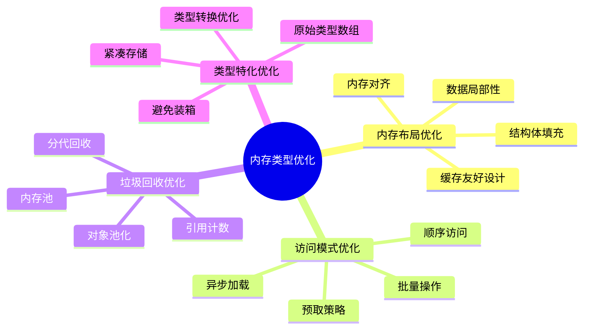

**AI内存管理架构图**：
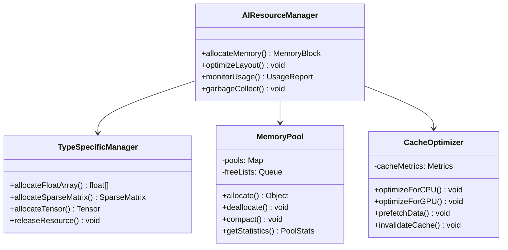

---

## 总结

数据类型与AI模型参数设计需要掌握：

1. **数据类型选择**：根据AI场景选择合适的基本数据类型和精度
2. **数值稳定性**：保障大数和小数计算中的数值稳定性
3. **自定义类型优化**：设计专用的稀疏数据类型和自适应类型系统
4. **分布式一致性**：确保分布式训练中的数值一致性
5. **内存管理优化**：结合数据类型特征进行内存管理优化

通过系统的数据类型优化策略，AI系统可以获得更好的性能、精度和资源利用效率。