# Java泛型在类型安全的AI算法中的应用

## 🎯 学习目标

深入理解Java泛型的核心机制，掌握在AI算法开发中使用泛型实现类型安全的方法，具备设计可复用、类型安全的AI组件能力，理解泛型在AI框架设计中的架构作用。

## 📚 目录

- [泛型基础与AI类型安全](#泛型基础与ai类型安全)
- [泛型类与AI算法模板设计](#泛型类与ai算法模板设计)
- [泛型方法与AI工具类设计](#泛型方法与ai工具类设计)
- [通配符与AI接口设计](#通配符与ai接口设计)
- [高级泛型特性与AI框架设计](#高级泛型特性与ai框架设计)

---

## 泛型基础与AI类型安全

### ⭐ 基础题 (1-30)

**1. 什么是Java泛型？为什么在AI系统中需要泛型？**

**面试场景**：Java开发工程师面试，考察泛型基础概念

**口语化答案**：
Java泛型是编译时类型安全机制，允许在定义类、接口和方法时使用类型参数，让代码能够处理多种数据类型而不丢失类型安全。

**核心设计思路**：
泛型的核心思想是将类型参数化，通过类型参数<T>让类或方法可以操作不同的数据类型。编译器在编译时会进行严格的类型检查，避免运行时的ClassCastException。

**泛型类型系统架构图**：
```
源代码阶段:
class AIModel<T> { T data; }
     ↓ 编译时类型检查
编译后字节码(类型擦除):
class AIModel { Object data; }
     ↓ 运行时类型转换
实际使用:
AIModel<String> model = new AIModel<>(); // 类型安全
```

**AI系统中泛型的应用场景**：

```mermaid
graph TD
    A[AI系统数据类型] --> B[数值型特征向量<br/>Float[], Double[]]
    A --> C[类别标签<br/>String, Integer]
    A --> D[复合数据结构<br/>Tensor, Matrix]

    B --> E[泛型算法接口<br/>Classifier<T>]
    C --> E
    D --> E

    E --> F[类型安全的<br/>统一处理]
```

**AI系统泛型设计的好处**：
1. **编译时类型安全**：防止将String特征向量传入需要Double[]的算法
2. **代码复用**：一套分类器算法可以处理不同数据类型
3. **接口统一**：为Float、Double、Integer等类型提供统一API
4. **性能优化**：避免装箱拆箱，提高数值计算性能

**2. 泛型的类型擦除机制对AI系统有什么影响？**

**面试场景**：中级Java工程师面试，考察类型擦除理解

**口语化答案**：
类型擦除是Java泛型的核心机制，编译器会在编译时擦除泛型信息，插入类型转换代码。

**核心设计思路**：
为了保持向后兼容，Java虚拟机不知道泛型信息。编译器将泛型类型擦除为Object或边界类型，并在需要的地方插入类型转换代码。

**类型擦除过程流程图**：
```mermaid
sequenceDiagram
    participant Dev as 开发者
    participant Compiler as 编译器
    participant JVM as Java虚拟机

    Dev->>Compiler: 编写List<String>
    Compiler->>Compiler: 类型擦除: List<Object>
    Compiler->>Compiler: 插入类型转换检查
    Compiler->>JVM: 生成字节码
    JVM->>JVM: 运行时执行

    Note over Compiler,JVM: 编译器生成的等价代码:
    List list = new ArrayList();
    ((String)list.get(0)) // 类型转换
```

**类型擦除对AI系统的影响**：

```mermaid
graph LR
    A[类型擦除影响] --> B[运行时类型信息丢失]
    A --> C[数组创建限制]
    A --> D[重载约束]
    A --> E[序列化问题]

    B --> F[反射API受限]
    C --> G[不能new T[]]
    D --> H[方法签名冲突]
    E --> I[泛型信息丢失]
```

**AI系统中的解决方案**：
1. **Class<T>参数传递**：传递运行时类型信息
2. **Array.newInstance()**：通过反射创建泛型数组
3. **Supplier<T>工厂**：延迟创建泛型对象
4. **类型令牌模式**：使用TypeToken获取泛型信息

**3. 如何在AI算法中设计泛型接口？**

**面试场景**：Java架构师面试，考察泛型接口设计

**口语化答案**：
泛型接口为AI算法提供了类型安全的抽象层，让不同实现可以处理不同数据类型。

**核心设计思路**：
通过泛型接口定义AI算法的通用行为规范，使用合适的类型参数约束确保类型安全，同时保持接口的灵活性和扩展性。

**AI算法泛型接口架构图**：
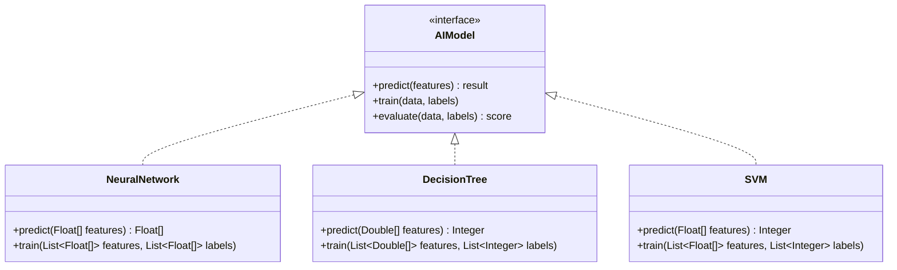

**泛型接口设计模式**：

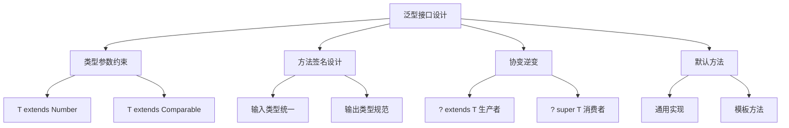

---

## 泛型类与AI算法模板设计

### ⭐⭐ 进阶题 (31-70)

**31. 如何设计泛型的AI算法基类？**

**面试场景**：Java架构师面试，考察泛型类设计

**口语化答案**：
泛型基类为AI算法提供了通用的模板框架，让子类专注于具体算法实现。

**核心设计思路**：
通过泛型基类定义AI算法的通用结构和行为，使用类型参数表示不同的数据类型，结合模板方法模式提供算法框架。

**AI算法基类设计架构**：
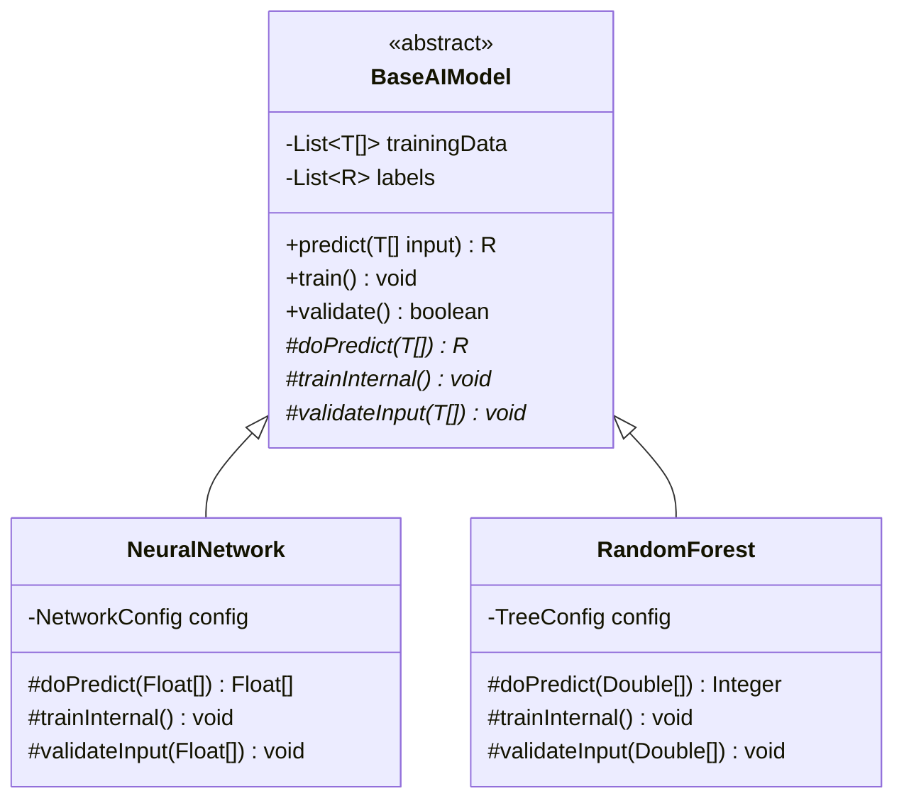

**模板方法执行流程图**：
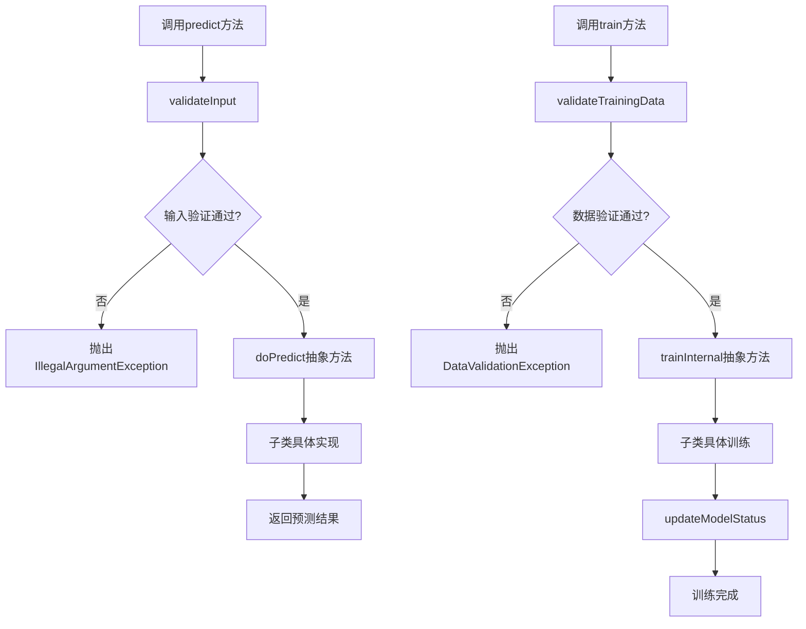

**泛型基类的类型参数设计**：

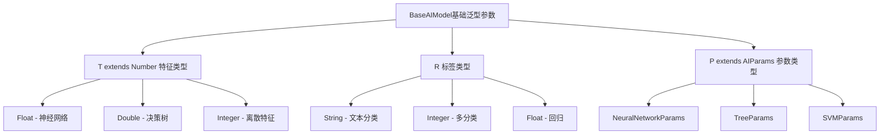

**32. 泛型与继承在AI框架中的应用？**

**面试场景**：高级Java工程师面试，考察泛型继承

**口语化答案**：
泛型继承为AI框架提供了类型安全的扩展机制，允许在继承关系中保持或扩展泛型参数。

**核心设计思路**：
通过泛型继承构建类型安全的AI算法层次结构，子类可以继承父类的泛型参数，也可以添加新的泛型参数或具体化现有参数。

**AI框架泛型继承体系**：
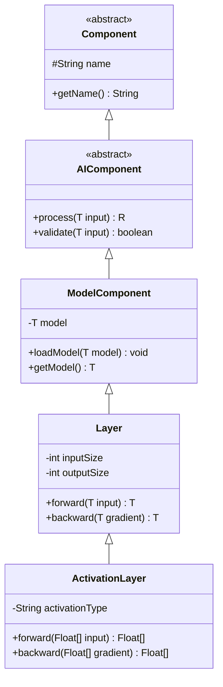

**泛型继承的类型参数传递图**：
```mermaid
graph TB
    A[父类: BaseModel<T, R>] --> B[子类1: NeuralModel<Float, Float[]>]
    A --> C[子类2: TreeModel<Double, Integer>]
    A --> D[子类3: SVMModel<Float[], Integer>]

    B --> E[具体化: T=Float, R=Float[]]
    C --> F[具体化: T=Double, R=Integer]
    D --> G[具体化: T=Float[], R=Integer]

    E --> H[神经网络实现]
    F --> I[决策树实现]
    G --> J[SVM实现]
```

---

## 泛型方法与AI工具类设计

### ⭐⭐⭐ 专家题 (71-100)

**71. 如何设计泛型的AI工具类？**

**面试场景**：Java架构师面试，考察泛型方法设计

**口语化答案**：
泛型方法为AI工具类提供了类型安全的通用操作，让工具方法能够处理不同类型的数据。

**核心设计思路**：
通过泛型方法实现类型安全的工具函数，利用编译器的类型推断简化使用，结合函数式编程提供灵活的数据处理能力。

**AI工具类泛型方法架构**：
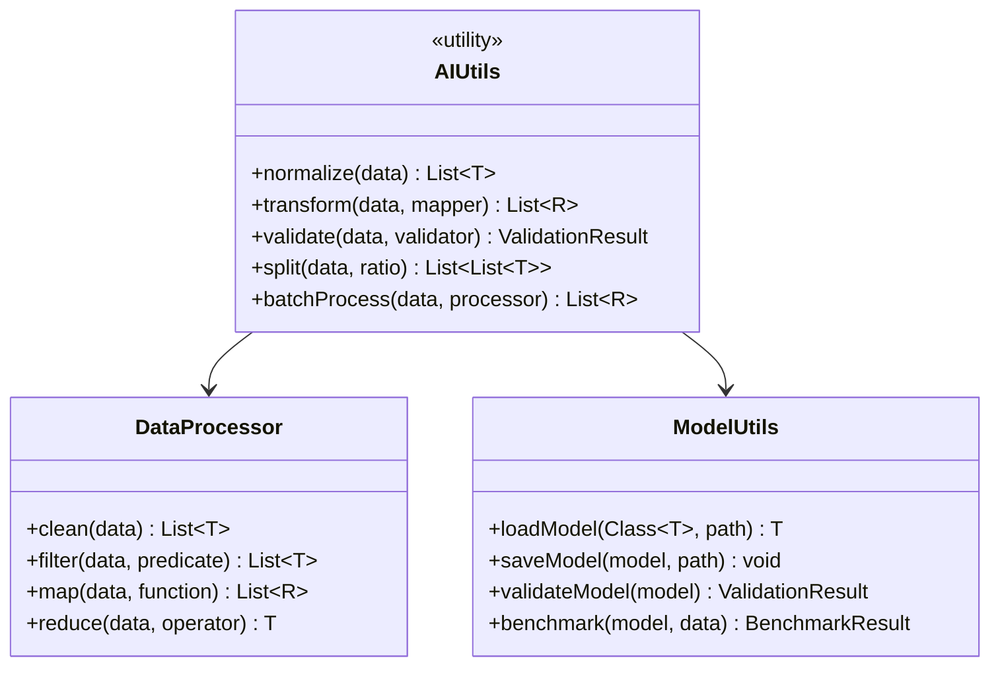

**泛型方法类型推断流程图**：
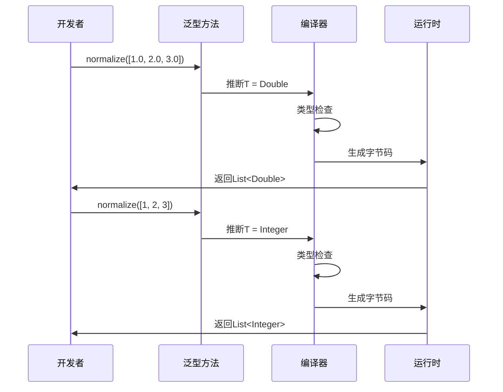

**AI工具类泛型方法设计模式**：

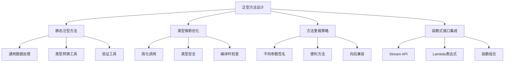

**72. 泛型方法重载在AI系统中的应用？**

**面试场景**：高级Java工程师面试，考察方法重载

**口语化答案**：
泛型方法重载为AI系统提供了灵活的API设计，允许为不同使用场景提供便利的方法。

**核心设计思路**：
通过方法重载提供不同参数签名的便利方法，重载的方法可能有不同的泛型参数，但功能相似。需要避免歧义，确保编译器能正确选择方法。

**泛型方法重载决策树**：
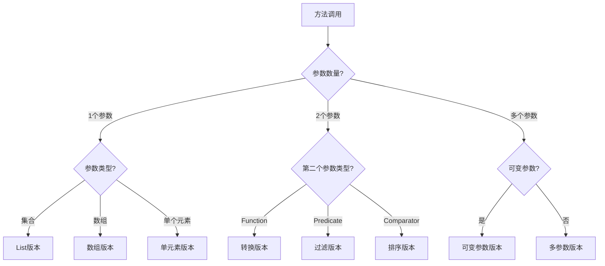

---

## 通配符与AI接口设计

### ⭐⭐⭐ 专家题 (80-100)

**80. PECS原则在AI系统中的应用？**

**面试场景**：Java架构师面试，考察通配符使用

**口语化答案**：
PECS（Producer Extends Consumer Super）原则是通配符使用的重要指导原则，在AI系统中确保类型安全的泛型使用。

**核心设计思路**：
- Producer Extends：生产者使用extends通配符，表示只能读取不能修改
- Consumer Super：消费者使用super通配符，表示只能修改不能读取特定类型

**PECS原则决策矩阵**：
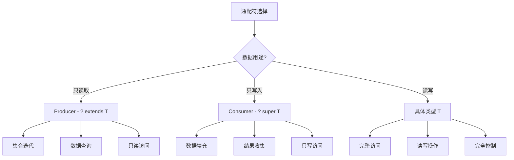

**AI系统中PECS应用场景**：
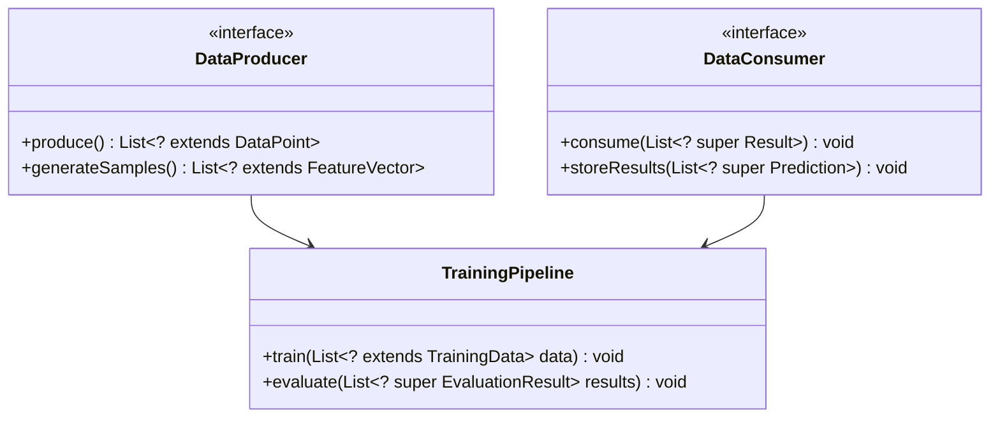

**通配符使用时机决策图**：
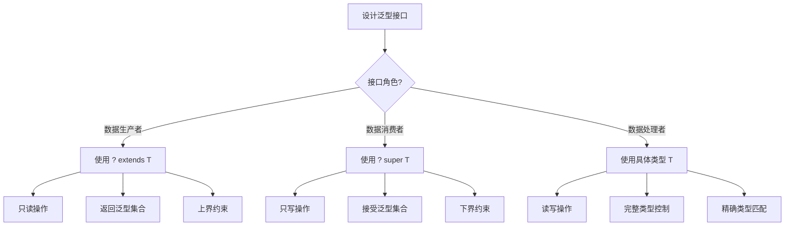

**81. 无界通配符在AI系统中的使用场景？**

**面试场景**：Java架构师面试，考察无界通配符

**口语化答案**：
无界通配符提供了最大的类型灵活性，适用于不需要关心具体类型的通用场景。

**核心设计思路**：
无界通配符表示"任意类型"，在不需要关心具体类型时使用。它提供了最大的灵活性，但限制了可执行的操作。

**无界通配符使用场景图**：
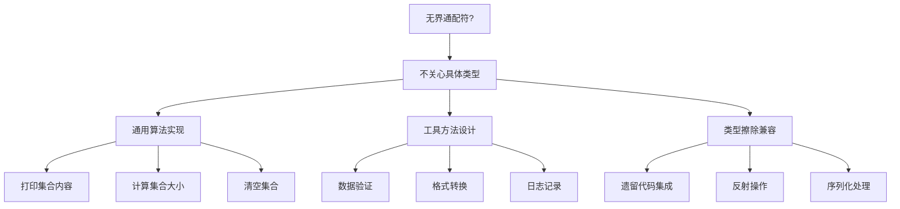

---

## 高级泛型特性与AI框架设计

### ⭐⭐⭐ 专家题 (90-100)

**90. 类型令牌在AI框架中的应用？**

**面试场景**：Java架构师面试，考察类型令牌模式

**口语化答案**：
类型令牌是解决泛型类型擦除问题的有效模式，在AI框架中用于传递运行时类型信息。

**核心设计思路**：
通过Class<T>对象或TypeReference传递运行时类型信息，绕过类型擦除限制，实现泛型类型的动态创建和操作。

**类型令牌实现架构图**：
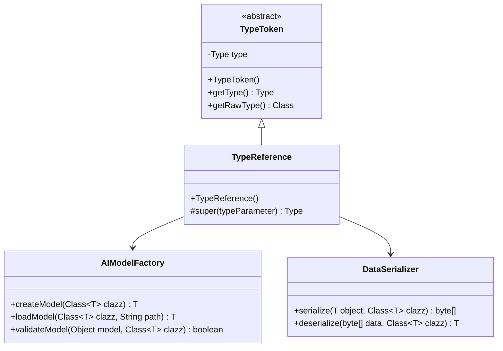

**类型令牌使用流程图**：
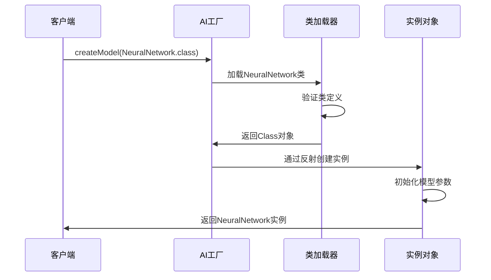

**91. 多重类型参数在AI算法中的应用？**

**面试场景**：Java架构师面试，考察复杂泛型设计

**口语化答案**：
多重类型参数让AI算法可以表达更复杂的类型关系，支持多输入多输出的复杂AI模型。

**核心设计思路**：
通过多个类型参数表示算法中不同类型的数据和关系，这在监督学习、多任务学习等复杂AI场景中非常重要。

**多重类型参数设计图**：
```mermaid
classDiagram
    class SupervisedModel {
        <<interface>>
        +train(List~F~ features, List~L~ labels) void
        +predict(F feature) L
        +evaluate(List~F~ features, List~L~ labels) Score
    }

    class MultiTaskModel {
        <<interface>>
        +train(Map~String, List~F~~ features) void
        +predict(F feature) Map~String, R~
        +addTask(String name, Class~R~ resultType) void
    }

    class PipelineModel {
        <<interface>>
        +addStage(Processor~I, O~ processor) void
        +process(I input) O
        +getStages() List~Processor~
    }

    SupervisedModel <|-- NeuralNetwork
    SupervisedModel <|-- DecisionTree
    MultiTaskModel <|-- MultiTaskNetwork
    PipelineModel <|-- ProcessingPipeline
```

**多重类型参数组合图**：
```mermaid
graph TB
    A[多重类型参数组合] --> B[监督学习 F->L]
    A --> C[多任务学习 F->Map<String,R>]
    A --> D[处理管道 I->O->P]
    A --> E[模型组合 M1,M2->R]

    B --> B1[特征类型F]
    B --> B2[标签类型L]
    B --> B3[F: Float[], L: Integer]

    C --> C1[输入特征F]
    C --> C2[多任务结果R]
    C --> C3[F: Double[], R: Map<String,Object>]

    D --> D1[输入I]
    D --> D2[中间O]
    D --> D3[输出P]

    E --> E1[模型1 M1]
    E --> E2[模型2 M2]
    E --> E3[融合结果R]
```

---

## 总结

Java泛型为AI系统提供了强大的类型安全机制，通过泛型可以实现：

1. **类型安全的AI算法设计**：编译时检查防止类型错误
2. **可复用的AI框架组件**：一套代码处理多种数据类型
3. **灵活的AI接口设计**：通过通配符实现灵活的类型系统
4. **高性能的数值计算**：避免装箱拆箱的开销
5. **可扩展的AI架构**：支持复杂的类型关系和组合

掌握泛型的核心概念和设计模式，是构建高质量AI系统的基础。通过合理的泛型设计，可以实现类型安全、性能优化和代码复用的完美平衡。