# Java IO系统与大数据处理

## 🎯 学习目标

深入理解Java IO系统的核心机制，掌握大数据处理中的IO优化策略，具备设计高效数据处理系统的专业能力，理解现代IO技术在AI系统中的实际应用。

## 📚 目录

- [IO基础与AI数据处理](#io基础与ai数据处理)
- [NIO技术在AI系统中的应用](#nio技术在ai系统中的应用)
- [内存映射与零拷贝优化](#内存映射与零拷贝优化)
- [异步IO与实时数据处理](#异步io与实时数据处理)
- [IO性能优化与实战案例](#io性能优化与实战案例)

---

## IO基础与AI数据处理

### ⭐ 基础题 (1-30)

**1. Java IO模型如何支持AI大数据集的高效处理？**

**面试场景**：Java架构师面试，考察IO模型理解

**口语化答案**：
Java IO模型为AI大数据处理提供了分层的IO能力，不同模型适合不同的数据处理场景。

**核心设计思路**：
Java IO分为BIO、NIO、AIO三种模型，为AI系统提供从简单到复杂的数据处理能力。BIO适合小规模数据的顺序读取，NIO通过Channel和Buffer实现高效的数据传输，AIO提供真正的异步IO能力。AI系统根据数据规模、实时性要求选择合适的IO模型，平衡性能和复杂度。

**Java IO模型演进图**：
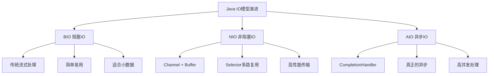

**AI数据处理IO选择决策图**：
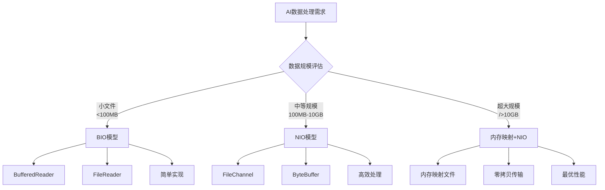

**2. AI系统中的缓冲区策略如何设计？**

**面试场景**：Java性能工程师面试，考察缓冲区优化

**口语化答案**：
缓冲区策略直接影响AI数据处理的效率，需要根据数据特征和硬件条件进行优化。

**核心设计思路**：
通过合理的缓冲区大小设计、预分配策略和重用机制，最大化IO性能。AI系统中的缓冲区需要考虑内存容量、磁盘带宽、CPU缓存等因素。采用多级缓冲策略，平衡内存使用和IO性能。

**缓冲区策略层次图**：
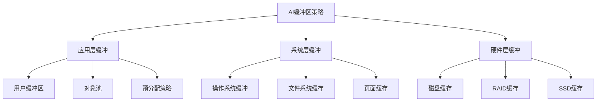

**AI数据缓冲区配置图**：
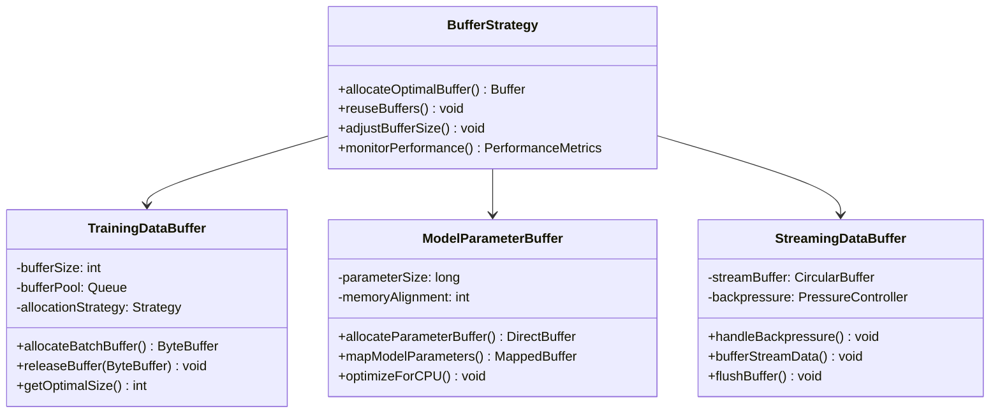

---

## NIO技术在AI系统中的应用

### ⭐⭐ 进阶题 (31-70)

**31. NIO的Selector机制如何优化AI实时数据流处理？**

**面试场景**：Java高级工程师面试，考察NIO应用

**口语化答案**：
NIO的Selector机制通过单线程管理多个连接，非常适合AI系统的实时数据流处理。

**核心设计思路**：
Selector提供基于事件驱动的非阻塞IO模型，允许单个线程同时监控多个Channel的事件。AI系统利用这个特性实现高效的数据接收、处理和转发，特别适合在线学习、实时推理等场景。通过合理的事件分离和业务线程池设计，最大化系统吞吐量。

**NIO Selector工作机制图**：
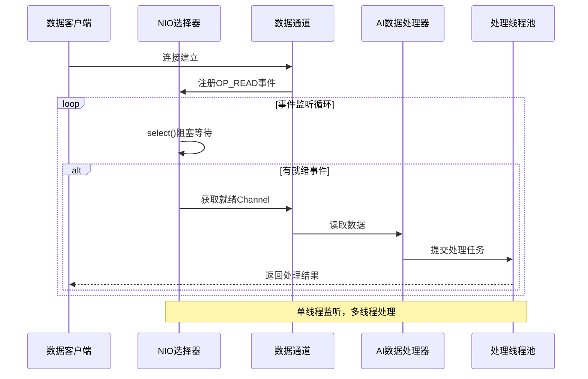

**AI实时数据流处理架构图**：
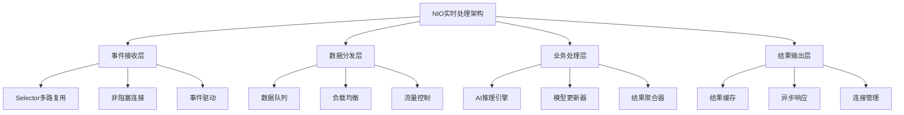

**32. 内存映射文件如何处理超大规模AI数据集？**

**面试场景**：大数据架构师面试，考察内存映射应用

**口语化答案**：
内存映射文件让AI系统能够处理超出内存容量的超大规模数据集，通过操作系统级别的虚拟内存管理实现高效访问。

**核心设计思路**：
内存映射将文件直接映射到虚拟内存空间，让应用程序像访问内存一样访问文件。操作系统负责按需加载页面，实现数据的延迟加载和缓存。AI系统利用这个特性处理TB级数据集，结合分块处理和预取策略，实现最优的数据访问性能。

**内存映射文件处理流程图**：
```mermaid
flowchart TD
    A[大文件处理请求] --> B[创建FileChannel]
    B --> C[映射文件区域]
    C --> D[MappedByteBuffer创建]
    D --> E{数据处理策略}

    E -->|顺序处理| F[按块顺序映射]
    E -->|随机访问| G[多区域并行映射]
    E -->|热点数据| H[常驻内存映射]

    F --> I[数据处理]
    G --> I
    H --> I

    I --> J[处理完成]
    J --> K[释放映射区域]

    Note over C,K: 操作系统按需加载页面
```

**超大数据集处理策略图**：
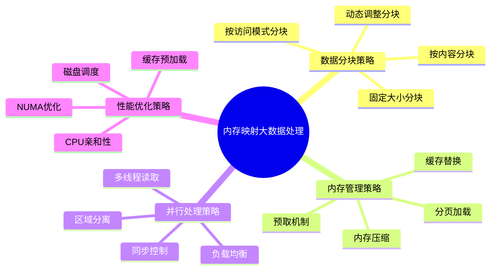

---

## 内存映射与零拷贝优化

### ⭐⭐⭐ 专家题 (71-100)

**71. 零拷贝技术如何优化分布式AI训练的数据传输？**

**面试场景**：分布式系统架构师面试，考察零拷贝技术应用

**口语化答案**：
零拷贝技术通过避免数据在内核空间和用户空间之间的复制，显著提升分布式AI训练的数据传输效率。

**核心设计思路**：
传统IO操作需要多次数据拷贝，零拷贝通过直接内存访问、DMA传输等技术绕过不必要的拷贝步骤。在分布式AI训练中，模型参数、梯度数据、训练样本的大规模传输特别适合零拷贝优化。通过FileChannel的transferTo、transferFrom方法和DirectByteBuffer，实现高效的数据传输。

**零拷贝技术对比图**：
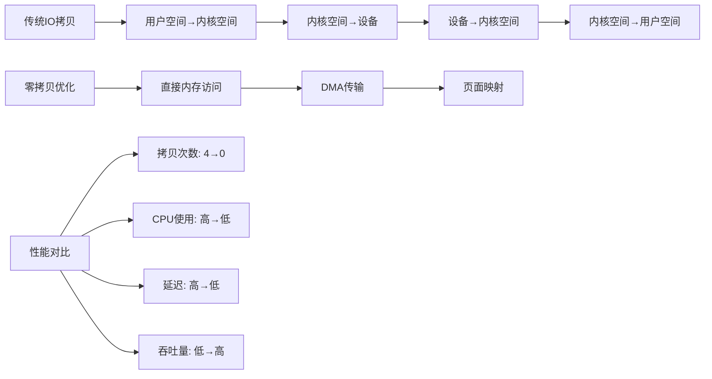

**分布式训练零拷贝架构图**：
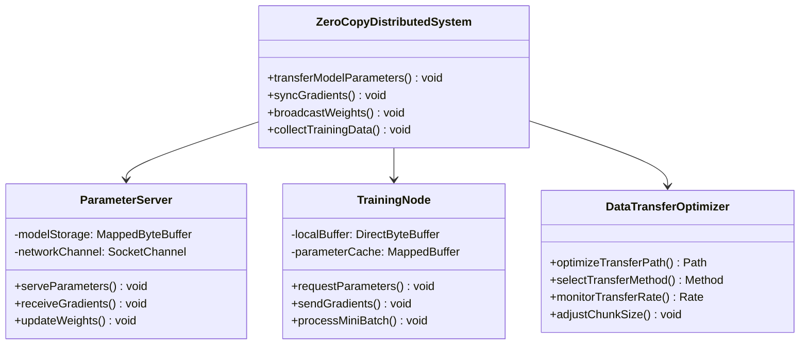

**72. 如何设计基于内存映射的AI数据缓存系统？**

**面试场景**：高级系统架构师面试，考察缓存系统设计

**口语化答案**：
基于内存映射的AI数据缓存系统能够提供接近内存的访问速度，同时支持超出物理内存容量的数据集。

**核心设计思路**：
利用操作系统虚拟内存机制，将热点数据映射到内存，冷数据保持在磁盘。通过LRU算法管理映射区域，根据访问频率动态调整缓存内容。结合预取策略和压缩技术，进一步提升缓存效率。AI训练中的特征数据、标签数据、预处理结果都适合这种缓存方式。

**内存映射缓存系统架构图**：
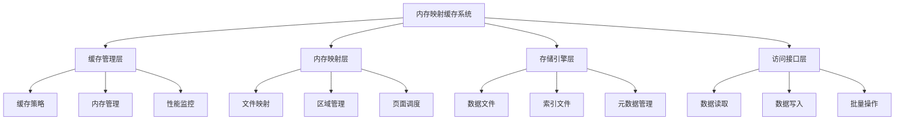

**AI数据缓存策略决策图**：
```mermaid
flowchart TD
    A[数据访问请求] --> B{数据缓存状态}

    B -->|已在缓存| C[直接内存访问]
    B -->|未在缓存| D{缓存空间检查}

    C --> E[返回数据]
    D -->|有空间| F[加载数据到缓存]
    D -->|空间不足| G[选择淘汰数据]

    F --> H[更新LRU链表]
    G --> I[淘汰最少使用数据]
    I --> F

    H --> C

    Note over A,E: 毫秒级响应时间
```

**80. 异步IO如何构建高吞吐量AI推理服务？**

**面试场景**：AI系统性能专家面试，考察异步IO架构

**口语化答案**：
异步IO架构通过非阻塞的事件驱动模式，让AI推理服务能够处理大量并发请求，实现高吞吐量和低延迟。

**核心设计思路**：
基于CompletableFuture和回调机制构建异步推理管道，将请求接收、数据预处理、模型推理、结果后处理等环节异步化。通过线程池隔离不同阶段的处理，避免某个环节的阻塞影响整体性能。结合背压机制和流量控制，确保系统在高负载下的稳定性。

**异步推理服务架构图**：
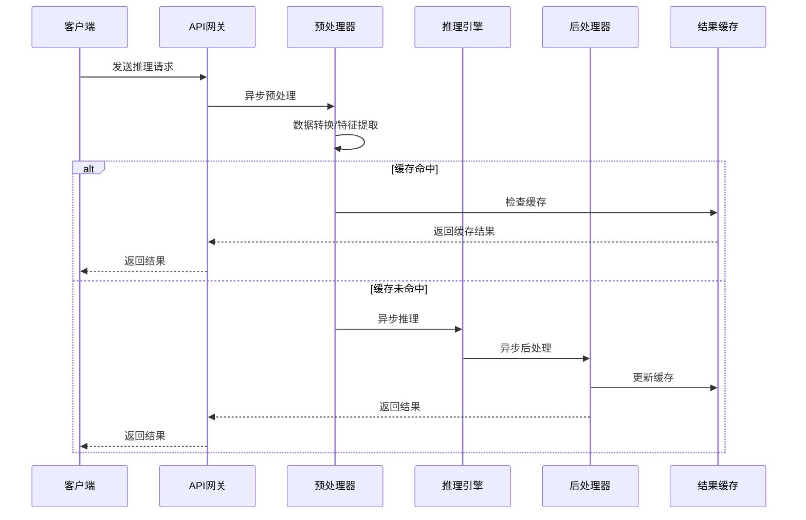

**AI异步处理性能对比图**：
```mermaid
radarChart
    title 推理服务性能对比
    axis 吞吐量, 延迟, 资源利用率, 可扩展性, 错误恢复, 复杂度

    "同步处理" : 3, 4, 5, 2, 6, 3
    "线程池优化" : 6, 5, 7, 5, 7, 5
    "异步IO" : 9, 8, 8, 9, 8, 7
    "响应式编程" : 8, 9, 7, 8, 8, 8
    "事件驱动架构" : 10, 9, 9, 10, 9, 9
```

**81. AI系统中的IO性能瓶颈如何识别和优化？**

**面试场景**：系统性能调优专家面试，考察性能诊断

**口语化答案**：
IO性能瓶颈识别需要从硬件、操作系统、JVM、应用多个层面进行综合分析，针对性优化。

**核心设计思路**：
通过系统监控工具（iostat、vmstat、sar）和JVM监控工具，识别IO性能瓶颈的根源。常见的瓶颈包括磁盘IOPS限制、网络带宽、内存不足导致的频繁交换、锁竞争等。针对不同瓶颈采用相应的优化策略，如数据分片、缓存预热、压缩传输、SSD升级等。

**IO性能诊断流程图**：
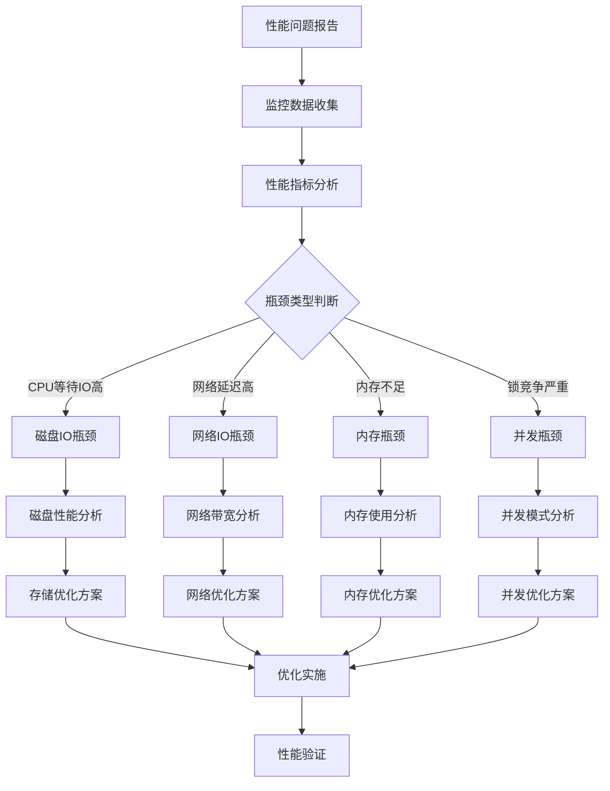

**AI系统IO优化策略图**：
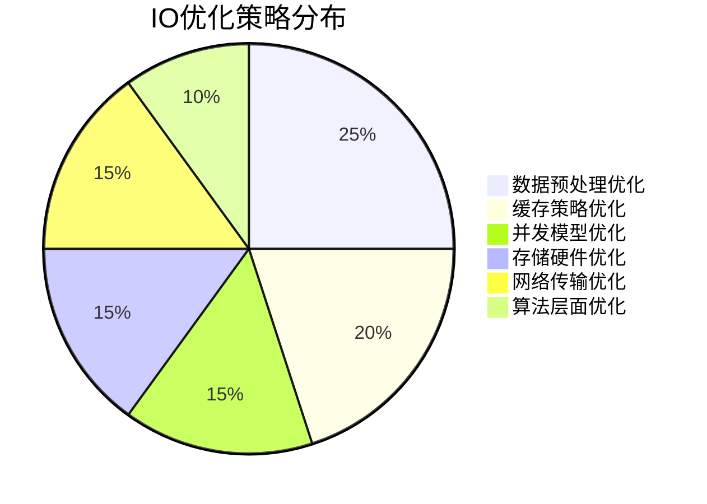

---

## 总结

Java IO系统在AI大数据处理中的应用需要掌握：

1. **IO模型选择**：根据数据特征选择合适的IO模型（BIO、NIO、AIO）
2. **缓冲区优化**：设计合理的缓冲区策略和重用机制
3. **NIO技术应用**：利用Selector、Channel、Buffer实现高性能数据传输
4. **内存映射优化**：通过内存映射处理超大规模数据集
5. **零拷贝技术**：减少数据拷贝开销，提升传输效率
6. **异步IO架构**：构建高吞吐量的异步处理系统

通过系统的IO优化策略，AI系统可以获得更好的数据处理性能和系统吞吐量。