# JVM内存管理在AI模型训练中的应用

## 🎯 学习目标

深入理解JVM内存管理的核心机制，掌握AI模型训练中的内存优化策略，具备解决复杂内存问题的能力，理解大模型训练中的内存分配和回收机制。

## 📚 目录

- [JVM内存区域与AI数据模型](#jvm内存区域与ai数据模型)
- [堆内存管理与大数据处理](#堆内存管理与大数据处理)
- [垃圾回收与AI系统性能](#垃圾回收与ai系统性能)
- [内存泄漏分析与预防](#内存泄漏分析与预防)
- [AI系统内存调优实战](#ai系统内存调优实战)

---

## JVM内存区域与AI数据模型

### ⭐ 基础题 (1-30)

**1. JVM内存模型如何支持AI大模型的内存需求？**

**面试场景**：Java架构师面试，考察JVM内存模型理解

**口语化答案**：
JVM内存模型为AI大模型提供了分层的内存管理机制，不同区域承担不同的存储责任。

**核心设计思路**：
JVM内存分为线程共享的堆和方法区，以及线程私有的栈和程序计数器。AI模型训练需要将这些区域合理分配：堆内存存储模型参数和训练数据，方法区存储类信息和算法实现，栈内存处理方法调用和临时变量。

**JVM内存模型架构图**：
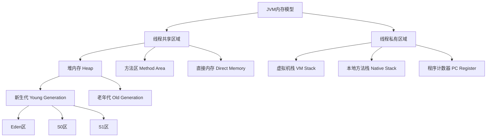

**AI模型内存分配策略图**：
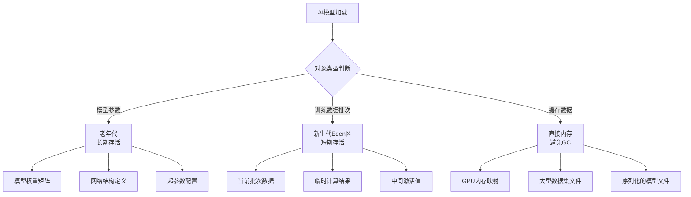

**2. AI训练中的堆内存分配策略如何设计？**

**面试场景**：Java性能工程师面试，考察内存分配策略

**口语化答案**：
AI训练的堆内存分配需要考虑对象生命周期、访问模式和GC压力。

**核心设计思路**：
通过合理的对象生命周期管理、分代分配策略和内存预分配，优化AI训练的内存使用效率。重点是减少GC停顿时间和内存碎片。

**堆内存分配决策流程图**：
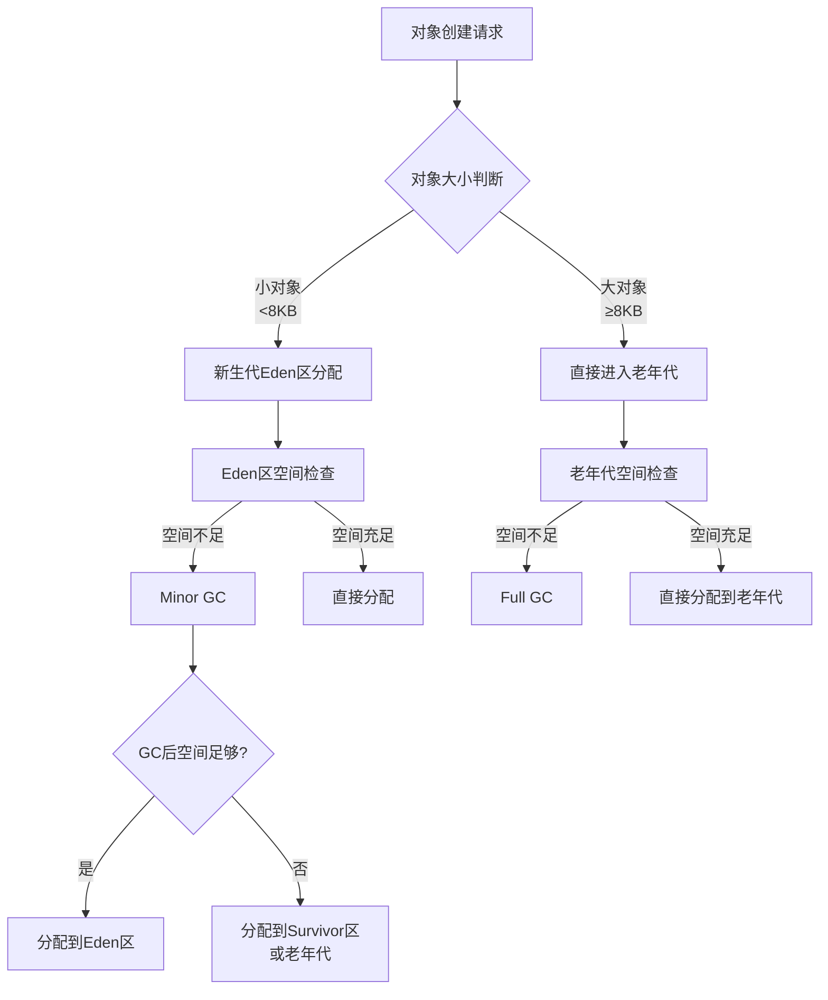

**AI对象内存分配模式图**：
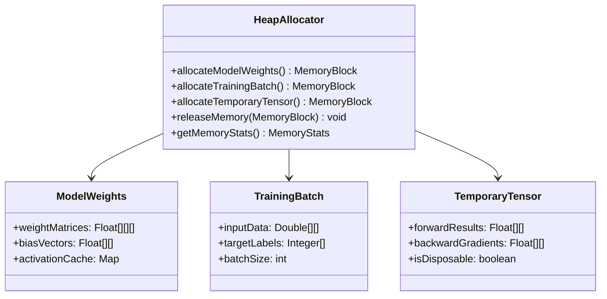

---

## 堆内存管理与大数据处理

### ⭐⭐ 进阶题 (31-70)

**31. 如何优化AI大数据集的堆内存使用？**

**面试场景**：Java架构师面试，考察大数据内存优化

**口语化答案**：
AI大数据集的内存优化需要从数据结构、处理策略和GC调优多方面考虑。

**核心设计思路**：
通过数据分片处理、对象池化、内存映射等技术，在保证处理效率的同时最小化内存占用。重点是避免全量数据加载到内存，采用流式处理和按需加载。

**大数据内存优化策略图**：
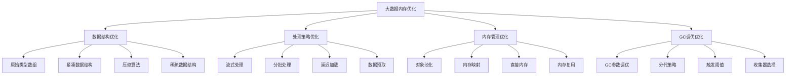

**流式数据处理架构图**：
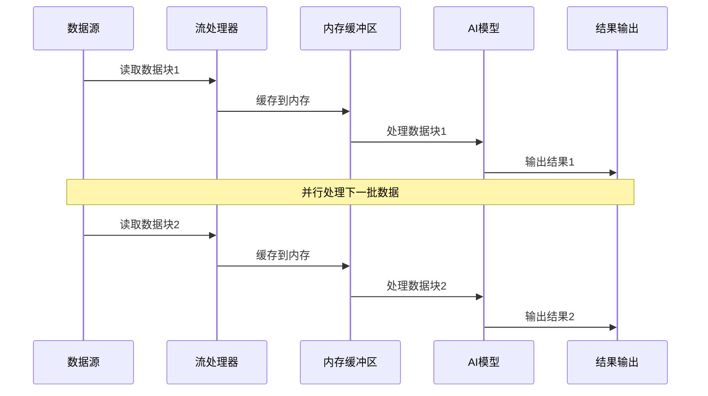

**32. AI模型参数的内存布局如何优化？**

**面试场景**：高性能计算工程师面试，考察内存布局优化

**口语化答案**：
AI模型参数的内存布局直接影响计算效率和缓存命中率。

**核心设计思路**：
通过数据局部性优化、内存对齐、缓存友好的数据结构设计，提高AI模型计算的性能。重点是理解CPU缓存层次结构和内存访问模式。

**模型参数内存布局图**：
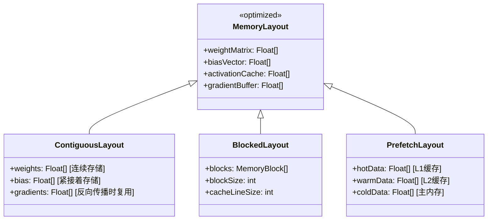

**缓存友好访问模式图**：
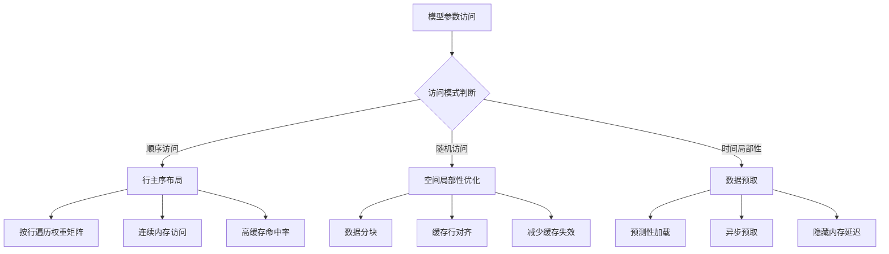

---

## 垃圾回收与AI系统性能

### ⭐⭐⭐ 专家题 (71-100)

**71. 如何选择适合AI训练的GC算法？**

**面试场景**：Java性能专家面试，考察GC算法选择

**口语化答案**：
AI训练的GC算法选择需要平衡吞吐量、延迟和内存占用。

**核心设计思路**：
根据AI训练的特点（大量短期对象、批量数据处理、低延迟要求）选择合适的GC算法。重点是理解不同GC算法的适用场景和调优参数。

**GC算法选择决策树**：
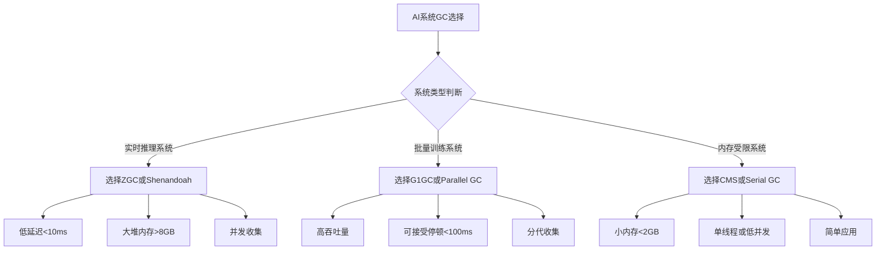

**GC算法性能对比图**：
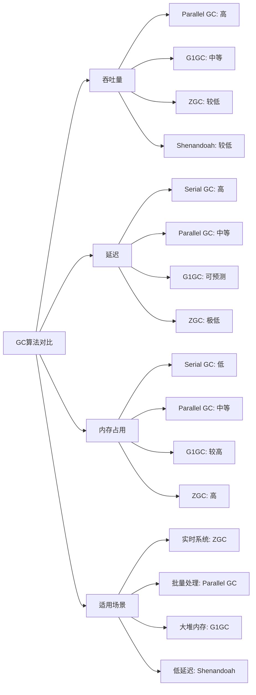

**72. AI系统中的GC调优策略有哪些？**

**面试场景**：Java性能调优专家面试

**口语化答案**：
AI系统的GC调优需要针对AI特有的内存模式进行优化。

**核心设计思路**：
通过调整JVM参数、优化对象分配模式、减少临时对象创建等方式，提高GC效率。重点是理解AI应用的内存分配特点和GC触发机制。

**GC调优策略架构图**：
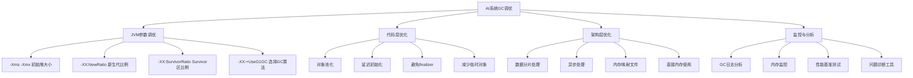

**GC性能监控流程图**：
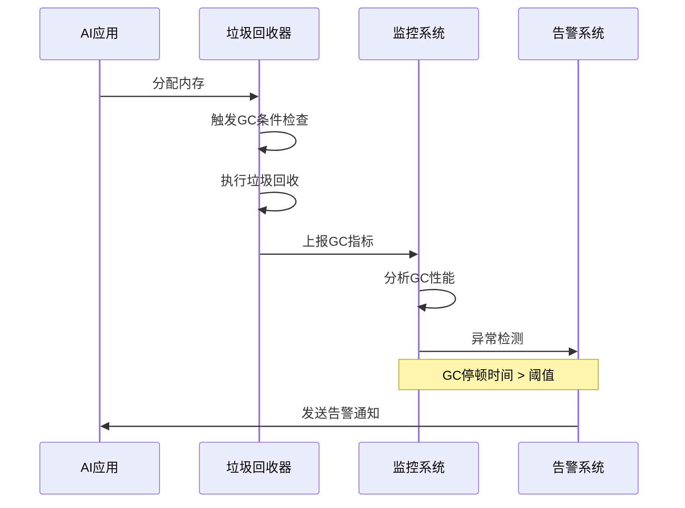

---

## 内存泄漏分析与预防

### ⭐⭐⭐ 专家题 (80-100)

**80. AI系统中的内存泄漏常见原因有哪些？**

**面试场景**：Java架构师面试，考察内存泄漏分析

**口语化答案**：
AI系统中的内存泄漏主要来自缓存、监听器、静态引用等。

**核心设计思路**：
通过理解对象引用关系、生命周期管理、资源释放机制，识别和预防内存泄漏。重点是分析AI系统特有的内存使用模式。

**内存泄漏原因分类图**：
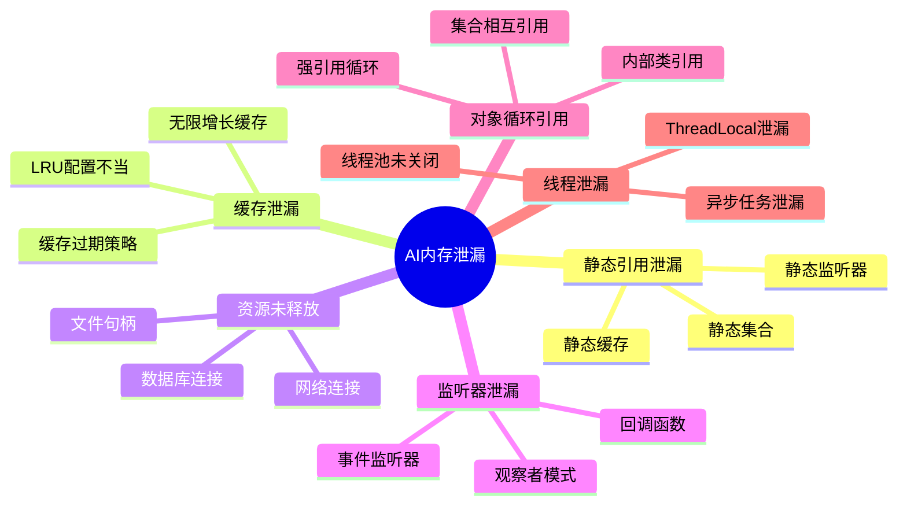

**内存泄漏检测流程图**：
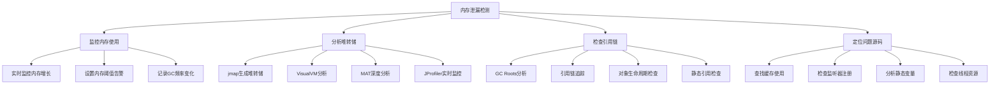

**81. 如何设计AI系统的内存监控体系？**

**面试场景**：系统架构师面试，考察监控体系设计

**口语化答案**：
AI系统的内存监控需要多层次、多维度的监控能力。

**核心设计思路**：
通过构建从JVM层面到应用层面的完整监控体系，实现内存使用的可视化、告警和自动化调优。

**内存监控体系架构图**：
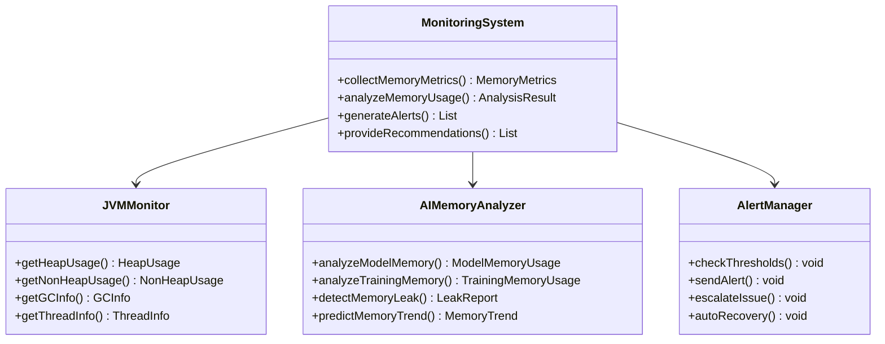

**监控数据流程图**：
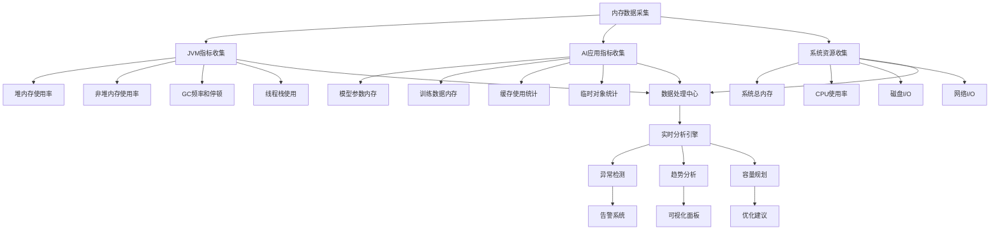

---

## AI系统内存调优实战

### ⭐⭐⭐ 专家题 (90-100)

**90. 大型AI模型的内存预算如何规划？**

**面试场景**：AI架构师面试，考察内存规划能力

**口语化答案**：
大型AI模型的内存预算规划需要考虑模型大小、训练数据、中间计算结果等多方面因素。

**核心设计思路**：
通过精确的内存需求分析和合理的资源分配，确保AI训练的稳定性和效率。重点是理解内存占用的各个组成部分和优化策略。

**内存预算规划流程图**：
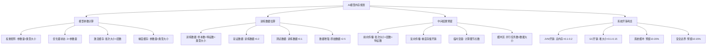

**内存分配策略图**：
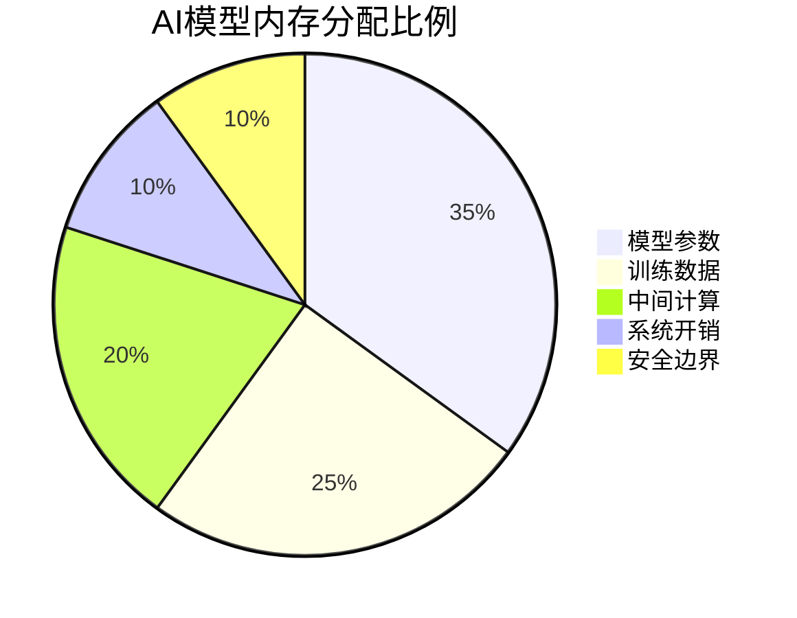

**91. 如何实现AI系统的自适应内存管理？**

**面试场景**：高级系统架构师面试，考察自适应系统设计

**口语化答案**：
自适应内存管理让AI系统能根据运行时情况动态调整内存使用策略。

**核心设计思路**：
通过监控内存使用模式、预测内存需求、动态调整参数，实现智能化的内存管理。重点是建立反馈循环和预测模型。

**自适应内存管理架构图**：
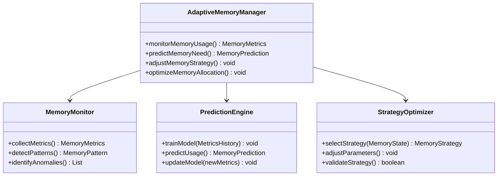

**自适应调整流程图**：
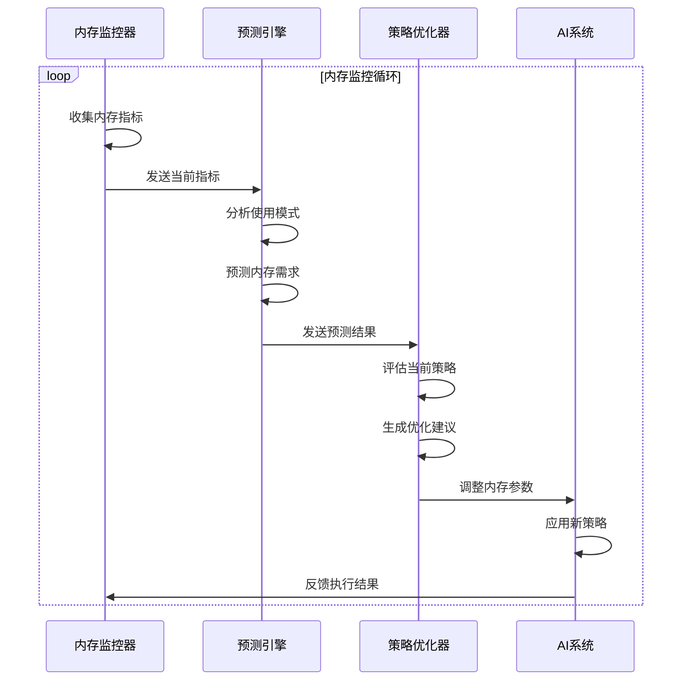

---

## 总结

JVM内存管理在AI系统中的应用需要综合考虑：

1. **内存区域合理分配**：根据AI数据特点优化各内存区域使用
2. **GC算法选择**：平衡吞吐量和延迟，选择适合AI训练的GC策略
3. **内存泄漏预防**：识别AI系统特有的内存泄漏模式并制定预防措施
4. **监控体系建设**：构建多层次的内存监控和告警体系
5. **自适应管理**：实现智能化的内存预测和动态调整

通过深入理解JVM内存管理机制和AI系统特点，可以设计出高效、稳定的AI训练环境。