# JIT编译优化在AI推理加速中的应用

## 🎯 学习目标

深入理解JIT编译器的核心机制，掌握AI推理系统的JIT优化策略，具备解决AI性能瓶颈的专业能力，理解现代JVM编译技术在大规模AI系统中的应用。

## 📚 目录

- [JIT编译基础与AI性能](#jit编译基础与ai性能)
- [热点代码识别与AI优化](#热点代码识别与ai优化)
- [编译器优化技术](#编译器优化技术)
- [GraalVM与AI应用](#graalvm与ai应用)
- [AI系统JIT调优实战](#ai系统jit调优实战)

---

## JIT编译基础与AI性能

### ⭐ 基础题 (1-30)

**1. JIT编译器如何影响AI推理性能？**

**面试场景**：Java性能工程师面试，考察JIT编译基础

**口语化答案**：
JIT编译器通过将热点字节码编译为本地机器码，显著提升AI推理性能。

**核心设计思路**：
JIT编译器采用分层编译策略，C1编译器进行快速编译，C2编译器进行深度优化。AI推理中的热点代码(如矩阵运算、激活函数)会被识别并编译，通过内联缓存、循环优化等技术大幅提升执行效率。

**JIT编译层次架构图**：
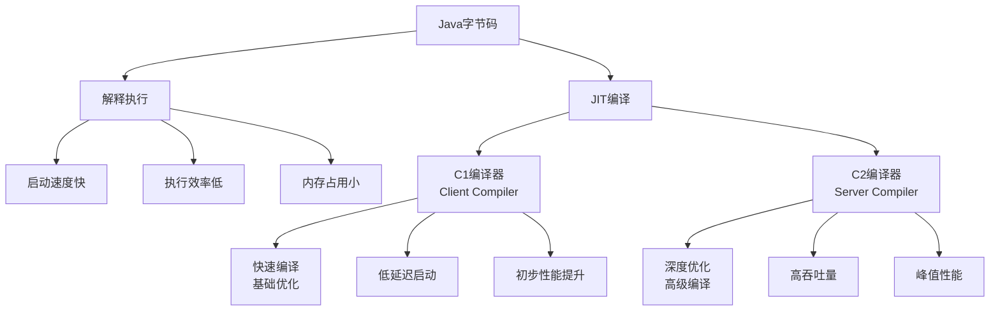

**AI推理性能影响图**：
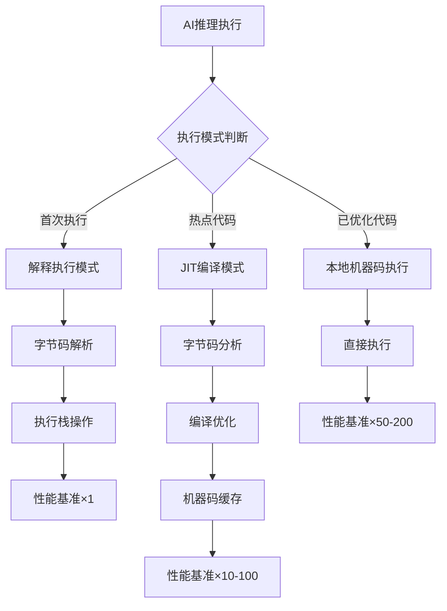

**2. AI系统中的分层编译策略如何设计？**

**面试场景**：Java架构师面试，考察分层编译理解

**口语化答案**：
分层编译策略在AI系统中需要平衡编译时间和执行性能。

**核心设计思路**：
通过C1编译器快速编译AI推理的基础路径，确保系统快速响应；通过C2编译器深度优化计算密集型代码，提升长期运行性能。动态调整编译阈值，根据AI系统的实际使用模式优化编译策略。

**分层编译决策流程图**：
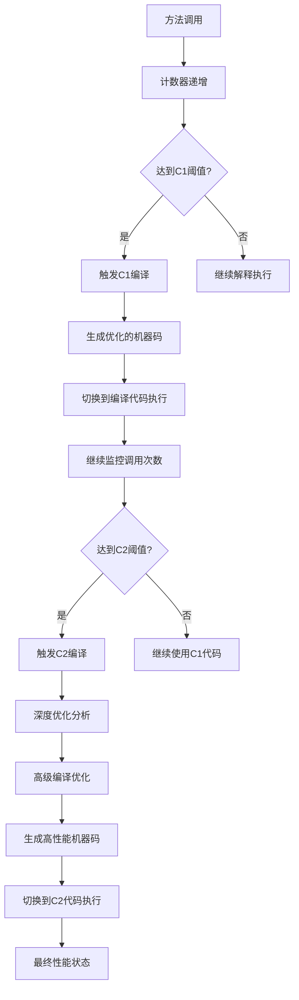

**AI编译策略配置图**：
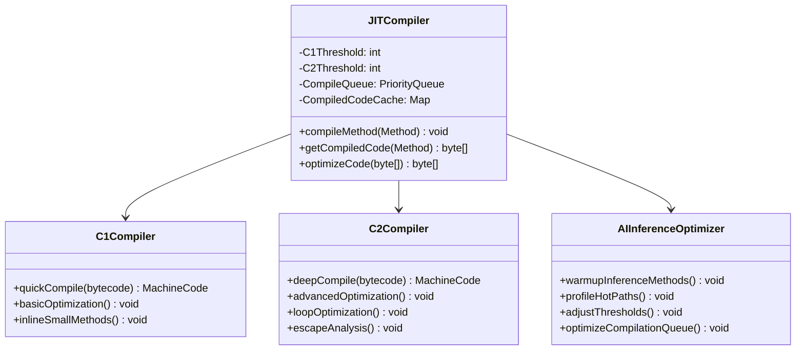

---

## 热点代码识别与AI优化

### ⭐⭐ 进阶题 (31-70)

**31. 如何识别AI推理中的热点代码？**

**面试场景**：Java性能专家面试，考察热点识别

**口语化答案**：
AI推理中的热点代码识别需要结合方法调用频率和执行时间来分析。

**核心设计思路**：
通过JVM的Profiler工具和采样计数器，识别AI推理中执行频率高、耗时长的关键方法。重点关注矩阵运算、激活函数、前向传播等计算密集型代码段。

**热点代码识别流程图**：
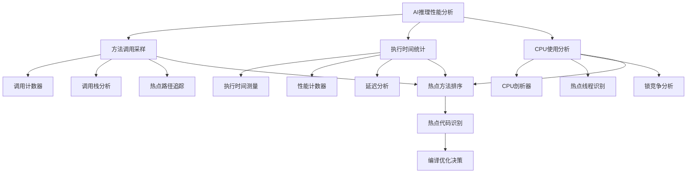

**AI推理热点代码分类图**：
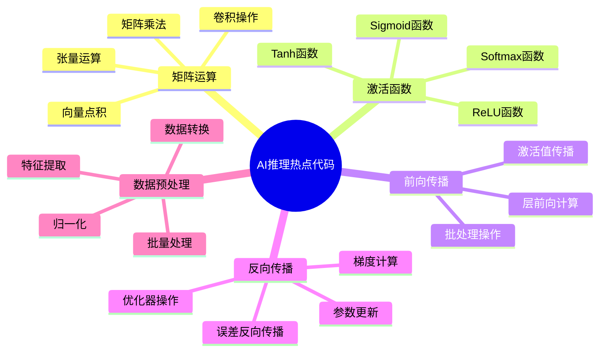

**32. AI系统中的循环优化如何实现？**

**面试场景**：Java性能优化工程师面试，考察循环优化

**口语化答案**：
循环优化对AI推理性能至关重要，特别是神经网络中的批处理和迭代计算。

**核心设计思路**：
通过循环展开、循环不变量外提、循环合并等技术，优化AI推理中的循环结构。重点是识别循环不变的计算，并将其移到循环外部，减少重复计算的开销。

**循环优化策略图**：
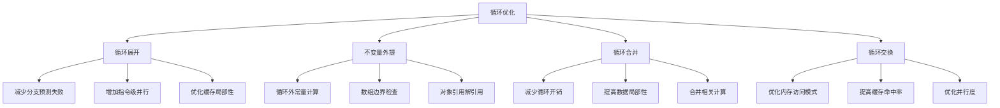

**AI矩阵运算循环优化示例图**：
```mermaid
sequenceDiagram
    participant Original as 原始代码
    participant Optimizer as 优化器
    participant Result as 优化结果

    Original->>Optimizer: for(int i=0; i<n; i++) { result += a[i] * b[i]; }
    Optimizer->>Optimizer: 分析循环模式
    Optimizer->>Optimizer: 识别SIMD优化机会
    Optimizer->>Optimizer: 生成向量化代码
    Optimizer->>Result: 向量化指令执行

    Note over Original,Result: 性能提升4-8倍
```

---

## 编译器优化技术

### ⭐⭐⭐ 专家题 (71-100)

**71. 逃逸分析如何优化AI对象分配？**

**面试场景**：Java架构师面试，考察逃逸分析

**口语化答案**：
逃逸分析是JIT编译器的重要优化技术，可以减少AI系统中的对象分配开销。

**核心设计思路**：
通过分析对象的生命周期和作用域，判断对象是否会"逃逸"到方法外。不逃逸的对象可以直接在栈上分配或进行标量替换，避免GC压力。

**逃逸分析决策流程图**：
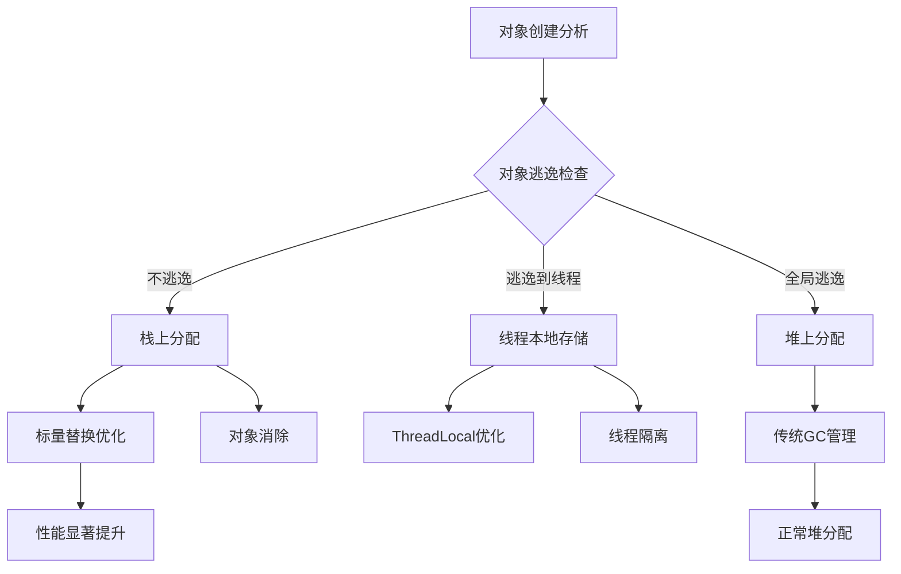

**AI对象逃逸分析示例图**：
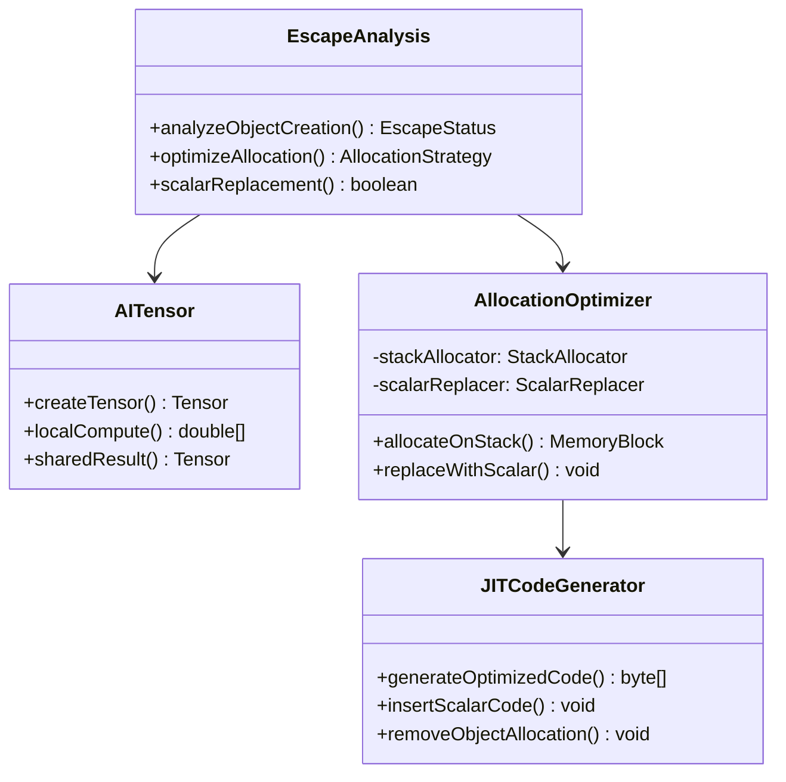

**逃逸分析在AI系统中的应用**：
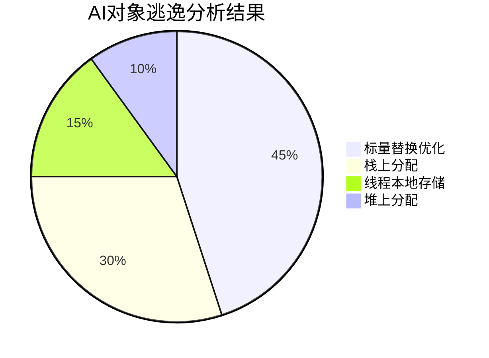

**72. 内联缓存如何优化AI方法调用？**

**面试场景**：Java性能专家面试，考察内联优化

**口语化答案**：
内联缓存是JIT编译器的核心优化技术，通过消除方法调用开销提升AI推理性能。

**核心设计思路**：
将频繁调用的小方法直接内联到调用点，避免方法调用的开销。在AI系统中，特别关注神经网络层间调用、激活函数、损失函数等高频调用方法。

**内联决策树**：
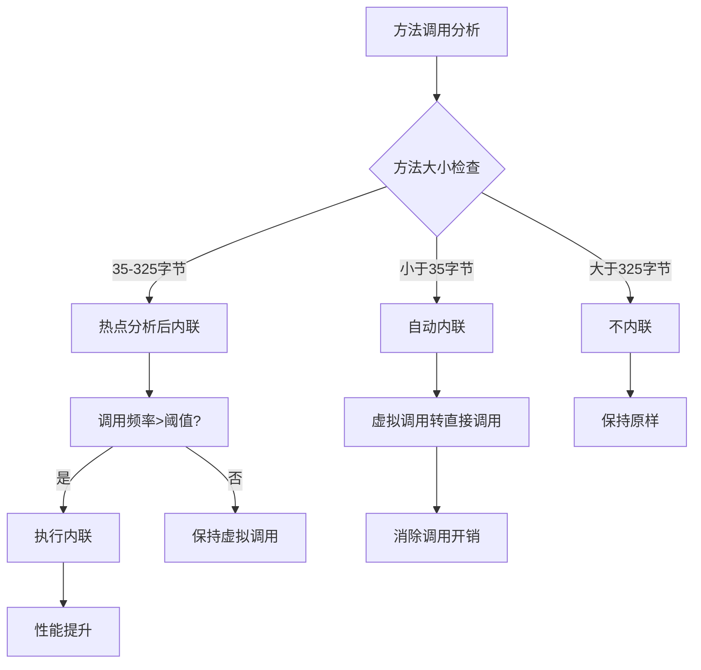

**AI方法内联优化效果图**：
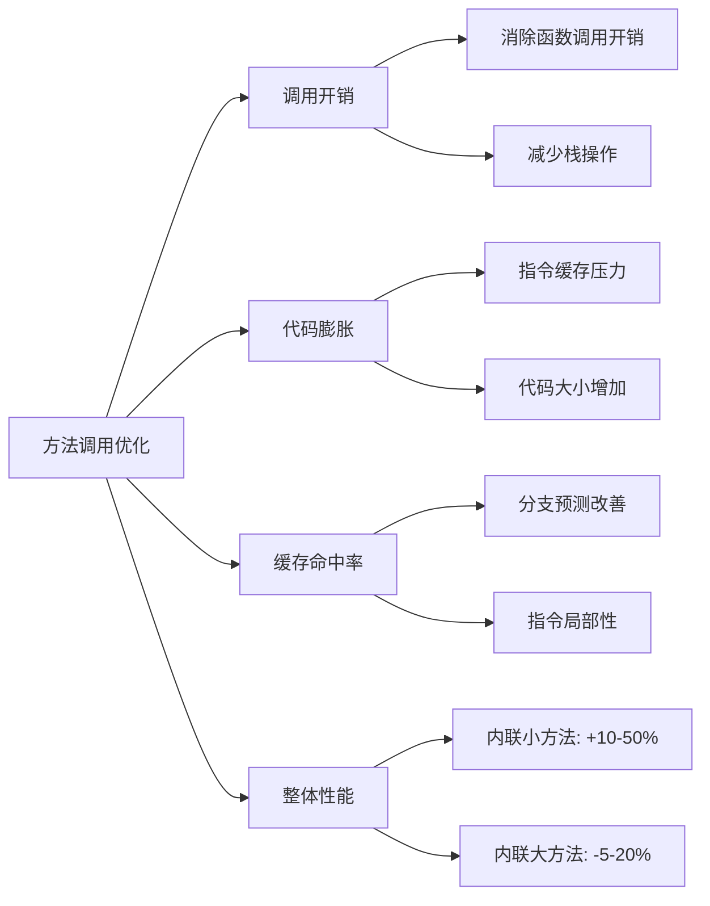

---

## GraalVM与AI应用

### ⭐⭐⭐ 专家题 (80-100)

**80. GraalVM如何提升AI系统性能？**

**面试场景**：Java架构师面试，考察GraalVM应用

**口语化答案**：
GraalVM通过AOT编译、多语言互操作、原生镜像等技术，显著提升AI系统的启动性能和执行效率。

**核心设计思路**：
利用GraalVM的提前编译能力将AI代码编译为本地可执行文件，避免JIT编译的启动延迟。通过SubstrateVM创建轻量级原生镜像，减少内存占用和启动时间。

**GraalVM优化架构图**：
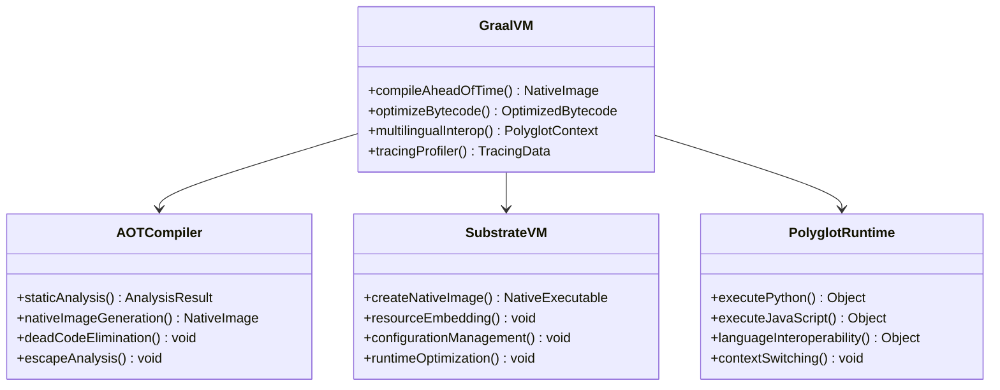

**GraalVM在AI系统中的优化策略**：
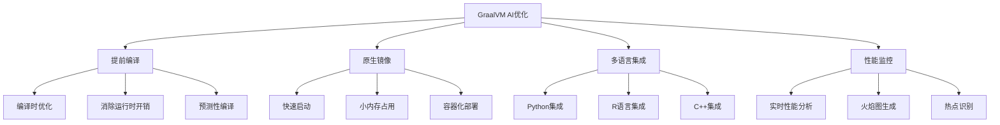

**81. AI系统的AOT编译如何实现？**

**面试场景**：高级系统架构师面试，考察AOT编译

**口语化答案**：
AOT编译将AI代码提前编译为本地机器码，消除运行时编译开销。

**核心设计思路**：
通过静态分析确定AI系统的可达代码，构建完整的调用图，生成优化的本地可执行文件。重点关注AI推理的热点路径和内存布局优化。

**AOT编译流程图**：
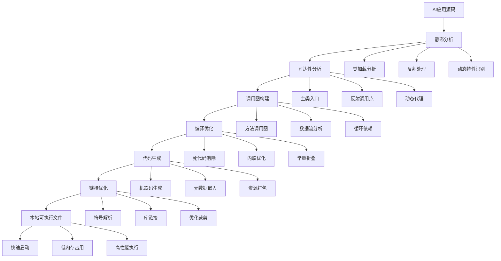

---

## AI系统JIT调优实战

### ⭐⭐⭐ 专家题 (90-100)

**90. AI推理系统的JIT调优策略有哪些？**

**面试场景**：Java性能调优专家面试，考察JIT调优

**口语化答案**：
AI推理系统的JIT调优需要针对AI特有的计算模式进行优化。

**核心设计思路**：
通过JVM参数调整、代码结构优化、预热策略等手段，最大化JIT编译器对AI系统的优化效果。重点是平衡编译时间和运行时性能。

**JIT调优策略架构图**：
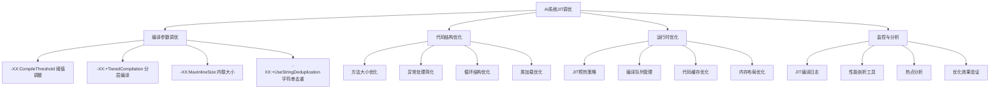

**JIT预热策略实现图**：
```mermaid
sequenceDiagram
    participant Warmup as 预热器
    participant Profiler as 性能分析器
    participant JIT as JIT编译器
    participant App as AI应用

    Warmup->>App: 生成模拟推理数据
    App->>Profiler: 执行推理路径
    Profiler->>Profiler: 收集调用统计

    loop 预热循环
        App->>JIT: 调用热点方法
        JIT->>JIT: 调用计数增加
        JIT->>JIT{达到编译阈值?}
        JIT->>Warmup: 触发编译通知
        Warmup->>JIT: 编译配置
        JIT->>JIT: 执行编译
        JIT->>App: 切换到编译代码
    end

    Note over App,JIT: 预热完成后达到峰值性能
```

**91. 如何监控AI系统的JIT编译效果？**

**面试场景**：系统监控专家面试，考察JIT监控

**口语化答案**：
AI系统的JIT编译效果监控需要多维度、实时的监控能力。

**核心设计思路**：
通过JVM内置的编译日志、JITWatch工具、性能计数器等，实时监控JIT编译状态和效果，为调优提供数据支持。

**JIT监控体系架构图**：
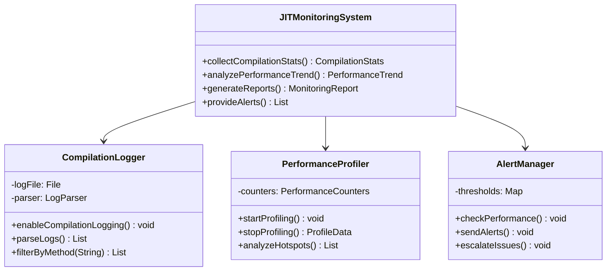

**JIT性能监控数据流图**：
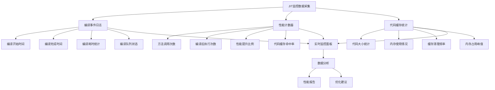

---

## 总结

JIT编译优化在AI系统中的应用需要综合考虑：

1. **编译技术理解**：深入掌握JIT编译机制和优化技术
2. **热点代码识别**：准确识别AI推理中的性能瓶颈
3. **优化策略制定**：针对AI特点制定编译优化策略
4. **GraalVM应用**：利用先进编译技术提升AI性能
5. **调优监控**：建立完善的JIT监控和调优体系

通过系统的JIT编译优化，AI推理系统可以获得显著性能提升，实现低延迟、高吞吐量的推理能力。