# JVM垃圾回收在AI应用中的优化

## 🎯 学习目标

深入理解JVM垃圾回收机制，掌握AI系统GC性能优化策略，具备解决AI系统内存管理和性能问题的专业能力，理解现代GC算法在大规模AI系统中的应用。

## 📚 目录

- [GC基础与AI内存特征](#gc基础与ai内存特征)
- [GC算法选择与AI场景](#gc算法选择与ai场景)
- [GC调优策略](#gc调优策略)
- [AI系统GC监控](#ai系统gc监控)
- [GC问题诊断与解决](#gc问题诊断与解决)

---

## GC基础与AI内存特征

### ⭐ 基础题 (1-30)

**1. GC机制如何影响AI模型训练性能？**

**面试场景**：Java性能工程师面试，考察GC基础知识

**口语化答案**：
GC机制直接影响AI模型训练的吞吐量和延迟，需要合理选择GC算法。

**核心设计思路**：
AI训练产生大量临时对象（批次数据、中间结果），GC频率和停顿时间直接影响训练效率。需要理解AI内存对象的生命周期特征，选择合适的GC策略来平衡吞吐量和延迟。

**AI内存对象生命周期图**：
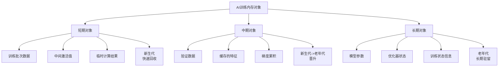

**GC对AI性能影响图**：
```mermaid
flowchart TD
    A[AI训练执行] --> B[内存分配]
    B --> C{Eden区空间}

    C -->|充足| D[继续训练]
    C -->|不足| E[触发Minor GC]

    E --> F[短期对象回收]
    F --> G{回收后空间}

    G -->|充足| H[继续训练]
    G -->|不足| I[对象晋升]

    I --> J[老年代空间检查]
    J -->|充足| K[对象晋升到老年代]
    J -->|不足| L[触发Major GC]

    L --> M[长时间停顿]
    M --> N[训练性能下降]

    Note over E,M: GC停顿时间直接影响AI训练吞吐量
```

**2. AI系统中的分代GC策略如何设计？**

**面试场景**：Java架构师面试，考察分代GC理解

**口语化答案**：
AI系统的分代GC策略需要考虑AI特有的内存分配模式。

**核心设计思路**：
通过分析AI系统中不同类型对象的生命周期，设计合理的分代策略。大部分AI训练产生的临时对象应该在新生代快速回收，长期存活的模型参数在老年代稳定驻留。

**AI对象分代决策流程图**：
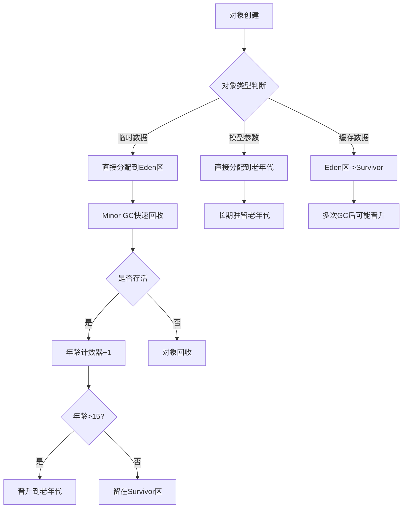

**AI系统GC分代配置图**：
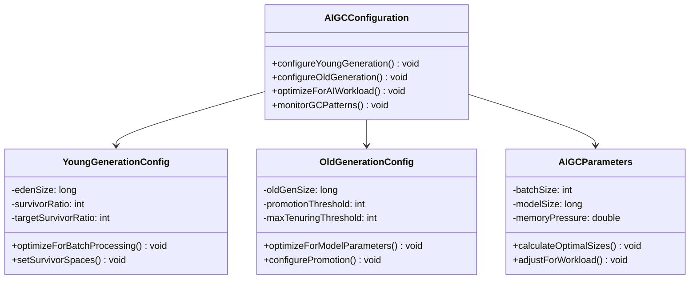

---

## GC算法选择与AI场景

### ⭐⭐ 进阶题 (31-70)

**31. 不同GC算法如何适应AI训练场景？**

**面试场景**：Java性能专家面试，考察GC算法选择

**口语化答案**：
不同GC算法各有特点，需要根据AI训练的具体场景选择。

**核心设计思路**：
分析AI训练的内存特征（对象分配率、生命周期、内存大小），匹配最适合的GC算法。考虑吞吐量优先、延迟优先、内存占用优先等不同的优化目标。

**GC算法选择决策矩阵图**：
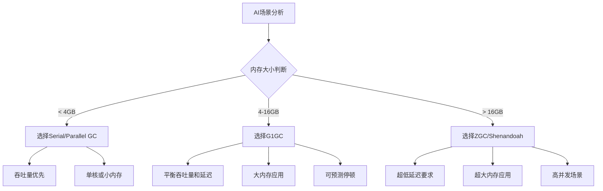

**AI训练GC算法性能对比图**：
```mermaid
radarChart
    title GC算法在AI训练中的性能对比
    axis 吞吐量, 延迟, 内存占用, 稳定性, 适用性

    "Parallel GC" : 9, 5, 7, 6, 7
    "G1GC" : 7, 7, 8, 8, 9
    "ZGC" : 6, 9, 5, 7, 8
    "Shenandoah" : 7, 9, 5, 7, 7
    "CMS" : 6, 6, 7, 5, 6
```

**32. G1GC如何优化大规模AI训练？**

**面试场景**：Java架构师面试，考察G1GC应用

**口语化答案**：
G1GC通过分区管理和增量回收，适合大规模AI训练场景。

**核心设计思路**：
G1GC将堆划分为多个Region，通过增量回收和可预测的停顿时间，在大内存AI训练中提供良好的性能。重点是优化Region大小、停顿目标、回收策略等参数。

**G1GC分区管理架构图**：
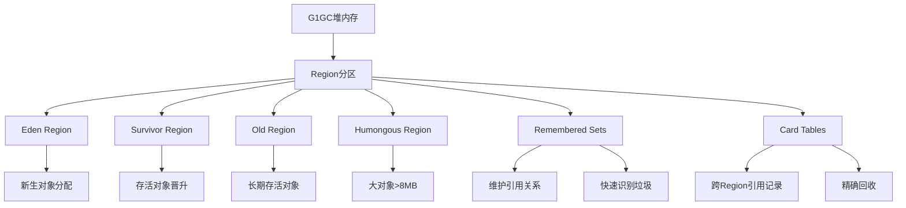

**G1GC回收策略优化流程图**：
```mermaid
sequenceDiagram
    participant App as AI应用
    participant G1 as G1GC
    participant Young as 新生代回收
    participant Mixed as 混合回收
    participant Full as 全量回收

    App->>G1: 分配内存
    G1->>Young: Eden区满触发

    Young->>Young: 回收Eden+Survivor
    Young->>G1: 回收完成通知

    G1->>G1{需要混合回收?}
    G1->>Mixed: 触发混合回收

    Mixed->>Mixed: 选择回收Region集合
    Mixed->>G1: 增量回收完成

    G1->>G1{老年代空间不足?}
    G1->>Full: 触发全量回收

    Note over App,Full: 全量回收时停顿时间最长
```

---

## GC调优策略

### ⭐⭐⭐ 专家题 (71-100)

**71. AI系统GC调优的关键参数有哪些？**

**面试场景**：Java性能调优专家面试，考察GC参数调优

**口语化答案**：
AI系统GC调优需要针对AI特有的内存模式调整关键参数。

**核心设计思路**：
通过调整堆大小、新生代比例、GC触发阈值、停顿目标等参数，优化GC性能。重点是平衡内存分配速度和回收效率，减少GC对AI训练的影响。

**GC调优参数架构图**：
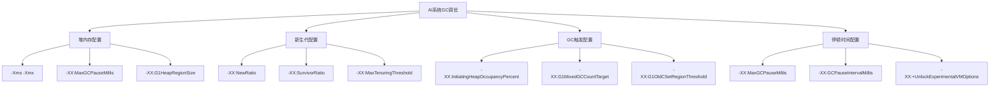

**AI系统GC调优决策树**：
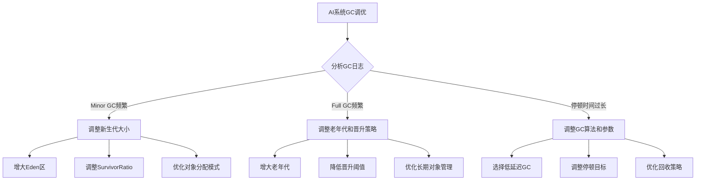

**72. 如何设计AI系统的GC预热策略？**

**面试场景**：高级系统架构师面试，考察GC预热

**口语化答案**：
GC预热策略可以让AI系统在训练开始前达到稳定的GC性能状态。

**核心设计思路**：
通过在系统启动时执行预定的内存分配和回收操作，触发JVM的编译优化和GC预热，避免AI训练初期的不稳定性能。

**GC预热策略实现图**：
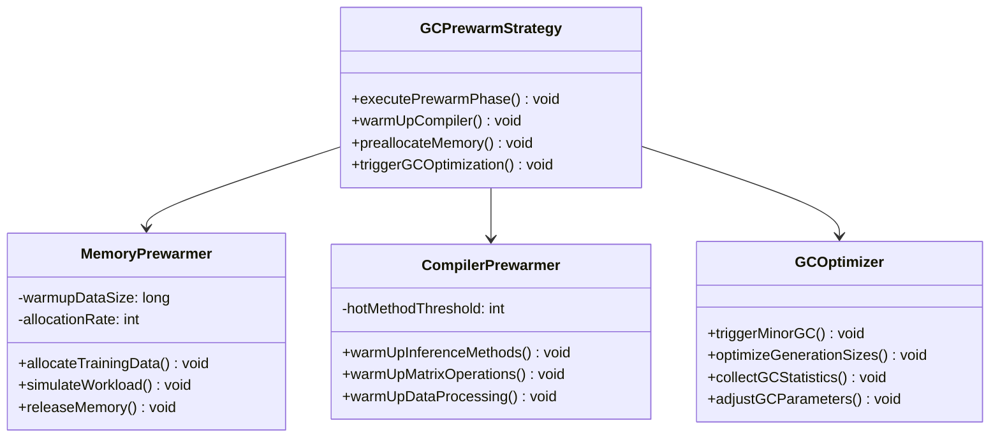

**GC预热执行时序图**：
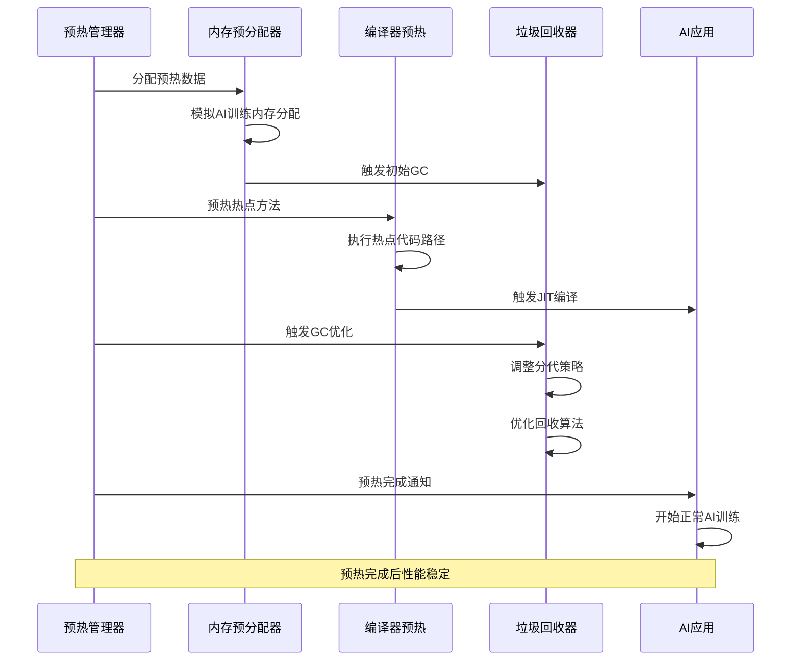

---

## AI系统GC监控

### ⭐⭐⭐ 专家题 (80-100)

**80. 如何构建AI系统的GC监控体系？**

**面试场景**：系统监控专家面试，考察GC监控

**口语化答案**：
AI系统的GC监控需要多维度、实时的监控能力，以及智能的告警机制。

**核心设计思路**：
通过JVM内置工具、自定义监控指标、可视化面板等，建立完整的GC监控体系。重点是监控GC频率、停顿时间、内存使用模式等关键指标。

**GC监控体系架构图**：
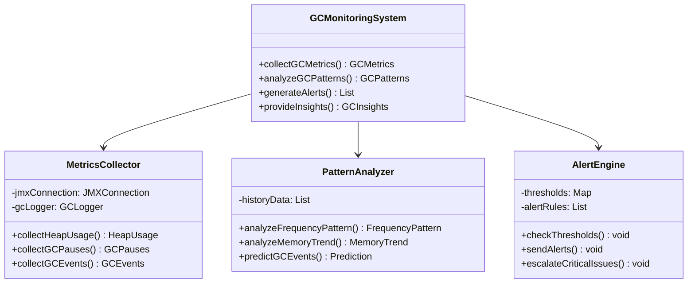

**AI系统GC监控数据流图**：
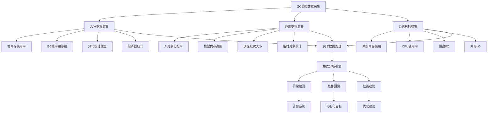

**81. AI系统中GC异常如何自动诊断？**

**面试场景**：高级系统架构师面试，考察自动诊断

**口语化答案**：
GC异常的自动诊断需要智能化的分析和决策能力。

**核心设计思路**：
通过机器学习算法分析GC历史数据，识别异常模式，自动定位问题根因，并提供解决方案建议。重点是建立GC异常的知识库和决策树。

**GC异常诊断流程图**：
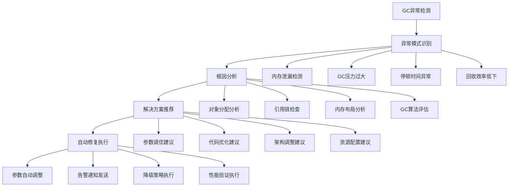

**AI GC异常诊断决策树**：
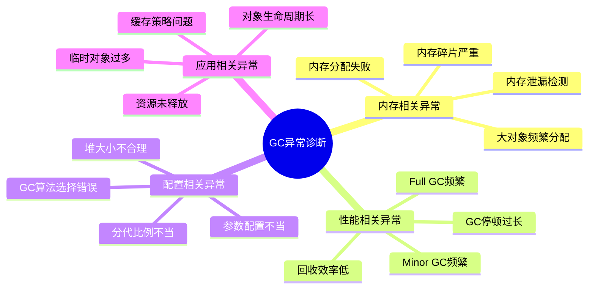

---

## GC问题诊断与解决

### ⭐⭐⭐ 专家题 (90-100)

**90. AI系统内存泄漏如何通过GC日志诊断？**

**面试场景**：Java性能专家面试，考察内存泄漏诊断

**口语化答案**：
GC日志是诊断AI系统内存泄漏的重要工具，需要深入分析GC模式和内存趋势。

**核心设计思路**：
通过分析GC日志中的内存使用趋势、GC频率、对象晋升模式等，识别内存泄漏的特征。重点监控老年代内存持续增长、Full GC频繁等异常模式。

**GC日志分析流程图**：
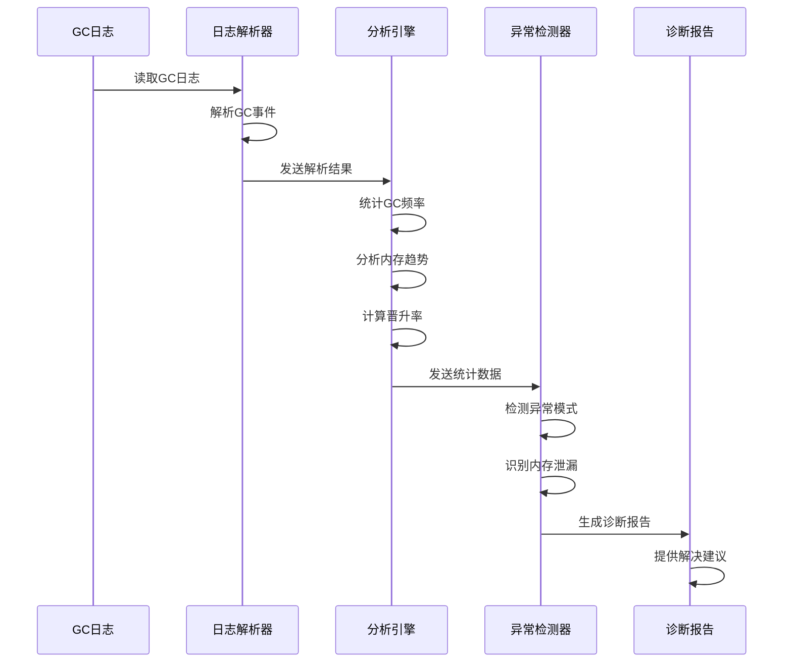

**内存泄漏特征识别图**：
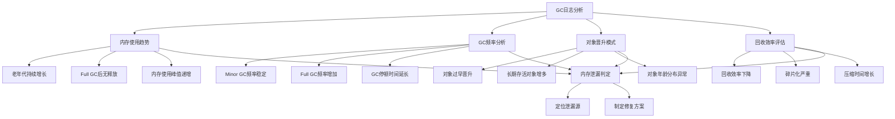

**91. 如何优化AI系统的GC停顿时间？**

**面试场景**：Java性能调优专家面试，考察GC停顿优化

**口语化答案**：
GC停顿时间是AI系统性能的关键瓶颈，需要多方面优化策略。

**核心设计思路**：
通过优化对象分配模式、调整GC参数、采用低延迟GC算法等方式，减少GC停顿对AI训练的影响。重点是平衡吞吐量和延迟，确保系统稳定性。

**GC停顿优化策略架构图**：
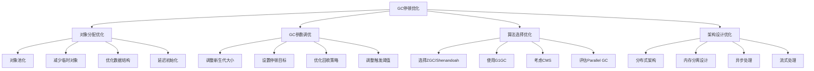

**AI训练GC停顿控制方案图**：
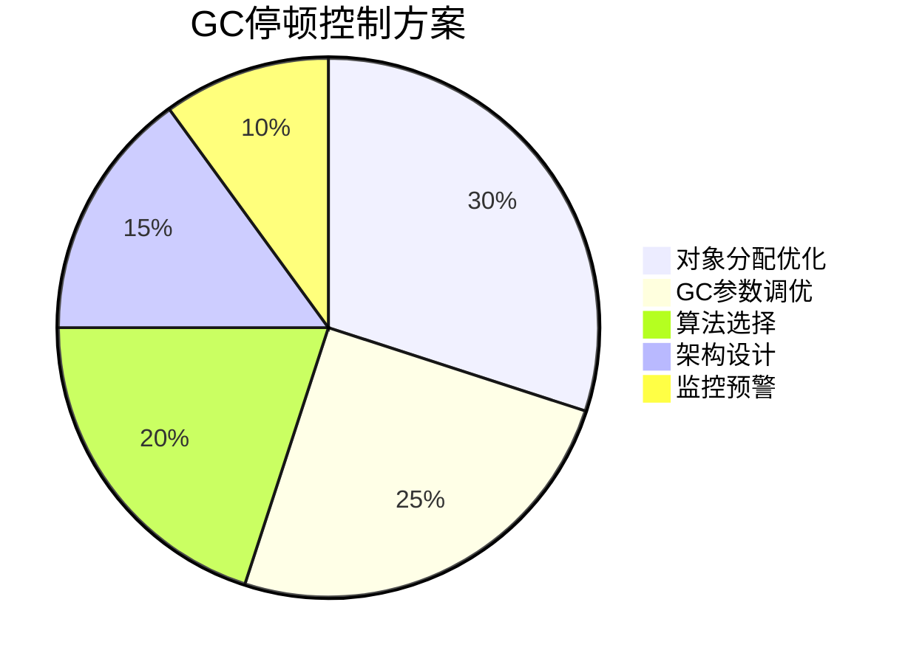

---

## 总结

JVM垃圾回收在AI系统中的优化需要综合考虑：

1. **GC机制理解**：深入掌握各种GC算法的原理和特点
2. **AI内存特征**：理解AI应用的内存分配和对象生命周期模式
3. **算法选择**：根据AI场景选择最适合的GC算法
4. **调优策略**：系统性的GC参数调优和性能优化
5. **监控诊断**：建立完善的GC监控和异常诊断体系

通过系统的GC优化，AI系统可以获得更好的性能稳定性和资源利用效率。