# JVM性能监控与调优工具实战

## 🎯 学习目标

深入理解JVM性能监控工具的核心原理，掌握AI系统性能监控的专业技能，具备设计完善监控体系的能力，理解现代监控工具在复杂AI系统中的实际应用。

## 📚 目录

- [JVM监控基础与AI场景](#jvm监控基础与ai场景)
- [核心监控工具实战](#核心监控工具实战)
- [AI系统监控体系设计](#ai系统监控体系设计)
- [性能调优工具应用](#性能调优工具应用)
- [监控数据分析与优化](#监控数据分析与优化)

---

## JVM监控基础与AI场景

### ⭐ 基础题 (1-30)

**1. JVM性能监控在AI系统中的重要性？**

**面试场景**：Java架构师面试，考察监控基础理解

**口语化答案**：
JVM性能监控是AI系统稳定运行的基础保障，尤其在大规模训练和推理场景中至关重要。

**核心设计思路**：
AI系统具有独特的性能特征：高内存占用、大量临时对象、复杂计算密集型操作。通过JVM监控可以及时发现性能瓶颈，优化资源使用，确保AI服务的稳定性和效率。监控数据是性能调优和容量规划的重要依据。

**AI系统性能监控架构图**：
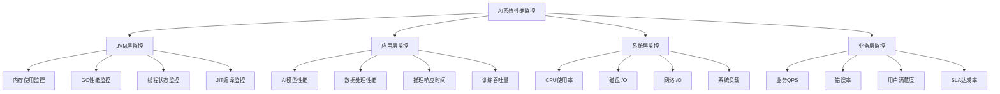

**AI性能监控目标层次图**：
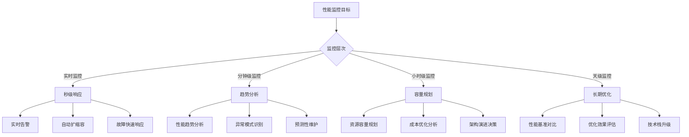

**2. AI系统中需要监控的关键指标有哪些？**

**面试场景**：Java性能工程师面试，考察指标理解

**口语化答案**：
AI系统需要监控多维度的关键指标，全面反映系统运行状态和性能表现。

**核心设计思路**：
AI系统的关键指标分为JVM层面、应用层面和业务层面。JVM层面关注内存、GC、线程等基础指标；应用层面关注AI模型性能、数据处理效率等核心指标；业务层面关注用户体验和业务价值指标。

**AI系统关键指标分类图**：
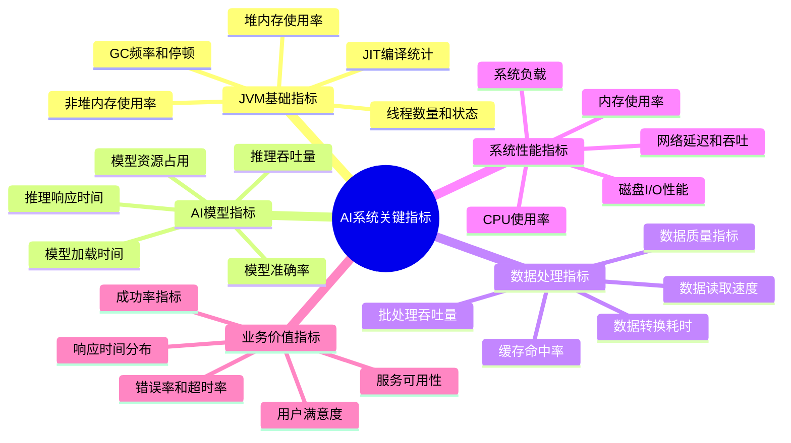

**AI系统指标采集流程图**：
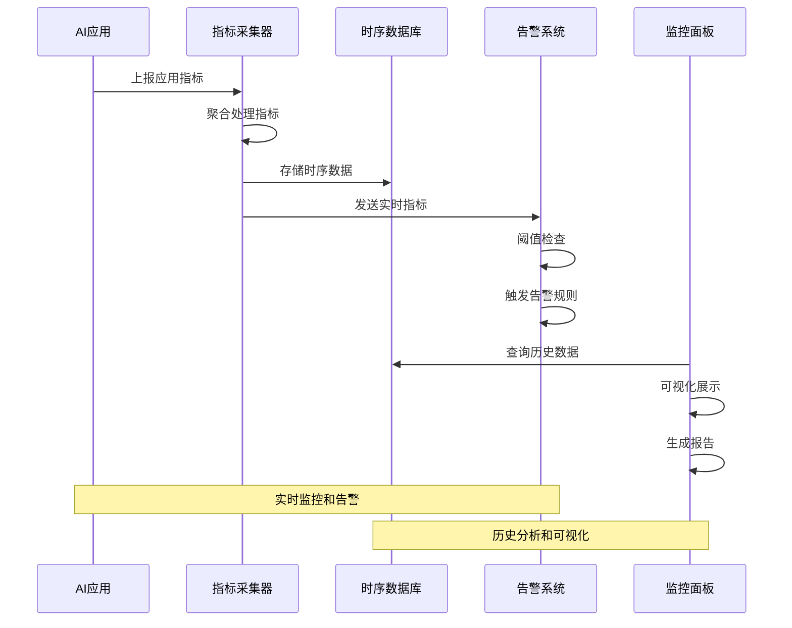

---

## 核心监控工具实战

### ⭐⭐ 进阶题 (31-70)

**31. 如何使用jstat监控AI系统的GC性能？**

**面试场景**：Java性能专家面试，考察工具使用

**口语化答案**：
jstat是JVM自带的监控工具，可以实时监控GC性能，特别适合AI系统的GC调优。

**核心设计思路**：
jstat通过连接到目标JVM进程，定期收集GC统计信息，帮助分析GC性能模式。在AI系统中，主要关注新生代和老年代的使用情况、GC频率、停顿时间等关键指标。

**jstat监控命令架构图**：
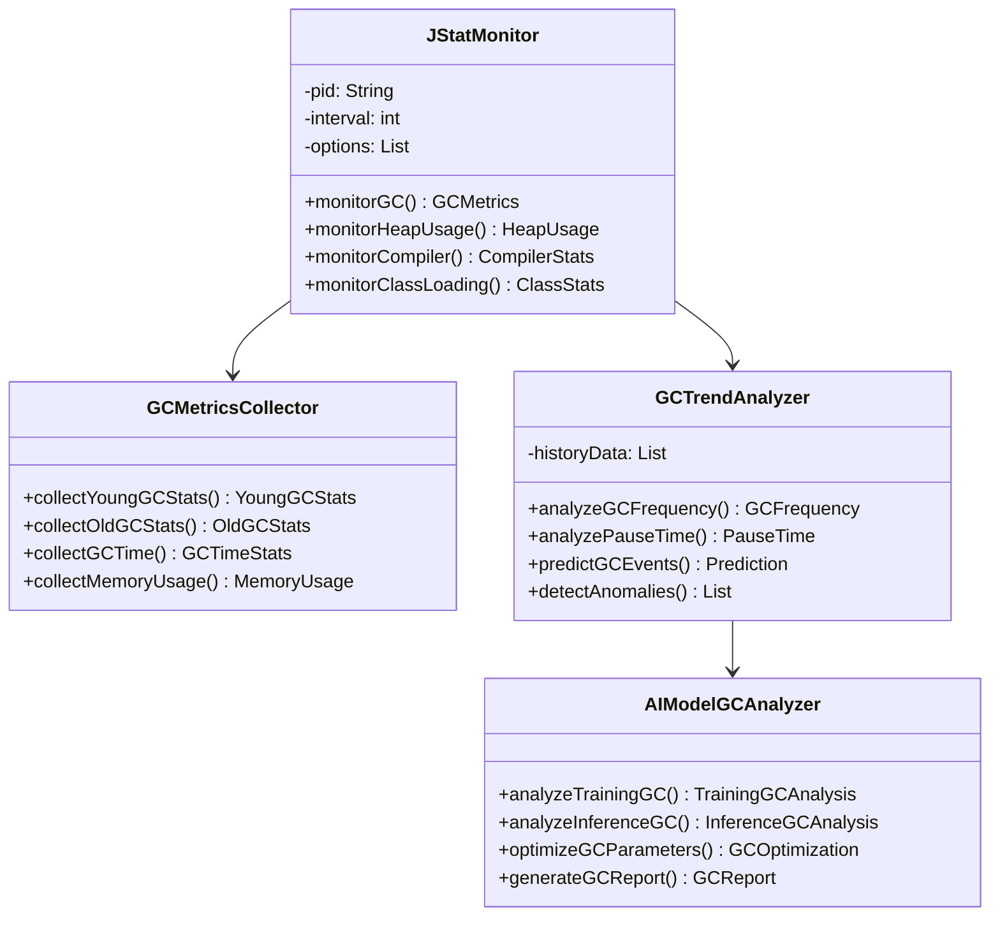

**jstat命令使用场景图**：
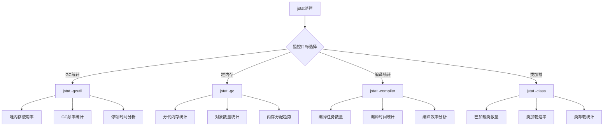

**32. 如何使用jstack分析AI系统的线程状态？**

**面试场景**：Java架构师面试，考察线程分析

**口语化答案**：
jstack是分析线程状态的重要工具，特别适合诊断AI系统中的线程阻塞和死锁问题。

**核心设计思路**：
jstack生成指定进程的线程堆栈信息，帮助识别线程状态、锁竞争、死锁等问题。在AI系统中，重点关注训练线程、推理线程、数据处理线程的运行状态。

**jstack分析流程图**：
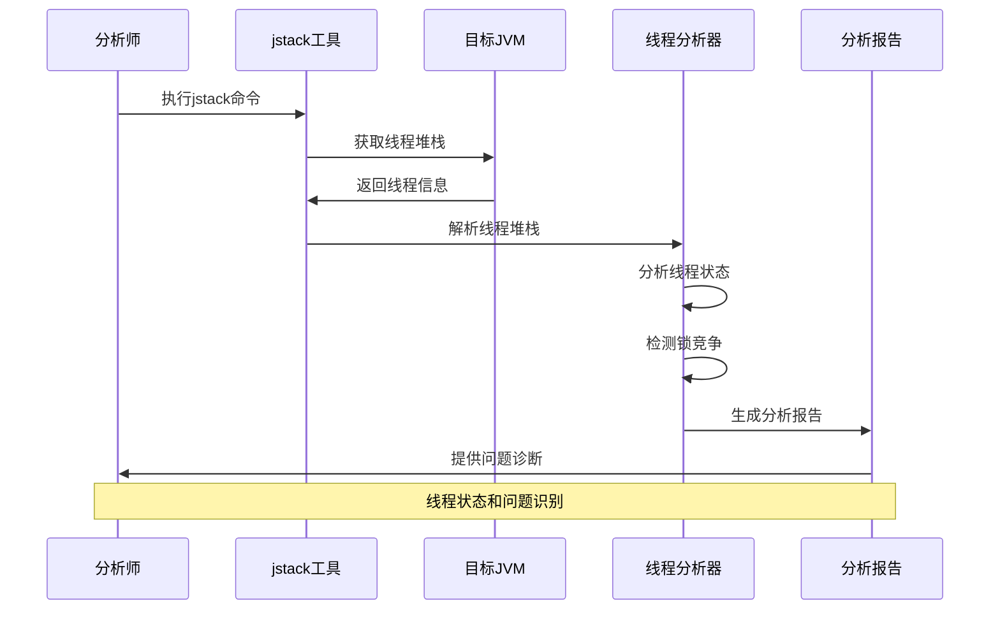

**AI系统线程状态分类图**：
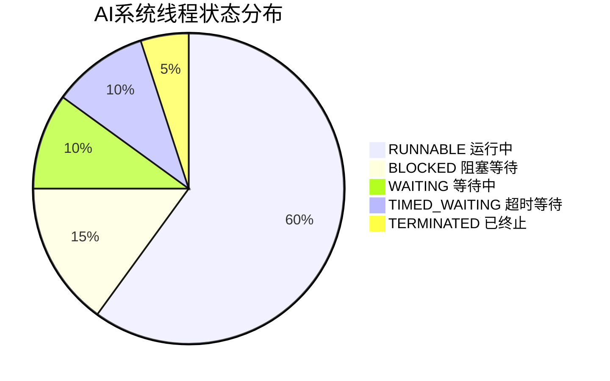

**AI线程问题诊断决策树**：
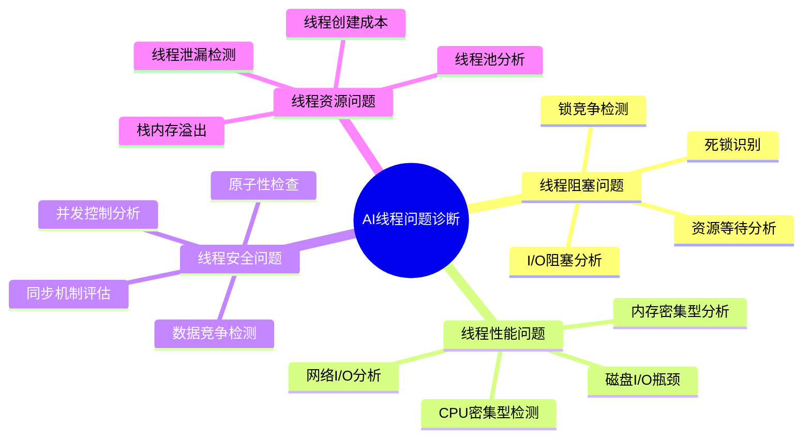

---

## AI系统监控体系设计

### ⭐⭐⭐ 专家题 (71-100)

**71. 如何设计AI系统的分层监控架构？**

**面试场景**：系统架构师面试，考察监控体系设计

**口语化答案**：
分层监控架构是AI系统可观测性的基础，需要从基础设施到业务层面全方位监控。

**核心设计思路**：
通过分层的监控架构，实现对AI系统的全方位可观测性。基础设施层监控硬件资源，平台层监控JVM和容器，应用层监控AI模型和服务，业务层监控用户体验和业务指标。每层都有独立的监控和告警机制。

**AI系统分层监控架构图**：
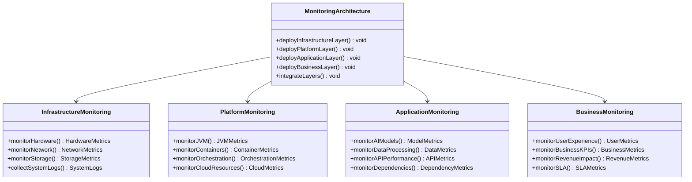

**分层监控数据流图**：
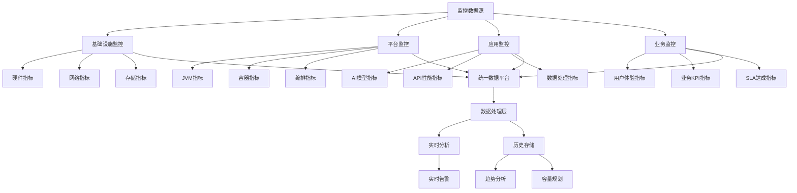

**72. 如何实现AI系统的智能告警机制？**

**面试场景**：高级系统架构师面试，考察智能告警

**口语化答案**：
智能告警机制通过机器学习算法分析监控数据，自动识别异常模式，减少误报和漏报。

**核心设计思路**：
传统告警基于静态阈值，容易产生误报或漏报。智能告警通过学习历史数据模式，建立动态阈值，结合上下文信息和业务知识库，提高告警准确性。重点关注AI系统的特有指标和模式。

**智能告警系统架构图**：
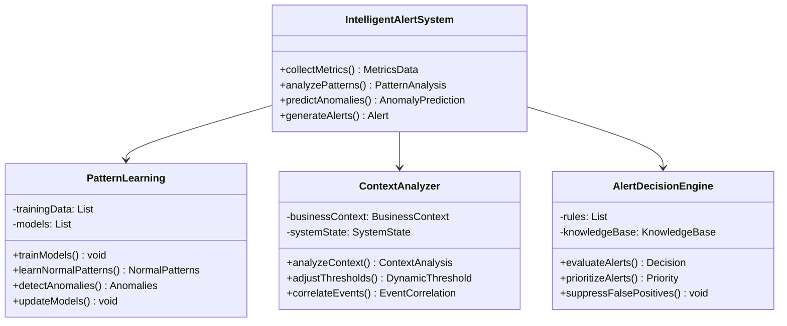

**智能告警决策流程图**：
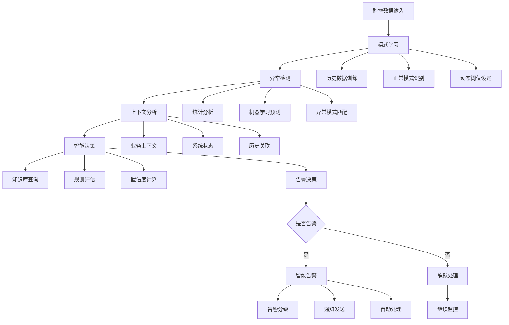

---

## 性能调优工具应用

### ⭐⭐⭐ 专家题 (80-100)

**80. 如何使用VisualVM进行AI系统性能分析？**

**面试场景**：Java性能专家面试，考察工具应用

**口语化答案**：
VisualVM是功能强大的可视化工具，非常适合AI系统的性能分析和调优。

**核心设计思路**：
VisualVM集成了JVM监控、线程分析、内存分析、性能剖析等功能。在AI系统中，主要用于分析内存使用模式、线程状态、方法热点、GC性能等关键性能指标。

**VisualVM功能模块图**：
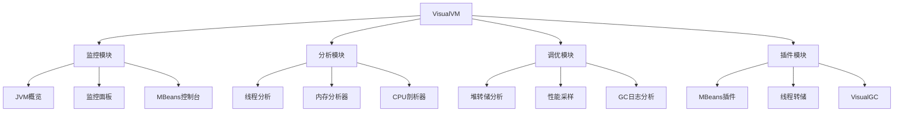

**AI系统VisualVM分析流程图**：
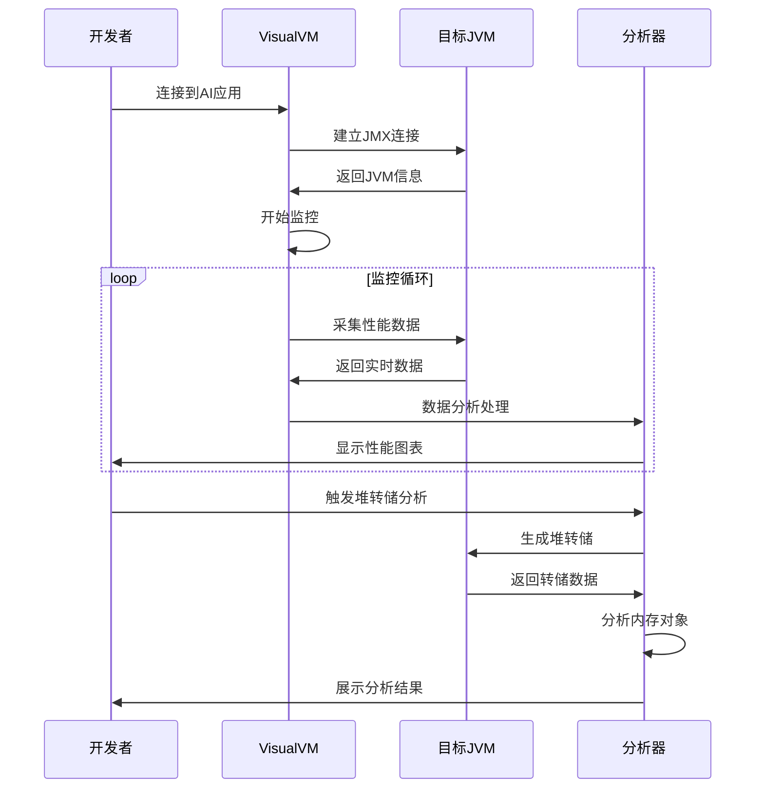

**AI系统性能热点识别图**：
```mermaid
radarChart
    title AI系统性能热点分析
    axis CPU使用, 内存使用, GC压力, I/O操作, 网络延迟

    "模型推理" : 9, 7, 5, 6, 8
    "数据预处理" : 7, 8, 6, 9, 5
    "模型训练" : 10, 9, 8, 5, 3
    "批量处理" : 6, 7, 7, 8, 6
    "实时推理" : 8, 5, 4, 7, 9
```

**81. 如何使用JProfiler优化AI系统性能？**

**面试场景**：Java性能调优专家面试，考察高级工具使用

**口语化答案**：
JProfiler是商业级性能分析工具，提供更深入的内存和CPU分析能力，适合复杂AI系统的性能调优。

**核心设计思路**：
JProfiler通过字节码插桩技术，提供精确的方法级性能分析。在AI系统中，主要用于识别性能瓶颈、内存泄漏、算法优化机会等深层问题。

**JProfiler分析架构图**：
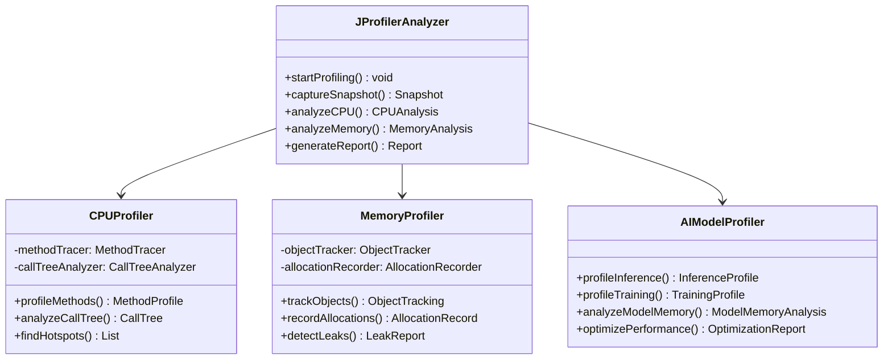

**AI系统JProfiler调优策略图**：
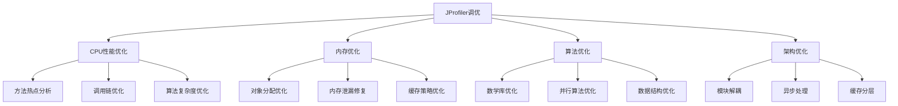

---

## 监控数据分析与优化

### ⭐⭐⭐ 专家题 (90-100)

**90. 如何进行AI系统的性能基线分析？**

**面试场景**：系统性能专家面试，考察基线分析

**口语化答案**：
性能基线分析是AI系统优化的基础，需要建立合理的性能基准和评估体系。

**核心设计思路**：
通过建立标准化的测试环境和场景，收集不同负载下的性能数据，建立性能基线。基线数据用于评估优化效果、容量规划和性能回归检测。重点关注AI系统特有的性能特征。

**性能基线分析流程图**：
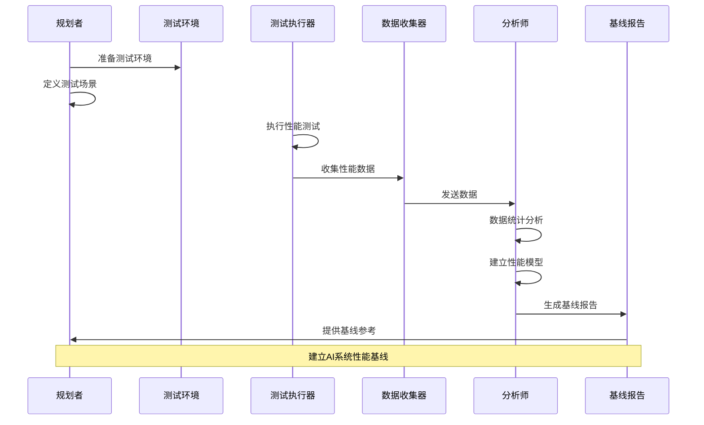

**AI系统性能基线指标图**：
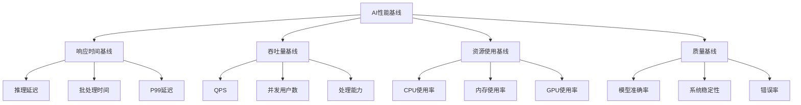

**91. 如何设计AI系统的性能优化决策系统？**

**面试场景**：高级系统架构师面试，考察决策系统

**口语化答案**：
性能优化决策系统通过智能分析，为AI系统提供自动化的优化建议和执行方案。

**核心设计思路**：
集成多种性能分析工具和数据源，建立智能决策引擎。通过机器学习算法分析性能数据模式，识别优化机会，生成优化策略，部分优化可以自动执行。

**性能优化决策系统架构图**：
```mermaid
classDiagram
    class PerformanceDecisionSystem {
        +collectPerformanceData() DataCollector
        +analyzePerformance() PerformanceAnalyzer
        +generateOptimizationPlan() OptimizationPlan
        +executeOptimization() void
    }

    class DataCollector {
        -sources: List
        +collectMetrics() MetricsData
        +aggregateData() AggregatedData
        +validateData() ValidationReport
    }

    class OptimizationEngine {
        -strategies: List
        +analyzeBottlenecks() BottleneckAnalysis
        +recommendOptimizations() List
        +evaluateSolutions() Evaluation
        +prioritizeActions() Priority
    }

    class AutoOptimizer {
        -executor: Executor
        +optimizeConfiguration() void
        +autoScaleResources() void
        +applyPerformanceTuning() void
        +monitorOptimization() void
    }

    PerformanceDecisionSystem --> DataCollector
    PerformanceDecisionSystem --> OptimizationEngine
    PerformanceDecisionSystem --> AutoOptimizer
```

**AI系统优化决策矩阵图**：
```mermaid
graph LR
    A[性能问题] --> B[优化策略]
    B --> C[执行方式]

    A --> A1[CPU瓶颈]
    A --> A2[内存不足]
    A --> A3[I/O延迟]
    A --> A4[网络拥塞]

    B --> B1[算法优化]
    B --> B2[资源配置]
    B --> B3[架构调整]
    B --> B4[缓存优化]

    C --> C1[代码重构]
    C --> C2[参数调优]
    C --> C3[自动扩容]
    C --> C4[手动介入]
```

---

## 总结

JVM性能监控与调优工具在AI系统中的应用需要掌握：

1. **监控工具精通**：熟练使用各种JVM监控和性能分析工具
2. **监控体系设计**：构建完善的分层监控架构
3. **智能告警机制**：实现基于机器学习的智能告警系统
4. **性能调优实战**：使用专业工具进行深度性能分析
5. **数据驱动优化**：基于监控数据进行科学的性能优化

通过系统的性能监控和调优，AI系统可以获得更好的性能表现和运行稳定性。