# Java异常处理与AI系统稳定性

## 🎯 学习目标

深入理解Java异常处理机制，掌握AI系统中的异常分类和优先级管理，具备设计高可用性AI系统的专业能力，理解异常处理在复杂AI系统中的架构作用。

## 📚 目录

- [异常体系与AI系统稳定性](#异常体系与ai系统稳定性)
- [异常分类与优先级管理](#异常分类与优先级管理)
- [分布式AI系统异常处理](#分布式ai系统异常处理)
- [智能异常检测与自愈](#智能异常检测与自愈)
- [边缘AI系统异常处理](#边缘ai系统异常处理)

---

## 异常体系与AI系统稳定性

### ⭐ 基础题 (1-30)

**1. Java异常体系如何支持AI系统的稳定性保障？**

**面试场景**：Java架构师面试，考察异常体系理解

**口语化答案**：
Java异常体系为AI系统提供了分层的错误处理机制，确保系统在各种异常情况下保持稳定运行。

**核心设计思路**：
通过异常继承体系建立清晰的错误分类，结合AI系统的特点设计专用异常类型。检查异常强制开发者处理可预见的错误情况，运行时异常处理程序逻辑错误。AI系统中重点关注模型推理异常、数据验证异常、资源不足异常等特定场景。

**Java异常体系架构图**：
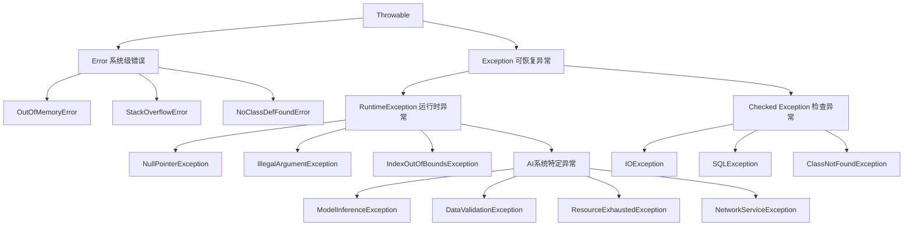

**AI系统异常处理流程图**：
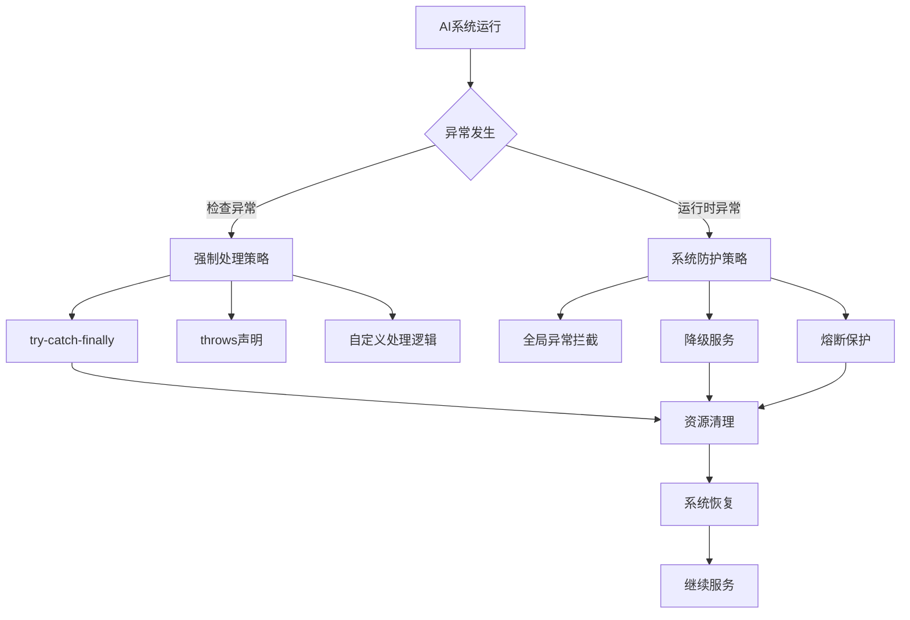

**2. AI系统中如何设计异常的严重程度分级？**

**面试场景**：系统架构师面试，考察异常优先级管理

**口语化答案**：
AI系统需要精细的异常分级机制，确保关键异常得到及时处理，避免系统级故障。

**核心设计思路**：
根据异常对系统功能的影响程度、用户感知、业务损失等因素建立多级分类体系。严重程度决定处理优先级、告警级别、恢复策略。实时监控异常频率和严重程度，动态调整处理策略。

**AI系统异常严重程度分级图**：
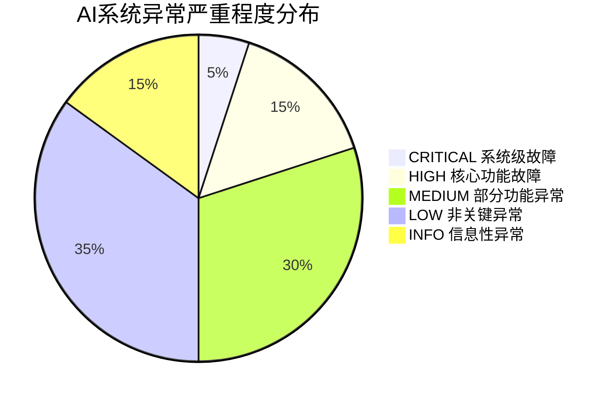

**异常严重程度决策矩阵**：
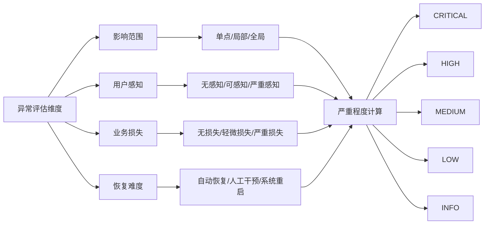

**3. try-with-resources在AI资源管理中如何应用？**

**面试场景**：Java开发工程师面试，考察资源管理

**口语化答案**：
try-with-resources是AI系统中管理GPU内存、模型文件、数据库连接等资源的最佳实践。

**核心设计思路**：
利用AutoCloseable接口自动管理资源的生命周期，避免资源泄漏。在AI系统中特别关注模型文件句柄、GPU内存分配、数据库连接、网络连接等有限资源的正确释放。

**AI资源管理生命周期图**：
```mermaid
sequenceDiagram
    participant App as AI应用
    participant Resource as 资源对象
    participant System as 系统
    participant GC as 垃圾回收器

    App->>Resource: 加载模型文件
    Resource->>System: 分配文件句柄
    Resource->>System: 分配GPU内存

    try-with-resources块开始
    Note over App,Resource: 模型推理执行
    App->>Resource: 执行推理计算
    Resource->>System: GPU计算

    try-with-resources块结束
    Resource->>Resource: 自动调用close()
    Resource->>System: 释放GPU内存
    Resource->>System: 释放文件句柄

    Note over System,GC: 资源已正确释放
```

**AI系统资源分类管理图**：
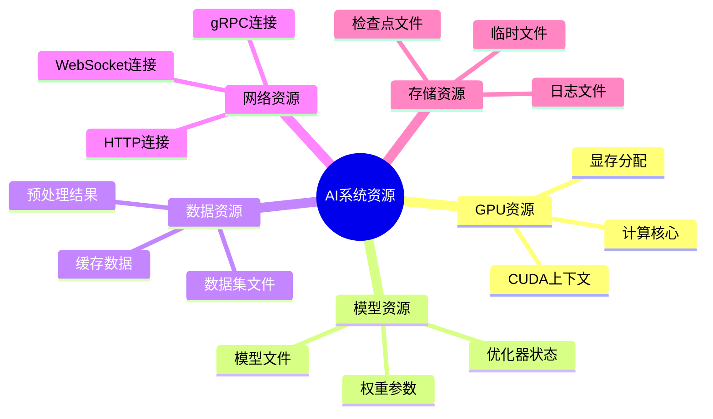

---

## 异常分类与优先级管理

### ⭐⭐ 进阶题 (31-70)

**31. AI系统中的异常分类体系如何设计？**

**面试场景**：系统架构师面试，考察异常分类设计

**口语化答案**：
AI系统的异常分类需要结合业务场景、技术层次、影响范围等多维度进行体系化设计。

**核心设计思路**：
建立多维度异常分类矩阵，按技术层次（基础设施、平台、应用、业务）、异常类型（数据、模型、算法、系统）、影响范围（局部、全局）进行分类。每个异常类型定义标准的处理流程、恢复策略、告警级别。

**AI系统异常分类体系架构图**：
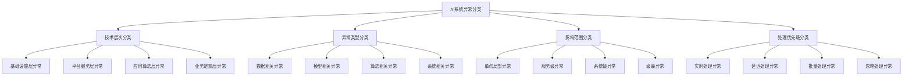

**异常分类处理策略决策树**：
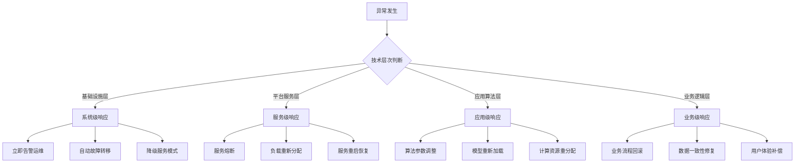

**32. AI系统中的异常优先级管理策略？**

**面试场景**：高级Java工程师面试，考察优先级管理

**口语化答案**：
异常优先级管理确保关键异常得到及时处理，避免重要问题被大量低优先级异常淹没。

**核心设计思路**：
基于业务影响、系统稳定性、用户体验等因素建立动态优先级评分机制。考虑异常频率、影响用户数、业务损失等量化指标。优先级决定处理顺序、资源分配、告警级别。

**异常优先级评分模型图**：
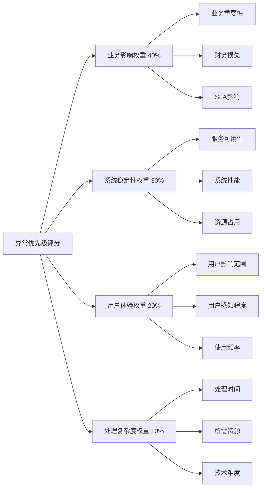

**动态优先级调整流程图**：
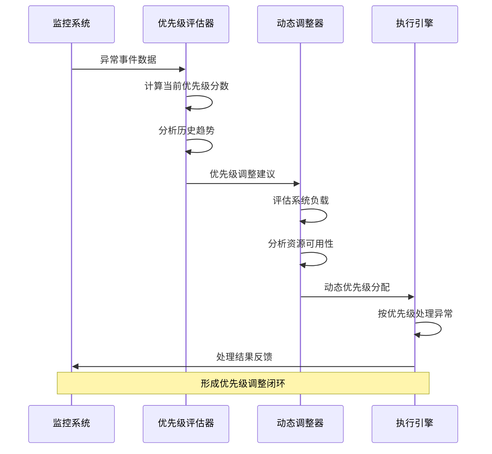

**AI系统异常处理优先级分布图**：
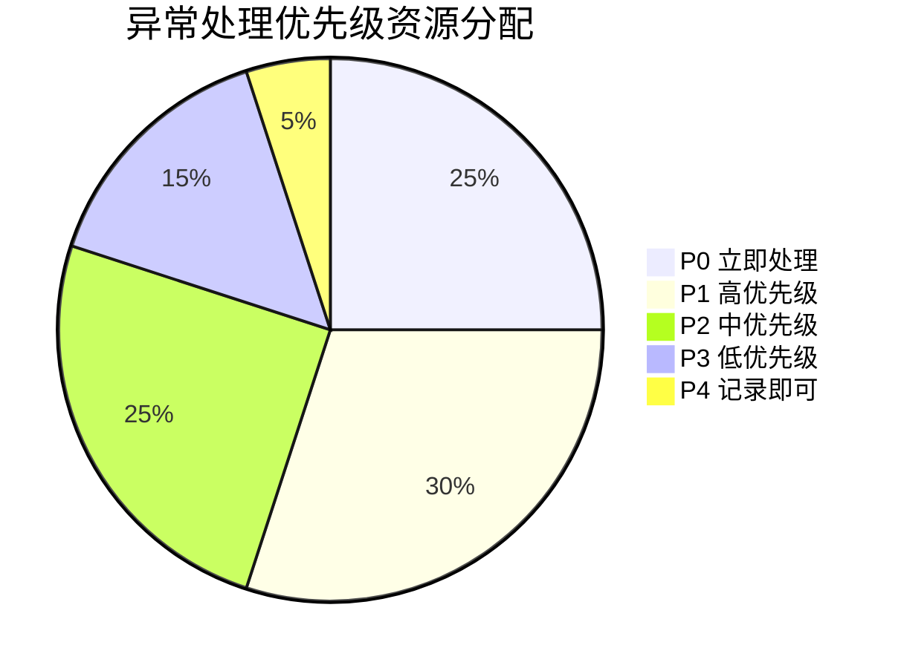

---

## 分布式AI系统异常处理

### ⭐⭐⭐ 专家题 (71-100)

**71. 分布式AI系统中的异常传播机制如何设计？**

**面试场景**：分布式系统架构师面试，考察异常传播设计

**口语化答案**：
分布式AI系统的异常传播需要考虑网络延迟、服务边界、上下文保持等技术挑战。

**核心设计思路**：
建立分层的异常传播架构，包括服务内传播、跨服务传播、用户面传播。通过标准化异常格式、传播上下文、聚合策略实现有效的异常信息传递。考虑网络分区、服务降级、超时控制等分布式场景的特殊处理。

**分布式异常传播架构图**：
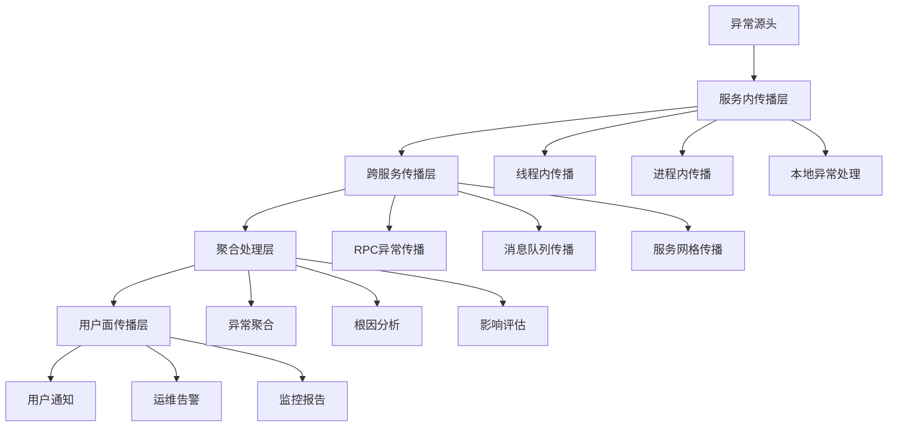

**异常传播上下文管理图**：
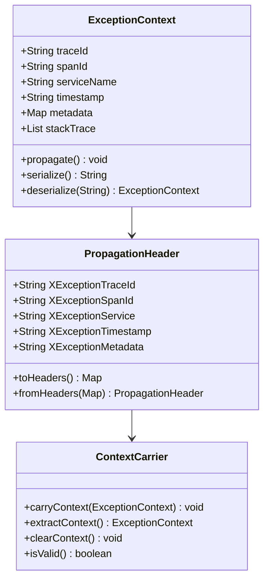

**72. 微服务AI系统中如何实现故障隔离？**

**面试场景**：微服务架构师面试，考察故障隔离机制

**口语化答案**：
故障隔离是微服务AI系统稳定性的关键，需要防止局部故障扩散到整个系统。

**核心设计思路**：
通过服务边界、资源隔离、数据隔离、网络隔离等多层次隔离策略，构建故障防火墙。结合熔断器、限流器、隔离舱等模式，实现快速故障检测和自动恢复。关键服务采用冗余部署和自动故障转移。

**微服务故障隔离策略图**：
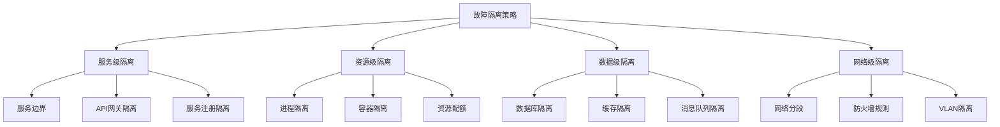

**故障隔离自动恢复流程图**：
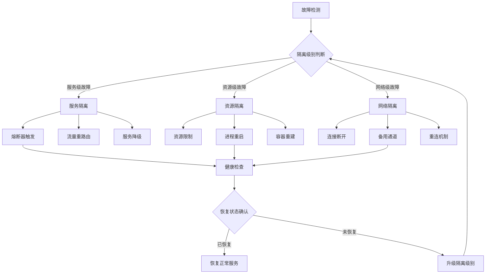

**故障隔离效果评估雷达图**：
```mermaid
radarChart
    title 故障隔离策略效果评估
    axis 故障检测速度, 隔离有效性, 恢复时间, 服务可用性, 资源利用率, 运维复杂度

    "容器隔离" : 8, 9, 7, 8, 6, 7
    "熔断器隔离" : 9, 8, 8, 9, 9, 5
    "服务网格隔离" : 7, 9, 6, 8, 7, 8
    "资源池隔离" : 6, 7, 9, 7, 8, 6
```

---

## 智能异常检测与自愈

### ⭐⭐⭐ 专家题 (80-100)

**80. 基于机器学习的异常检测如何实现？**

**面试场景**：AI系统架构师面试，考察智能异常检测

**口语化答案**：
基于ML的异常检测能够从历史数据中学习正常模式，识别传统阈值方法难以发现的异常。

**核心设计思路**：
集成多种ML算法构建异常检测模型，包括统计方法、机器学习方法、深度学习方法。通过特征工程提取时序特征、统计特征、相关性特征等多维度特征。采用集成学习提高检测准确性，结合在线学习实现模型自适应。

**ML异常检测算法架构图**：
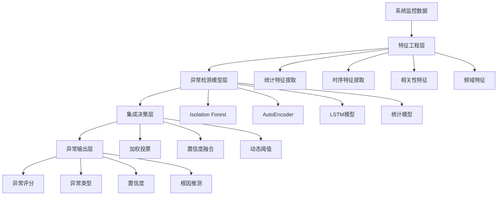

**异常检测特征工程流程图**：
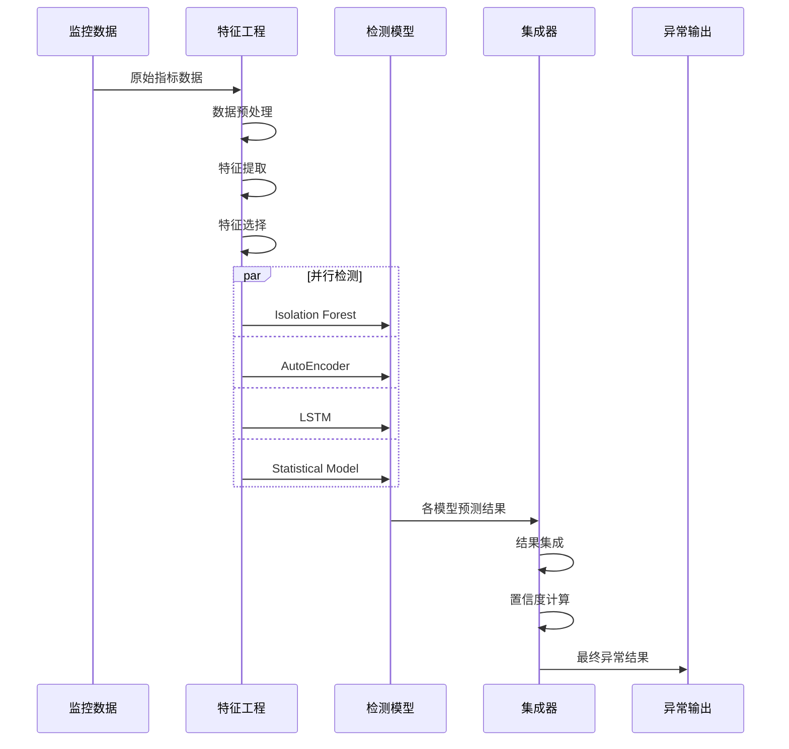

**异常检测模型性能对比图**：
```mermaid
radarChart
    title 异常检测算法性能对比
    axis 检测准确率, 召回率, F1分数, 计算效率, 训练难度, 实时性能

    "Isolation Forest" : 8, 7, 8, 9, 7, 9
    "AutoEncoder" : 9, 8, 9, 6, 8, 7
    "LSTM" : 9, 9, 9, 5, 9, 6
    "Statistical Model" : 7, 6, 7, 9, 5, 9
    "Ensemble Model" : 9, 9, 9, 6, 8, 7
```

**81. AI系统自愈机制如何设计？**

**面试场景**：高级系统架构师面试，考察自愈系统设计

**口语化答案**：
自愈机制让AI系统能够自动检测异常、诊断问题、执行恢复策略，最大程度减少人工干预。

**核心设计思路**：
构建闭环自愈系统，包括异常检测、根因分析、恢复策略、效果验证四个阶段。根据异常类型和严重程度选择合适的恢复策略，如服务重启、配置调整、资源扩容、版本回滚等。建立安全检查和回滚机制确保自愈过程的安全性。

**自愈系统闭环架构图**：
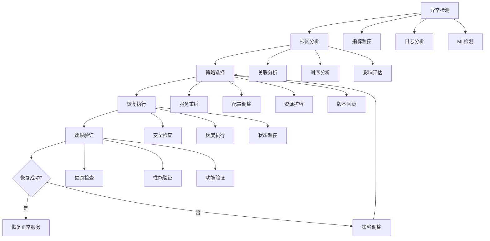

**自愈策略决策矩阵图**：
```mermaid
graph LR
    A[异常类型] --> B[恢复策略选择]

    A --> A1[服务异常]
    A --> A2[资源异常]
    A --> A3[数据异常]
    A --> A4[网络异常]

    A1 --> B1[服务重启]
    A1 --> B2[负载重分配]
    A1 --> B3[降级服务]

    A2 --> B4[资源扩容]
    A2 --> B5[资源重分配]
    A2 --> B6[配置优化]

    A3 --> B7[数据修复]
    A3 --> B8[备份恢复]
    A3 --> B9[缓存重建]

    A4 --> B10[连接重试]
    A4 --> B11[路由切换]
    A4 --> B12[备用通道]
```

**自愈效果监控看板图**：
```mermaid
pie title 自愈策略成功率统计
    "自动恢复成功" : 75
    "人工介入恢复" : 15
    "恢复失败需升级" : 7
    "自愈过程中断" : 3
```

**90. 异常处理的成本优化策略？**

**面试场景**：系统运维专家面试，考察成本控制

**口语化答案**：
异常处理需要在系统稳定性和成本控制之间找到平衡点，避免过度投入资源。

**核心设计思路**：
通过异常风险评估、资源分级投入、自动化程度优化实现成本控制。建立ROI评估模型，量化异常处理投入和避免的损失。采用智能化的资源分配策略，确保关键异常获得充足资源，低优先级异常采用低成本处理方式。

**异常处理成本构成分析图**：
```mermaid
pie title 异常处理成本构成
    "人力成本" : 35
    "计算资源" : 25
    "监控系统" : 20
    "存储成本" : 10
    "网络成本" : 5
    "其他成本" : 5
```

**成本优化策略决策流程图**：
```mermaid
flowchart TD
    A[异常风险评估] --> B{风险等级判断}

    B -->|高风险| C[高投入策略]
    B -->|中风险| D[中等投入策略]
    B -->|低风险| E[低成本策略]

    C --> C1[实时监控]
    C --> C2[自动恢复]
    C --> C3[多重告警]

    D --> D1[定期监控]
    D --> D2[半自动恢复]
    D --> D3[单点告警]

    E --> E1[日志记录]
    E --> E2[批量处理]
    E --> E3[延迟告警]

    C --> F[ROI评估]
    D --> F
    E --> F

    F --> G{成本效益比}
    G -->|合理| H[策略维持]
    G -->|不合理| I[策略调整]

    I --> A
```

**异常处理ROI评估模型图**：
```mermaid
graph LR
    A[ROI = 避免损失 / 投入成本] --> B[避免损失计算]
    A --> C[投入成本计算]

    B --> B1[直接业务损失]
    B --> B2[用户体验损失]
    B --> B3[声誉损失]
    B --> B4[SLA违约损失]

    C --> C1[人力成本]
    C --> C2[技术成本]
    C --> C3[运营成本]
    C --> C4[机会成本]
```

---

## 边缘AI系统异常处理

### ⭐⭐⭐ 专家题 (95-100)

**95. 边缘计算环境下的AI异常处理挑战？**

**面试场景**：边缘计算架构师面试，考察边缘异常处理

**口语化答案**：
边缘AI环境面临网络不稳定、资源受限、部署分散等特殊挑战，需要定制化的异常处理策略。

**核心设计思路**：
考虑边缘环境的网络延迟、带宽限制、计算资源约束等特点。设计轻量级的异常检测算法、本地化的恢复策略、智能的同步机制。重点处理网络分区、设备故障、资源耗尽等边缘特有异常场景。

**边缘AI系统异常处理架构图**：
```mermaid
graph TB
    A[边缘AI节点] --> B[本地异常处理]
    A --> C[云端协同处理]

    B --> B1[轻量级检测]
    B --> B2[本地恢复]
    B --> B3[降级服务]

    C --> C1[异常数据上传]
    C --> C2[云端模型更新]
    C --> C3[远程协助恢复]

    B --> D[设备协同]
    D --> D1[负载转移]
    D --> D2[状态同步]
    D --> D3[互助恢复]
```

**边缘异常处理资源优化图**：
```mermaid
radarChart
    title 边缘异常处理策略对比
    axis 检测精度, 响应速度, 资源占用, 网络依赖, 离线能力, 可扩展性

    "本地检测" : 7, 9, 8, 2, 9, 6
    "云端协同" : 9, 5, 4, 8, 3, 8
    "设备协同" : 6, 7, 7, 3, 8, 7
    "混合模式" : 8, 8, 6, 6, 7, 9
```

**100. AI系统异常处理的未来发展趋势？**

**面试场景**：技术专家面试，考察技术前瞻性

**口语化答案**：
AI异常处理正在向智能化、自动化、预测性方向发展，形成主动防御体系。

**核心设计思路**：
AI技术深度融入异常处理的各个环节，实现预测性异常检测、自适应恢复策略、智能化运维决策。结合AIOps理念，构建自我学习、自我优化的异常处理系统。边缘计算和云计算协同，提供更灵活的异常处理能力。

**未来异常处理技术演进路线图**：
```mermaid
timeline
    title AI异常处理技术演进
    section 当前阶段
        反应式处理 : 事后响应<br/>人工介入
        规则驱动 : 静态阈值<br/>固定策略
    section 近期发展
        智能检测 : ML算法<br/>自动识别
        自适应恢复 : 动态策略<br/>自动执行
    section 中期目标
        预测性防护 : 异常预测<br/>主动防御
        自学习系统 : 持续优化<br/>策略演进
    section 未来愿景
        自主运维 : AI决策<br/>全面自动化
        生态协同 : 跨系统协作<br/>智能联动
```

**下一代异常处理系统架构图**：
```mermaid
graph TB
    A[智能异常处理系统] --> B[预测层]
    A --> C[检测层]
    A --> D[处理层]
    A --> E[学习层]

    B --> B1[异常预测]
    B --> B2[风险评估]
    B --> B3[容量规划]

    C --> C1[多模态检测]
    C --> C2[实时分析]
    C --> C3[智能告警]

    D --> D1[自愈执行]
    D --> D2[资源调度]
    D --> D3[服务编排]

    E --> E1[模式学习]
    E --> E2[策略优化]
    E --> E3[知识积累]

    E --> B
    E --> C
    E --> D
```

---

## 总结

Java异常处理在AI系统中具有重要作用，需要掌握：

1. **异常体系理解**：深入掌握Java异常机制和分类体系
2. **AI系统特性**：理解AI系统特有的异常场景和处理需求
3. **分布式处理**：掌握分布式环境下的异常传播和隔离
4. **智能检测**：利用AI技术提升异常检测的准确性和预测性
5. **自愈机制**：设计自动化的恢复策略和系统

通过系统的异常处理设计，AI系统可以获得更高的稳定性、可用性和用户体验。