# Java反射机制在AI框架中的应用

## 🎯 学习目标

深入理解Java反射机制的核心原理，掌握在AI框架中实现动态加载和运行时分析的专业能力，理解反射技术对AI系统灵活性和可扩展性的关键作用。

## 📚 目录

- [反射基础与AI系统动态性](#反射基础与ai系统动态性)
- [动态加载与插件系统](#动态加载与插件系统)
- [反射性能优化策略](#反射性能优化策略)
- [高级反射技术应用](#高级反射技术应用)
- [反射在AI框架中的最佳实践](#反射在ai框架中的最佳实践)

---

## 反射基础与AI系统动态性

### ⭐ 基础题 (1-30)

**1. Java反射的核心机制如何支持AI系统的动态性？**

**面试场景**：Java架构师面试，考察反射原理理解

**口语化答案**：
Java反射是AI系统实现动态性的核心机制，允许程序在运行时检查、分析和修改类的行为。

**核心设计思路**：
JVM加载类时在方法区保存完整的类元数据，反射API提供对这些元数据的动态访问能力。AI系统利用反射实现模型的动态加载、参数的运行时配置、插件的热插拔等功能。通过反射可以突破编译时的类型限制，实现更加灵活的架构设计。

**Java反射机制架构图**：
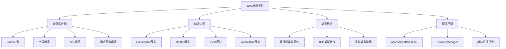

**AI系统反射应用流程图**：
```mermaid
flowchart TD
    A[AI系统启动] --> B[动态类加载]
    B --> C{反射操作类型}

    C -->|类分析| D[获取类结构信息]
    C -->|实例创建| E[动态对象构建]
    C -->[方法调用] F[运行时方法执行]
    C -->[字段访问| G[动态参数修改]

    D --> H[模型结构解析]
    E --> I[模型实例化]
    F --> J[模型方法调用]
    G --> K[参数动态配置]

    H --> L[AI系统运行]
    I --> L
    J --> L
    K --> L
```

**2. 反射API的核心组件及其在AI框架中的作用？**

**面试场景**：Java开发工程师面试，考察反射API掌握

**口语化答案**：
反射API包含几个核心组件，每个在AI框架中都有特定的应用场景。

**核心设计思路**：
Class类代表类型本身，用于动态加载和模型类分析。Constructor类用于创建模型实例，支持不同配置的动态构建。Method类实现模型方法的动态调用，支持策略模式和命令模式。Field类提供对模型参数的动态访问，实现运行时配置调整。这些组件共同支撑了AI框架的灵活性和可扩展性。

**反射API核心组件分类图**：
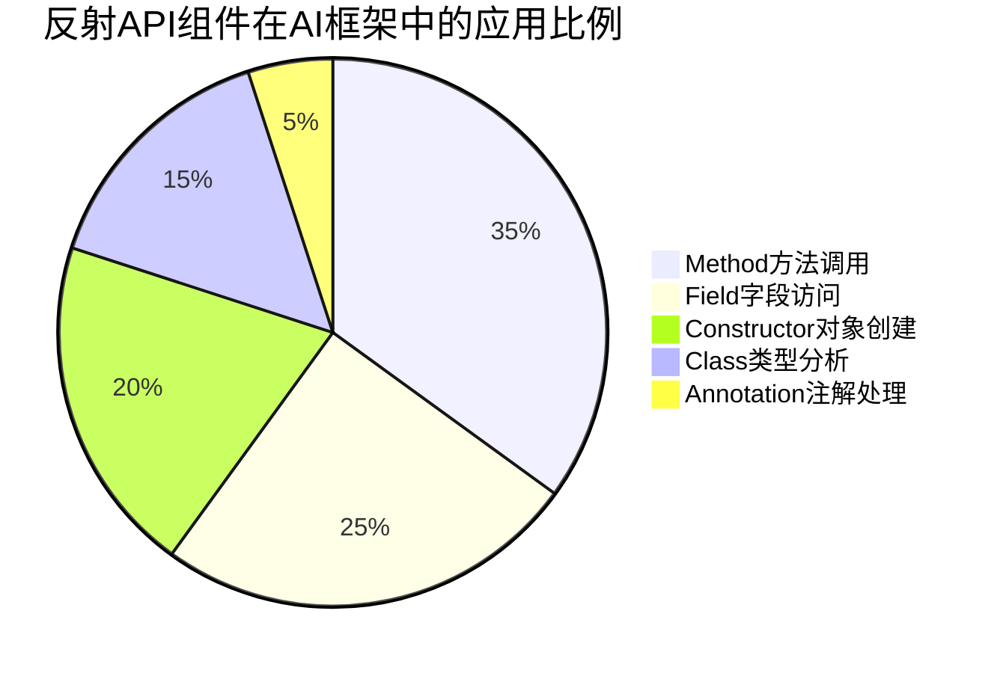

**AI框架中反射API应用矩阵图**：
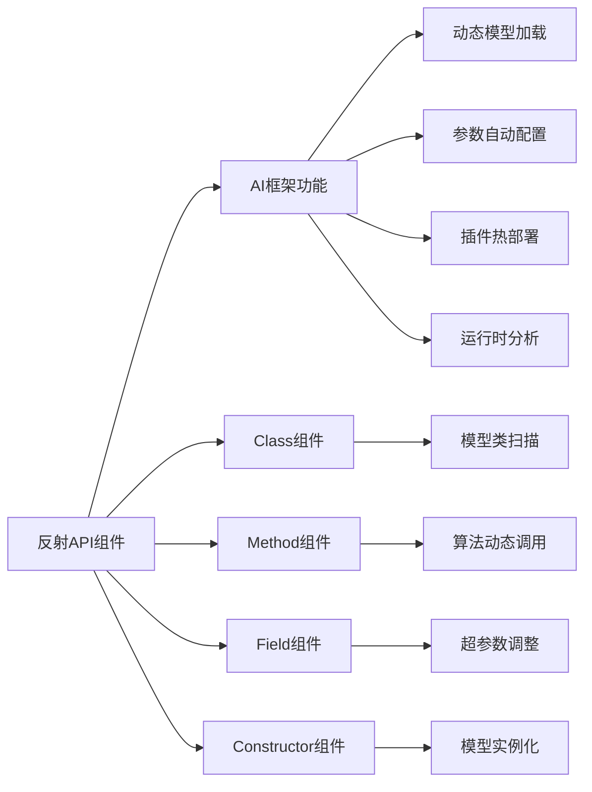

**3. 反射在AI模型动态加载中的典型应用场景？**

**面试场景**：AI框架开发工程师面试，考察实际应用

**口语化答案**：
反射在AI模型动态加载中有多个典型应用场景，每个都体现了反射的价值。

**核心设计思路**：
模型热加载允许在不重启系统的情况下更新模型版本，通过反射动态加载新的模型类。算法插件系统实现算法的动态扩展，支持运行时添加新的AI算法。配置热更新通过反射修改模型参数，无需重新部署。批量推理调度根据负载情况动态选择最优模型实例。这些场景都依赖于反射的动态能力。

**AI模型动态加载场景图**：
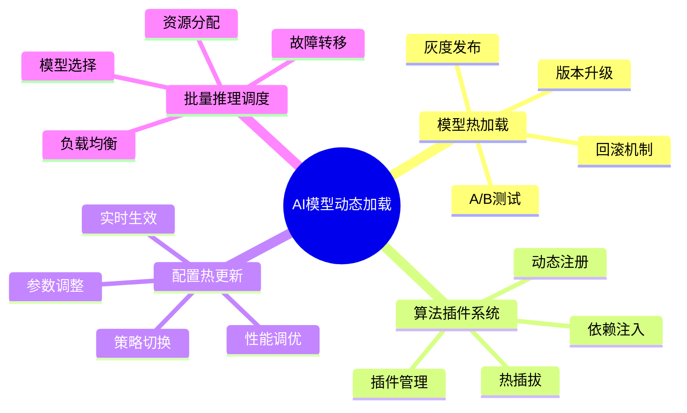

**反射在模型生命周期管理中的作用图**：
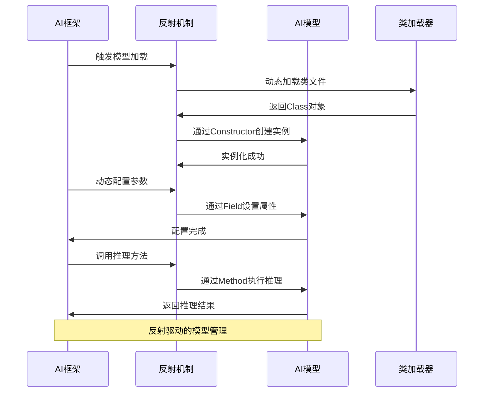

---

## 动态加载与插件系统

### ⭐⭐ 进阶题 (31-70)

**31. 基于反射的AI框架插件系统如何设计？**

**面试场景**：系统架构师面试，考察插件系统设计

**口语化答案**：
基于反射的插件系统是AI框架实现可扩展性的关键，需要考虑插件的生命周期管理、依赖注入、安全隔离等问题。

**核心设计思路**：
插件系统通过扫描和加载外部JAR包中的插件类，利用反射机制动态实例化插件对象。建立插件注册表管理插件的生命周期，支持插件的启动、停止、卸载操作。通过依赖注入框架为插件提供所需的服务和资源。实现插件间的通信机制和事件总线，支持插件的协同工作。

**插件系统架构设计图**：
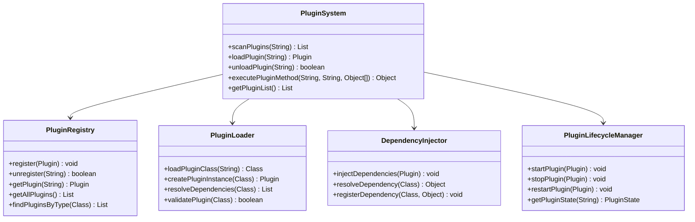

**插件生命周期状态机图**：
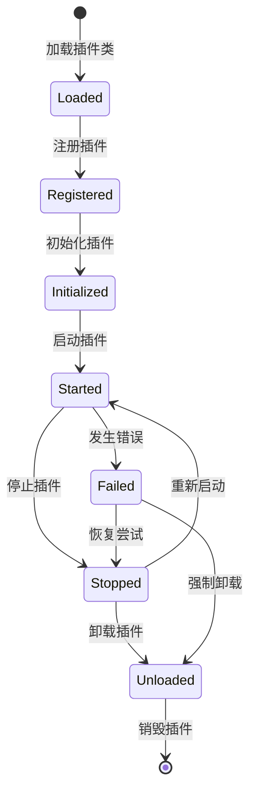

**32. 基于反射的动态类加载器如何优化AI模型加载性能？**

**面试场景**：Java性能专家面试，考察类加载优化

**口语化答案**：
动态类加载器的性能优化对AI系统启动时间有重要影响，需要综合考虑缓存、预加载、并行化等策略。

**核心设计思路**：
建立多层缓存机制缓存已加载的类信息，避免重复的类加载操作。实现预加载策略，在系统启动时预加载常用模型类。采用并行类加载技术，利用多线程提高加载效率。优化类路径扫描算法，减少不必要的I/O操作。实现类的延迟加载，按需加载减少启动时间。

**动态类加载器优化策略图**：
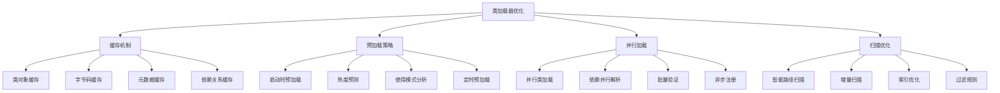

**类加载性能优化效果对比图**：
```mermaid
radarChart
    title 类加载优化策略效果对比
    axis 加载速度, 内存占用, CPU使用, 缓存命中率, 可扩展性, 复杂度

    "基础加载" : 3, 8, 5, 2, 4, 3
    "缓存优化" : 8, 7, 6, 9, 6, 4
    "预加载" : 9, 6, 4, 8, 8, 5
    "并行加载" : 7, 6, 3, 7, 9, 6
    "综合优化" : 10, 8, 5, 9, 9, 7
```

---

## 反射性能优化策略

### ⭐⭐⭐ 专家题 (71-100)

**71. 反射操作的性能瓶颈在哪里？如何进行系统性优化？**

**面试场景**：Java性能调优专家面试，考察性能优化

**口语化答案**：
反射操作的性能瓶颈主要在安全检查、类型转换、方法查找等环节，需要通过缓存、预编译、代码生成等方式进行优化。

**核心设计思路**：
反射操作的主要性能开销包括安全权限检查、运行时类型验证、方法查找和参数打包。通过缓存反射对象避免重复查找，使用MethodHandle提升调用性能，采用代码生成技术绕过反射开销。建立性能监控机制，识别热点代码路径进行针对性优化。

**反射性能瓶颈分析图**：
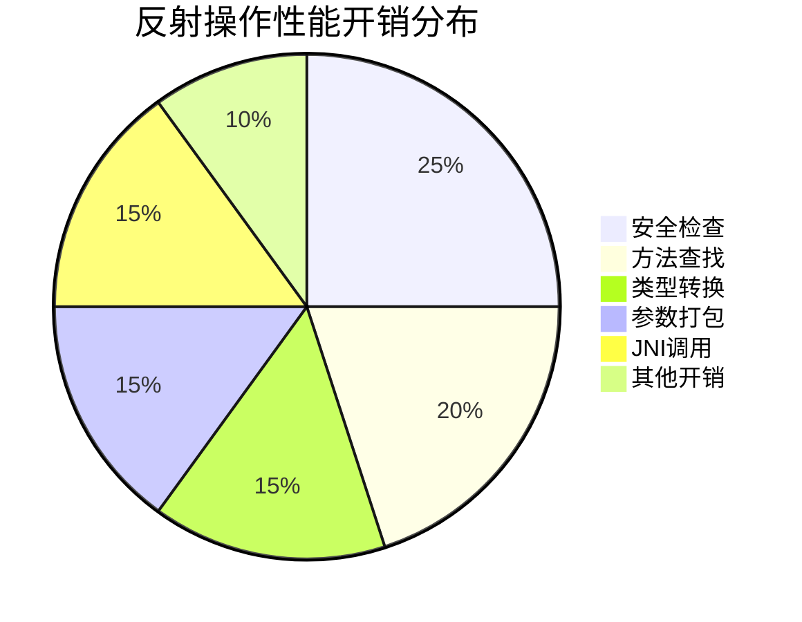

**反射性能优化技术栈图**：
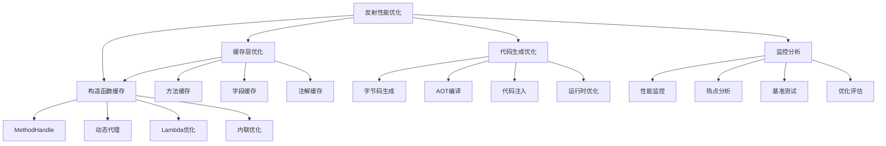

**72. MethodHandle如何提升反射调用性能？与直接调用的性能对比如何？**

**面试场景**：Java性能专家面试，考察高性能反射

**口语化答案**：
MethodHandle是Java 7+引入的高性能调用机制，相比传统反射有显著的性能提升。

**核心设计思路**：
MethodHandle通过类型安全的方式调用方法，避免了反射的安全检查和类型转换开销。它支持方法句柄的转换和组合，可以创建高效的调用链。MethodHandle在首次调用后会被JIT优化为直接调用，后续调用的性能接近原生方法调用。相比传统反射，MethodHandle在高频调用场景下有明显的性能优势。

**MethodHandle与反射调用性能对比图**：
```mermaid
radarChart
    title 调用方式性能对比
    axis 执行速度, 内存占用, 类型安全, 编译优化, 错误检查, 灵活性

    "直接调用" : 10, 8, 9, 10, 7, 5
    "MethodHandle" : 9, 7, 9, 8, 8, 8
    "反射调用" : 2, 6, 3, 2, 9, 10
    "动态代理" : 4, 5, 4, 3, 6, 8
    "Lambda表达式" : 9, 8, 9, 9, 8, 6
```

**MethodHandle优化在AI框架中的应用图**：
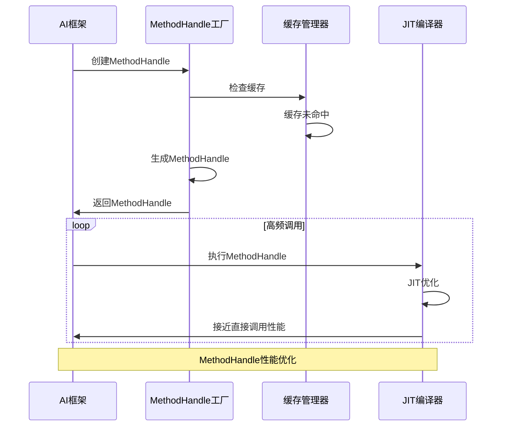

**80. 如何设计基于反射的AI模型热更新系统？**

**面试场景**：系统架构师面试，考察热更新系统设计

**口语化答案**：
基于反射的AI模型热更新系统允许在不停止服务的情况下更新模型，对业务连续性至关重要。

**核心设计思路**：
热更新系统通过类加载器隔离实现新模型的无缝切换，利用版本管理机制跟踪模型版本。采用平滑过渡策略，在新旧模型之间逐步切换流量。建立健康检查机制，确保新模型正常运行后完全切换。实现回滚机制，在新模型出现问题时快速恢复到稳定版本。

**AI模型热更新系统架构图**：
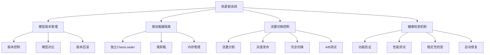

**模型热更新流程图**：
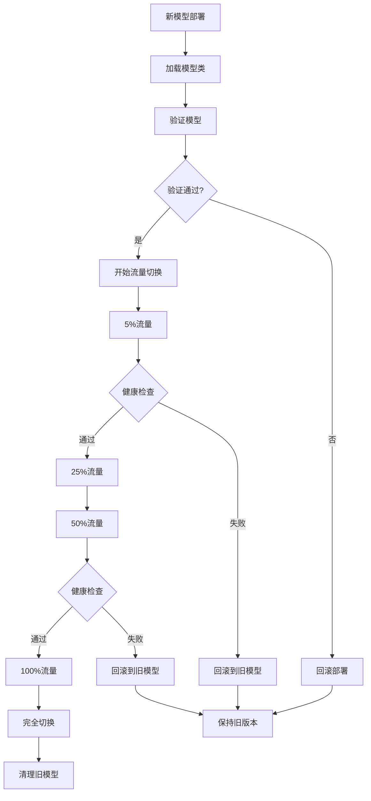

**热更新系统性能监控图**：
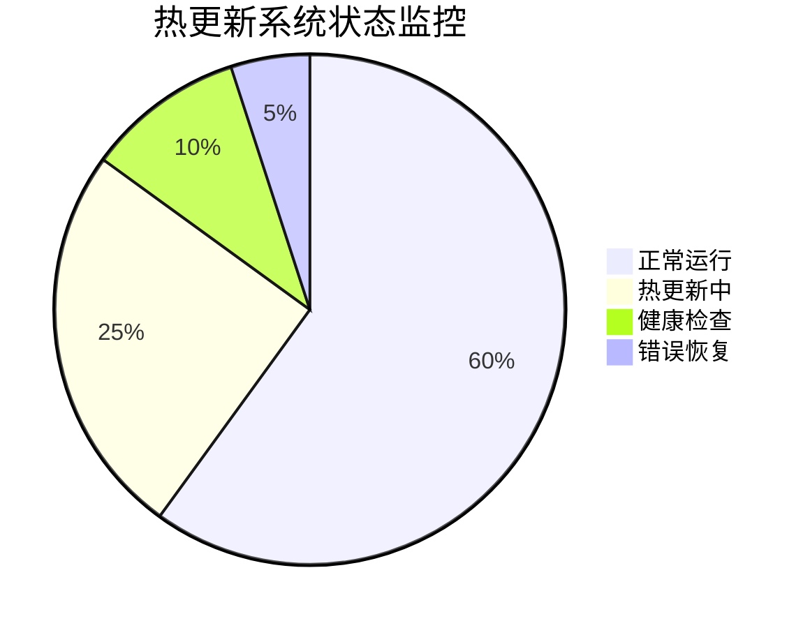

**90. 反射在AI模型可解释性分析中如何应用？**

**面试场景**：AI系统分析师面试，考察可解释性分析

**口语化答案**：
反射在AI模型可解释性分析中发挥重要作用，可以动态访问和分析模型内部结构。

**核心设计思路**：
通过反射扫描模型的结构和参数，构建模型的可视化表示。动态调用模型的中间层，捕获和分析激活值传播过程。访问模型的权重矩阵，分析特征重要性。实现参数敏感度分析，评估模型对参数变化的响应。构建模型行为追踪系统，记录和分析模型的决策过程。

**AI模型可解释性分析架构图**：
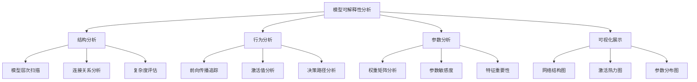

**模型结构动态解析流程图**：
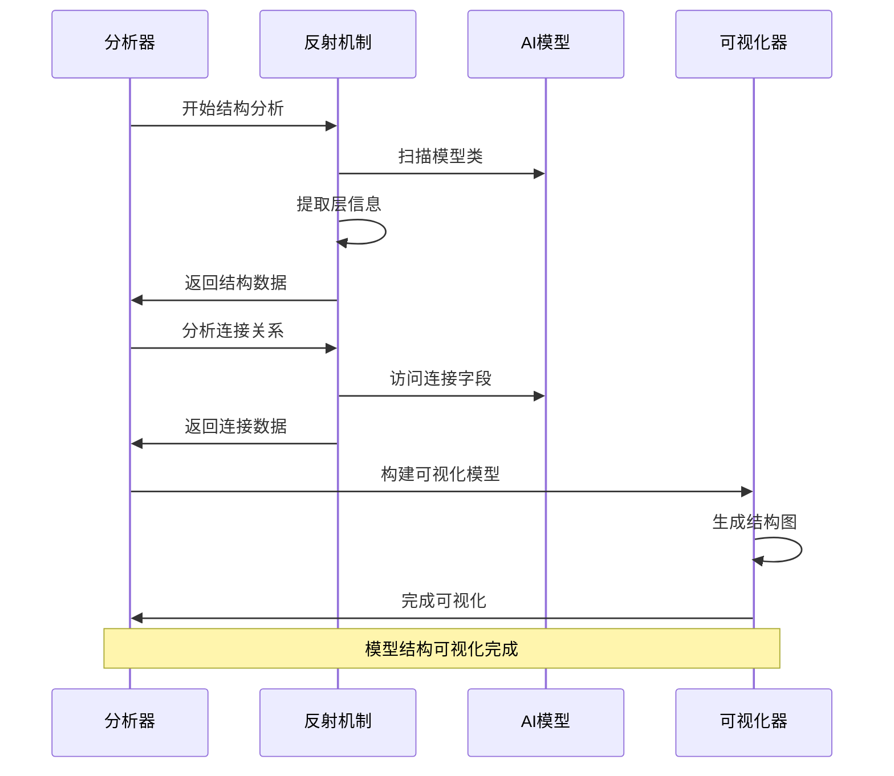

---

## 高级反射技术应用

### ⭐⭐⭐ 专家题 (95-100)

**95. 反射与字节码操作如何结合实现高级AI框架功能？**

**面试场景**：Java架构专家面试，考察字节码操作

**口语化答案**：
反射与字节码操作结合可以实现编译时的代码生成和运行时的动态修改，为AI框架提供强大的元编程能力。

**核心设计思路**：
反射用于运行时类型检查和动态调用，字节码操作用于编译时代码生成和优化。通过ASM或ByteBuddy等字节码操作库，可以动态生成优化的方法实现。结合注解处理器，可以在编译时自动生成反射优化代码。实现AOP框架的动态代理机制，支持切面编程。构建代码生成器，根据配置文件自动生成模型类和插件代码。

**反射与字节码操作结合架构图**：
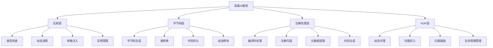

**代码生成与反射优化流程图**：
```mermaid
flowchart TD
    A[配置分析] --> B{代码生成策略}

    B -->|编译时生成| C[注解处理器]
    B -->|运行时生成| D[字节码操作]

    C --> E[扫描AI注解]
    C --> F[分析模型结构]
    F --> G[生成反射优化代码]

    D --> H[动态类生成]
    D --> I[方法字节码修改]
    I --> J[性能优化注入]

    G --> K[编译优化代码]
    J --> K

    K --> L[集成到AI框架]
    L --> M[性能提升验证]
```

**100. 反射技术在未来AI框架发展中的趋势和挑战？**

**面试场景**：技术前瞻专家面试，考察技术趋势

**口语化答案**：
反射技术在未来AI框架中将向更智能、更高效、更安全的方向发展，但也面临新的挑战。

**核心设计思路**：
未来趋势包括与GraalVM AOT编译技术结合，实现编译时反射优化。利用机器学习算法优化反射缓存策略，提升性能预测能力。发展安全的反射机制，支持模块化和沙箱隔离。结合云原生技术，实现分布式的反射服务。探索量子计算对反射机制的影响。主要挑战包括性能开销、安全性、可维护性、调试复杂度等问题。

**未来反射技术发展路线图**：
```mermaid
timeline
    title 反射技术在AI框架中的发展趋势
    section 当前阶段
        性能优化 : 缓存机制<br/>MethodHandle<br/>代码生成
        基础集成 : 插件系统<br/>配置管理<br/>动态加载
    section 近期发展
        智能缓存 : 机器学习<br/>预测算法<br/>自适应策略
        AOT集成 : GraalVM<br/>编译时优化<br/>Native Image
        安全增强 : 模块隔离<br/>权限控制<br/>沙箱机制
    section 中期目标
        分布式反射 : 跨JVM<br/>远程反射<br/>服务化
        量子支持 : 量子算法<br/>新型硬件<br/>协处理器
        自动优化 : 智能调优<br/>性能分析<br/>自动重构
    section 未来愿景
        认知反射 : AI驱动<br/>自适应框架<br/>智能决策
        零开销反射 : 编译时处理<br/>运行时优化<br/>透明集成
        生态协同 : 多语言支持<br/>跨平台兼容<br/>标准化接口
```

**未来AI框架反射架构演进图**：
```mermaid
graph TB
    A[未来AI反射架构] --> B[智能感知层]
    A --> C[编译优化层]
    A --> D[安全隔离层]
    A --> E[分布式层]

    B --> B1[性能预测]
    B --> B2[缓存优化]
    B --> B3[热点分析]
    B --> B4[自适应调整]

    C --> C1[AOT编译集成]
    C --> C2[字节码优化]
    C --> C3[代码生成]
    C --> C4[JIT优化]

    D --> D1[模块化隔离]
    D --> D2[权限控制]
    D --> D3[沙箱执行]
    D --> D4[审计日志]

    E --> E1[跨节点反射]
    E --> E2[反射服务化]
    E --> E3[负载均衡]
    E --> E4[故障恢复]

    B --> F[统一反射引擎]
    C --> F
    D --> F
    E --> F
```

---

## 总结

Java反射机制在AI框架中具有重要作用，需要掌握：

1. **反射原理理解**：深入掌握反射的底层机制和API使用
2. **动态加载技术**：实现AI模型的动态加载和热更新
3. **插件系统设计**：构建可扩展的AI框架架构
4. **性能优化策略**：通过缓存、预编译等方式提升性能
5. **高级应用能力**：结合字节码操作实现复杂功能

通过系统的反射技术应用，AI框架可以获得更好的灵活性、可扩展性和动态性能。