# Java注解处理器在AI代码生成中的应用

## 🎯 学习目标

深入理解Java注解处理器的工作原理，掌握在AI系统中实现编译时代码生成的专业技能，具备设计高效代码生成工具的专业能力，理解注解处理器对AI开发效率提升的关键作用。

## 📚 目录

- [注解处理器基础与AI代码生成](#注解处理器基础与ai代码生成)
- [AI框架代码生成设计](#ai框架代码生成设计)
- [编译时优化技术](#编译时优化技术)
- [高级代码生成模式](#高级代码生成模式)
- [性能优化与最佳实践](#性能优化与最佳实践)

---

## 注解处理器基础与AI代码生成

### ⭐ 基础题 (1-30)

**1. 注解处理器如何革新AI系统的开发模式？**

**面试场景**：Java架构师面试，考察注解处理器核心价值

**口语化答案**：
注解处理器通过编译时代码生成，彻底改变了AI系统的开发模式，大幅提升开发效率和代码质量。

**核心设计思路**：
AI系统包含大量重复的样板代码，如神经网络层定义、数据管道配置、模型序列化等。注解处理器在编译时扫描特定注解，自动生成这些样板代码，消除手写错误，保证代码一致性。编译时生成相比运行时反射具有零性能开销、类型安全、IDE支持好等优势。开发者只需关注业务逻辑，框架自动生成基础设施代码，实现真正的声明式编程。

**注解处理器AI代码生成架构图**：
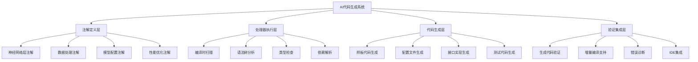

**AI注解处理器工作流程图**：
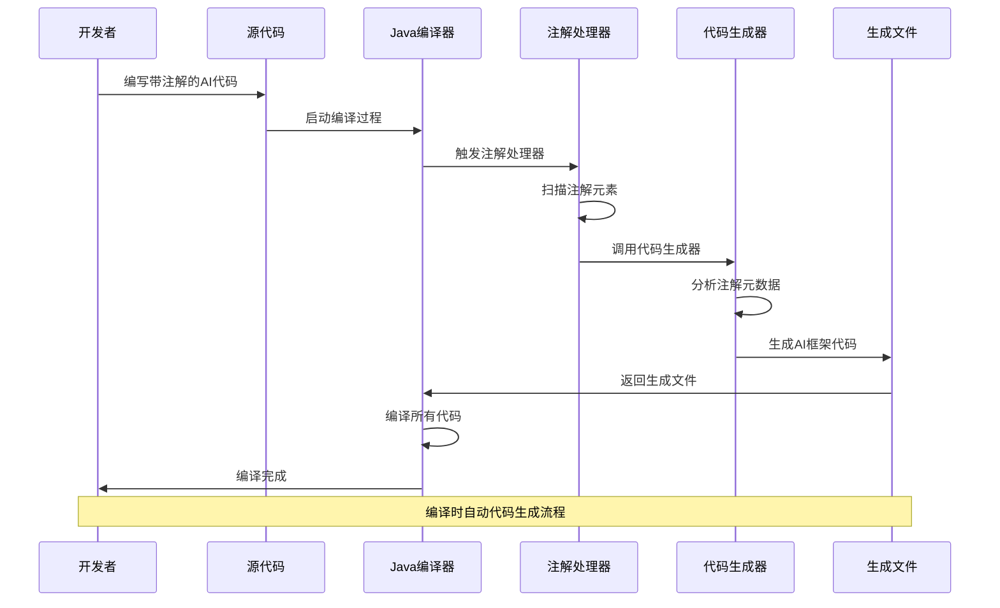

**2. 注解处理器的核心组件如何协作实现AI代码生成？**

**面试场景**：Java开发专家面试，考察处理器组件理解

**口语化答案**：
注解处理器的核心组件通过精密协作，实现从注解扫描到代码生成的完整流程。

**核心设计思路**：
ProcessingEnvironment提供处理器运行环境，包含元素操作工具、类型检查工具、文件生成工具等核心API。AbstractProcessor作为基类，定义处理流程模板，子类实现具体的处理逻辑。通过RoundEnvironment获取当前轮次的注解元素，Elements和Types工具类提供语法树操作能力，Filer负责生成代码文件，Messager处理错误信息和警告。

**注解处理器核心组件协作图**：
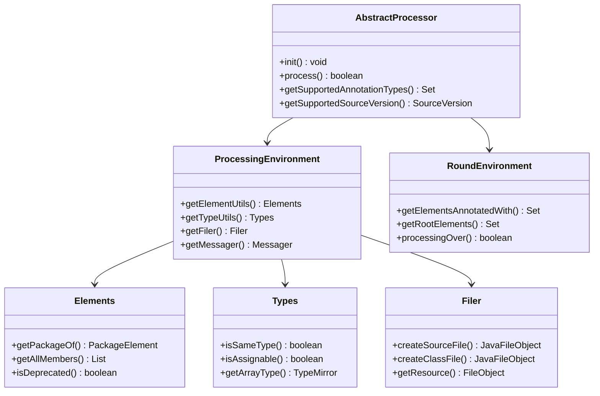

**AI注解处理轮次处理机制图**：
```mermaid
flowchart TD
    A[编译开始] --> B[第一轮处理]
    B --> C{发现新文件?}

    C -->|是| D[生成新源文件]
    D --> E[下一轮处理]
    E --> F{还有新文件?}

    F -->|是| C
    F -->|否| G[最后一轮处理]

    C -->|否| H[处理当前轮次]
    H --> I{处理完成?}

    I -->|否| E
    I -->|是| J[编译结束]

    G --> J

    Note over B,J: 多轮处理确保所有生成的代码都被处理
```

**3. AI系统中的编译时验证如何通过注解处理器实现？**

**面试场景**：AI系统架构师面试，考察编译时验证能力

**口语化答案**：
编译时验证是AI系统质量保障的重要手段，注解处理器能够在编译阶段发现运行时问题。

**核心设计思路**：
通过自定义验证注解，在编译时检查AI模型的配置正确性、数据类型匹配、参数有效性等关键约束。相比运行时异常，编译时验证能够更早发现问题，提供更好的开发体验。建立完整的验证规则库，覆盖AI模型训练、推理、部署等各个阶段的配置要求，确保系统稳定性和正确性。

**AI编译时验证架构图**：
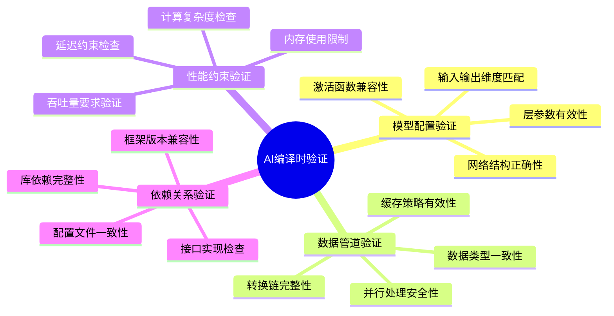

---

## AI框架代码生成设计

### ⭐⭐ 进阶题 (31-70)

**31. 如何设计基于注解的神经网络层代码生成系统？**

**面试场景**：AI框架架构师面试，考察神经网络代码生成设计

**口语化答案**：
神经网络层代码生成系统需要通过注解描述层的结构特征，自动生成对应的实现代码。

**核心设计思路**：
定义层次化的注解体系，从基础层类型到具体的配置参数。通过注解元素的元数据信息，生成完整的层实现类，包括前向传播、反向传播、参数初始化等方法。支持层组合的递归生成，构建复杂的网络结构。生成的代码遵循统一的接口规范，确保层间的兼容性和可替换性。

**神经网络层注解体系设计图**：
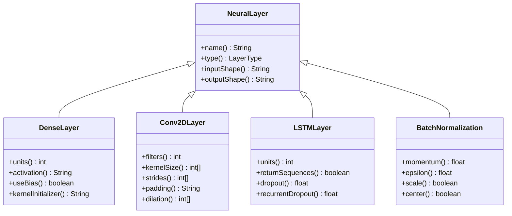

**AI层代码生成决策流程图**：
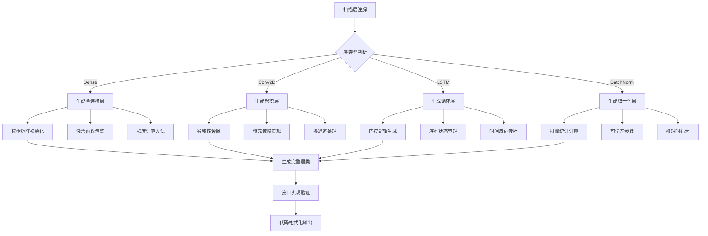

**32. AI数据管道的注解驱动代码生成如何设计？**

**面试场景**：大数据AI架构师面试，考察数据管道代码生成

**口语化答案**：
数据管道的注解驱动生成通过声明式配置，自动生成高效的数据处理代码。

**核心设计思路**：
数据管道包含读取、转换、缓存、批处理等多个环节。通过注解定义数据源、转换逻辑、性能要求等信息，处理器自动生成优化的数据处理代码。支持流式处理和批处理两种模式，根据数据特征和性能要求选择最优的实现策略。生成的代码包含错误处理、性能监控、资源管理等企业级特性。

**AI数据管道注解架构图**：
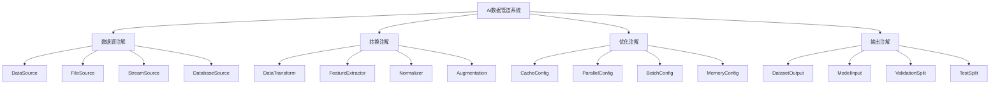

**数据管道代码生成策略图**：
```mermaid
radarChart
    title 数据管道生成策略对比
    axis 性能, 可维护性, 扩展性, 类型安全, 错误处理

    "简单转换链" : 6, 8, 5, 7, 6
    "并行处理管道" : 9, 6, 8, 8, 7
    "流式处理管道" : 8, 7, 9, 6, 8
    "批处理管道" : 7, 8, 6, 9, 7
    "混合模式管道" : 9, 7, 9, 8, 9
```

---

## 编译时优化技术

### ⭐⭐⭐ 专家题 (71-100)

**71. 注解处理器如何实现AI模型编译时优化？**

**面试场景**：AI性能优化专家面试，考察编译时优化技术

**口语化答案**：
编译时优化通过在编译阶段分析和优化AI模型，显著提升运行时性能。

**核心设计思路**：
利用编译时的完整信息，对模型图进行静态分析和优化。包括算子融合、常量折叠、内存布局优化、并行策略选择等关键技术。通过注解标记优化提示和约束，指导优化器生成更高效的代码。支持目标硬件的特定优化，如GPU向量化、CPU缓存友好的数据结构等。

**AI编译时优化架构图**：
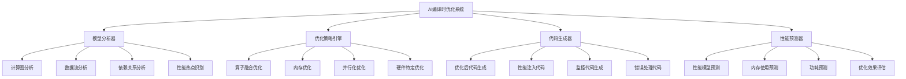

**AI模型优化决策树**：
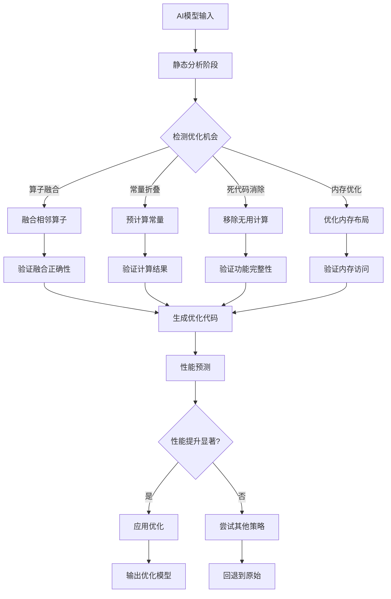

**72. 如何通过注解处理器实现AI系统的类型安全增强？**

**面试场景**：类型安全专家面试，考察编译时类型检查

**口语化答案**：
类型安全是AI系统稳定性的基础，注解处理器能够在编译时捕获类型相关的错误。

**核心设计思路**：
AI系统涉及多维数组、张量、模型参数等复杂数据类型。通过自定义类型注解，在编译时验证维度匹配、数据类型兼容性、参数约束等。建立类型推断系统，自动推导和验证类型信息。生成类型转换和检查代码，确保运行时类型安全。支持泛型类型参数，提供灵活的类型抽象。

**AI类型安全增强架构图**：
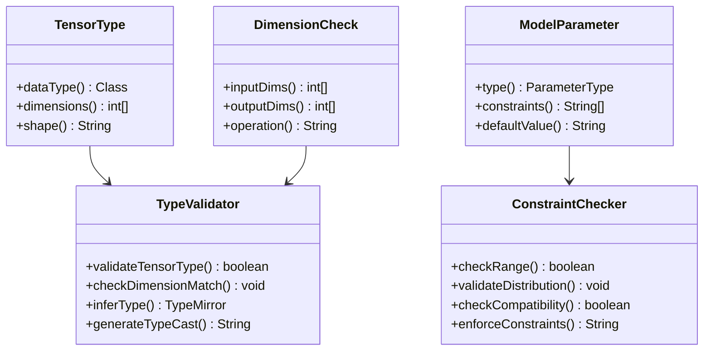

**AI类型检查流程图**：
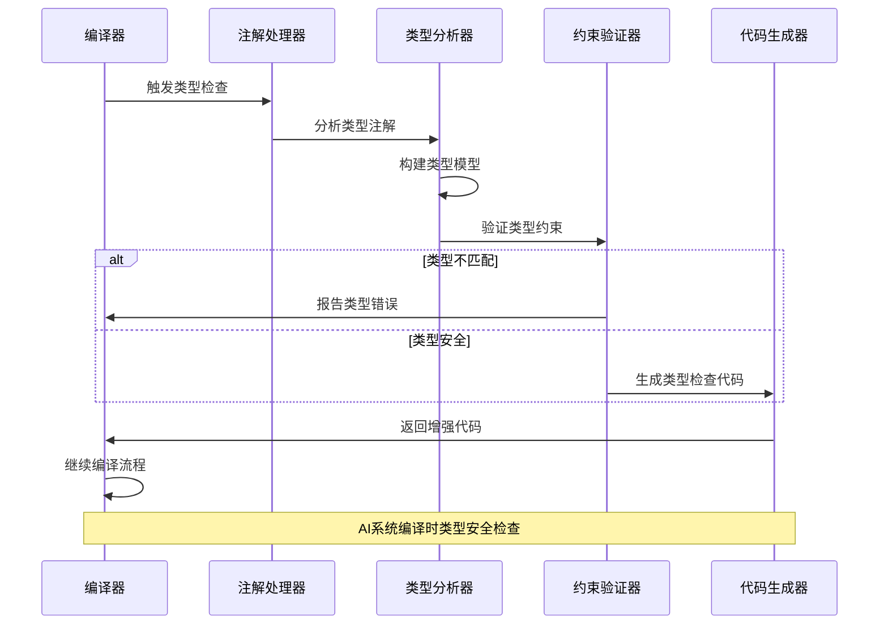

**80. 注解处理器如何实现AI系统的自动化测试代码生成？**

**面试场景**：测试自动化专家面试，考察测试代码生成

**口语化答案**：
自动化测试代码生成通过分析AI模型结构，自动生成全面的测试用例。

**核心设计思路**：
基于模型的结构和参数特征，生成单元测试、集成测试、性能测试等多种类型的测试代码。通过注解标记测试重点和边界条件，指导测试用例生成。支持数据驱动测试，自动生成测试数据集。包含正确性验证、性能基准、异常处理等测试场景。生成可维护的测试代码，支持测试的演进和扩展。

**AI测试代码生成架构图**：
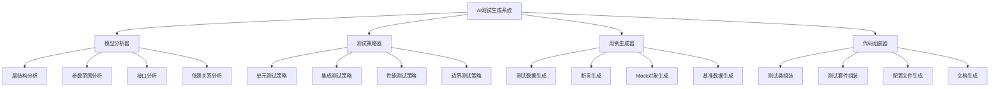

**AI测试覆盖度分析图**：
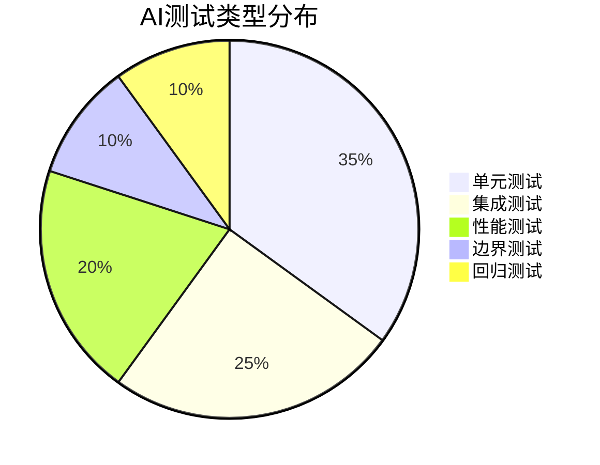

**81. 如何设计注解处理器的增量编译支持？**

**面试场景**：编译系统架构师面试，考察增量编译优化

**口语化答案**：
增量编译支持是大型AI项目开发效率的关键，需要精确的依赖分析和变化检测。

**核心设计思路**：
建立细粒度的依赖关系图，追踪注解元素间的依赖链路。通过文件修改时间和内容哈希检测变化，只重新处理受影响的元素。支持并行处理，充分利用多核CPU提升编译速度。实现智能缓存机制，避免重复计算。提供编译状态持久化，支持编译过程的恢复和断点续编。

**增量编译依赖分析图**：
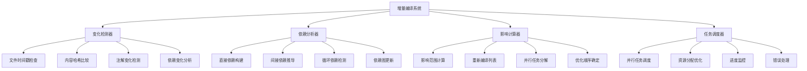

**AI增量编译性能优化对比图**：
```mermaid
radarChart
    title 增量编译优化策略
    axis 编译速度, 内存使用, 准确性, 复杂度, 可维护性

    "全量编译" : 2, 5, 10, 3, 6
    "简单增量" : 6, 7, 7, 5, 7
    "智能增量" : 9, 8, 9, 8, 8
    "并行增量" : 10, 6, 8, 7, 6
    "缓存优化" : 8, 9, 9, 6, 8
```

---

## 总结

Java注解处理器在AI代码生成中的应用需要掌握：

1. **核心原理**：深入理解注解处理器的工作机制和组件协作
2. **代码生成设计**：掌握AI框架代码生成的架构模式和最佳实践
3. **编译时优化**：实现模型优化、类型安全、性能提升等编译时增强
4. **高级应用**：构建测试生成、增量编译、性能监控等高级功能
5. **工程实践**：注重开发效率、代码质量和系统可维护性

通过系统的注解处理器技术应用，AI系统能够获得更好的开发效率、运行性能和代码质量。