# Java编译时优化与AI算法加速

## 🎯 学习目标

深入理解Java编译时优化机制，掌握AI算法加速的专业技能，具备设计和实现高效AI系统的专业能力，理解编译器优化对AI性能提升的关键作用。

## 📚 目录

- [编译器优化基础与AI性能](#编译器优化基础与ai性能)
- [JIT编译优化策略](#jit编译优化策略)
- [AI算法加速技术](#ai算法加速技术)
- [内存优化与缓存策略](#内存优化与缓存策略)
- [高级优化与性能调优](#高级优化与性能调优)

---

## 编译器优化基础与AI性能

### ⭐ 基础题 (1-30)

**1. Java编译器的优化机制如何影响AI算法性能？**

**面试场景**：Java性能专家面试，考察编译器优化理解

**口语化答案**：
Java编译器的多层优化机制对AI算法性能有着深远影响，通过编译时和运行时的协同优化显著提升执行效率。

**核心设计思路**：
Java编译器采用分层优化策略，前端编译器进行语法分析和基础优化，JIT编译器在运行时根据热点代码进行深度优化。AI算法通常包含大量数值计算、循环迭代和矩阵操作，这些正是编译器优化的重点领域。通过方法内联、循环优化、向量化等技术，将高级语言代码转换为高效的机器码，充分利用底层硬件性能。

**Java编译优化架构图**：
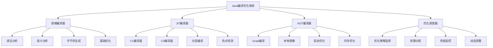

**AI算法编译优化流程图**：
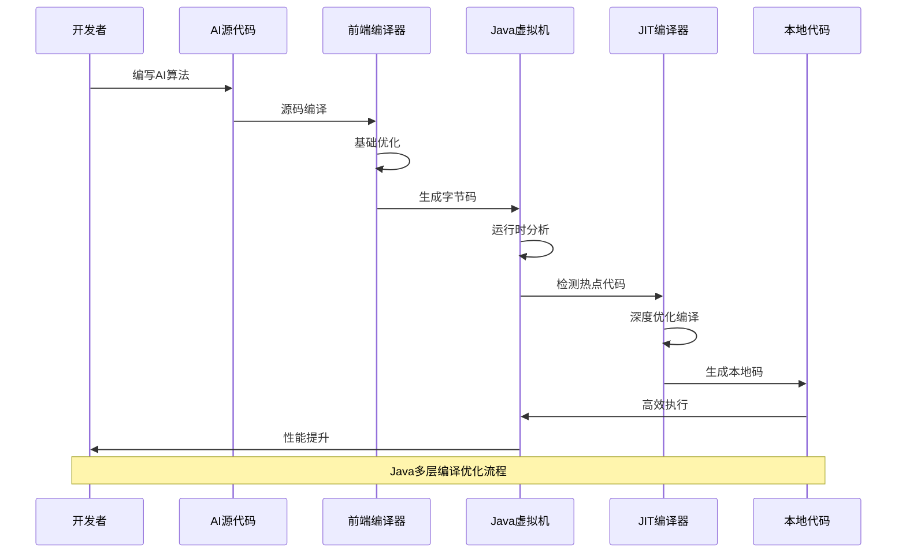

**2. AI算法中的热点代码如何被JIT编译器识别和优化？**

**面试场景**：JVM性能专家面试，考察热点代码检测

**口语化答案**：
热点代码检测是JIT编译器的核心功能，通过精确的计数和分析识别AI算法中的性能瓶颈。

**核心设计思路**：
JIT编译器通过方法调用计数器和循环回边计数器追踪代码执行频率。当计数超过阈值时触发编译，将字节码转换为优化的本地机器码。AI算法中的矩阵运算、神经网络前向传播、梯度计算等计算密集型操作通常成为热点。编译器根据代码特征选择C1编译器进行快速优化或C2编译器进行深度优化。

**JIT热点检测机制图**：
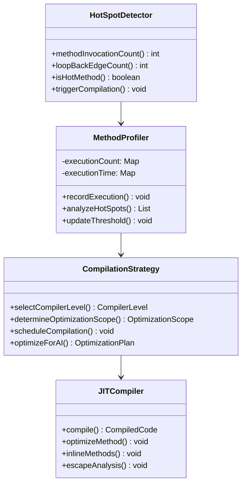

**AI热点代码分布图**：
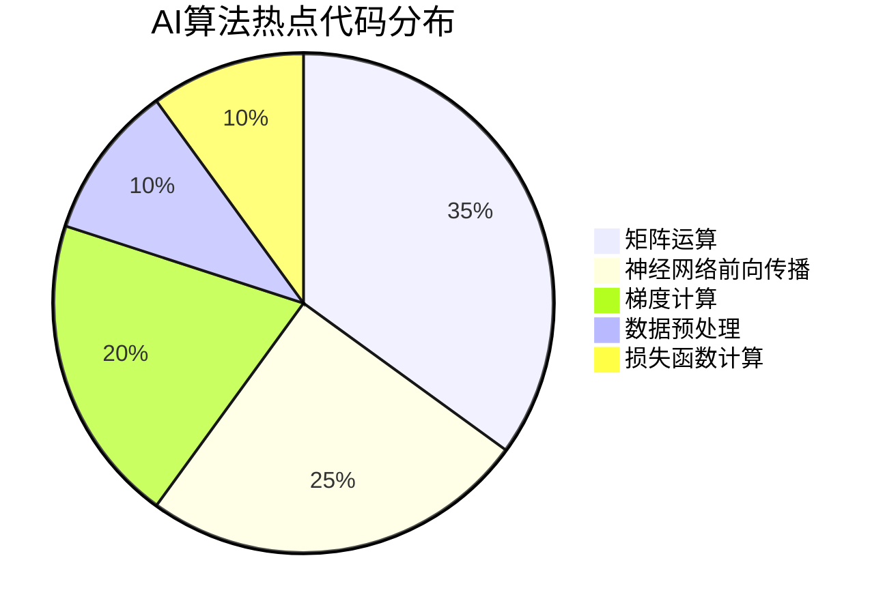

**3. Graal编译器如何提升AI算法的执行效率？**

**面试场景**：编译器专家面试，考察Graal编译器优势

**口语化答案**：
Graal编译器作为新一代JIT编译器，通过先进的优化技术显著提升AI算法的执行效率。

**核心设计思路**：
Graal编译器采用基于SSA（静态单赋值）的中间表示，支持更激进的优化策略。通过节点级的图表示，能够进行全局优化、更精确的逃逸分析和向量化。对于AI算法特有的计算模式，Graal提供专门的优化策略，如自动向量化、循环融合、内存访问优化等。AOT编译能力进一步减少启动延迟，提升实时AI应用的响应速度。

**Graal编译优化架构图**：
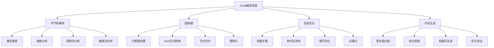

---

## JIT编译优化策略

### ⭐⭐ 进阶题 (31-70)

**31. 方法内联优化如何加速AI算法执行？**

**面试场景**：Java性能调优专家面试，考察方法内联优化

**口语化答案**：
方法内联是JIT编译器最重要的优化技术之一，对AI算法的性能提升尤为显著。

**核心设计思路**：
方法内联消除方法调用的开销，将被调用方法的方法体直接嵌入到调用点。AI算法通常包含大量小方法的调用，如数学函数、激活函数、损失函数等。通过内联，不仅减少调用开销，还为后续优化创造条件，如常量传播、死代码消除等。内联决策基于方法大小、调用频率、调用关系等因素，确保优化的收益大于成本。

**AI方法内联优化策略图**：
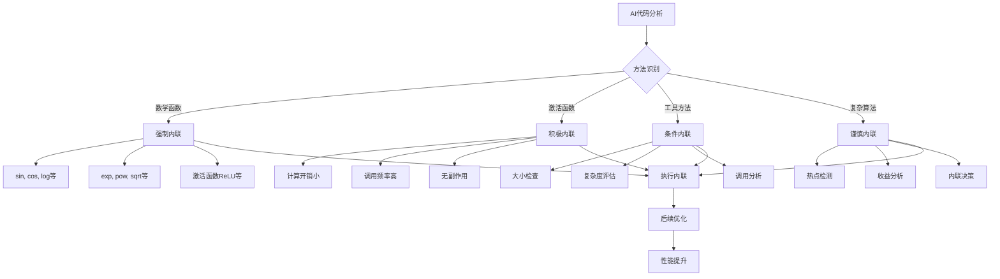

**内联优化效果对比图**：
```mermaid
radarChart
    title 内联优化策略效果
    axis 执行速度, 内存使用, 编译时间, 代码体积, 优化机会

    "无内联" : 3, 8, 9, 7, 2
    "保守内联" : 6, 7, 7, 6, 5
    "积极内联" : 9, 5, 4, 3, 9
    "智能内联" : 8, 7, 6, 5, 8
    "AI特化内联" : 10, 6, 5, 4, 10
```

**32. 循环优化技术如何提升AI训练性能？**

**面试场景**：AI系统性能优化面试，考察循环优化技术

**口语化答案**：
循环优化是AI算法性能提升的关键技术，通过多种优化策略显著减少计算开销。

**核心设计思路**：
AI训练过程包含大量循环操作，如epoch迭代、批次处理、矩阵乘法等。循环优化技术包括循环展开、循环合并、循环不变式外提、循环交换等。通过循环展开减少循环控制开销，通过循环合并提高数据局部性，通过循环不变式外提减少重复计算。这些优化技术与CPU缓存、分支预测、指令流水线等硬件特性紧密配合。

**AI循环优化架构图**：
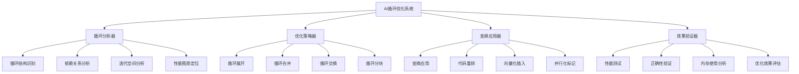

**循环优化决策矩阵图**：
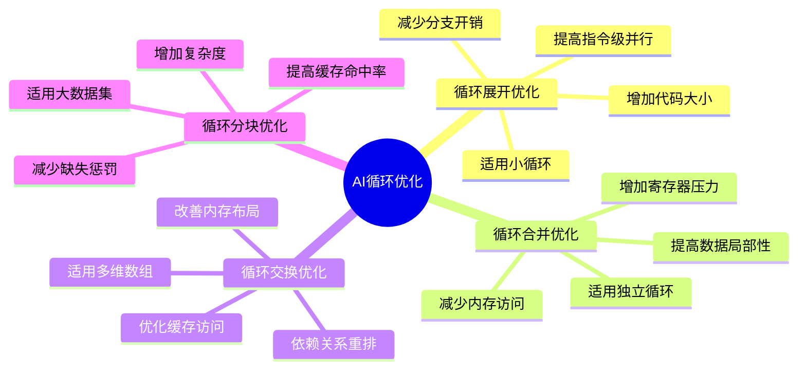

---

## AI算法加速技术

### ⭐⭐⭐ 专家题 (71-100)

**71. Vector API如何实现AI算法的向量化加速？**

**面试场景**：高性能计算专家面试，考察向量化技术

**口语化答案**：
Vector API是Java引入的革命性特性，为AI算法提供了硬件级向量化加速能力。

**核心设计思路**：
Vector API将底层SIMD（单指令多数据）指令暴露给Java开发者，支持在单个指令中处理多个数据元素。AI算法中的向量运算、矩阵操作、激活函数计算等都可通过向量化大幅加速。API提供类型安全的向量操作，支持不同硬件架构的自动适配。编译器将向量操作转换为最优的SIMD指令，充分利用现代CPU的向量计算能力。

**Vector API向量化架构图**：
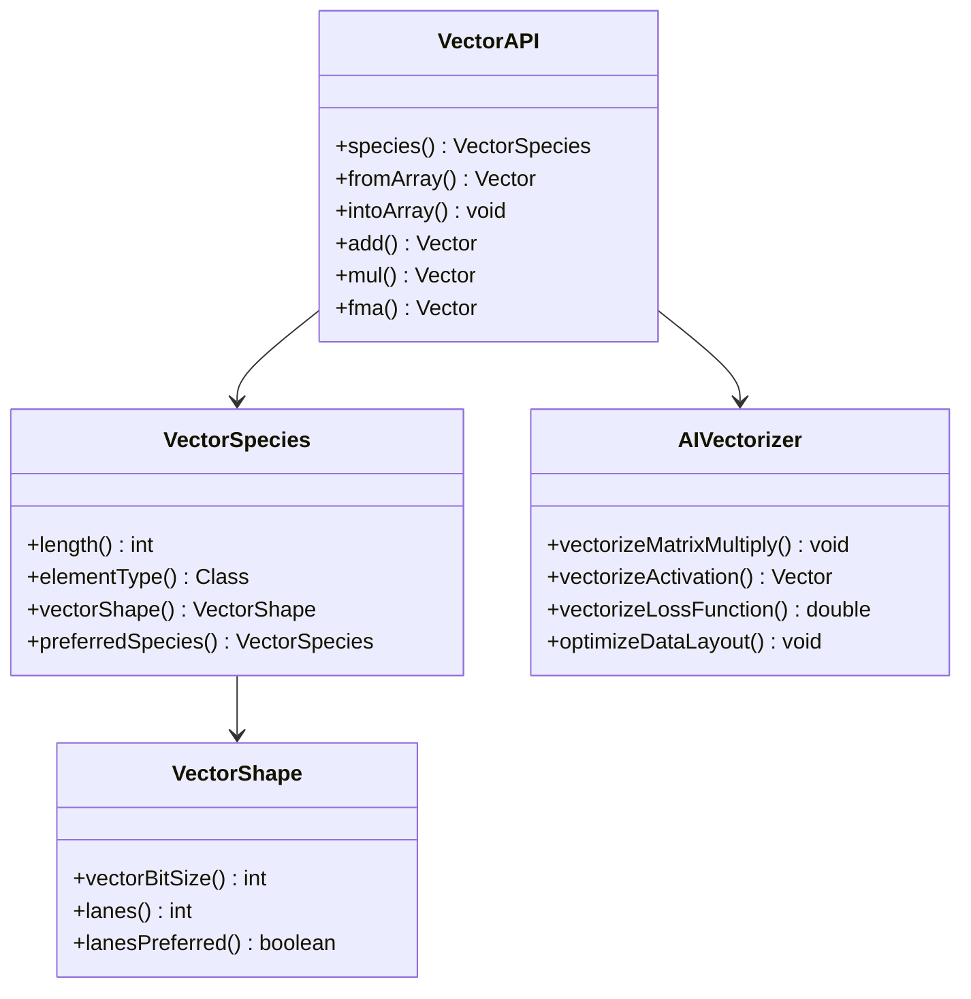

**AI向量化加速效果图**：
```mermaid
radarChart
    title 向量化技术加速效果
    axis 计算速度, 内存效率, 能耗, 可移植性, 编程复杂度

    "标量计算" : 2, 6, 3, 10, 9
    "手动SIMD" : 8, 7, 6, 3, 2
    "Vector API" : 9, 8, 7, 8, 6
    "GPU加速" : 10, 5, 4, 5, 7
    "混合优化" : 10, 8, 8, 7, 5
```

**72. Project Valhalla的值对象如何优化AI内存布局？**

**面试场景**：内存优化专家面试，考察值对象应用

**口语化答案**：
Project Valhalla的值对象特性彻底改变了AI系统的内存布局和使用效率。

**核心设计思路**：
值对象提供无引用标识的轻量级数据类型，消除了对象头和引用开销。AI系统中大量的小对象，如向量、矩阵元素、参数等，使用值对象可大幅减少内存占用和缓存压力。值对象的扁平内存布局提高数据局部性，增强缓存命中率。无标识性支持更高效的垃圾回收和内存分配，特别适合高频率的AI计算场景。

**值对象内存优化架构图**：
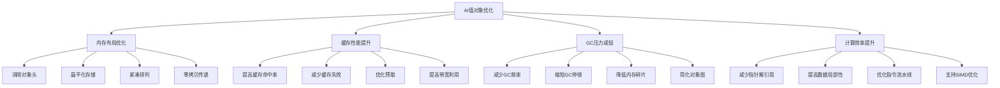

**AI内存布局对比图**：
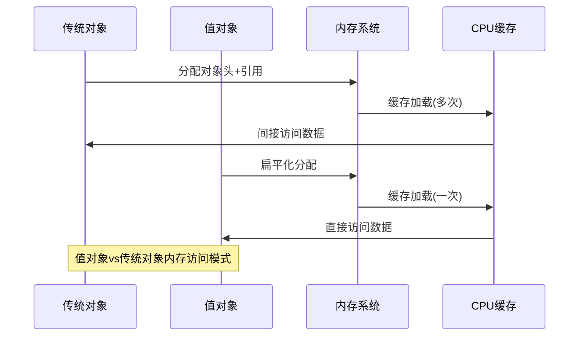

**80. GraalVM Native Image如何优化AI应用启动性能？**

**面试场景**：云原生AI架构师面试，考察Native Image应用

**口语化答案**：
GraalVM Native Image通过AOT编译技术，将Java AI应用编译为本地可执行文件，显著提升启动性能。

**核心设计思路**：
Native Image在构建时进行完整的静态分析，生成自包含的可执行文件。消除了JVM启动开销、类加载延迟、JIT编译预热等性能瓶颈。对于AI服务，特别适合无服务器架构、边缘计算、实时推理等对启动延迟敏感的场景。通过构建时优化、死代码消除、类初始化等手段，实现接近原生语言的启动速度。

**Native Image构建优化流程图**：
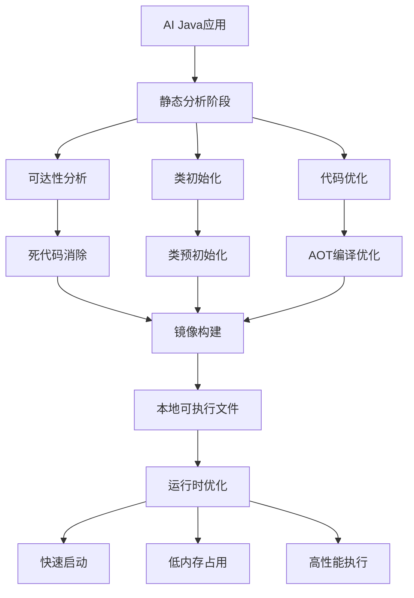

**AI应用启动性能对比图**：
```mermaid
radarChart
    title AI应用启动性能对比
    axis 启动速度, 内存占用, 峰值性能, 兼容性, 构建时间

    "传统JVM" : 2, 4, 9, 10, 8
    "JIT预热" : 4, 5, 10, 9, 7
    "Native Image" : 10, 9, 7, 6, 3
    "混合模式" : 7, 7, 9, 8, 5
    "容器优化" : 6, 6, 8, 9, 6
```

**81. AI算法中的内存访问模式如何通过编译器优化？**

**面试场景**：系统性能专家面试，考察内存访问优化

**口语化答案**：
内存访问模式优化是AI算法性能提升的关键，编译器通过多种技术优化数据访问效率。

**核心设计思路**：
AI算法通常具有规律性的内存访问模式，编译器通过分析访问模式进行针对性优化。包括数据预取、缓存友好的数据布局、内存访问重排等。通过数组填充避免假共享，通过循环分块提高时间局部性，通过数据结构转换优化空间局部性。结合硬件特性，最大化缓存和内存带宽的利用效率。

**内存访问优化架构图**：
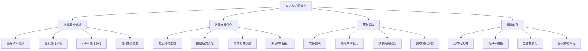

**AI内存访问模式分类图**：
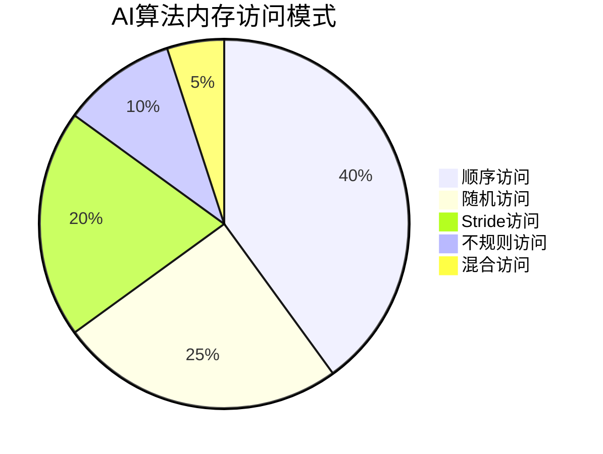

---

## 总结

Java编译时优化与AI算法加速需要掌握：

1. **编译器原理**：深入理解JVM编译优化机制和策略选择
2. **JIT优化技术**：掌握方法内联、循环优化、逃逸分析等关键技术
3. **向量化加速**：利用Vector API实现SIMD级计算加速
4. **内存优化**：通过值对象、布局优化等提升内存效率
5. **AOT编译**：使用GraalVM Native Image优化启动性能

通过系统的编译优化技术应用，AI算法能够获得数量级的性能提升，充分发挥硬件潜力。