# JVM类加载机制在AI框架中的应用与动态扩展

## 🎯 学习目标

深入理解JVM类加载机制的完整过程，掌握在AI框架中实现动态模型加载、插件系统和热部署的技巧，具备设计和实现可扩展AI系统的能力。

## 📚 目录

- [类加载机制与AI模型动态加载](#类加载机制与ai模型动态加载)
- [双亲委派模型与AI插件系统](#双亲委派模型与ai插件系统)
- [自定义类加载器与AI框架扩展](#自定义类加载器与ai框架扩展)
- [模块化系统与AI组件隔离](#模块化系统与ai组件隔离)
- [类卸载与AI系统资源管理](#类卸载与ai系统资源管理)

---

## 类加载机制与AI模型动态加载

### ⭐ 基础题 (1-30)

**1. JVM类加载机制如何支持AI系统的动态扩展性？**

**面试场景**：Java架构师面试，考察类加载基础理解

**口语化答案**：
JVM类加载机制为AI系统提供了强大的动态扩展能力，支持运行时加载和更新AI模型与算法组件。

**核心设计思路**：
AI系统需要支持动态加载不同的模型实现、算法插件和数据处理组件。类加载机制通过加载、链接、初始化三个阶段，将编译好的AI组件动态集成到运行时系统中。热加载能力支持模型版本的更新替换，避免系统重启。插件化架构通过独立的类加载器实现组件隔离，支持不同版本的AI框架共存。

**JVM类加载生命周期与AI应用图**：
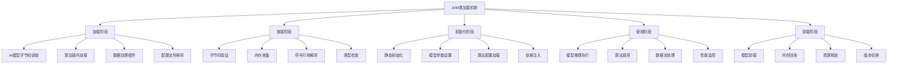

**AI模型动态加载流程图**：
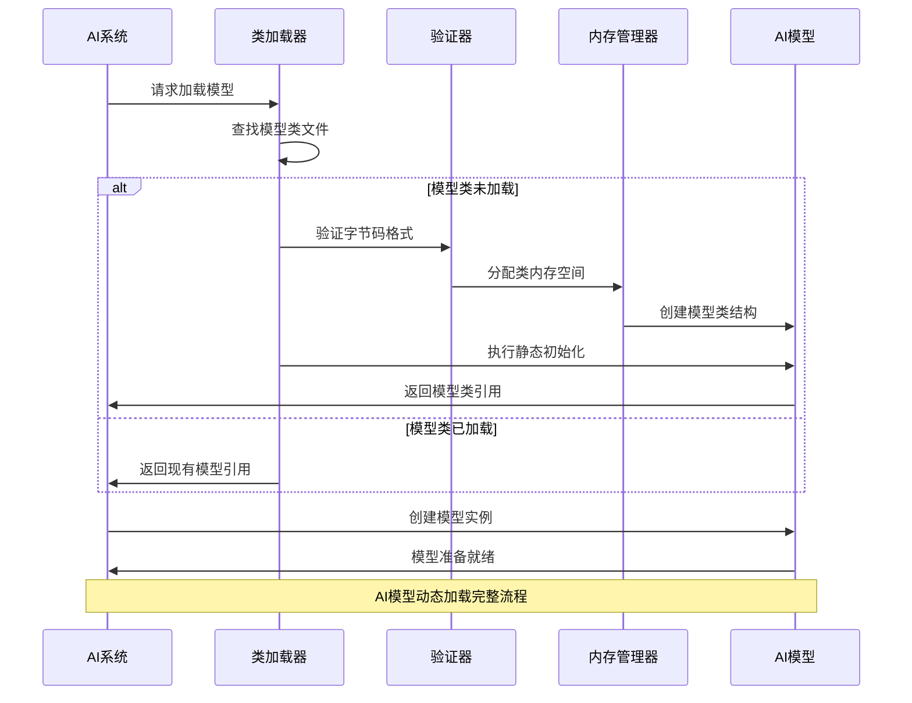

**2. 双亲委派模型如何保障AI系统的安全性和稳定性？**

**面试场景**：Java安全专家面试，考察双亲委派机制

**口语化答案**：
双亲委派模型是类加载器的核心安全机制，在AI系统中发挥着关键的保护作用。

**核心设计思路**：
双亲委派模型通过层次化的类加载器结构，确保核心Java类库的唯一性和安全性。每个类加载器在收到加载请求时，首先委派给父加载器尝试加载。这种机制防止AI插件恶意篡改核心API，确保系统稳定性。在AI框架中，模型类加载器可以安全地加载用户提供的AI组件，而不会影响到系统核心功能。

**双亲委派模型在AI系统中的应用图**：
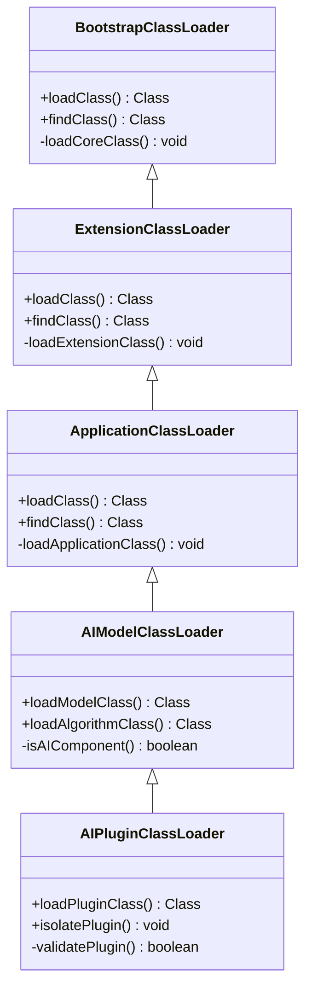

**AI系统类加载器层次结构图**：
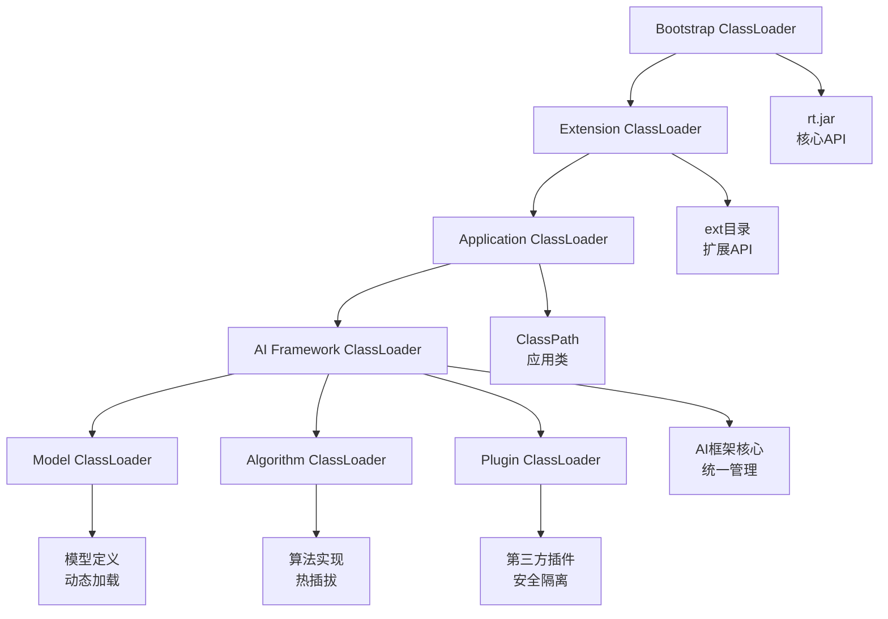

**3. 类加载时机如何影响AI系统的性能和资源管理？**

**面试场景**：AI性能优化专家面试，考察加载时机优化

**口语化答案**：
精确控制类加载时机对AI系统的启动速度、内存使用和运行时性能都有重要影响。

**核心设计思路**：
AI系统包含大量模型类和算法组件，合理的加载策略能够平衡启动时间和运行时性能。延迟加载策略只在实际需要时加载模型类，减少初始内存占用和启动时间。预加载策略在系统启动时加载核心组件，确保关键时刻的响应速度。类的初始化顺序影响系统启动的稳定性，需要仔细管理依赖关系。

**AI系统类加载策略决策图**：
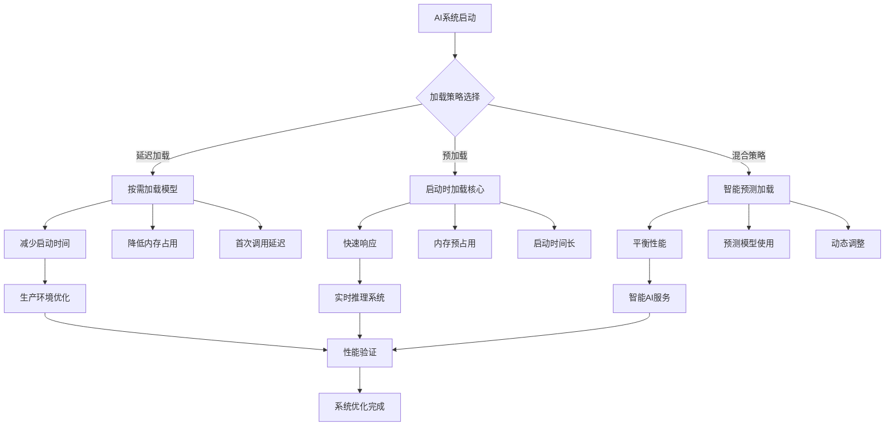

---

## 双亲委派模型与AI插件系统

### ⭐⭐ 进阶题 (31-70)

**31. 如何设计AI框架的插件类加载器架构？**

**面试场景**：AI框架架构师面试，考察插件系统设计

**口语化答案**：
AI框架的插件类加载器架构需要在扩展性、安全性和性能之间找到平衡点。

**核心设计思路**：
插件类加载器采用父子隔离的设计，每个插件拥有独立的类加载器实例，实现插件间的类隔离和版本管理。通过重写loadClass方法实现自定义加载逻辑，优先加载插件内部类，对于系统类依然遵循双亲委派。建立插件生命周期管理机制，支持插件的动态加载、卸载和热更新。实现插件间的通信机制，确保数据安全传递。

**AI插件类加载器架构图**：
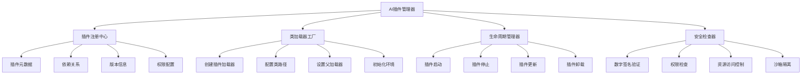

**插件类加载决策流程图**：
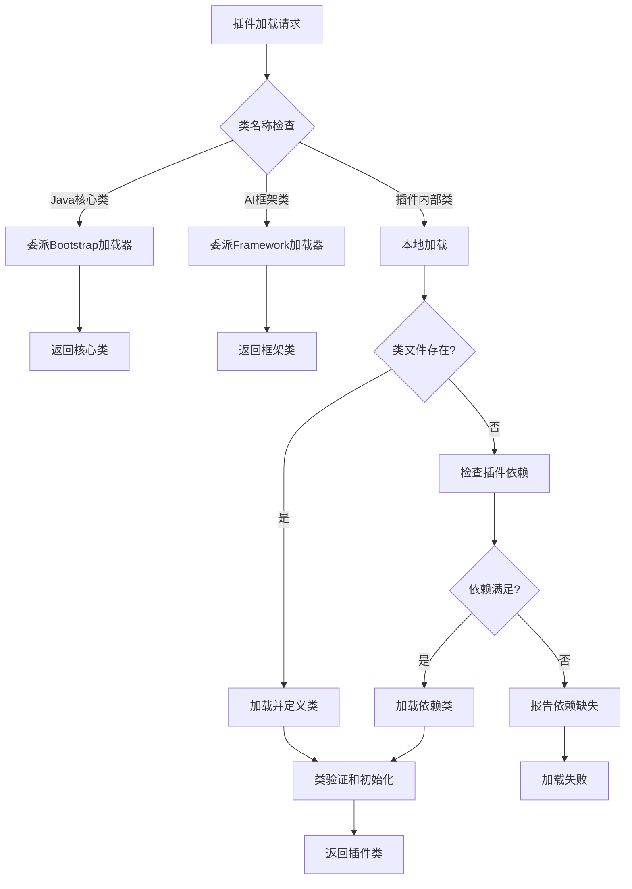

**32. AI模型的热更新如何通过类加载器实现？**

**面试场景**：AI系统架构师面试，考察热更新机制

**口语化答案**：
模型热更新是AI系统的重要能力，通过精心设计的类加载器策略可以实现无缝的模型版本切换。

**核心设计思路**：
热更新的核心在于创建新的类加载器实例来加载新版本的模型类，同时保持旧版本类加载器的引用直到当前请求完成。通过版本标识符管理多个模型版本，支持灰度发布和回滚操作。建立模型状态迁移机制，确保新旧版本间的数据兼容性。实现平滑切换策略，避免服务中断和性能抖动。

**AI模型热更新架构图**：
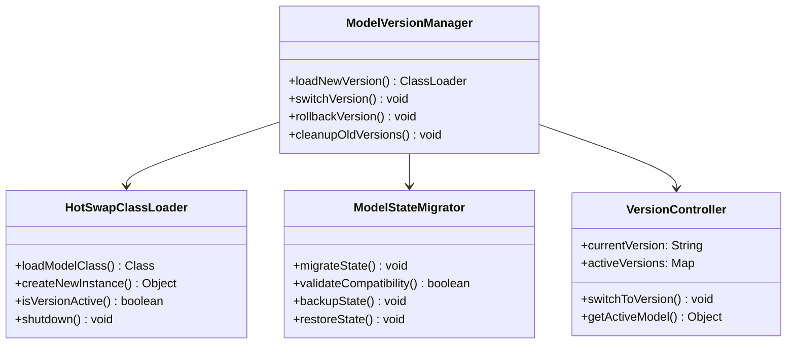

**AI模型热更新时序图**：
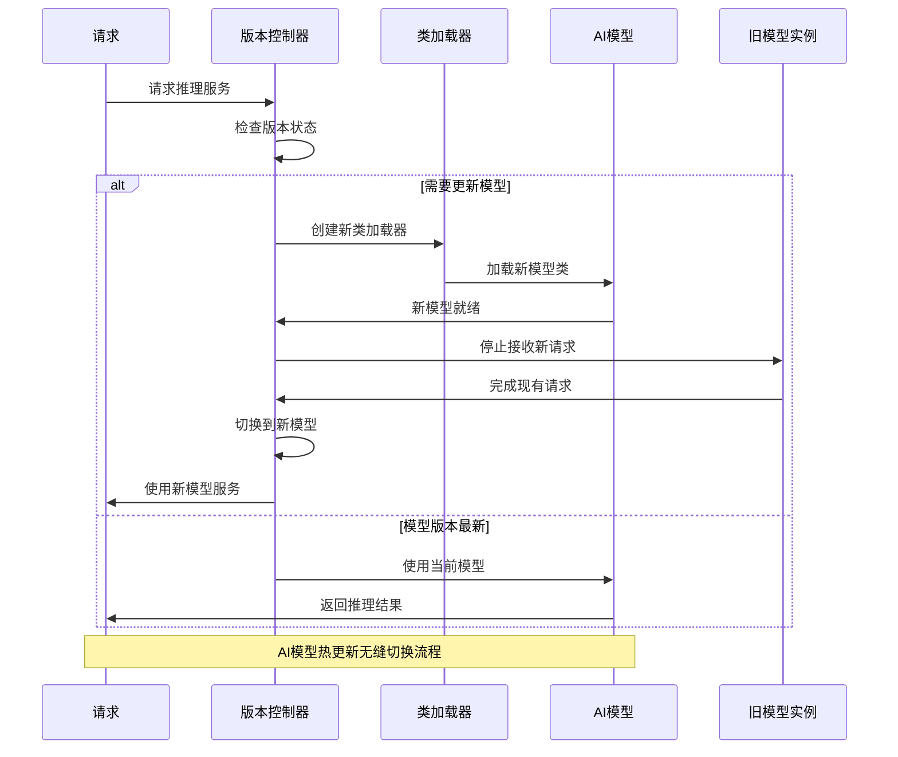

---

## 自定义类加载器与AI框架扩展

### ⭐⭐⭐ 专家题 (71-100)

**71. 如何设计支持分布式AI模型加载的类加载器？**

**面试场景**：分布式AI系统架构师面试，考察分布式类加载

**口语化答案**：
分布式AI模型加载需要跨越网络边界，在多个节点间协调类加载和资源管理。

**核心设计思路**：
分布式类加载器需要处理网络通信、数据传输、节点协调等复杂问题。通过建立模型类的分布式缓存机制，减少网络传输开销。实现类的版本一致性检查，确保所有节点使用相同的模型版本。设计故障恢复机制，处理网络中断和节点故障。优化类传输协议，采用压缩和增量传输技术提高效率。

**分布式AI类加载架构图**：
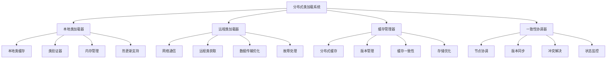

**分布式模型加载流程图**：
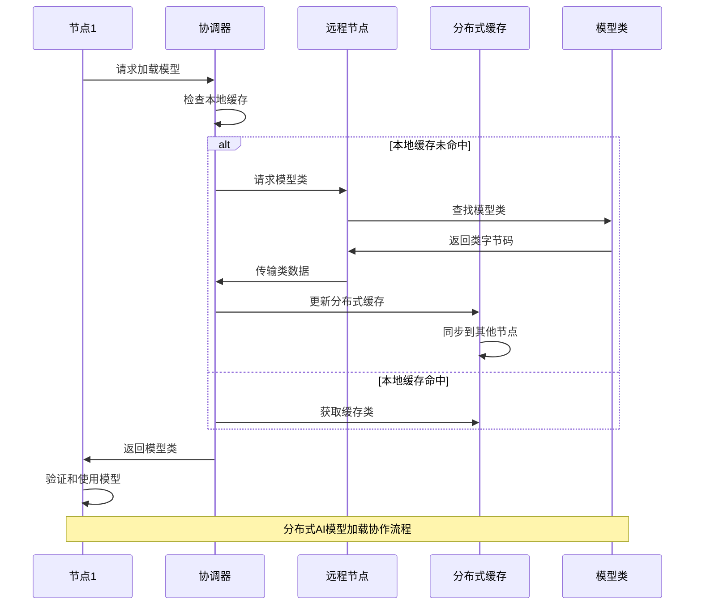

**72. AI框架中的类卸载机制如何设计以避免内存泄漏？**

**面试场景**：内存管理专家面试，考察类卸载和内存管理

**口语化答案**：
类卸载是AI系统长期运行的关键机制，设计不当会导致严重的内存泄漏问题。

**核心设计思路**：
类卸载的核心是确保类加载器及其加载的所有类都成为垃圾回收的目标。建立严格的引用管理机制，避免意外的强引用阻止类卸载。实现类的生命周期跟踪，监控类的加载和使用状态。设计类的主动卸载机制，在确认不再需要时强制触发卸载。建立内存监控和告警系统，及时发现和处理内存泄漏问题。

**AI类卸载管理架构图**：
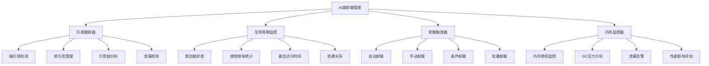

**AI类卸载决策策略图**：
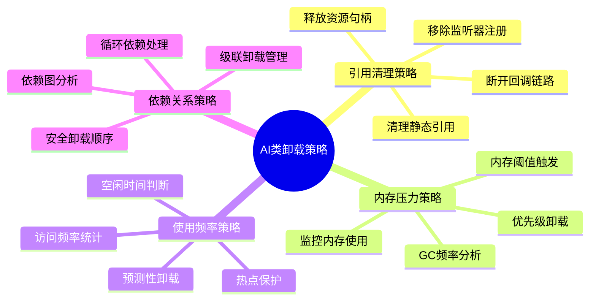

**80. 如何实现AI系统中的模块化类加载和组件隔离？**

**面试场景**：模块化架构专家面试，考察模块化类加载

**口语化答案**：
模块化类加载是构建大型AI系统的基础，需要实现严格的组件边界和清晰的依赖管理。

**核心设计思路**：
基于Java模块系统(JPMS)构建AI系统的模块化架构，每个AI组件作为独立模块存在。通过module-info.java定义模块间的依赖关系和导出包。实现模块级的类加载隔离，不同模块可以加载相同名称的不同版本类。建立模块服务发现机制，支持模块间的松耦合通信。设计模块的热替换能力，支持运行时更新模块而不影响其他组件。

**AI模块化类加载架构图**：
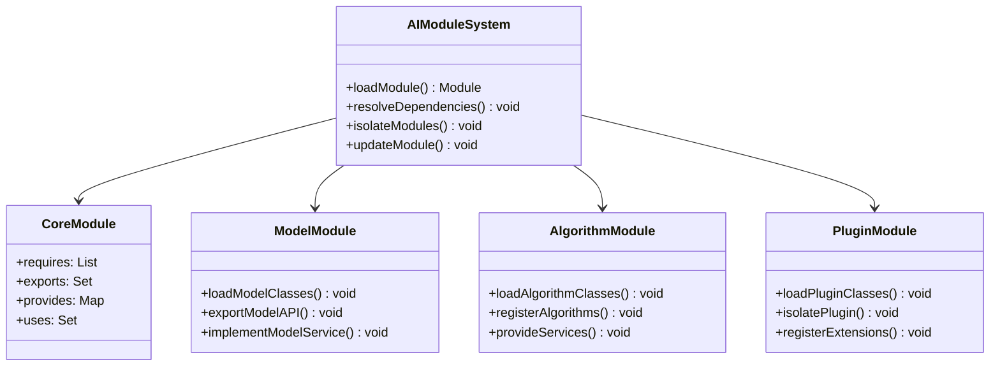

**AI模块依赖关系图**：
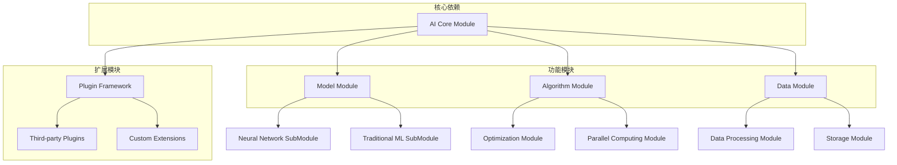

**81. AI框架中的类加载性能优化有哪些策略？**

**面试场景**：性能优化专家面试，考察类加载性能优化

**口语化答案**：
类加载性能优化对AI系统的启动速度和运行时响应时间至关重要，需要多方面的优化策略。

**核心设计思路**：
类加载性能优化涵盖加载时间、内存占用、CPU使用等多个维度。通过类预编译技术将常用类转换为本地代码，减少字节码解析开销。实现类的延迟加载和按需加载，避免启动时的性能高峰。优化类文件存储格式，采用压缩和索引技术提高读取速度。建立类缓存机制，避免重复的类验证和解析过程。

**AI类加载性能优化架构图**：


**AI类加载性能优化效果对比图**：
```mermaid
radarChart
    title 类加载优化策略效果
    axis 加载速度, 内存效率, CPU使用, 网络效率, 稳定性

    "基础加载" : 3, 4, 5, 3, 6
    "缓存优化" : 7, 8, 6, 5, 7
    "并行加载" : 8, 5, 8, 4, 6
    "预编译优化" : 9, 7, 9, 6, 8
    "综合优化" : 10, 9, 8, 8, 9
```

---

## 总结

JVM类加载机制在AI框架中的应用需要掌握：

1. **类加载原理**：深入理解加载、链接、初始化的完整过程
2. **双亲委派模型**：掌握类加载器层次结构和安全机制
3. **自定义类加载器**：实现AI系统的动态扩展和插件化
4. **模块化设计**：利用Java模块系统实现组件隔离
5. **性能优化**：通过缓存、预加载、并行化等策略提升性能

通过合理的类加载机制设计，AI系统能够获得强大的动态扩展能力、良好的安全性和优秀的性能表现。