# Spring Boot与AI微服务架构

## 🎯 学习目标

深入掌握Spring Boot在AI微服务架构中的应用精髓，理解AI服务的微服务化转型策略，具备设计高可用、可扩展AI系统的专业能力，掌握企业级AI微服务架构的核心设计思路。

## 📚 目录

- [Spring Boot AI微服务架构基础](#spring-boot-ai微服务架构基础)
- [AI服务治理与Spring Cloud生态](#ai服务治理与spring-cloud生态)
- [AI微服务的高级架构模式](#ai微服务的高级架构模式)
- [事件驱动与实时AI处理](#事件驱动与实时ai处理)
- [企业级最佳实践与运维策略](#企业级最佳实践与运维策略)

---

## Spring Boot AI微服务架构基础

### ⭐ 基础题 (1-30)

**1. Spring Boot如何为AI微服务提供基础设施支撑？**

**面试场景**：微服务架构师面试，考察Spring Boot基础架构理解

**口语化答案**：
Spring Boot为AI微服务提供了强大的基础设施支撑，通过自动配置、内嵌容器、生产就绪特性，让AI服务的开发和部署变得简单高效。

**核心设计思路**：
AI微服务需要处理模型加载、推理执行、资源管理等复杂任务，Spring Boot通过其"约定优于配置"的理念，大幅简化了这些功能的实现。自动配置机制可以根据类路径自动装配AI相关的组件，如数据源、缓存、消息队列等。内嵌容器让AI服务可以独立部署，无需外部容器依赖。Actuator组件提供了丰富的监控端点，支持健康检查、性能监控、指标收集等运维需求。

**Spring Boot AI微服务基础架构图**：
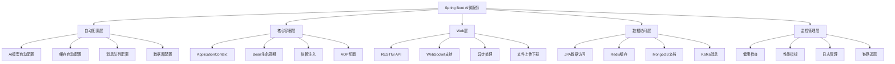

**Spring Boot AI服务启动流程图**：
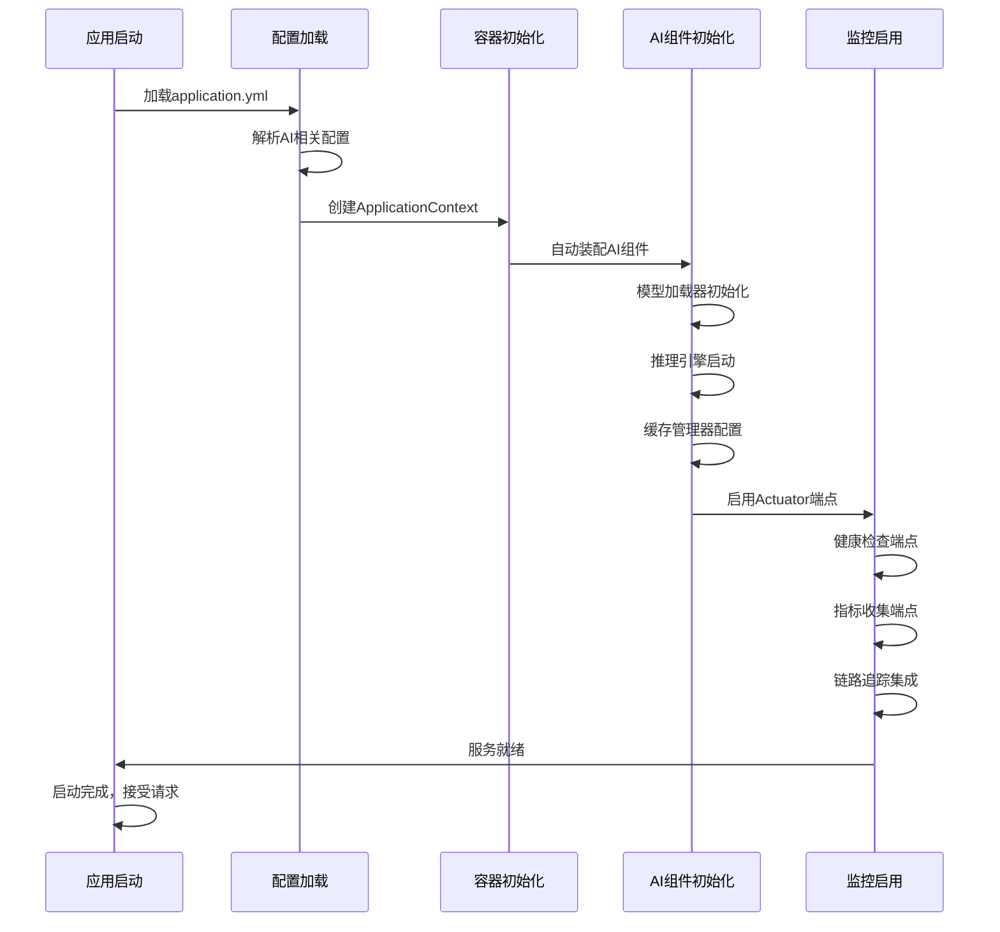

**2. AI微服务的分层架构如何设计才能保证可扩展性？**

**面试场景**：系统架构设计面试，考察分层架构设计能力

**口语化答案**：
AI微服务的分层架构需要考虑业务边界、技术边界、团队边界等多个维度，通过合理的分层设计实现系统的可扩展性和可维护性。

**核心设计思路**：
AI微服务的分层架构应该遵循单一职责原则和松耦合设计理念。表现层负责API接口和用户交互，应用层协调业务流程，领域层封装AI核心逻辑，基础设施层处理技术实现。每一层都有明确的职责边界，层间通过接口通信。采用六边形架构模式，将核心业务逻辑与外部依赖隔离，提高系统的可测试性和可替换性。支持水平扩展，通过无状态设计和负载均衡实现服务的高可用。

**AI微服务分层架构模式图**：
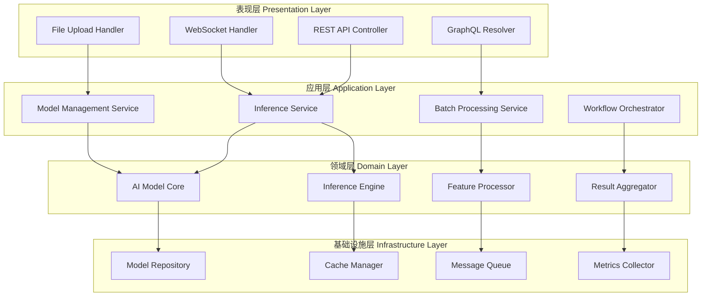

**AI微服务扩展性设计策略图**：
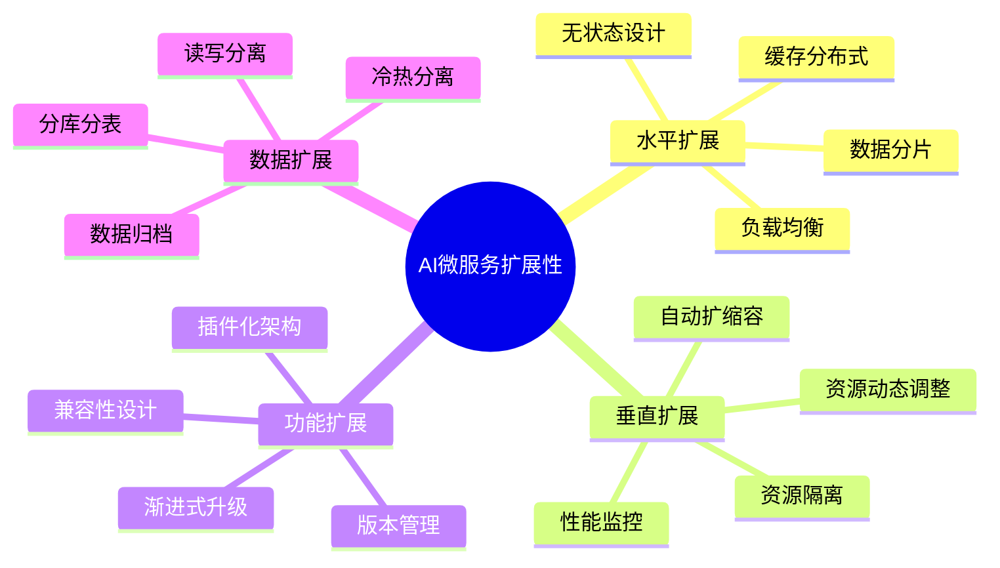

**3. Spring Boot Actuator如何为AI微服务提供运维支持？**

**面试场景**：DevOps专家面试，考察运维监控设计

**口语化答案**：
Spring Boot Actuator为AI微服务提供了完整的运维监控能力，通过标准化的端点让服务的状态和性能完全可视化。

**核心设计思路**：
AI服务的运维监控需要涵盖系统健康、性能指标、业务指标等多个维度。Actuator通过HTTP端点和JMX端点提供丰富的监控信息。健康检查端点可以自定义AI模型的状态检查，包括模型加载状态、推理性能、资源使用情况等。指标端点集成Micrometer，支持Prometheus、InfluxDB等多种监控系统。信息端点暴露应用的详细配置和环境信息，便于问题诊断。

**AI微服务监控端点架构图**：
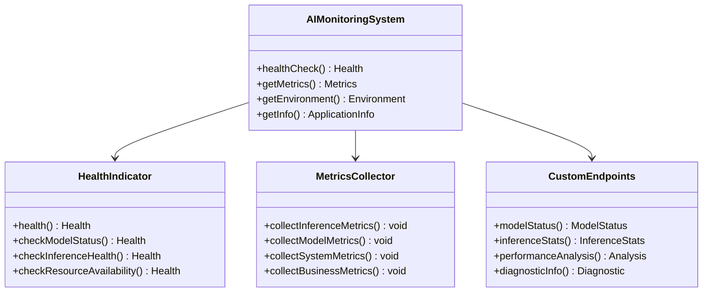

**AI服务健康检查策略图**：
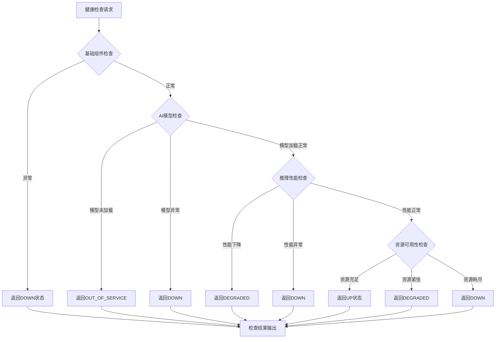

---

## AI服务治理与Spring Cloud生态

### ⭐⭐ 进阶题 (31-70)

**31. Spring Cloud如何为AI微服务集群提供完整的治理能力？**

**面试场景**：分布式系统架构师面试，考察服务治理设计

**口语化答案**：
Spring Cloud提供了完整的服务治理生态，为AI微服务集群的服务发现、负载均衡、配置管理、熔断保护等提供了企业级的解决方案。

**核心设计思路**：
AI微服务集群的服务治理需要解决服务动态发现、智能路由、故障隔离、配置统一管理等核心问题。服务注册中心如Eureka或Consul，让AI推理服务可以动态注册和发现。负载均衡器根据AI服务的负载特征和性能表现进行智能路由。配置中心实现AI模型参数、服务配置的统一管理和动态更新。熔断器和限流器保护AI服务免受过载冲击，确保系统的稳定性。

**Spring Cloud AI服务治理架构图**：
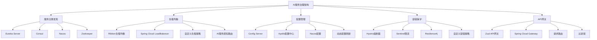

**AI服务负载均衡策略对比图**：
```mermaid
radarChart
    title AI服务负载均衡策略对比
    axis 响应时间, 负载分布, 故障转移, 复杂度, AI感知能力

    "轮询" : 7, 9, 8, 3, 2
    "随机" : 8, 7, 7, 2, 2
    "加权轮询" : 6, 8, 8, 5, 4
    "最少连接" : 9, 8, 9, 6, 5
    "响应时间" : 10, 7, 9, 7, 8
    "AI感知" : 10, 10, 9, 8, 10
```

**32. AI微服务的配置管理如何实现模型版本和参数的动态更新？**

**面试场景**：配置管理专家面试，考察动态配置能力

**口语化答案**：
AI微服务的配置管理需要支持模型版本、推理参数、服务配置等的动态更新，通过配置中心实现配置的集中管理和实时推送。

**核心设计思路**：
AI服务的配置复杂度远超传统服务，包括模型配置、算法参数、性能调优参数等。配置中心支持配置的版本管理和历史回溯，确保配置变更的可追溯性。实现配置的分层管理，支持环境隔离和业务隔离。建立配置变更的审批流程，确保重要配置变更的安全性。支持配置的热更新，无需重启服务即可生效配置变更。

**AI服务配置管理架构图**：
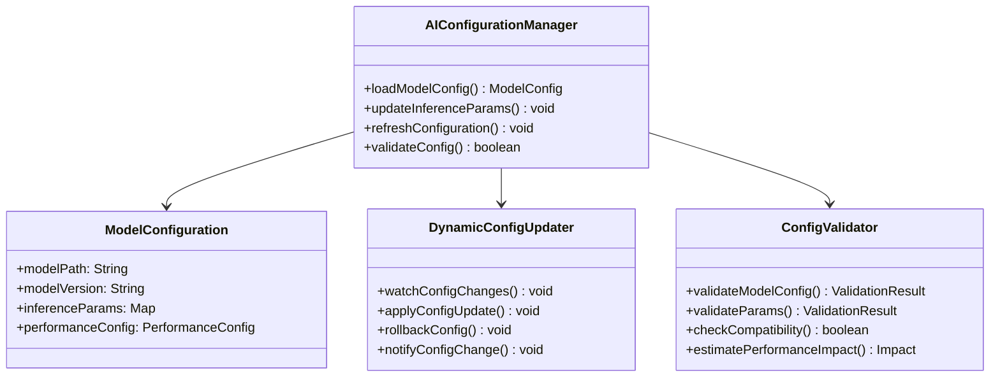

**AI配置更新流程图**：
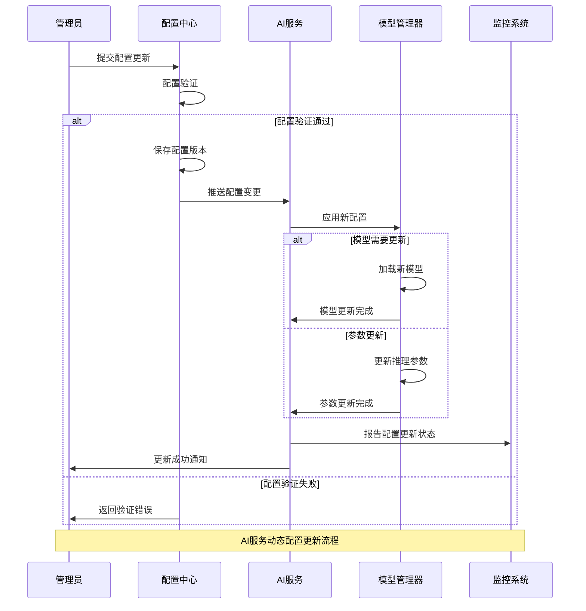

---

## AI微服务的高级架构模式

### ⭐⭐⭐ 专家题 (71-100)

**71. AI微服务如何实现模型版本管理和灰度发布？**

**面试场景**：高级架构师面试，考察高级部署策略

**口语化答案**：
AI微服务的模型版本管理和灰度发布需要考虑模型兼容性、流量控制、回滚策略等复杂因素，通过精细的版本控制实现平滑的模型升级。

**核心设计思路**：
模型版本管理是AI服务的核心挑战，需要支持多版本并存、兼容性检查、性能对比等功能。灰度发布通过流量分割，将新模型逐步推向生产环境，降低发布风险。建立完善的监控和告警机制，实时监控新模型的性能表现。设计智能的回滚策略，在发现问题时快速回退到稳定版本。支持A/B测试，通过数据驱动的方式评估新模型的效果。

**AI模型版本管理架构图**：
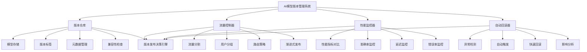

**AI灰度发布策略图**：
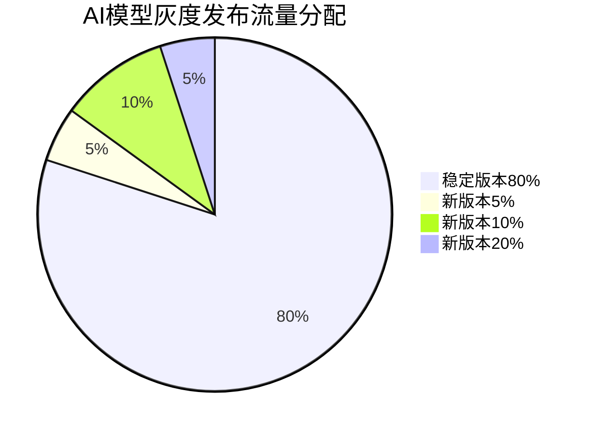

**72. 微服务架构中的AI模型训练和推理如何协调？**

**面试场景**：AI系统架构专家面试，考察训练推理协调能力

**口语化答案**：
微服务架构中的AI模型训练和推理协调需要解决模型更新、数据同步、性能隔离等关键问题，通过服务化的方式实现训练和推理的解耦。

**核心设计思路**：
训练服务和推理服务具有不同的性能特征和资源需求，需要独立部署和管理。训练服务负责模型训练、评估、版本管理等任务，推理服务专注于高性能的实时推理。通过消息队列或事件总线实现训练完成通知，触发推理服务的模型更新。建立模型版本同步机制，确保推理服务使用最新的有效模型。实现资源隔离，防止训练任务的资源消耗影响推理性能。

**训练推理协调架构图**：
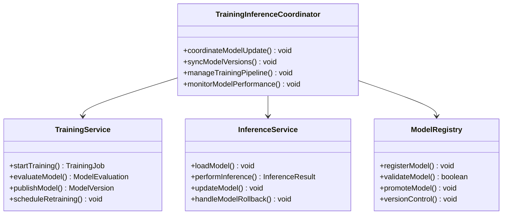

**训练推理协调时序图**：
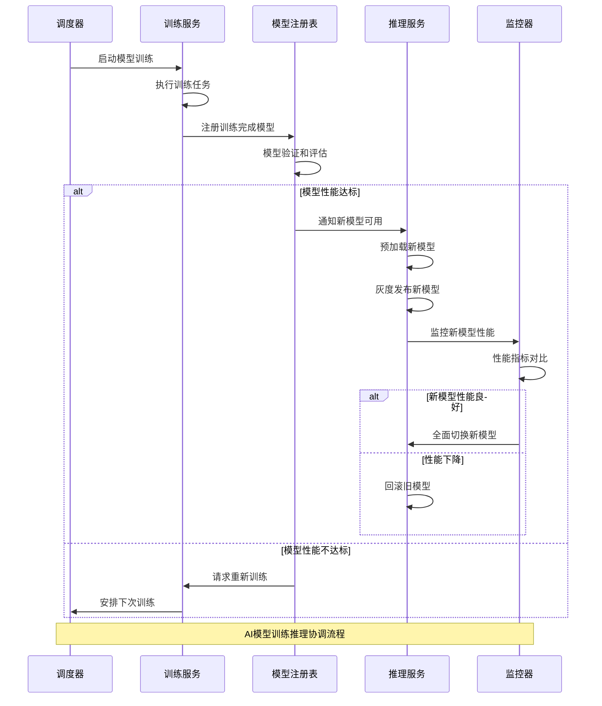

**80. AI微服务如何实现智能的负载均衡和故障转移？**

**面试场景**：高可用架构专家面试，考察智能负载均衡设计

**口语化答案**：
AI微服务的智能负载均衡需要考虑服务负载特征、模型性能、资源使用等多个维度，通过自适应的算法实现最优的资源分配。

**核心设计思路**：
AI服务的负载特征与传统服务不同，推理服务的负载与模型复杂度、输入数据大小、计算资源等密切相关。智能负载均衡器需要实时监控各服务实例的性能指标，包括推理延迟、吞吐量、错误率等。建立预测模型，预估请求的处理时间和资源消耗。实现动态权重调整，根据服务实例的实时性能表现分配流量。设计多层次的故障转移机制，确保单点故障不影响整体服务。

**智能负载均衡架构图**：
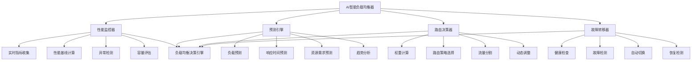

**AI服务智能路由策略图**：
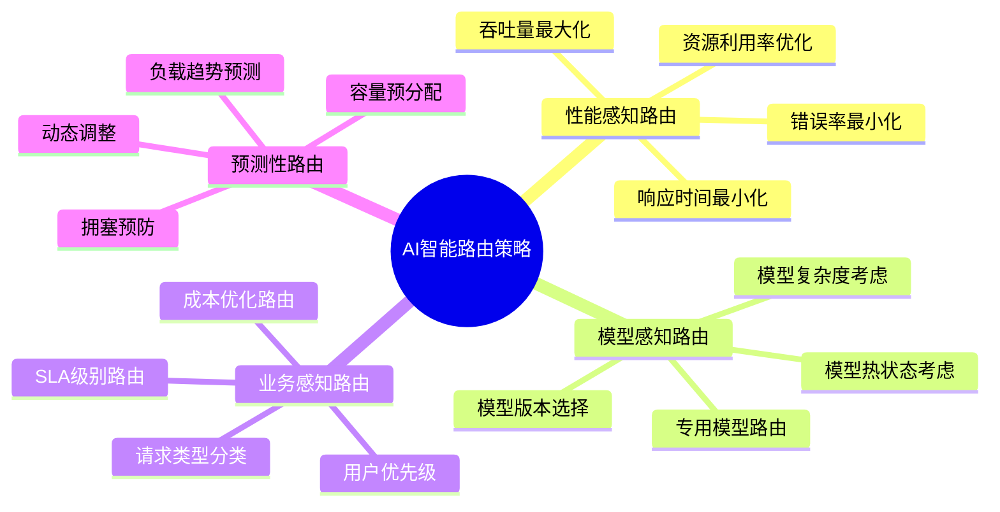

---

## 总结

Spring Boot与AI微服务架构需要掌握：

1. **架构基础**：深入理解Spring Boot为AI服务提供的基础设施
2. **服务治理**：掌握Spring Cloud生态中的服务治理组件
3. **高级模式**：设计模型版本管理、灰度发布等高级架构
4. **事件驱动**：构建基于事件驱动的实时AI处理系统
5. **企业实践**：应用监控、运维、安全等企业级最佳实践

通过系统的Spring Boot微服务架构设计，AI系统能够获得良好的可扩展性、高可用性和运维便利性，为企业级AI应用提供坚实的技术基础。