# AI模型数据的加密与解密技术

## 🎯 学习目标

深入掌握AI系统中数据安全的核心理念和实践技术，理解从数据加密、访问控制到隐私保护的全栈安全架构，具备设计安全可靠的AI系统的能力。

## 📚 目录

- [数据加密基础与AI模型保护](#数据加密基础与ai模型保护)
- [密钥管理与安全架构](#密钥管理与安全架构)
- [访问控制与身份认证](#访问控制与身份认证)
- [隐私保护与合规要求](#隐私保护与合规要求)
- [AI系统安全最佳实践](#ai系统安全最佳实践)

---

## 数据加密基础与AI模型保护

### ⭐ 基础题 (1-30)

**1. AI系统中加密技术如何保护模型知识产权？**

**面试场景**：AI安全架构师面试，考察加密技术原理

**口语化答案**：
加密技术是保护AI模型知识产权的核心手段，通过多层次的安全策略确保模型不被未授权访问和复制。

**核心设计思路**：
AI模型作为企业的核心资产，需要端到端的加密保护。采用混合加密架构，结合对称加密的高效性和非对称加密的安全性，为模型文件提供强保护。模型训练数据、推理结果、模型参数等敏感信息都需要加密存储和传输。建立密钥生命周期管理机制，确保密钥的安全生成、分发、轮换和销毁。实施数据完整性保护，防止模型被恶意篡改。

**AI模型加密保护架构图**：
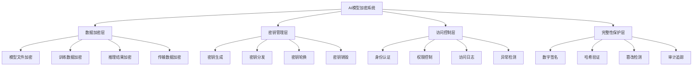

**AI数据加密技术分类图**：
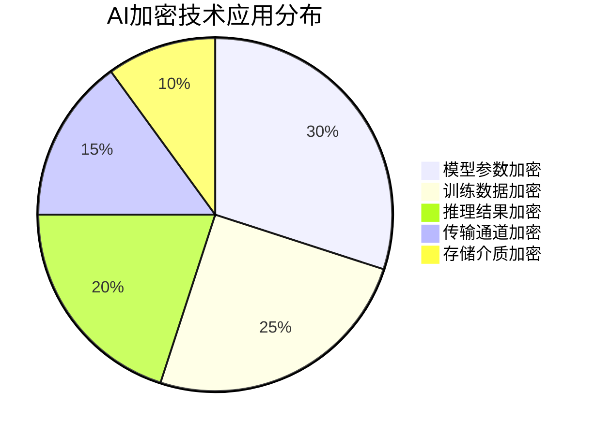

**2. 对称加密和非对称加密在AI系统中如何协同工作？**

**面试场景**：Java安全专家面试，考察加密算法选择和应用

**口语化答案**：
对称加密和非对称加密各有优势，在AI系统中通过混合加密架构实现最佳的安全性能平衡。

**核心设计思路**：
对称加密如AES具有高性能，适合大规模AI数据的批量加密，但密钥分发是其弱点。非对称加密如RSA安全性高，密钥管理简单，但计算开销大。混合加密架构利用非对称加密安全交换对称密钥，然后用对称加密高效处理大量AI数据。这种组合既保证了安全性，又兼顾了性能，是AI系统的理想选择。

**混合加密架构流程图**：
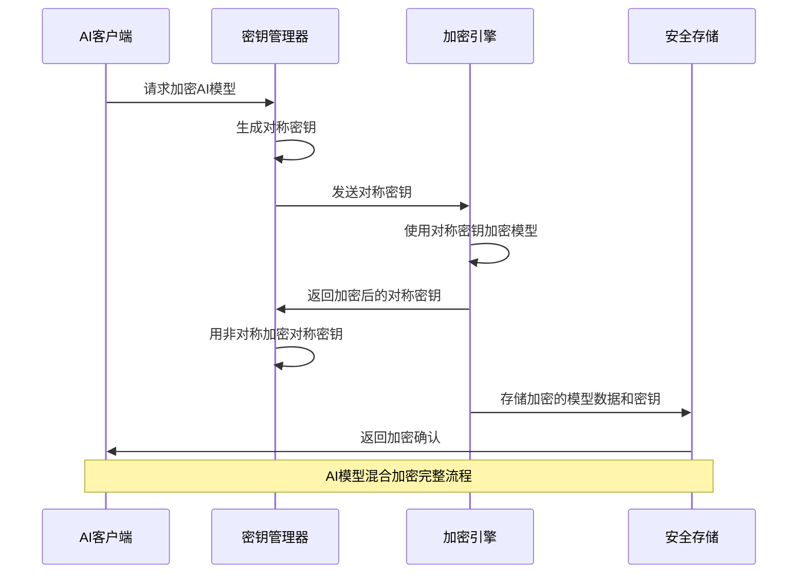

**AI加密算法选择策略图**：
```mermaid
radarChart
    title 加密算法在AI系统中的适用性
    axis 加密速度, 安全强度, 密钥管理, 资源消耗, 实现复杂度

    "AES-256" : 9, 8, 6, 7, 5
    "RSA-2048" : 3, 9, 9, 8, 7
    "ChaCha20" : 10, 7, 5, 6, 6
    "ECC" : 5, 10, 8, 5, 8
    "混合方案" : 8, 10, 9, 7, 8
```

**3. AI模型在传输过程中如何保证数据安全？**

**面试场景**：网络安全专家面试，考察传输安全

**口语化答案**：
AI模型在传输过程中面临多种安全威胁，需要建立端到端的安全传输机制。

**核心设计思路**：
AI模型传输安全需要考虑信道安全、端点安全和数据完整性。采用TLS/SSL协议建立加密通道，防止中间人攻击。实施模型分片传输，将大型模型拆分为多个加密块，降低泄露风险。建立传输完整性验证机制，通过数字签名和哈希校验确保模型未被篡改。设计重传和恢复机制，应对网络中断和传输失败的安全场景。

**AI模型安全传输架构图**：
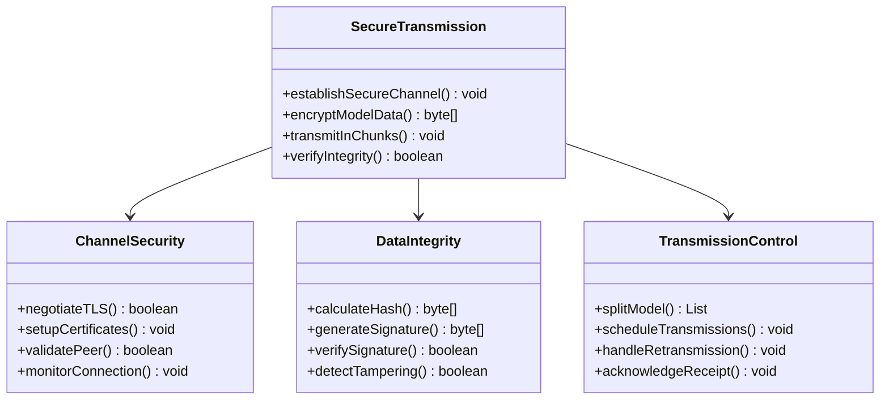

---

## 密钥管理与安全架构

### ⭐⭐ 进阶题 (31-70)

**31. 如何设计AI系统的密钥管理架构？**

**面试场景**：企业安全架构师面试，考察密钥管理设计

**口语化答案**：
密钥管理是AI系统安全的基础设施，需要建立完整的密钥生命周期管理体系。

**核心设计思路**：
AI系统的密钥管理需要支持海量模型密钥的生成、存储、分发和轮换。建立分层密钥架构，主密钥保护数据密钥，数据密钥保护模型数据。采用硬件安全模块(HSM)保护核心密钥，防止密钥泄露。实现密钥的自动轮换和版本管理，确保密钥安全性的持续维护。建立密钥使用的审计机制，追踪密钥的访问和使用情况。

**AI密钥管理架构图**：
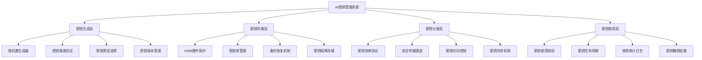

**密钥生命周期管理流程图**：
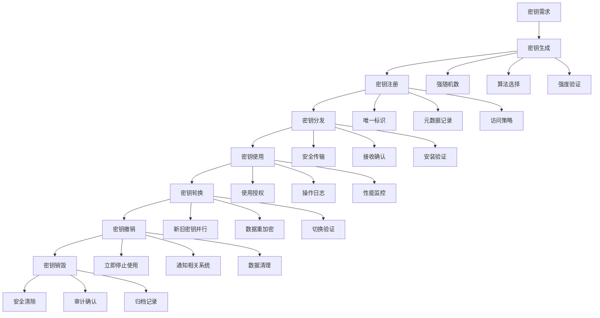

**32. HSM在AI系统安全中扮演什么角色？**

**面试场景**：硬件安全专家面试，考察HSM应用

**口语化答案**：
HSM(硬件安全模块)为AI系统提供硬件级别的密钥保护，是最高级别的安全保障。

**核心设计思路**：
HSM通过专用的硬件和固件，为AI系统的核心密钥提供物理隔离保护。密钥在HSM内部生成和存储，永远不会离开硬件边界，从根本上防止密钥泄露。支持高性能的加密运算，满足AI系统大规模加密的需求。提供多层次的访问控制和审计功能，确保只有授权的AI服务才能使用密钥。支持集群部署和故障转移，保证高可用性。

**HSM在AI系统中的应用架构图**：
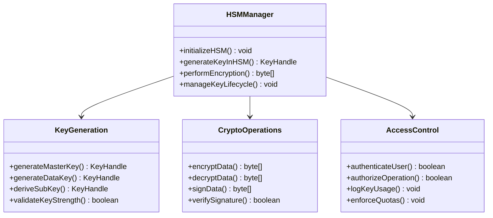

**HSM安全防护层次图**：
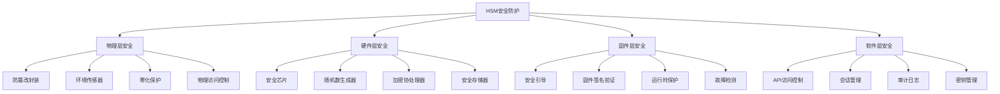

---

## 访问控制与身份认证

### ⭐⭐⭐ 专家题 (71-100)

**71. AI系统如何实现基于角色的访问控制(RBAC)？**

**面试场景**：身份认证专家面试，考察RBAC设计

**口语化答案**：
RBAC是AI系统访问控制的核心机制，通过角色-权限的映射实现灵活的安全管理。

**核心设计思路**：
AI系统的RBAC需要考虑用户、角色、权限三个核心要素的合理设计。用户通过角色获得权限，角色通过权限控制资源访问。建立细粒度的权限体系，区分模型训练、模型推理、数据访问等不同操作级别。支持角色的继承和组合，简化权限管理。实现动态权限验证，确保AI操作的实时安全性。

**AI系统RBAC架构图**：
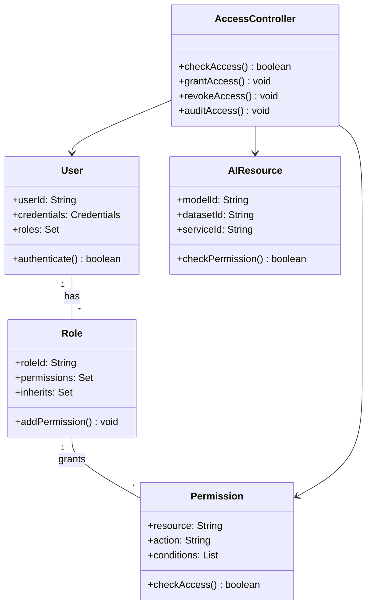

**AI权限分类体系图**：
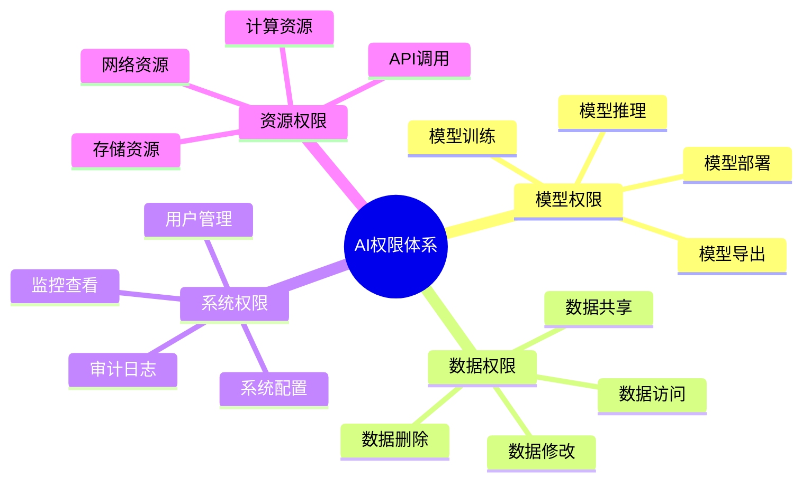

**72. AI系统如何实现多因素认证(MFA)？**

**面试场景**：安全认证专家面试，考察MFA实现

**口语化答案**：
多因素认证为AI系统提供了更强的身份安全保障，通过多种认证因子的组合验证用户身份。

**核心设计思路**：
MFA结合了你知道的(密码)、你拥有的(设备)、你自身的(生物特征)三种认证因子。AI系统需要实现灵活的MFA策略，根据操作的重要性和风险等级调整认证要求。支持多种认证方式，包括短信验证码、移动APP推送、硬件令牌、生物识别等。建立风险评估机制，动态调整认证强度。确保MFA过程对用户体验的友好性，避免过度复杂的认证流程。

**AI系统MFA架构图**：
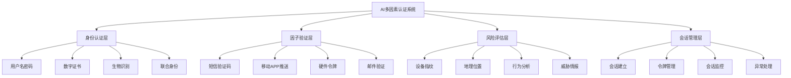

**MFA认证流程图**：
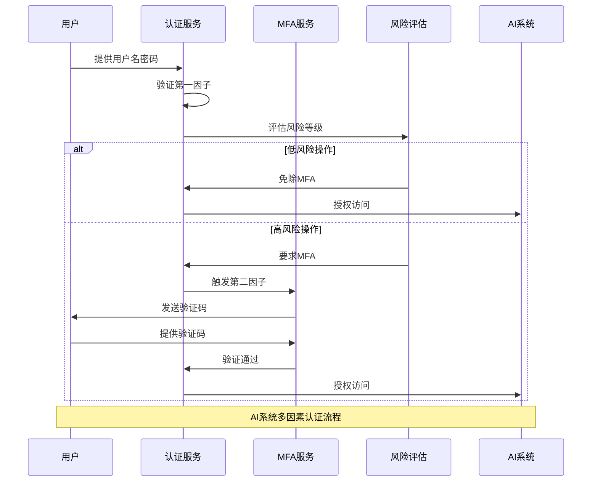

**80. AI系统如何实现零信任安全架构？**

**面试场景**：零信任架构专家面试，考察零信任设计

**口语化答案**：
零信任架构是AI系统安全的现代理念，通过永不信任、始终验证的原则保护AI资产。

**核心设计思路**：
零信任架构打破了传统的边界安全模型，对每一次访问都进行严格的身份验证和权限检查。AI系统需要实现微隔离，将不同的AI服务和数据分隔保护。建立持续的安全监控，实时检测异常行为和威胁。实施最小权限原则，确保每个AI服务只能访问必要的资源。支持动态的安全策略调整，根据威胁情报和风险评估自动调整安全措施。

**AI零信任架构图**：
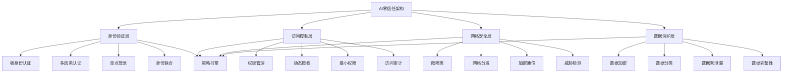

**AI零信任访问决策流程图**：
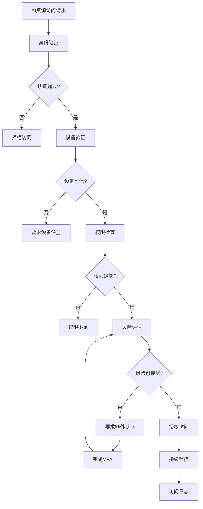

**81. AI系统如何实现数据脱敏和隐私保护？**

**面试场景**：隐私保护专家面试，考察数据脱敏技术

**口语化答案**：
数据脱敏和隐私保护是AI系统合规性的重要要求，需要在数据可用性和隐私保护之间找到平衡。

**核心设计思路**：
AI系统处理的数据可能包含敏感个人信息，需要采用多层脱敏策略。实现静态数据脱敏，对存储的训练数据进行匿名化处理。支持动态数据脱敏，在查询和展示时实时脱敏。采用差分隐私技术，在保证数据统计特性的同时保护个体隐私。建立数据分类分级机制，根据数据敏感度选择合适的脱敏策略。

**AI数据脱敏架构图**：
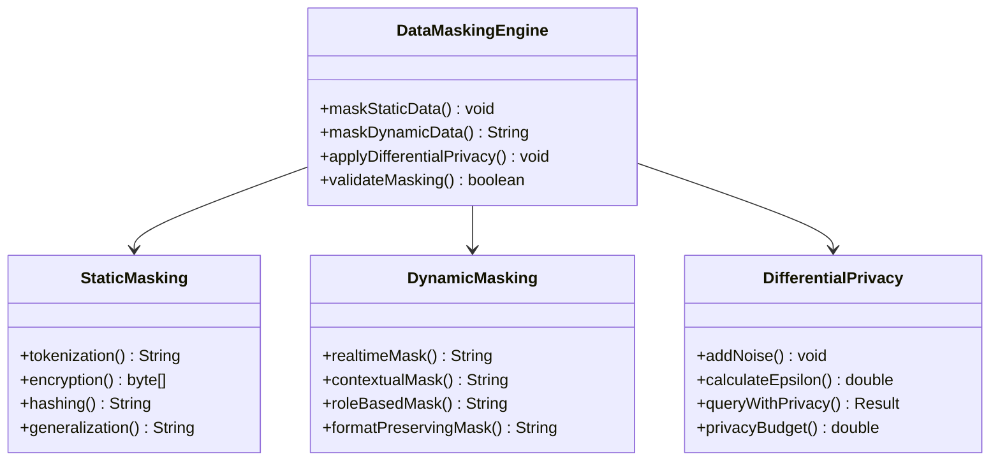

**AI隐私保护技术对比图**：
```mermaid
radarChart
    title AI隐私保护技术效果
    axis 隐私保护, 数据效用, 实现复杂度, 计算开销, 合规性

    "静态脱敏" : 7, 5, 6, 3, 8
    "动态脱敏" : 8, 7, 8, 6, 9
    "差分隐私" : 10, 6, 9, 8, 10
    "同态加密" : 10, 8, 10, 10, 9
    "联邦学习" : 9, 9, 7, 7, 8
```

---

## 总结

AI模型数据的加密与解密技术需要掌握：

1. **加密基础**：掌握对称加密、非对称加密和混合加密的原理和应用
2. **密钥管理**：设计完整的密钥生命周期管理架构和安全存储方案
3. **访问控制**：实现基于角色的访问控制和多因素认证机制
4. **隐私保护**：运用数据脱敏、差分隐私等技术保护用户隐私
5. **架构设计**：构建零信任安全架构和端到端的安全保护体系

通过系统的安全设计和实施，AI系统能够在保证数据安全的前提下，充分发挥AI技术的价值。