# 线程池在AI模型推理中的优化实战

## 🎯 学习目标

深入理解Java线程池在AI模型推理系统中的优化策略，掌握高并发推理场景下的性能调优技巧，具备设计高效AI推理服务的专业能力。

## 📚 目录

- [AI推理系统线程池架构](#ai推理系统线程池架构)
- [推理任务特性分析](#推理任务特性分析)
- [线程池参数调优策略](#线程池参数调优策略)
- [资源隔离与优先级管理](#资源隔离与优先级管理)
- [性能监控与自动调优](#性能监控与自动调优)

---

## AI推理系统线程池架构

### ⭐ 基础题 (1-30)

**1. AI推理系统的并发挑战与线程池解决方案？**

**面试场景**：AI系统架构师面试，考察并发推理设计

**口语化答案**：
AI推理系统面临高并发请求、资源竞争、响应时间要求等挑战，线程池通过资源复用和并发控制有效解决这些问题。

**核心设计思路**：
AI模型推理具有计算密集、内存占用大、延迟敏感等特点。线程池通过复用线程资源避免频繁创建销毁的开销，控制并发数量防止资源耗尽，实现负载均衡提升系统吞吐量。合理的线程池配置能够最大化硬件资源利用率，同时保证响应时间要求。

**AI推理线程池架构图**：
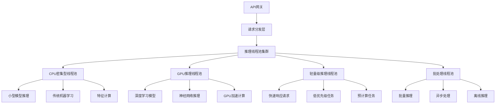

**推理请求处理流程图**：
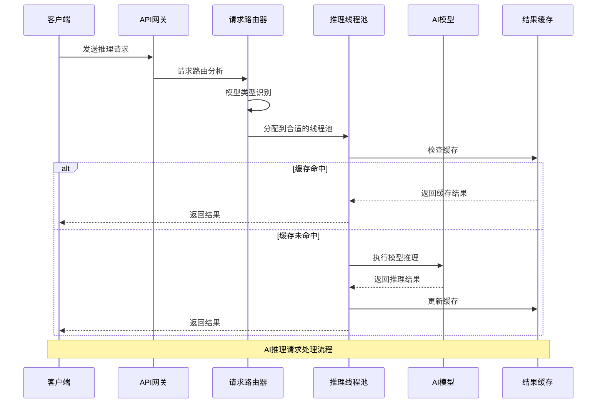

**2. 不同类型AI推理任务的线程池配置策略？**

**面试场景**：AI性能优化专家面试，考察线程池配置

**口语化答案**：
不同类型的AI推理任务具有不同的资源需求和性能特征，需要采用针对性的线程池配置策略。

**核心设计思路**：
AI推理任务可分为CPU密集型、GPU密集型、I/O密集型和混合型等类型。CPU密集型任务适合固定大小的线程池，线程数约等于CPU核心数；GPU密集型任务需要控制并发度避免GPU内存溢出；I/O密集型任务可以适当增加线程数；混合型任务需要动态调整策略。根据任务的SLA要求、资源成本和性能目标进行精细化配置。

**AI推理任务分类与配置矩阵图**：
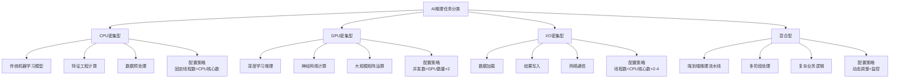

**线程池性能对比图**：
```mermaid
radarChart
    title 推理线程池配置性能对比
    axis 吞吐量, 响应时间, 资源利用率, 稳定性, 扩展性, 成本效率

    "保守配置" : 5, 7, 6, 9, 3, 8
    "均衡配置" : 8, 8, 8, 7, 6, 7
    "激进配置" : 9, 5, 9, 4, 8, 6
    "自适应配置" : 8, 9, 8, 8, 9, 7
    "混合配置" : 9, 8, 9, 8, 9, 8
```

---

## 推理任务特性分析

### ⭐⭐ 进阶题 (31-70)

**31. AI模型推理的内存和CPU特征如何影响线程池设计？**

**面试场景**：AI系统性能专家面试，考察资源特性分析

**口语化答案**：
AI模型推理的内存占用模式、CPU使用特征和资源竞争模式直接影响线程池的设计策略和参数配置。

**核心设计思路**：
不同AI模型具有不同的资源使用特征：大型语言模型需要大量内存但CPU使用相对较低，CNN模型计算密集但内存使用适中，传统机器学习模型资源占用相对较小。需要根据模型的内存占用、计算复杂度、批次处理能力等特征，设计相应的线程池配置。考虑内存碎片、GC压力、缓存命中率等因素，优化整体性能。

**AI模型资源特征分析图**：
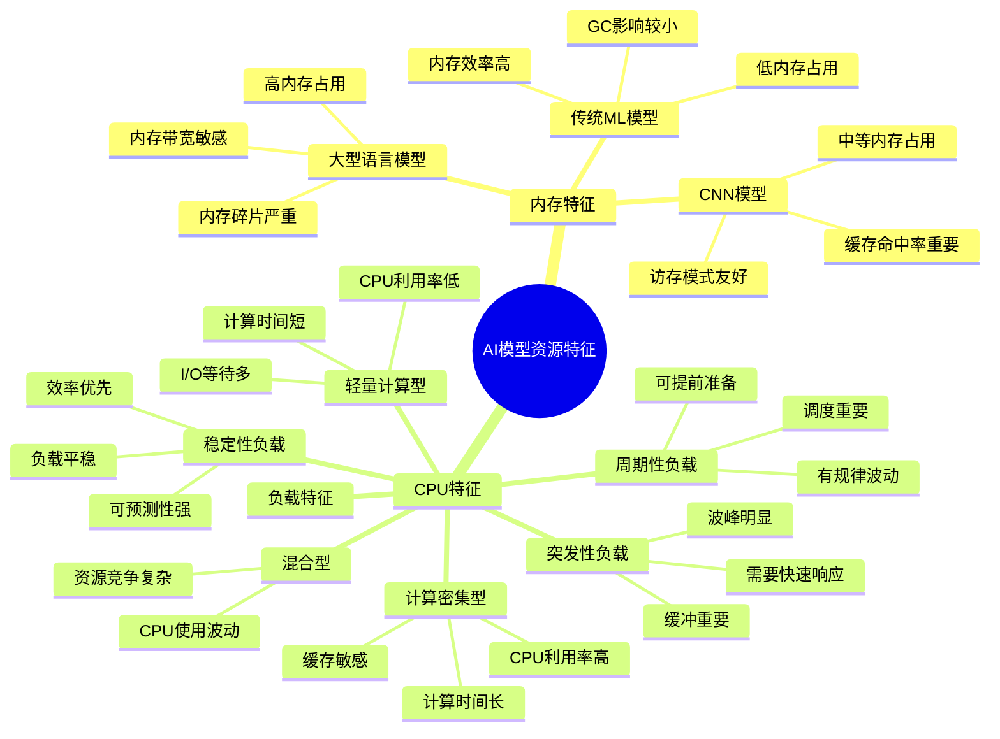

**线程池配置决策树图**：
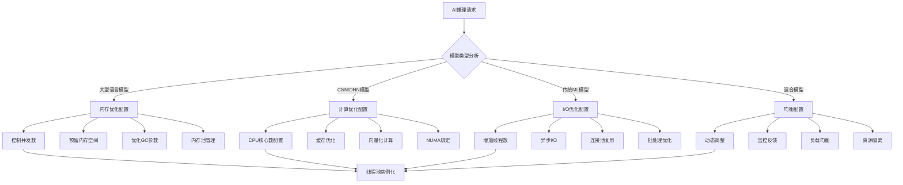

**32. 推理延迟与吞吐量的平衡如何通过线程池实现？**

**面试场景**：AI系统架构师面试，考察性能平衡策略

**口语化答案**：
推理系统的延迟和吞吐量往往存在权衡关系，通过合理的线程池设计和调度策略可以在两者间找到最佳平衡点。

**核心设计思路**：
延迟敏感的场景需要小线程池和快速响应机制，吞吐量优先的场景需要大线程池和批处理优化。设计多级线程池架构，将不同优先级和特征的请求分配到不同的线程池。实现智能调度算法，根据系统负载动态调整处理策略。通过预热、缓存、异步处理等技术手段，同时优化延迟和吞吐量。

**延迟吞吐量平衡策略图**：
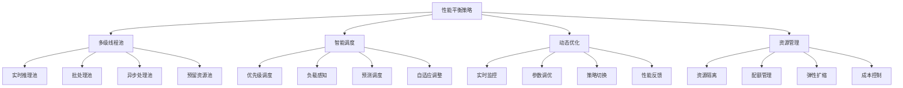

**性能优化效果对比图**：
```mermaid
radarChart
    title 不同策略的性能表现
    axis 延迟优化, 吞吐量优化, 资源效率, 稳定性, 可扩展性, 成本控制

    "延迟优先策略" : 9, 4, 5, 7, 5, 6
    "吞吐量优先策略" : 3, 9, 8, 5, 7, 8
    "平衡策略" : 7, 7, 8, 8, 8, 8
    "自适应策略" : 8, 8, 9, 9, 9, 7
    "混合策略" : 8, 9, 8, 8, 9, 8
```

---

## 线程池参数调优策略

### ⭐⭐⭐ 专家题 (71-100)

**71. 如何实现AI推理系统的自适应线程池调优？**

**面试场景**：AI系统性能优化专家面试，考察自适应调优

**口语化答案**：
自适应线程池调优通过实时监控系统状态和负载特征，动态调整线程池参数，实现最佳性能表现。

**核心设计思路**：
构建多维度的监控指标体系，包括CPU使用率、内存占用、队列长度、响应时间等关键指标。设计智能调优算法，根据负载模式和性能目标自动调整线程池大小、队列容量和拒绝策略。实现预测性调优，基于历史数据和机器学习预测负载变化，提前调整资源配置。建立反馈闭环，持续优化调策略效果。

**自适应调优架构图**：
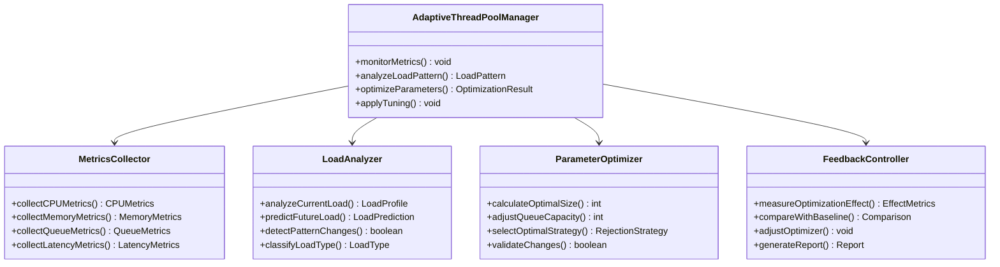

**自适应调优决策流程图**：
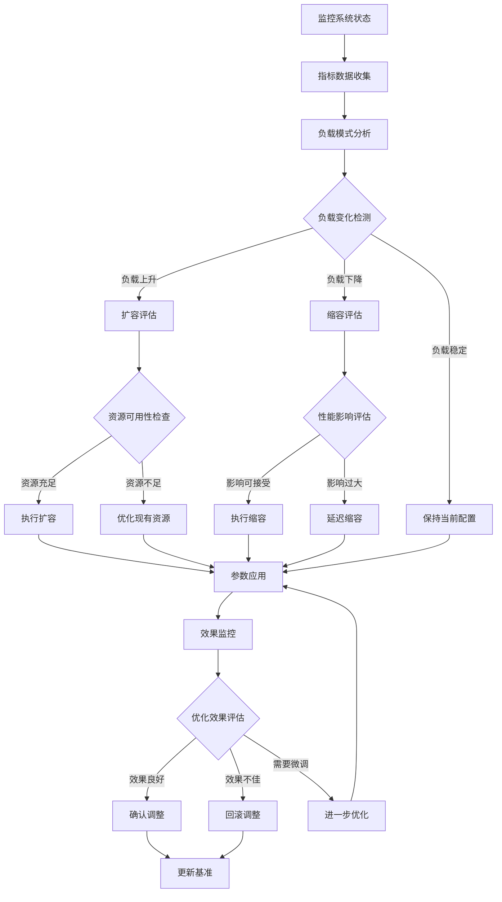

**72. 多模型并发推理的线程池如何设计？**

**面试场景**：AI多模型系统架构师面试，考察多模型并发设计

**口语化答案**：
多模型并发推理需要考虑模型间的资源竞争、调度优先级和性能隔离，设计专门的线程池架构来协调多个模型的执行。

**核心设计思路**：
为不同类型和优先级的模型分配专门的线程池，实现资源隔离和性能保障。设计模型调度器，根据模型特征、业务优先级和系统负载智能调度推理任务。实现模型间的负载均衡和故障隔离，防止单个模型的问题影响整体系统。支持动态资源分配，根据实时负载情况在线程池间调整资源配额。

**多模型推理架构图**：
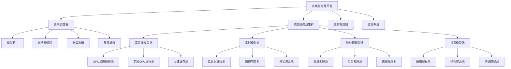

**模型调度策略图**：
```mermaid
radarChart
    title 模型调度策略性能对比
    axis 响应时间, 吞吐量, 资源利用率, 公平性, 稳定性, 可扩展性

    "FIFO调度" : 5, 6, 7, 9, 7, 6
    "优先级调度" : 8, 5, 6, 7, 6, 7
    "负载均衡调度" : 7, 8, 9, 8, 8, 8
    "自适应调度" : 9, 8, 8, 8, 9, 9
    "混合调度" : 8, 9, 8, 8, 9, 9
```

**80. 线程池在分布式AI推理系统中如何协调？**

**面试场景**：分布式AI系统架构师面试，考察分布式协调

**口语化答案**：
分布式AI推理系统需要协调多个节点的线程池，实现全局资源优化和负载均衡，提供统一的推理服务。

**核心设计思路**：
设计全局调度器协调各节点的线程池，实现跨节点的任务分发和负载均衡。建立线程池状态同步机制，确保各节点资源状态的一致性。实现智能的请求路由算法，根据模型分布、节点负载和网络状况选择最优执行节点。支持动态扩缩容，根据整体负载情况自动调整节点数量和资源配置。

**分布式线程池协调架构图**：
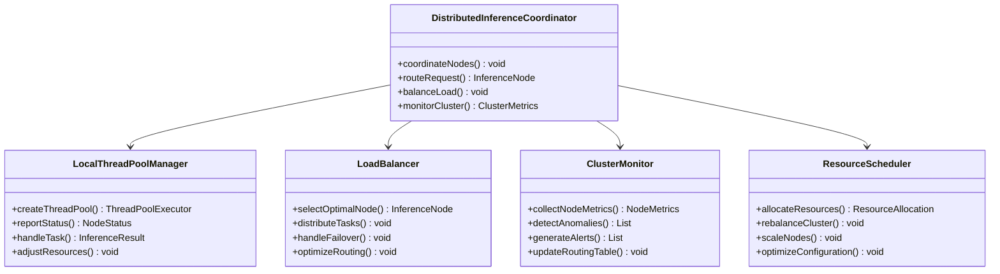

**分布式推理处理流程图**：
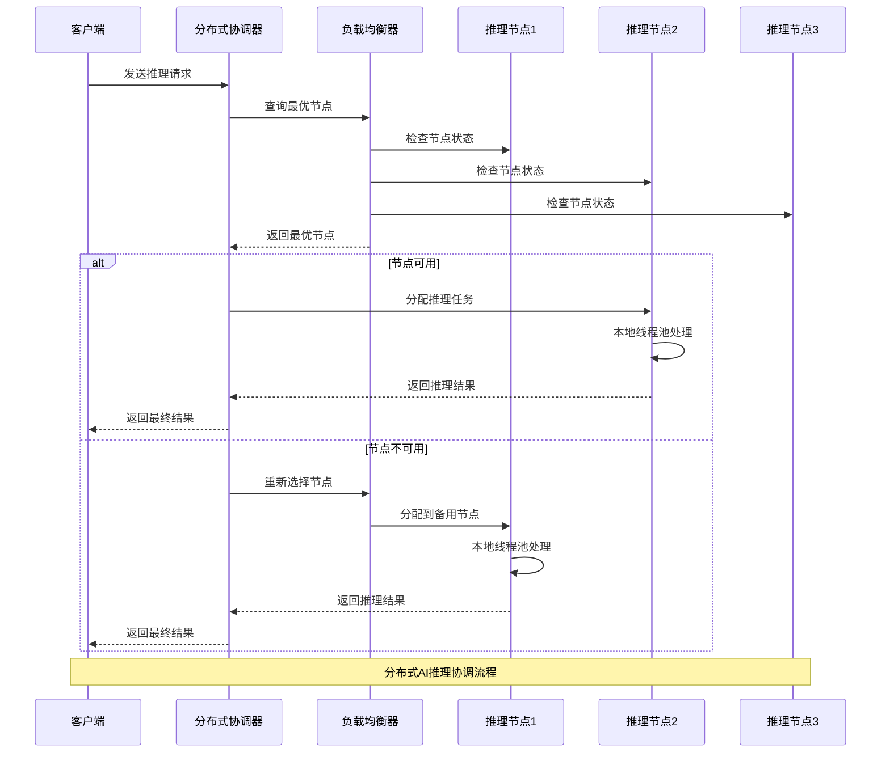

**81. 如何设计线程池的监控和告警系统？**

**面试场景**：AI运维专家面试，考察监控告警设计

**口语化答案**：
线程池的监控告警系统需要全面覆盖性能指标、资源使用和异常情况，提供实时的可视化界面和智能的告警机制。

**核心设计思路**：
构建多层次的监控体系，包括实时监控、趋势分析和异常检测。设计智能的告警规则，基于阈值、趋势和异常模式触发告警。实现可视化的监控面板，提供直观的性能展示和运维操作界面。支持自动化的故障处理和自愈机制，减少人工干预。

**监控告警系统架构图**：
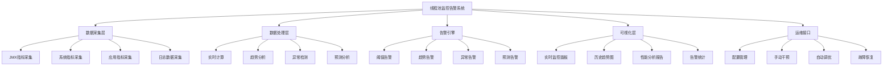

**告警规则配置矩阵图**：
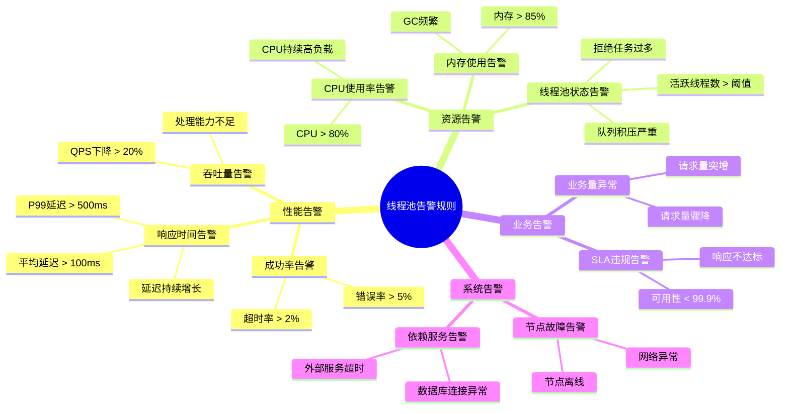

---

## 总结

线程池在AI模型推理中的优化需要掌握：

1. **推理特性分析**：理解AI推理任务的计算特征和资源需求
2. **架构设计**：设计适合推理场景的线程池架构和调度策略
3. **参数调优**：根据模型特征和负载模式精细化调优线程池参数
4. **自适应优化**：实现智能的监控、调优和负载均衡机制
5. **分布式协调**：在多节点环境中协调线程池资源，实现全局优化

通过系统的线程池优化策略，AI推理系统能够获得更好的性能表现、资源利用率和系统稳定性。