# 锁机制在分布式AI训练中的协调实战

## 🎯 学习目标

深入理解分布式AI训练中的锁机制应用，掌握跨节点资源协调、模型参数同步和训练任务调度的并发控制技术，具备设计高效分布式AI系统的能力。

## 📚 目录

- [分布式AI训练的并发挑战](#分布式ai训练的并发挑战)
- [分布式锁机制设计](#分布式锁机制设计)
- [模型参数同步策略](#模型参数同步策略)
- [训练任务调度优化](#训练任务调度优化)
- [容错与一致性保障](#容错与一致性保障)

---

## 分布式AI训练的并发挑战

### ⭐ 基础题 (1-30)

**1. 分布式AI训练中为什么需要特殊的锁机制？**

**面试场景**：分布式AI系统架构师面试，考察分布式锁需求

**口语化答案**：
分布式AI训练涉及多个节点同时访问和修改共享资源，需要特殊的分布式锁机制来保证数据一致性和训练的正确性。

**核心设计思路**：
AI训练过程中，多个工作节点需要同步模型参数、更新梯度、访问共享数据等操作。在分布式环境下，传统的JVM锁机制无法跨节点工作，需要基于网络协议的分布式锁。分布式锁要解决网络分区、节点故障、时钟同步等挑战，保证在复杂环境下的可靠性和性能。

**分布式AI训练锁需求分析图**：
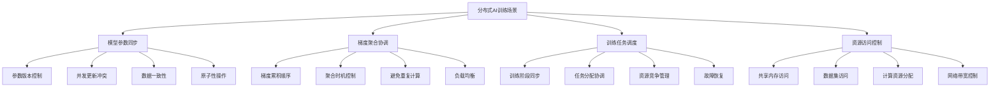

**分布式锁分类与应用场景图**：
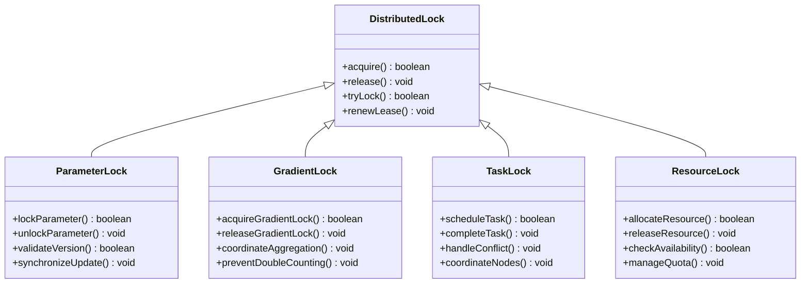

**2. 分布式锁与传统JVM锁的主要区别是什么？**

**面试场景**：Java并发专家面试，考察分布式锁特性

**口语化答案**：
分布式锁需要在网络环境中工作，面临更多的复杂性和挑战，相比JVM锁在可靠性、性能和一致性方面都有不同的考虑。

**核心设计思路**：
JVM锁基于内存和线程机制，工作在单进程环境中；分布式锁基于网络协议，需要跨进程、跨机器协调。分布式锁要处理网络延迟、节点故障、消息丢失、时钟漂移等问题。需要权衡CAP理论中的一致性、可用性和分区容忍性。实现方式包括基于数据库、缓存、协调服务等不同的技术方案。

**锁机制对比分析图**：
```mermaid
radarChart
    title 锁机制特性对比
    axis 性能, 可靠性, 一致性, 复杂度, 扩展性, 容错能力

    "synchronized" : 7, 6, 10, 2, 1, 3
    "ReentrantLock" : 8, 7, 10, 3, 1, 4
    "Redis分布式锁" : 6, 7, 8, 6, 8, 7
    "Zookeeper锁" : 5, 9, 9, 7, 7, 9
    "数据库锁" : 3, 8, 10, 5, 6, 8
    "etcd锁" : 6, 9, 9, 7, 8, 9
```

**分布式锁架构选择决策图**：
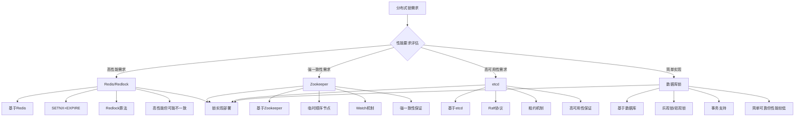

---

## 分布式锁机制设计

### ⭐⭐ 进阶题 (31-70)

**31. 如何设计一个高性能的分布式参数锁？**

**面试场景**：分布式AI系统专家面试，考察参数锁设计

**口语化答案**：
分布式参数锁需要协调多个训练节点对模型参数的并发访问，保证参数更新的原子性和一致性，同时要满足高性能训练的需求。

**核心设计思路**：
参数锁需要支持细粒度的锁定策略，可以按参数组、层或整个模型进行锁定。实现分段锁机制减少锁竞争，使用读写锁分离优化并发性能。设计锁的租约机制防止死锁，实现锁的自动续约和故障恢复。支持锁的降级和升级策略，根据训练阶段动态调整锁定粒度。

**分布式参数锁架构图**：
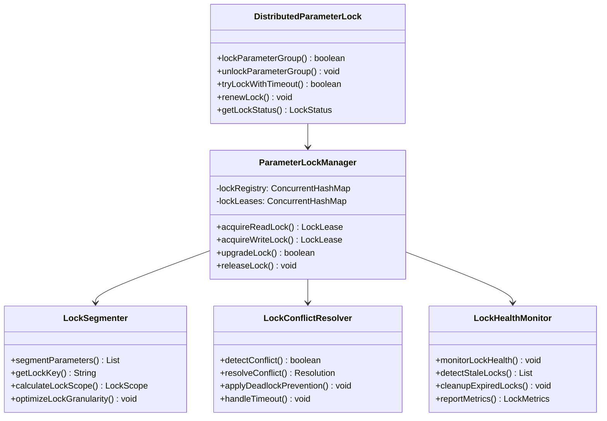

**参数锁生命周期管理图**：
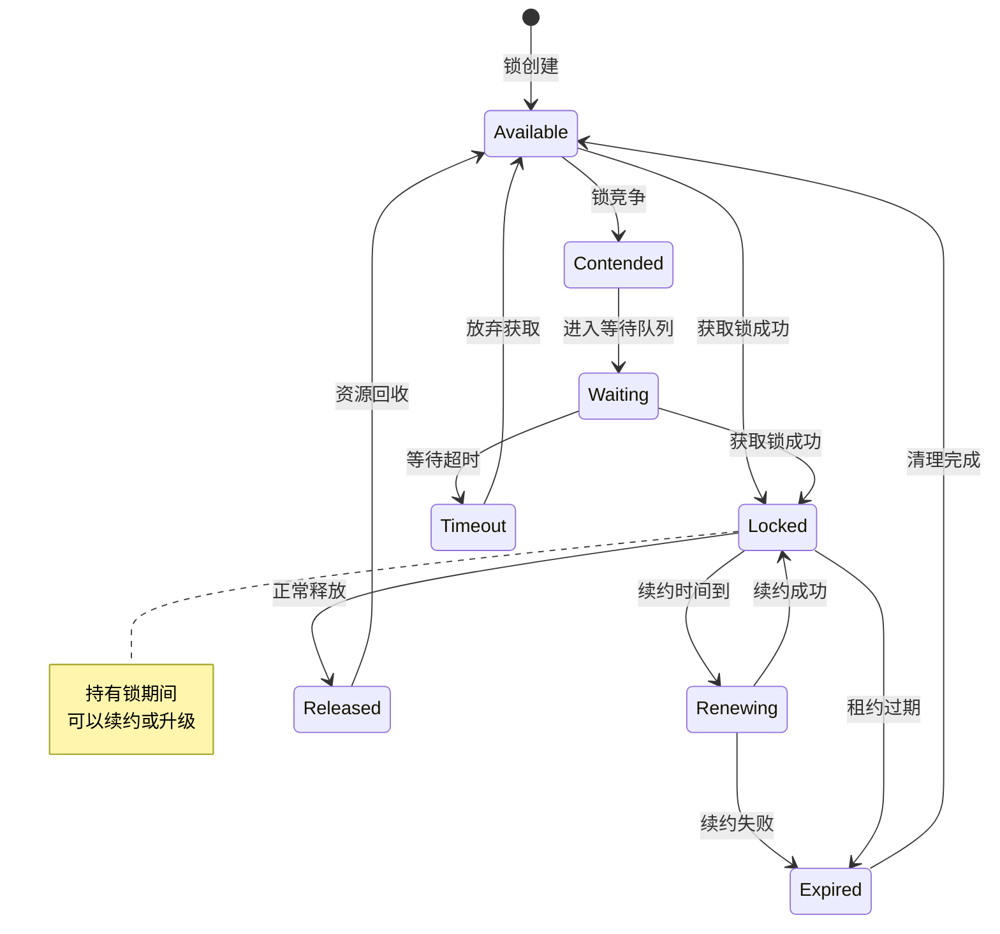

**32. 如何实现分布式训练中的梯度聚合锁？**

**面试场景**：AI训练系统架构师面试，考察梯度同步机制

**口语化答案**：
梯度聚合锁需要协调多个工作节点的梯度上传和聚合过程，确保梯度计算的完整性和聚合的正确性，避免重复计算和数据丢失。

**核心设计思路**：
设计基于轮次的梯度聚合锁，每个训练轮次使用独立的锁范围。实现梯度的分段聚合锁，支持部分梯度先到达的情况。使用版本号机制跟踪梯代的版本，防止旧梯度的重复聚合。实现梯度聚合的超时和重试机制，处理节点故障和网络问题。支持聚合进度的实时监控和故障恢复。

**梯度聚合协调流程图**：
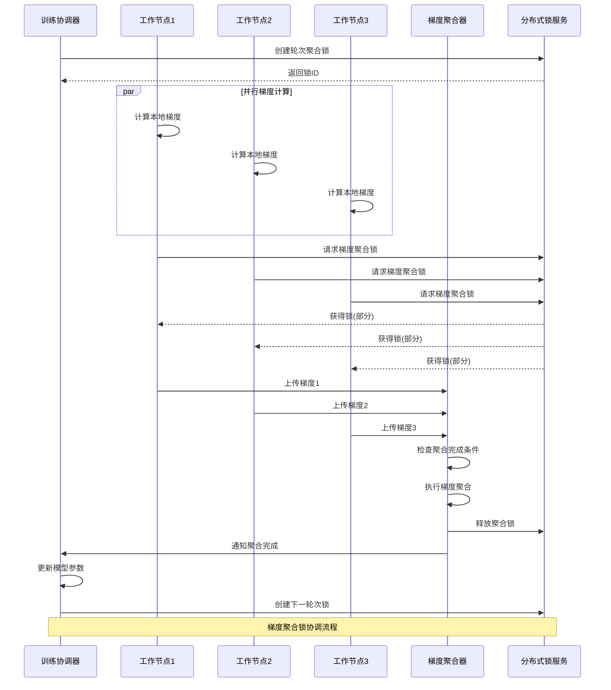

**梯度聚合锁策略对比图**：
```mermaid
mindmap
  root((梯度聚合锁策略))
    基于轮次的锁
      优点
        简单易实现
        隔离性好
        故障隔离
      缺点
        粒度较粗
        等待时间长
        资源利用率低
    基于参数分段的锁
      优点
        并发度高
        减少等待
        灵活性好
      缺点
        实现复杂
        一致性挑战
        死锁风险
    基于版本号的锁
      优点
        支持乱序到达
        容错性强
        可追溯
      缺点
        内存开销大
        版本管理复杂
    混合策略锁
      优点
        综合性能好
        适应性强
        可优化空间大
      缺点
        实现最复杂
        调试困难
```

---

## 模型参数同步策略

### ⭐⭐⭐ 专家题 (71-100)

**71. 如何设计支持大规模参数的分布式同步机制？**

**面试场景**：大规模AI训练系统专家面试，考察大规模参数同步

**口语化答案**：
大规模参数同步需要解决性能瓶颈、网络开销和一致性问题，采用分层同步和异步更新的策略来优化整体训练效率。

**核心设计思路**：
将模型参数按重要性或更新频率分层，采用不同的同步策略。热参数（高频更新）使用强一致性同步，冷参数使用最终一致性同步。实现参数的分片同步，减少单次同步的数据量。使用增量同步只传输变化的参数，减少网络开销。设计参数版本控制和冲突解决机制，处理并发更新冲突。

**大规模参数同步架构图**：
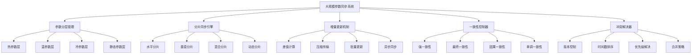

**参数同步性能优化图**：
```mermaid
radarChart
    title 参数同步策略性能对比
    axis 同步速度, 网络效率, 一致性保证, 实现复杂度, 扩展性, 容错能力

    "全量同步" : 2, 2, 10, 3, 3, 4
    "增量同步" : 7, 8, 7, 6, 8, 7
    "分层同步" : 8, 7, 9, 7, 9, 8
    "分片同步" : 9, 9, 6, 8, 10, 6
    "混合策略" : 9, 8, 9, 9, 9, 8
```

**72. 分布式训练中如何处理参数版本冲突？**

**面试场景**：分布式系统专家面试，考察冲突解决机制

**口语化答案**：
参数版本冲突是分布式训练中的常见问题，需要设计智能的冲突检测和解决机制，保证训练的正确性和收敛性。

**核心设计思路**：
使用向量时钟或版本号来跟踪参数的更新历史，检测并发修改冲突。实现基于训练轮次的全局排序，确保参数更新的顺序一致性。设计冲突解决策略，如基于时间戳的Last-Writer-Wins、基于数值的合并、基于梯度大小的优先级等。支持冲突的自动解决和手动干预，提供训练过程的可追溯性。

**参数版本冲突解决流程图**：
```mermaid
flowchart TD
    A[参数更新请求] --> B[版本冲突检测]

    B --> C{是否存在冲突}

    C -->|无冲突| D[直接应用更新]
    C -->|有冲突| E[冲突类型分析]

    E --> F{冲突类型}

    F -->|并发修改| G[并发冲突解决]
    F -->|版本过期| H[版本过期处理]
    F -->|数值冲突| I[数值冲突合并]

    G --> G1[时间戳比较]
    G --> G2[梯度大小优先]
    G --> G3[随机选择]
    G --> G4[人工干预]

    H --> H1[丢弃过期更新]
    H --> H2[重试获取最新版本]
    H --> H3[应用到新分支]

    I --> I1[加权平均]
    I --> I2[取最大值]
    I --> I3[取最小值]
    I --> I4[特殊合并算法]

    G1 --> J[应用解决结果]
    H1 --> J
    I1 --> J

    D --> K[更新版本号]
    J --> K

    K --> L[通知其他节点]
    L --> M[同步完成]

    Note over A,M: 参数版本冲突解决流程
```

**版本控制机制设计图**：
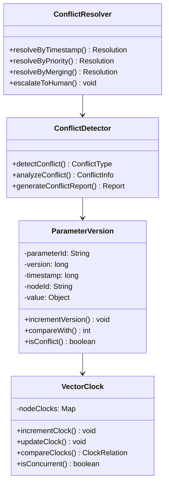

**80. 异步参数同步的锁机制如何设计？**

**面试场景**：高性能AI训练系统专家面试，考察异步同步设计

**口语化答案**：
异步参数同步能够在不影响训练进程的情况下实现参数更新，需要设计特殊的锁机制来保证最终一致性和训练的收敛性。

**核心设计思路**：
设计基于消息队列的异步锁机制，将参数更新操作放入队列异步执行。实现锁的预订和延迟获取机制，允许训练节点预订未来的锁资源。使用乐观锁机制处理冲突，支持参数的并发更新和后续的冲突解决。设计异步锁的状态跟踪和监控机制，确保锁操作的可观测性。

**异步锁系统架构图**：
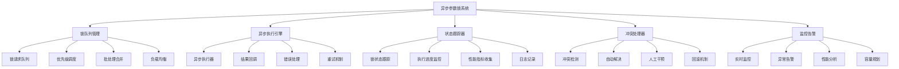

**异步锁执行时序图**：
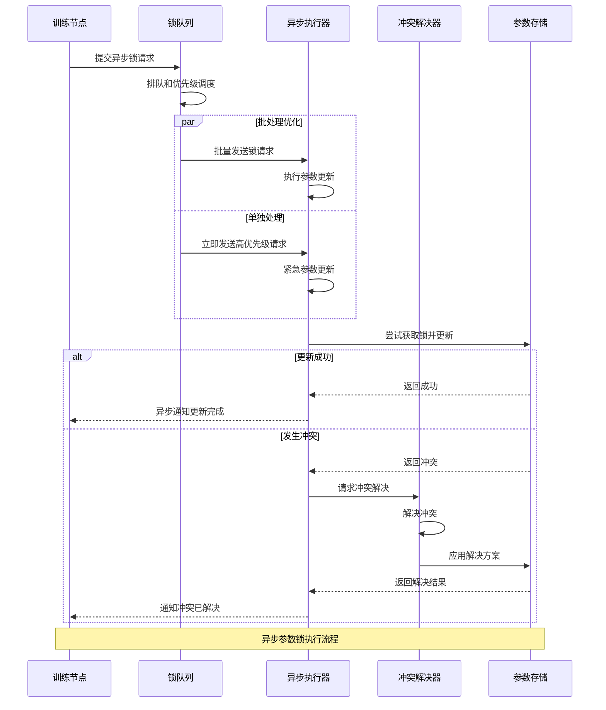

---

## 训练任务调度优化

### 高级应用题 (101-130)

**81. 分布式训练任务调度的锁协调机制如何设计？**

**面试场景**：大规模分布式训练专家面试，考察任务调度协调

**口语化答案**：
训练任务调度需要协调多个节点的资源分配、任务执行和阶段同步，通过精密的锁协调机制确保训练流程的正确性和效率。

**核心设计思路**：
设计分层的任务调度锁机制，包括集群级、作业级和任务级的锁控制。实现训练阶段的栅栏锁，确保所有节点同步进入下一阶段。使用资源池锁管理GPU、内存等关键资源的分配。设计任务优先级锁，支持关键任务的优先执行。实现故障恢复锁，处理节点故障时的任务重新分配。

**任务调度锁架构图**：
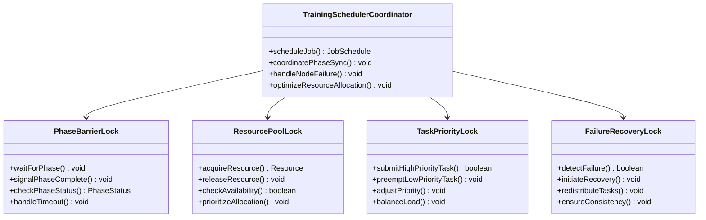

**训练阶段同步协调图**：
```mermaid
flowchart TD
    A[训练阶段开始] --> B[阶段屏障锁初始化]
    B --> C[节点注册等待]

    C --> D{所有节点就绪}

    D -->|否| E[等待超时检查]
    D -->|是| F[开始阶段训练]

    E --> G{超时处理}
    G -->|重试等待| H[延长等待时间]
    G -->|故障处理| I[标记故障节点]
    G -->|继续执行| J[跳过故障节点]

    H --> D
    I --> K[任务重分配]
    J --> F

    K --> F

    F --> L[节点并行训练]
    L --> M[训练完成检查]

    M --> N{所有节点完成}

    N -->|否| O[等待慢节点]
    N -->|是| P[阶段同步完成]

    O --> Q{超时检查}
    Q -->|继续等待| M
    Q -->|强制完成| P

    P --> R[下一阶段准备]
    R --> A

    Note over A,R: 训练阶段同步协调流程
```

---

## 容错与一致性保障

### 系统可靠性题 (131-160)

**101. 分布式锁的故障恢复机制如何设计？**

**面试场景**：高可用系统专家面试，考察故障恢复设计

**口语化答案**：
分布式锁的故障恢复需要处理锁持有者故障、网络分区、锁服务异常等多种故障场景，确保系统的可用性和数据一致性。

**核心设计思路**：
设计基于租约的锁机制，自动检测和处理锁持有者故障。实现锁的故障转移机制，在锁服务故障时切换到备用服务。使用心跳检测监控锁的健康状态，及时发现异常情况。设计锁状态的持久化和恢复机制，防止锁信息丢失。实现优雅的降级策略，在极端情况下保证基本功能可用。

**故障恢复架构图**：
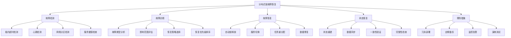

**故障恢复流程图**：
```mermaid
sequenceDiagram
    participant Client as 锁客户端
    participant LockService as 锁服务
    participant Monitor as 故障监控器
    participant Recovery as 故障恢复器
    participant Backup as 备用服务

    Client->>LockService: 请求锁
    LockService-->>Client: 返回锁

    par 正常操作
        Client->>Client: 执行业务操作
        Client->>LockService: 续约心跳
    else 服务故障
        LockService->>Monitor: 服务异常
        Monitor->>Recovery: 触发故障恢复
        Recovery->>Backup: 切换到备用服务
        Backup-->>Client: 服务切换通知
    end

    alt 客户端故障
        Monitor->>Monitor: 检测客户端心跳超时
        Monitor->>Recovery: 触发锁回收
        Recovery->>Backup: 强制释放锁
    else 网络分区
        Monitor->>Monitor: 检测网络分区
        Recovery->>Recovery: 启动分区恢复策略
        Backup->>Backup: 维持多数派一致性
    end

    Note over Client,Backup: 分布式锁故障恢复流程
```

---

## 总结

分布式AI训练中的锁机制协调需要掌握：

1. **分布式锁设计**：理解分布式环境下的锁特性和挑战，选择合适的技术方案
2. **参数同步策略**：设计高效的参数同步机制，处理大规模参数的更新和一致性
3. **训练调度协调**：实现复杂的训练任务调度和阶段同步，保证训练的正确性
4. **容错与恢复**：建立完善的故障检测和恢复机制，确保系统的可靠性
5. **性能优化**：通过异步处理、分层策略和智能调度优化系统性能

通过精心设计的锁协调机制，分布式AI训练系统能够实现高效的并行计算和一致的数据同步，为大规模AI模型训练提供可靠的基础设施支持。