# CompletableFuture在异步AI管道中的应用实战

## 🎯 学习目标

深入理解CompletableFuture在AI系统中的高级应用，掌握构建异步AI处理管道、并发任务编排和异常处理的技巧，具备设计高性能异步AI系统的能力。

## 📚 目录

- [CompletableFuture基础与AI异步模型](#completablefuture基础与ai异步模型)
- [异步AI管道构建](#异步ai管道构建)
- [并发任务编排与协调](#并发任务编排与协调)
- [异常处理与容错机制](#异常处理与容错机制)
- [性能优化与监控](#性能优化与监控)

---

## CompletableFuture基础与AI异步模型

### ⭐ 基础题 (1-30)

**1. CompletableFuture如何解决AI系统的异步编程挑战？**

**面试场景**：Java异步编程专家面试，考察CompletableFuture应用

**口语化答案**：
CompletableFuture提供了强大的异步编程能力，能够有效解决AI系统中的并发处理、任务编排和异步协调问题。

**核心设计思路**：
AI处理流程通常包含多个异步阶段：数据加载、预处理、模型推理、后处理等。CompletableFuture通过链式调用和函数式编程，将这些异步操作串联成高效的处理管道。支持任务的并行执行和结果合并，最大化系统资源利用率。提供完善的异常处理机制，保证异步流程的可靠性。避免传统回调地狱的问题，提供清晰可读的异步代码结构。

**AI异步处理管道架构图**：
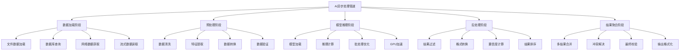

**CompletableFuture异步流程图**：
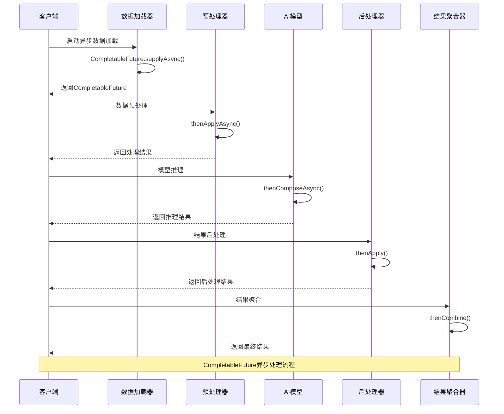

**2. CompletableFuture与传统Future相比有什么优势？**

**面试场景**：Java并发专家面试，考察异步编程特性对比

**口语化答案**：
CompletableFuture相比传统Future提供了更强大的异步编程能力，支持链式调用、异常处理、任务组合等高级特性。

**核心设计思路**：
传统Future只能通过get()阻塞获取结果，缺乏灵活性。CompletableFuture支持非阻塞的结果获取和回调机制。提供丰富的组合操作，如thenApply、thenCompose、thenCombine等，支持复杂的异步流程编排。内置异常处理机制，可以在异步链中处理异常。支持手动完成和取消操作，提供更细粒度的任务控制。可以与Stream API结合使用，提供函数式编程体验。

**异步编程特性对比图**：
```mermaid
radarChart
    title 异步编程特性对比
    axis 易用性, 功能完整性, 性能, 可读性, 异常处理, 扩展性

    "Future" : 4, 3, 7, 3, 2, 3
    "CompletableFuture" : 8, 9, 8, 9, 9, 9
    "回调模式" : 5, 5, 6, 2, 6, 4
    "响应式编程" : 7, 9, 8, 8, 9, 10
    "协程" : 9, 8, 9, 9, 8, 8
```

**CompletableFuture操作矩阵图**：
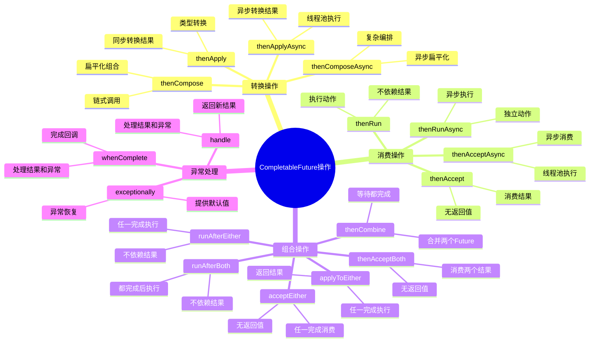

---

## 异步AI管道构建

### ⭐⭐ 进阶题 (31-70)

**31. 如何使用CompletableFuture构建多阶段AI处理管道？**

**面试场景**：AI系统架构师面试，考察异步管道设计

**口语化答案**：
使用CompletableFuture可以将AI处理的多个阶段串联成异步管道，每个阶段独立执行，提高系统的并发性能和资源利用率。

**核心设计思路**：
AI处理管道包含数据验证、预处理、模型推理、结果后处理等阶段。使用CompletableFuture的thenCompose方法实现阶段间的顺序执行，使用thenCombine实现并行阶段的合并。为每个阶段配置专门的线程池，优化资源分配。设计阶段间的数据传递机制，保证数据流的完整性。实现管道的监控和故障恢复机制，提高系统可靠性。

**多阶段AI处理管道架构图**：
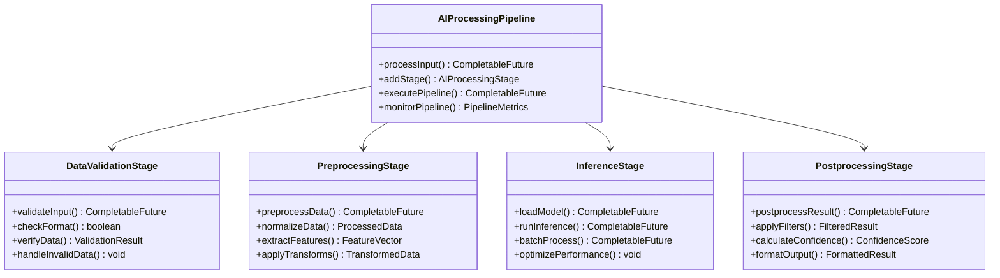

**异步管道执行流程图**：
```mermaid
flowchart TD
    A[输入数据] --> B[数据验证阶段]
    B --> C{验证通过?}

    C -->|是| D[预处理阶段]
    C -->|否| E[错误处理]

    D --> F[特征提取]
    F --> G[数据归一化]
    G --> H[模型推理阶段]

    H --> I[模型加载]
    I --> J[推理计算]
    J --> K[后处理阶段]

    K --> L[结果过滤]
    L --> M[置信度计算]
    M --> N[格式化输出]

    N --> O[最终结果]
    E --> P[错误结果]

    H --> H1[并行推理]
    H1 --> H2[批量处理]
    H1 --> H3[模型A]
    H1 --> H4[模型B]

    J2[J结果合并]
    H2 --> J2
    H3 --> J2
    H4 --> J2
    J2 --> K

    Note over A,P: AI异步处理管道流程
```

**32. 如何实现AI管道的并行处理和分支逻辑？**

**面试场景**：高级AI系统工程师面试，考察并行处理设计

**口语化答案**：
AI管道中的某些处理阶段可以并行执行，某些条件需要分支处理，CompletableFuture提供了丰富的组合操作来实现这些复杂的逻辑。

**核心设计思路**：
使用CompletableFuture的allOf和anyOf实现并行任务协调。根据输入特征或业务规则创建分支处理逻辑，使用thenCompose实现条件分支。实现动态管道构建，根据运行时条件调整处理流程。设计并行任务的负载均衡和资源调度，最大化并行效率。提供分支合并策略，处理不同分支结果的整合。

**并行处理与分支逻辑架构图**：
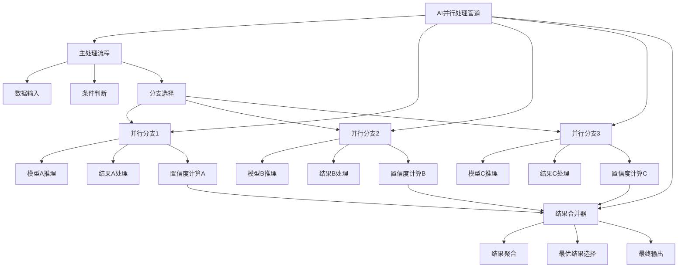

**分支决策逻辑图**：
```mermaid
flowchart TD
    A[输入数据分析] --> B{数据类型判断}

    B -->|图像数据| C[图像处理分支]
    B -->|文本数据| D[文本处理分支]
    B -->|音频数据| E[音频处理分支]
    B -->|混合数据| F[多模态处理分支]

    C --> C1[CNN模型推理]
    C1 --> C2[目标检测]
    C2 --> C3[图像分类]

    D --> D1[NLP模型推理]
    D1 --> D2[情感分析]
    D2 --> D3[实体识别]

    E --> E1[语音识别模型]
    E1 --> E2[语音转文本]
    E2 --> E3[语义理解]

    F --> F1[多模态融合]
    F1 --> F2[跨模态推理]
    F2 --> F3[综合分析]

    C3 --> G[结果聚合]
    D3 --> G
    E3 --> G
    F3 --> G

    G --> H[最终结果输出]

    Note over A,H: AI处理分支决策逻辑
```

**并行处理性能优化图**：
```mermaid
radarChart
    title 并行处理策略性能对比
    axis 并行度, 资源利用率, 响应时间, 吞吐量, 容错能力, 实现复杂度

    "串行处理" : 1, 3, 3, 2, 9, 2
    "简单并行" : 6, 6, 7, 7, 5, 4
    "智能分支" : 8, 8, 9, 8, 7, 7
    "动态并行" : 9, 9, 8, 9, 8, 9
    "混合策略" : 9, 9, 9, 9, 8, 8
```

---

## 并发任务编排与协调

### ⭐⭐⭐ 专家题 (71-100)

**71. 如何使用CompletableFuture编排复杂的AI任务依赖关系？**

**面试场景**：分布式AI系统专家面试，考察任务编排能力

**口语化答案**：
复杂AI任务间存在复杂的依赖关系，需要使用CompletableFuture的高级组合操作来编排任务的执行顺序和协调机制。

**核心设计思路**：
分析AI任务间的依赖关系，构建有向无环图(DAG)表示任务流程。使用thenCompose处理顺序依赖，thenCombine处理并行后合并，thenAcceptBoth处理双输入依赖。实现条件依赖和循环依赖的处理机制。设计任务执行的监控和调试工具，跟踪任务执行状态。支持动态任务编排，根据运行时条件调整执行计划。

**复杂任务依赖图**：
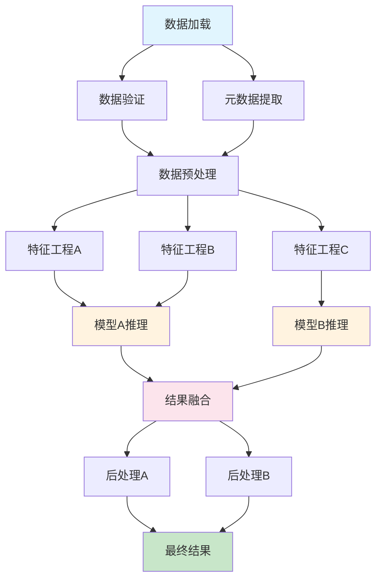

**任务编排器设计图**：
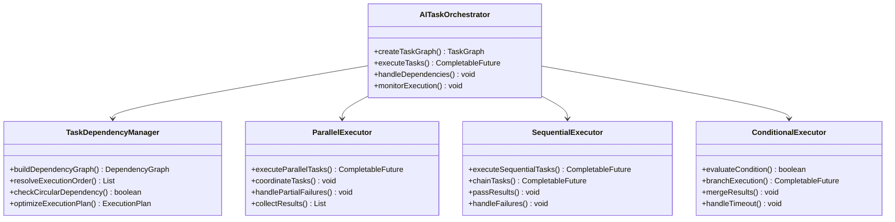

**72. 如何实现动态AI任务调度和负载均衡？**

**面试场景**：AI系统性能优化专家面试，考察动态调度设计

**口语化答案**：
动态AI任务调度需要根据系统负载、任务优先级和资源可用性实时调整任务分配策略，CompletableFuture提供了灵活的任务控制机制。

**核心设计思路**：
设计智能的任务调度器，监控CPU、内存、GPU等资源使用情况。实现任务优先级队列，支持紧急任务的快速处理。使用CompletableFuture的completeOnTimeout和orTimeout实现超时控制。设计任务重试和降级机制，提高系统可靠性。实现动态线程池调整，根据负载情况自动扩缩容。

**动态任务调度架构图**：
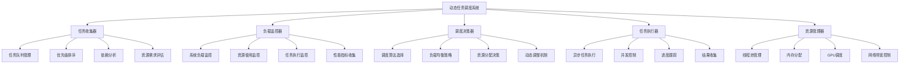

**负载均衡策略对比图**：
```mermaid
radarChart
    title 负载均衡策略对比
    axis 响应时间, 吞吐量, 资源利用率, 公平性, 扩展性, 实现复杂度

    "轮询调度" : 6, 7, 7, 9, 5, 3
    "加权轮询" : 7, 8, 8, 7, 6, 4
    "最少连接" : 8, 8, 9, 6, 7, 5
    "响应时间加权" : 9, 9, 9, 7, 8, 7
    "智能预测" : 9, 9, 9, 8, 9, 9
```

**80. 如何实现AI任务的批处理和流水线优化？**

**面试场景**：高性能AI系统专家面试，考察批处理优化

**口语化答案**：
AI任务的批处理和流水线优化能够显著提升系统吞吐量，需要精心设计任务聚合、批量执行和流水线并行机制。

**核心设计思路**：
使用CompletableFuture的thenCompose和thenCombine实现任务的智能聚合。设计动态批处理策略，根据任务特性和系统状态调整批次大小。实现流水线并行，让不同阶段的任务重叠执行。优化任务间的数据传递，减少序列化和网络开销。设计批处理超时和拆分机制，平衡延迟和吞吐量。

**批处理优化架构图**：
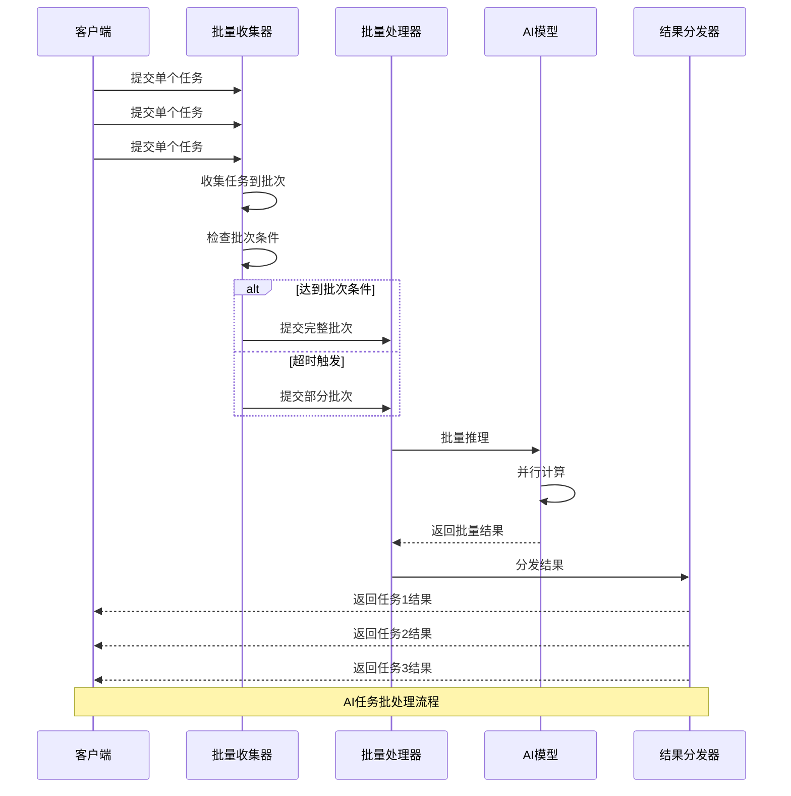

**流水线并行处理图**：
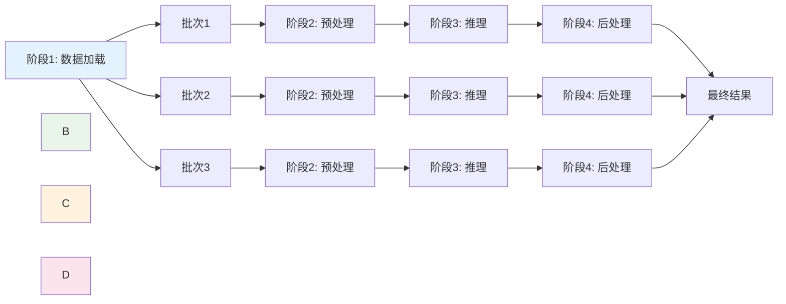

---

## 异常处理与容错机制

### 系统可靠性题 (101-130)

**81. 如何设计CompletableFuture的异常处理策略？**

**面试场景**：AI系统可靠性专家面试，考察异常处理设计

**口语化答案**：
CompletableFuture提供了丰富的异常处理机制，需要设计分层的异常处理策略，确保AI系统的稳定性和可靠性。

**核心设计思路**：
使用exceptionally处理可恢复异常，提供默认值或降级策略。使用whenComplete和handle记录异常信息和执行清理操作。设计异常分类和处理策略，区分业务异常、系统异常和网络异常。实现异常的传播和转换机制，在异步链中正确处理异常。建立异常监控和告警机制，及时发现系统问题。

**异常处理架构图**：
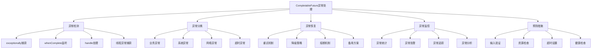

**异常处理策略矩阵图**：
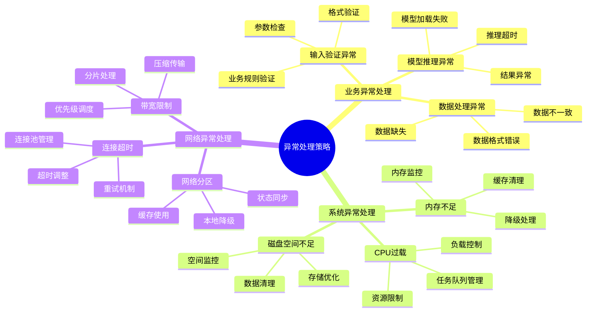

**82. 如何实现AI系统的熔断和降级机制？**

**面试场景**：高可用AI系统专家面试，考察熔断降级设计

**口语化答案**：
熔断和降级机制是AI系统保证可用性的重要手段，需要在CompletableFuture基础上实现智能的故障检测和自动恢复。

**核心设计思路**：
实现基于异常率的熔断机制，当异常率超过阈值时自动熔断。设计多级降级策略，包括缓存降级、简化模型降级、默认值降级等。使用CompletableFuture的completeOnTimeout实现超时熔断。设计熔断器的状态管理，包括关闭、打开、半开等状态。实现自动恢复机制，定期尝试恢复服务。

**熔断降级架构图**：
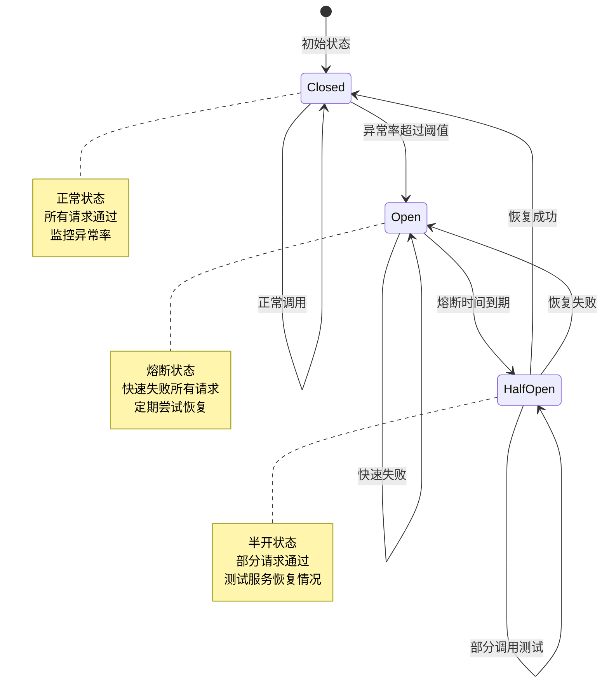

---

## 性能优化与监控

### 高级优化题 (131-160)

**101. 如何监控和优化CompletableFuture的性能？**

**面试场景**：AI性能优化专家面试，考察监控优化策略

**口语化答案**：
CompletableFuture的性能监控需要关注任务执行时间、线程池状态、异常率等关键指标，并通过数据驱动的方式进行持续优化。

**核心设计思路**：
使用JMX和自定义指标收集CompletableFuture的执行数据。监控线程池的活跃线程数、队列长度、拒绝任务数等指标。分析任务执行时间分布，识别性能瓶颈。实现动态参数调整，根据监控数据优化线程池配置。建立性能基线和告警机制，及时发现性能问题。

**性能监控系统架构图**：
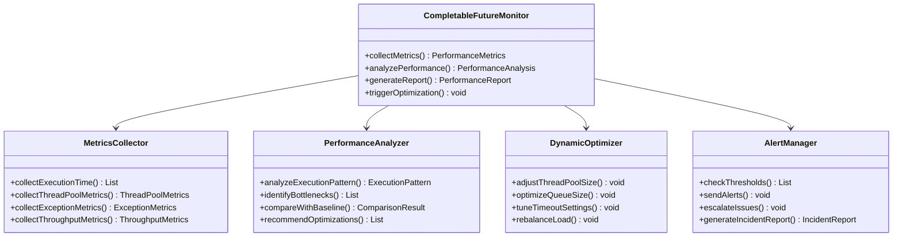

**性能优化效果对比图**：
```mermaid
radarChart
    title 优化前后性能对比
    axis 响应时间, 吞吐量, 资源利用率, 异常率, 稳定性, 扩展性

    "优化前" : 4, 5, 6, 7, 5, 4
    "线程池优化" : 6, 7, 8, 6, 7, 6
    "批处理优化" : 8, 9, 7, 5, 8, 8
    "缓存优化" : 7, 8, 9, 4, 9, 7
    "全面优化" : 9, 9, 9, 3, 9, 9
```

**102. 如何实现CompletableFuture的内存泄漏防护？**

**面试场景**：AI系统内存管理专家面试，考察内存优化

**口语化答案**：
CompletableFuture的不当使用可能导致内存泄漏，需要设计专门的机制来防护和检测内存问题。

**核心设计思路**：
避免在CompletableFuture的回调中持有大对象的引用。使用弱引用或软引用管理缓存数据。实现CompletableFuture的生命周期管理，及时取消不再需要的任务。设计内存监控机制，跟踪CompletableFuture的创建和销毁。实现定期清理机制，回收长时间未完成的任务资源。

**内存泄漏防护策略图**：
```mermaid
graph TB
    A[内存泄漏防护] --> B[引用管理]
    A --> C[生命周期控制]
    A --> D[资源清理]
    A --> E[监控检测]
    A --> F[预防措施]

    B --> B1[避免强引用]
    B --> B2[使用弱引用]
    B --> B3[及时释放引用]
    B --> B4[对象池管理]

    C --> C1[任务超时控制]
    C --> C2[主动取消机制]
    C --> C3[依赖关系管理]
    C --> C4[状态跟踪]

    D --> D1[自动清理]
    D --> D2[资源回收]
    D --> D3[缓存失效]
    D --> D4[连接池管理]

    E --> E1[内存使用监控]
    E --> E2[对象计数统计]
    E --> E3[泄漏检测算法]
    E --> E4[告警机制]

    F --> F1[编码规范]
    F --> F2[代码审查]
    F --> F3[静态分析]
    F --> F4[测试验证]
```

---

## 总结

CompletableFuture在异步AI管道中的应用需要掌握：

1. **基础异步模型**：理解CompletableFuture的核心特性和与传统Future的区别
2. **异步管道构建**：使用CompletableFuture构建多阶段、并行的AI处理管道
3. **任务编排协调**：实现复杂任务依赖关系的编排和动态调度
4. **异常处理容错**：设计完善的异常处理、熔断降级和故障恢复机制
5. **性能优化监控**：建立全面的性能监控体系和优化策略

通过合理运用CompletableFuture的各种特性，AI系统能够构建出高效、可靠、可扩展的异步处理架构，显著提升系统的性能和用户体验。