# 多线程并发编程深度解析与AI系统并发优化

## 🎯 学习目标

深入理解Java多线程并发编程的核心机制，掌握在AI系统中实现高效并发处理的技巧，具备解决复杂并发问题和性能优化的专业能力，理解并发编程在AI系统中的实际应用。

## 📚 目录

- [并发基础与AI线程模型](#并发基础与ai线程模型)
- [锁机制与AI数据同步](#锁机制与ai数据同步)
- [volatile与原子操作](#volatile与原子操作)
- [线程通信与AI任务协调](#线程通信与ai任务协调)
- [并发工具类与AI系统优化](#并发工具类与ai系统优化)

---

## 并发基础与AI线程模型

### ⭐ 基础题 (1-30)

**1. Java线程创建方式在AI系统中的应用场景如何选择？**

**面试场景**：Java架构师面试，考察线程创建策略

**口语化答案**：
在AI系统中，不同的线程创建方式适用于不同的场景，需要根据任务特性和性能要求进行选择。

**核心设计思路**：
AI系统的并发模式多样，需要根据任务类型选择合适的线程创建方式。短期的AI计算任务适合线程池复用，长期运行的服务适合独立线程，需要返回结果的异步任务适合Callable+Future。关键是平衡线程创建开销、资源管理和任务执行效率。

**AI线程创建方式选择决策图**：
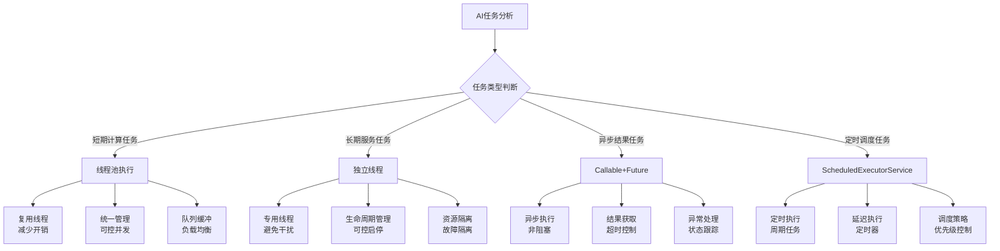

**AI系统线程模型架构图**：
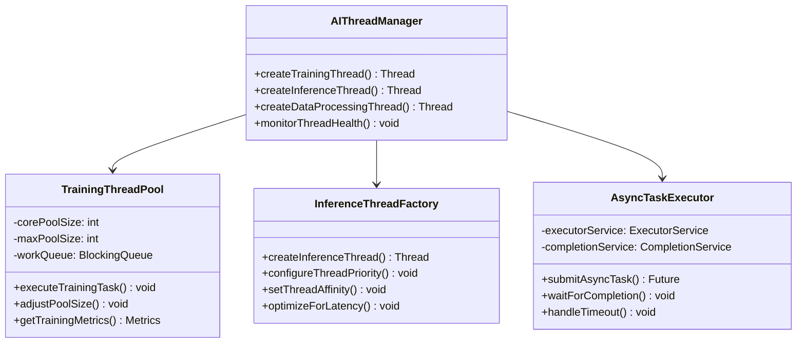

**2. AI系统中线程状态转换的特点和优化策略？**

**面试场景**：并发编程专家面试，考察线程状态管理

**口语化答案**：
AI系统中的线程状态转换具有计算密集、I/O密集、混合型等特点，需要针对性的优化策略。

**核心设计思路**：
AI系统的线程状态管理需要考虑不同任务的特性。训练任务主要是CPU密集型，推理任务涉及网络I/O，数据处理涉及磁盘I/O。通过合理的线程状态监控、阻塞优化和资源分配，最大化系统吞吐量和响应性能。

**AI线程状态优化策略图**：
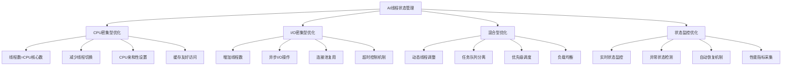

**AI线程状态转换流程图**：
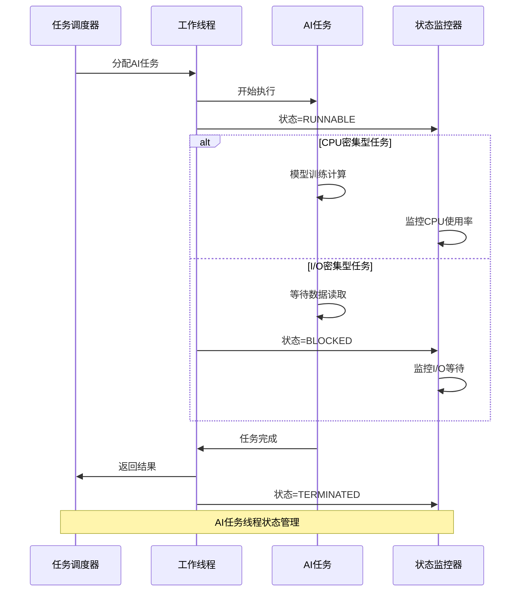

---

## 锁机制与AI数据同步

### ⭐⭐ 进阶题 (31-70)

**31. synchronized在AI模型参数同步中的最佳实践？**

**面试场景**：Java并发专家面试，考察synchronized应用

**口语化答案**：
synchronized在AI系统中的参数同步需要考虑性能开销、死锁风险和并发控制粒度。

**核心设计思路**：
AI模型参数的同步需要平衡一致性和性能。粗粒度锁简单但性能差，细粒度锁性能好但实现复杂。采用读写分离策略，参数更新时加写锁，参数读取时加读锁。结合volatile保证可见性，使用原子操作处理简单的参数更新。监控锁竞争情况，动态调整同步策略。

**AI参数同步策略图**：
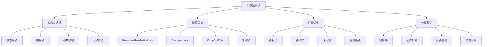

**AI模型参数同步架构图**：
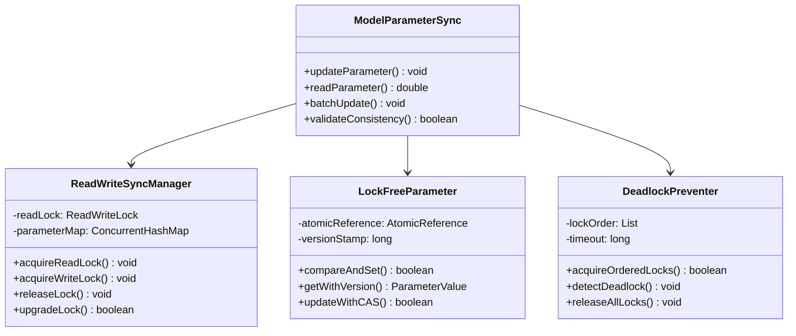

**32. ReentrantLock在AI分布式训练锁竞争优化中的应用？**

**面试场景**：分布式AI系统架构师面试，考察分布式锁

**口语化答案**：
ReentrantLock的灵活特性使其在AI分布式训练中能够实现更精细的锁竞争优化和资源管理。

**核心设计思路**：
利用ReentrantLock的可中断、超时、公平性等特性优化分布式训练中的资源竞争。实现分层的锁机制，模型参数使用公平锁避免饥饿，临时数据使用非公平锁提升性能。结合Condition实现精确的线程等待和唤醒，支持训练进度的协调控制。

**分布式训练锁优化流程图**：
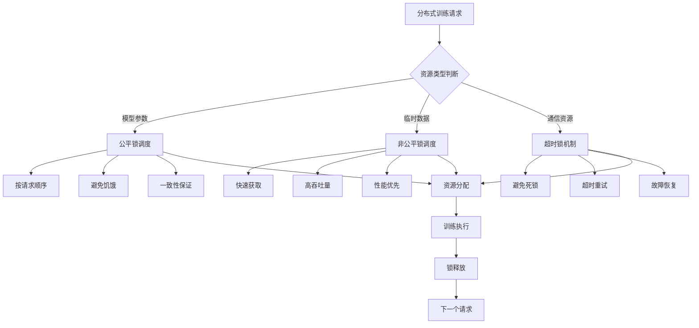

**AI分布式锁竞争对比图**：
```mermaid
radarChart
    title 分布式锁策略对比
    axis 性能, 公平性, 可靠性, 复杂度, 吞吐量, 一致性

    "Synchronized内置锁" : 5, 7, 8, 3, 6, 8
    "ReentrantLock重入锁" : 7, 8, 7, 5, 7, 8
    "ReadWriteLock读写锁" : 9, 7, 7, 6, 9, 7
    "StampedLock票据锁" : 10, 6, 6, 8, 10, 6
    "无锁CAS操作" : 10, 4, 5, 9, 10, 5
```

---

## volatile与原子操作

### ⭐⭐⭐ 专家题 (71-100)

**71. volatile在AI模型参数共享中的可见性保障机制？**

**面试场景**：并发编程专家面试，考察volatile原理

**口语化答案**：
volatile通过内存屏障保障AI模型参数在多线程间的可见性，避免参数更新的延迟问题。

**核心设计思路**：
volatile关键字通过插入内存屏障确保写操作的立即可见性和读操作获取最新值。在AI系统中，用于训练状态、模型版本、停止标志等共享变量的同步。理解happens-before原则，合理使用volatile与其他同步机制配合，构建高效的参数共享机制。

**volatile内存屏障机制图**：
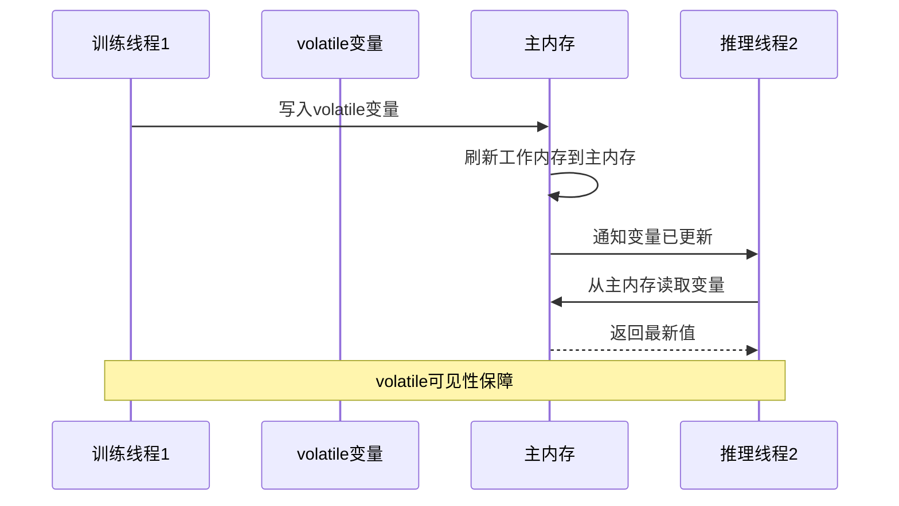

**AI参数共享架构图**：
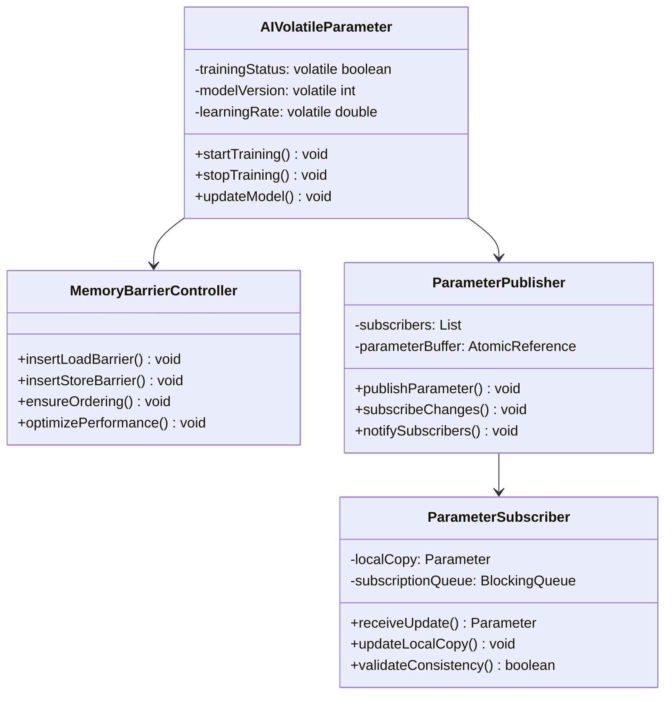

**72. 原子操作在AI梯度聚合中的应用优化？**

**面试场景**：高性能计算专家面试，考察原子操作

**口语化答案**：
原子操作在AI梯度聚合中提供无锁的并发安全更新，显著提升大规模并行训练的性能。

**核心设计思路**：
利用AtomicReference、AtomicLong等原子类实现梯度的高效聚合。采用LongAdder等高性能原子类减少竞争开销。设计分片聚合策略，将梯度按分片原子更新，最后合并结果。结合CAS操作实现复杂的数据结构更新，如梯度统计、收敛判断等。

**梯度原子聚合优化图**：
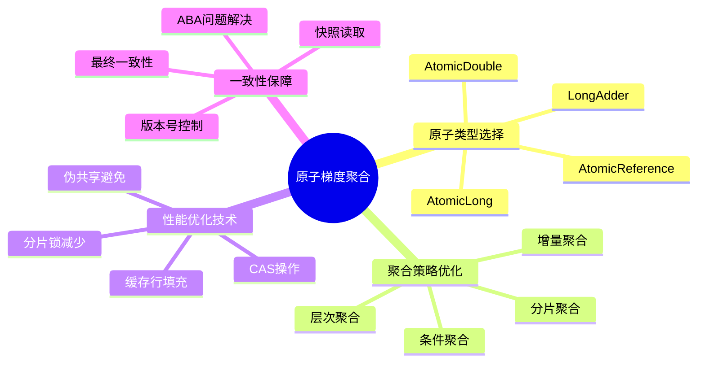

**AI梯度聚合性能对比图**：
```mermaid
radarChart
    title 梯度聚合方式性能对比
    axis 并发性能, 内存开销, 实现复杂度, 一致性保证, 扩展性, 容错能力

    "synchronized同步" : 3, 5, 4, 9, 4, 7
    "Atomic原子类" : 7, 6, 6, 8, 8, 8
    "LongAdder高性能" : 9, 7, 5, 7, 9, 7
    "分片聚合" : 10, 8, 8, 6, 10, 9
    "无锁CAS" : 10, 9, 9, 5, 10, 8
```

**80. 线程通信在AI流水线任务协调中的高级应用？**

**面试场景**：AI系统架构师面试，考察线程通信

**口语化答案**：
线程通信机制在AI流水线任务协调中实现高效的数据传递和状态同步，是构建复杂AI系统的关键。

**核心设计思路**：
设计多阶段的AI处理流水线，每个阶段由专门的线程处理。通过BlockingQueue实现阶段间的数据传递，控制背压和流量。使用CountDownLatch、CyclicBarrier等同步工具协调多阶段任务的启动和完成。利用Exchanger实现线程间的大量数据交换。实现优雅的停机机制和错误恢复策略。

**AI流水线任务协调架构图**：
```mermaid
graph TB
    A[AI数据输入] --> B[数据预处理线程]
    B --> C[特征提取线程]
    C --> D[模型推理线程]
    D --> E[结果后处理线程]
    E --> F[结果输出]

    B --> B1[BlockingQueue<br/>数据缓冲]
    C --> C1[CountDownLatch<br/>阶段同步]
    D --> D1[CyclicBarrier<br/>批量协调]
    E --> E1[Exchanger<br/>数据交换]

    B1 --> C
    C1 --> D
    D1 --> E
    E1 --> F

    Note over A,F: AI流水线线程协调
```

**线程通信机制选择矩阵图**：
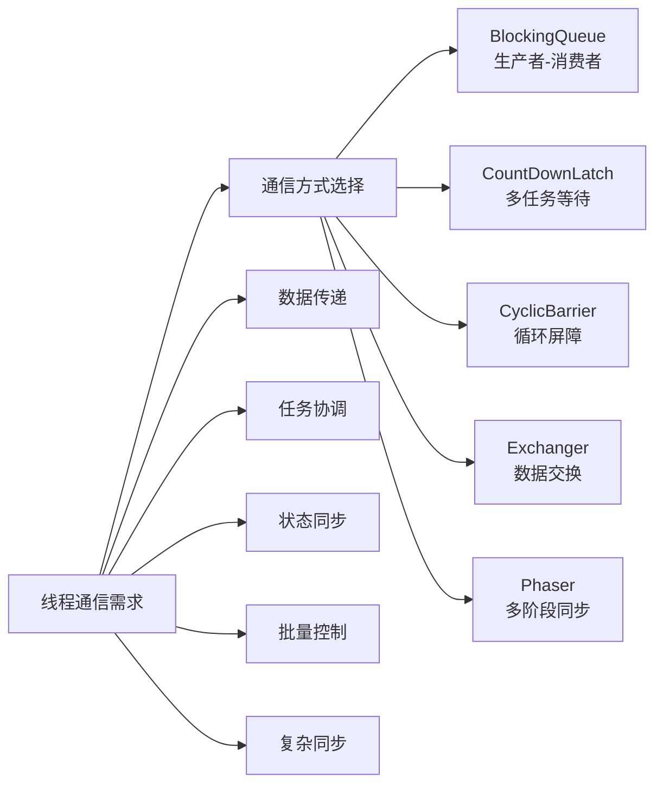

**81. AI系统中的线程池如何进行性能调优和监控？**

**面试场景**：AI性能优化专家面试，考察线程池调优

**口语化答案**：
AI系统中的线程池调优需要考虑任务特性、硬件资源和性能目标，建立完善的监控和调优机制。

**核心设计思路**：
根据AI任务的CPU密集型和I/O密集型特征，动态调整线程池大小。监控线程池的队列长度、活跃线程数、任务完成时间等关键指标。实现自适应的线程池调优策略，根据负载情况自动扩缩容。建立告警机制，及时发现和处理线程池异常。

**AI线程池性能调优策略图**：
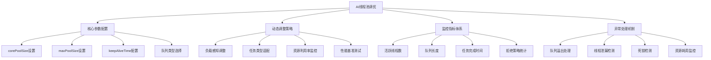

**AI线程池监控 dashboard 图**：
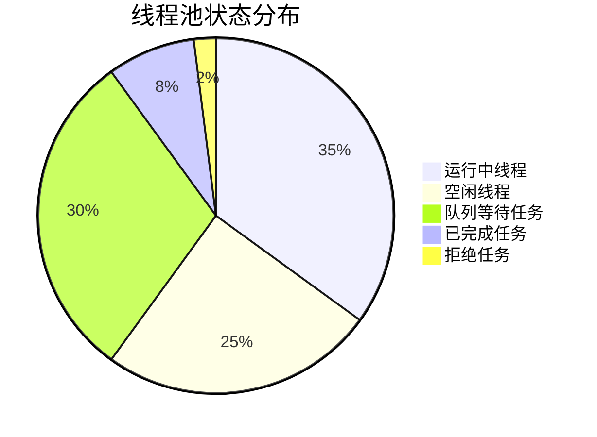

---

## 总结

多线程并发编程在AI系统中的应用需要掌握：

1. **线程模型设计**：根据AI任务特性选择合适的线程创建和管理策略
2. **锁机制优化**：平衡一致性和性能，选择最优的同步策略
3. **volatile与原子操作**：保障可见性，实现高效的并发安全更新
4. **线程通信协调**：构建高效的AI处理流水线和任务协调机制
5. **线程池调优**：动态调整和监控，最大化系统吞吐量和响应性能

通过系统的并发编程优化策略，AI系统可以获得更好的并发处理能力和资源利用效率。