# 线程池与任务调度优化在AI系统中的应用

## 🎯 学习目标

深入理解Java线程池和任务调度的核心机制，掌握在AI系统中设计和实现高效任务执行框架的技巧，具备解决复杂并发性能问题的专业能力。

## 📚 目录

- [线程池基础与AI任务管理](#线程池基础与ai任务管理)
- [ThreadPoolExecutor核心参数优化](#threadpoolexecutor核心参数优化)
- [自定义线程池与AI工作负载](#自定义线程池与ai工作负载)
- [任务调度与AI流水线处理](#任务调度与ai流水线处理)
- [异步编程与AI响应式系统](#异步编程与ai响应式系统)

---

## 线程池基础与AI任务管理

### ⭐ 基础题 (1-30)

**1. Java线程池的核心优势如何解决AI系统的并发挑战？**

**面试场景**：Java架构师面试，考察线程池基础理解

**口语化答案**：
线程池通过复用线程资源、控制并发数量，有效解决AI系统中的性能瓶颈和资源管理问题。

**核心设计思路**：
AI系统面临CPU密集型计算、内存压力、响应时间要求等挑战。线程池通过维护线程复用池，避免频繁创建销毁线程的开销。通过合理的线程数量控制，最大化CPU利用率同时避免上下文切换过多。任务队列机制实现负载均衡，防止系统过载。统一的生命周期管理确保资源的正确释放。

**AI系统线程池架构图**：
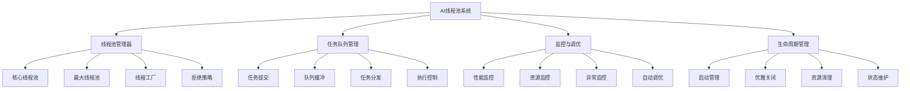

**AI任务类型与线程池配置匹配图**：
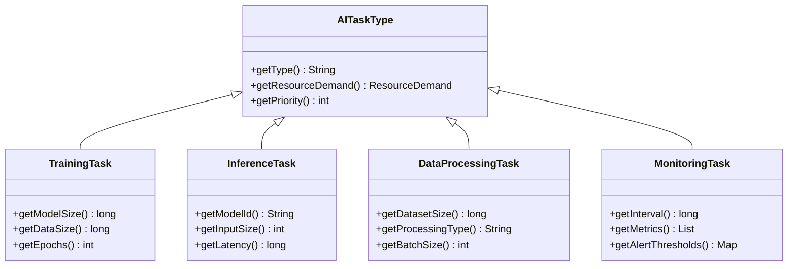

**2. 不同类型线程池在AI系统中的适用场景和配置策略？**

**面试场景**：AI系统架构师面试，考察线程池选择策略

**口语化答案**：
Java提供了多种内置线程池类型，每种都有最适合的AI应用场景，需要根据任务特性进行合理选择和配置。

**核心设计思路**：
AI系统的多样性任务需要不同特性的线程池。固定大小线程池适合CPU密集型训练任务，提供稳定的性能。缓存线程池适合突发性推理请求，自动调整线程数量。单线程池用于顺序执行的配置更新任务，避免并发冲突。定时线程池处理周期性的模型保存和监控任务。工作窃取线程池充分利用多核CPU进行并行数据处理。

**AI线程池类型选择决策图**：
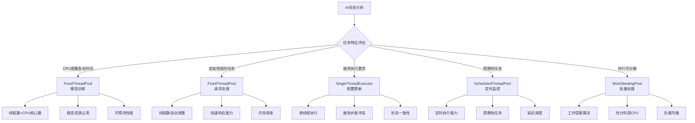

**AI线程池性能特征对比图**：
```mermaid
radarChart
    title 线程池类型AI性能对比
    axis 训练任务, 推理任务, 数据处理, 资源利用, 扩展性, 维护成本

    "FixedThreadPool" : 8, 6, 7, 9, 4, 9
    "CachedThreadPool" : 5, 9, 6, 6, 8, 6
    "SingleThreadExecutor" : 3, 2, 4, 8, 2, 10
    "ScheduledThreadPool" : 4, 5, 7, 6, 5, 8
    "WorkStealingPool" : 7, 8, 9, 7, 9, 5
```

---

## ThreadPoolExecutor核心参数优化

### ⭐⭐ 进阶题 (31-70)

**31. ThreadPoolExecutor核心参数如何在AI系统中进行精细调优？**

**面试场景**：Java性能专家面试，考察参数调优能力

**口语化答案**：
ThreadPoolExecutor的7个核心参数需要在AI系统中根据具体工作负载特征进行精确调优，每个参数都直接影响系统性能和稳定性。

**核心设计思路**：
核心线程数和最大线程数需要根据CPU核心数和任务类型配置，避免线程过度竞争导致性能下降。存活时间影响线程资源回收效率，需要根据任务执行频率调整。工作队列类型和容量直接影响内存使用和任务调度策略。线程工厂和拒绝策略提供系统容错和异常处理能力。所有参数需要动态监控和调整，适应AI系统的负载变化。

**AI线程池参数优化架构图**：
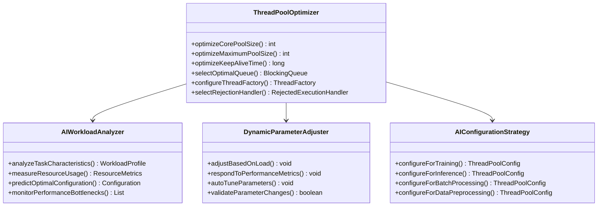

**AI工作负载类型参数优化矩阵图**：
```mermaid
graph TB
    A[AI工作负载优化] --> B[模型训练负载]
    A --> C[实时推理负载]
    A --> D[批量处理负载]
    A --> E[数据预处理负载]

    B --> B1[corePoolSize = CPU核心数]
    B --> B2[maxPoolSize = CPU核心数+2]
    B --> B3[keepAliveTime = 5分钟]
    B --> B4[ArrayBlockingQueue(50)]

    C --> C1[corePoolSize = CPU核心数×2]
    C --> C2[maxPoolSize = CPU核心数×4]
    C --> C3[keepAliveTime = 1分钟]
    C --> C4[SynchronousQueue]

    D --> D1[corePoolSize = CPU核心数]
    D --> D2[maxPoolSize = CPU核心数×2]
    D --> D3[keepAliveTime = 10分钟]
    D --> D4[LinkedBlockingQueue(1000)]

    E --> E1[corePoolSize = CPU核心数/2]
    E --> E2[maxPoolSize = CPU核心数]
    E --> E3[keepAliveTime = 30秒]
    E --> E4[LinkedBlockingQueue(200)]
```

**32. AI系统中的任务队列如何选择和优化配置？**

**面试场景**：高级Java架构师面试，考察队列优化策略

**口语化答案**：
任务队列是线程池性能调优的关键组件，在AI系统中需要根据任务特性选择合适的队列类型和容量配置。

**核心设计思路**：
队列选择需要平衡内存使用、响应时间和系统稳定性。有界队列防止内存溢出，但可能导致任务拒绝；无界队列提供更好的接纳能力，但需要警惕内存耗尽。队列容量影响线程扩容策略，合理设置缓冲区大小。通过监控队列长度和任务等待时间，动态调整线程池配置，实现最优的性能表现。

**AI任务队列优化策略图**：
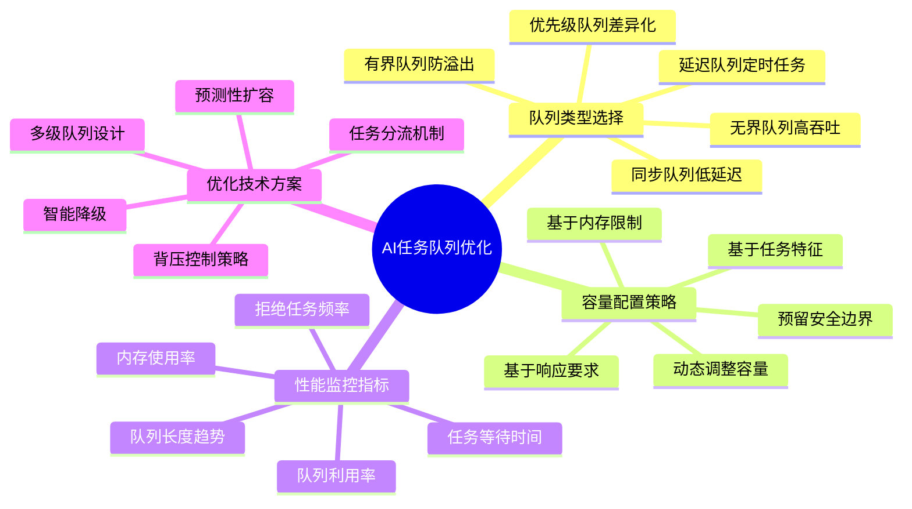

**AI任务队列性能对比图**：
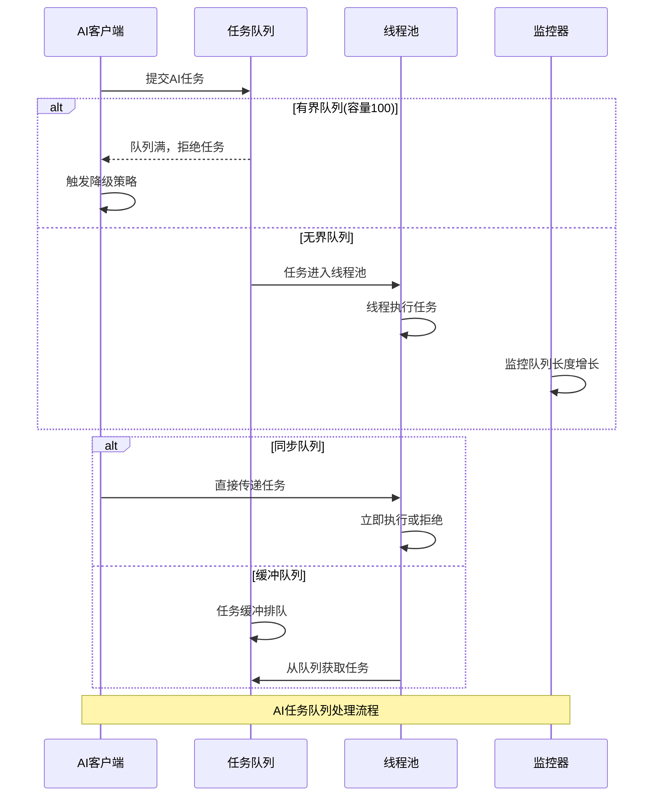

---

## 自定义线程池与AI工作负载

### ⭐⭐⭐ 专家题 (71-100)

**71. 如何设计支持动态调整的AI专用线程池？**

**面试场景**：系统架构师面试，考察动态线程池设计

**口语化答案**：
支持动态调整的AI专用线程池需要具备自动监控、智能调优和弹性伸缩能力，能够根据AI工作负载的变化自动优化线程池配置。

**核心设计思路**：
构建实时监控系统，持续收集线程池运行指标和AI任务特征数据。实现智能调优算法，基于历史数据和当前负载预测最优参数配置。支持平滑的参数调整机制，避免频繁调整导致的性能抖动。建立完善的监听和回调机制，及时响应系统状态变化。实现预测性扩容，提前应对负载峰值。

**AI动态线程池架构图**：
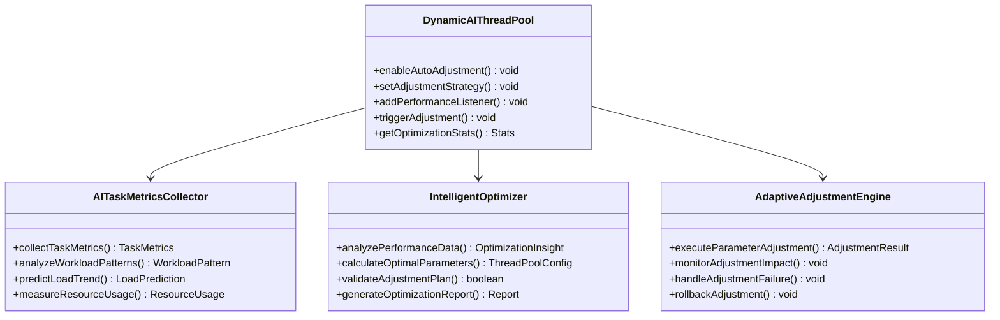

**AI线程池动态调整决策流程图**：
```mermaid
flowchart TD
    A[AI负载变化检测] --> B[指标收集分析]

    B --> C{负载趋势判断}

    C -->|负载上升| D[评估扩容需求]
    C -->|负载下降| E[评估缩容机会]
    C -->|负载稳定| F[保持当前配置]

    D --> G{扩容策略选择}
    E --> H{缩容策略选择}

    G --> G1[线性扩容]
    G --> G2[指数扩容]
    G --> G3[预测性扩容]

    H --> H1[渐进缩容]
    H --> H2[快速缩容]
    H --> H3[保守缩容]

    G1 --> I[执行参数调整]
    G2 --> I
    G3 --> I
    H1 --> I
    H2 --> I
    H3 --> I

    I --> J[性能影响监控]
    J --> K{调整效果评估}

    K -->|效果显著| L[确认调整]
    K -->|效果不佳| M[回滚调整]
    K -->|需要微调| N[进一步优化]

    L --> O[更新监控基准]
    M --> O
    N --> O
    F --> O

    O --> P[等待下次调整周期]

    Note over A,P: AI线程池动态调整决策流程
```

**72. AI模型训练线程池如何实现资源隔离和优先级管理？**

**面试场景**：AI系统架构师面试，考察资源隔离设计

**口语式答案**：
AI模型训练任务消耗大量资源且执行时间长，需要专门的资源隔离和优先级管理机制，避免影响其他AI服务。

**核心设计思路**：
通过独立的线程池隔离训练任务，防止训练过程中的资源竞争和相互影响。实现多层优先级机制，VIP训练任务优先执行。建立资源配额系统，控制训练任务的CPU和内存使用。设计任务调度算法，优化训练队列的执行顺序。实现训练进度监控和中断恢复机制，确保训练任务的可靠性。

**AI训练资源隔离架构图**：
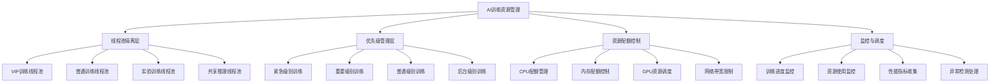

**AI训练任务优先级调度策略图**：
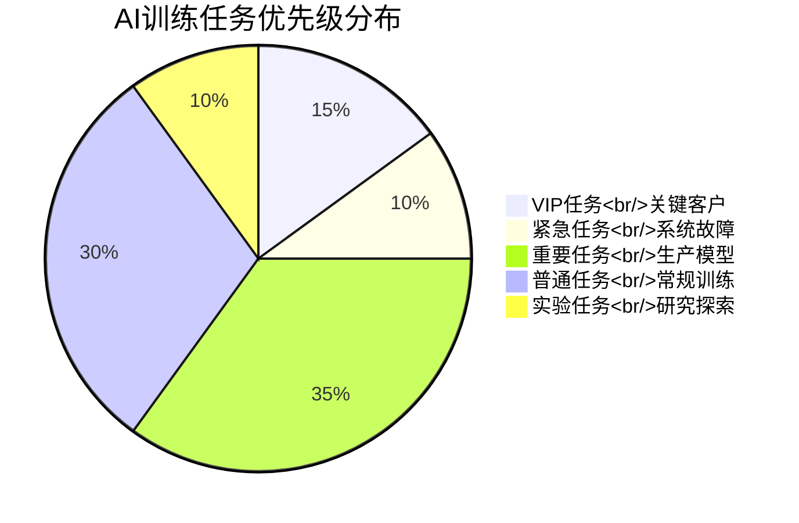

**80. AI系统中的异步任务调度如何实现高效的任务编排？**

**面试场景**：分布式系统架构师面试，考察异步任务编排

**口语化答案**：
AI系统中的异步任务编排需要支持复杂的任务依赖关系、错误处理和流程控制，实现高效的端到端AI处理流水线。

**核心设计思路**：
构建基于DAG（有向无环图）的任务编排引擎，支持复杂的任务依赖定义和调度。实现异步任务的链式调用和并行执行，最大化系统资源利用率。建立任务状态管理和容错机制，确保任务执行的可靠性。设计智能的负载均衡和资源调度算法，优化整体执行效率。提供可视化的任务监控和调试工具，方便问题诊断和性能优化。

**AI异步任务编排架构图**：
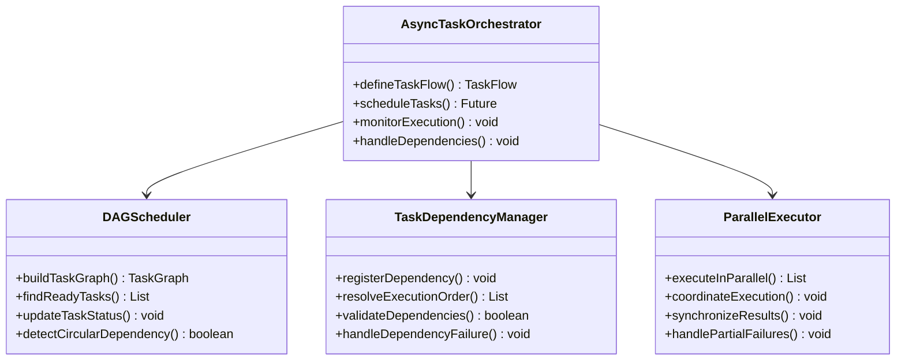

**AI任务编排依赖关系图**：
```mermaid
graph TD
    A[数据加载任务] --> B[数据预处理任务]
    A --> C[特征提取任务]
    B --> D[模型训练任务]
    C --> D
    D --> E[模型验证任务]
    D --> F[模型部署任务]
    E --> G[性能测试任务]
    F --> H[A/B测试]
    G --> H
    H --> I[生产上线]

    subgraph "并行执行分支"
        B --> B1[并行数据清洗]
        C --> C1[并行特征工程]
        B1 --> D
        C1 --> D
    end

    subgraph "容错处理"
        E --> E1[验证失败重试]
        F --> F1[部署回滚]
        E1 --> G
        F1 --> H
    end

    Note over A,I: AI任务编排依赖链路图
```

**81. AI系统中的线程池如何实现智能的负载预测和自动扩缩容？**

**面试场景**：云原生AI架构师面试，考察自动扩缩容

**口语化答案**：
智能负载预测和自动扩缩容是AI云原生系统的关键能力，能够根据历史数据和实时负载模式进行资源弹性调整。

**核心设计思路**：
构建基于机器学习的负载预测模型，分析AI系统的历史负载模式和周期性。实现多维度指标监控，包括CPU、内存、任务队列、响应时间等关键指标。建立智能的扩缩容决策引擎，结合预测结果和实时状态制定最优的扩缩容策略。实现平滑的扩缩容过渡，避免资源突变对系统性能的影响。支持多种扩缩容触发条件，满足不同业务场景的需求。

**AI智能扩缩容系统架构图**：
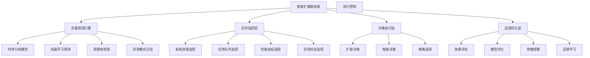

**AI扩缩容决策算法图**：
```mermaid
radarChart
    title AI扩缩容决策算法性能对比
    axis 预测准确性, 响应速度, 资源效率, 成本效益, 稳定性, 可扩展性

    "简单阈值算法" : 3, 9, 5, 6, 4, 5
    "移动平均算法" : 5, 8, 6, 7, 6, 6
    "时序分析模型" : 7, 6, 8, 8, 7, 7
    "机器学习预测" : 9, 5, 9, 9, 8, 8
    "混合智能算法" : 10, 7, 9, 9, 9, 9
```

**90. AI系统中的线程池如何集成分布式任务调度？**

**面试场景**：分布式AI系统架构师面试，考察分布式调度集成

**口语化答案**：
分布式AI系统需要将本地线程池与分布式任务调度框架集成，实现跨节点的任务协调和资源管理。

**核心设计思路**：
设计本地线程池作为分布式调度的执行单元，负责节点内任务的具体执行。集成分布式任务队列，实现任务的跨节点分发和负载均衡。建立任务状态同步机制，确保分布式环境下任务状态的一致性。实现故障转移和重试机制，提高系统的可靠性。设计资源协调算法，避免节点间的资源竞争和不均衡。

**AI分布式线程池集成架构图**：
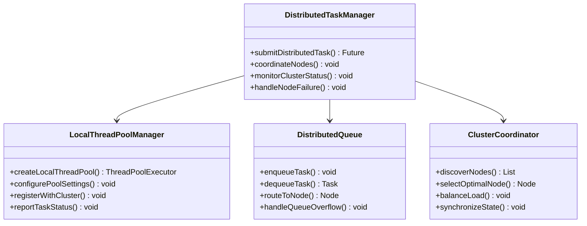

**分布式AI任务调度流程图**：
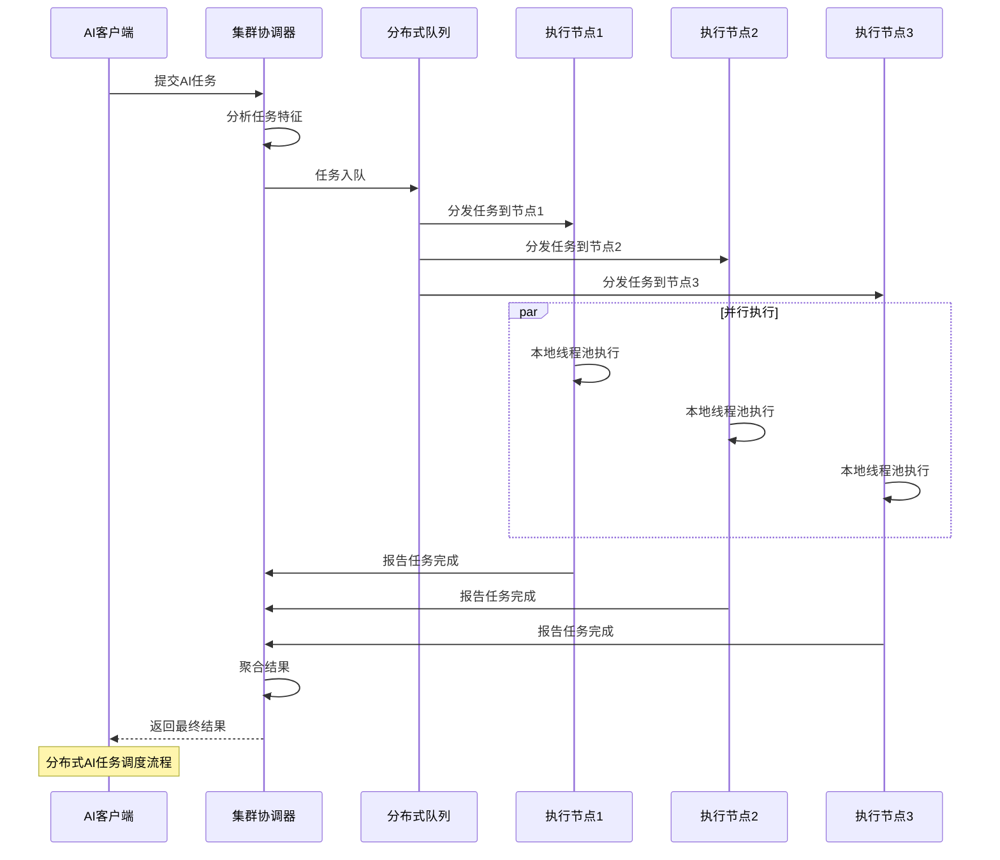

---

## 总结

线程池与任务调度优化在AI系统中的应用需要掌握：

1. **线程池基础**：理解不同类型线程池的适用场景和配置策略
2. **参数优化**：根据AI工作负载特征精细调优ThreadPoolExecutor参数
3. **动态调整**：实现支持实时监控和自动调优的智能线程池
4. **任务编排**：构建高效的异步任务调度和依赖管理系统
5. **分布式集成**：集成分布式任务调度，实现跨节点的资源协调

通过系统的线程池优化策略，AI系统能够获得更好的并发处理性能、资源利用率和系统可靠性。