# 设计模式在AI系统中的应用与架构优化

## 🎯 学习目标

深入理解设计模式在AI系统中的核心应用，掌握在AI项目中运用设计模式解决架构问题的专业能力，具备设计可扩展、可维护AI系统的架构思维。

## 📚 目录

- [创建型模式与AI系统构建](#创建型模式与ai系统构建)
- [结构型模式与AI组件设计](#结构型模式与ai组件设计)
- [行为型模式与AI流程控制](#行为型模式与ai流程控制)
- [并发模式与AI系统优化](#并发模式与ai系统优化)
- [架构模式与AI系统设计](#架构模式与ai系统设计)

---

## 创建型模式与AI系统构建

### ⭐ 基础题 (1-30)

**1. 工厂模式如何优化AI模型和算法的创建？**

**面试场景**：Java架构师面试，考察工厂模式应用

**口语化答案**：
工厂模式在AI系统中通过统一的创建接口管理复杂的AI组件实例化，提高系统的灵活性和可扩展性。

**核心设计思路**：
AI系统需要创建多种类型的模型、算法和处理器。工厂模式通过抽象工厂接口，隐藏具体创建逻辑，支持配置驱动的对象创建。当添加新的AI算法时，只需要扩展工厂类，无需修改客户端代码。这种设计支持插件化架构，便于系统的扩展和维护。

**AI工厂模式架构图**：
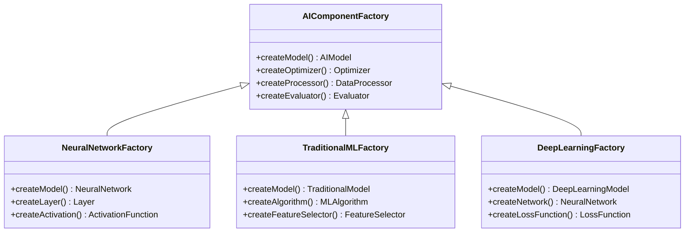

**AI组件创建决策流程图**：
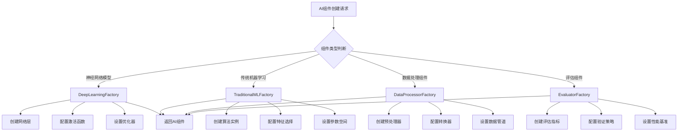

**2. 建造者模式如何构建复杂的AI模型配置？**

**面试场景**：AI系统架构师面试，考察建造者模式

**口语化答案**：
建造者模式通过链式调用的方式，让AI模型的复杂配置过程变得直观、可控且类型安全。

**核心设计思路**：
AI模型通常有大量配置参数，直接通过构造函数会导致参数列表过长且难以维护。建造者模式将配置过程分解为多个步骤，每个步骤设置特定参数并提供流畅的API。在build()方法中统一验证参数合法性，确保构建的模型配置正确。这种模式支持不可变对象创建，保证线程安全。

**AI模型建造者模式设计图**：
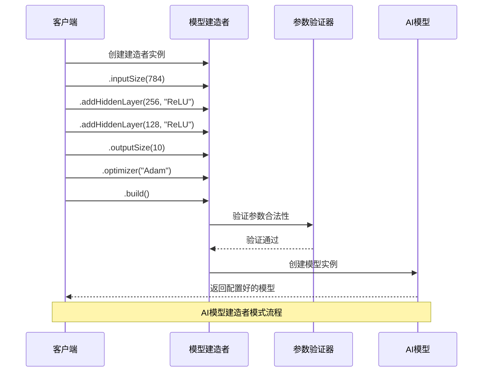

**AI模型配置复杂度对比图**：
```mermaid
radarChart
    title 模型配置方式对比
    axis 可读性, 可维护性, 类型安全, 扩展性, 复杂度控制, 线程安全

    "构造函数方式" : 3, 2, 4, 2, 2, 3
    "Setter方法" : 5, 4, 3, 5, 3, 2
    "建造者模式" : 9, 8, 9, 8, 9, 9
    "配置文件" : 7, 6, 2, 7, 6, 8
    "注解配置" : 8, 7, 6, 9, 7, 7
```

---

## 结构型模式与AI组件设计

### ⭐⭐ 进阶题 (31-70)

**31. 适配器模式如何集成不同AI框架和算法？**

**面试场景**：AI系统集成专家面试，考察适配器模式应用

**口语化答案**：
适配器模式在AI系统中解决不同框架、算法和接口之间的兼容性问题，实现系统的灵活集成。

**核心设计思路**：
AI系统往往需要集成多个框架和算法库，它们可能具有不同的接口和数据格式。适配器模式通过创建适配器类，将不兼容的接口转换为统一的标准接口。支持框架的透明切换，便于系统的升级和维护。实现数据格式的自动转换，确保不同组件间的无缝协作。

**AI框架适配器架构图**：
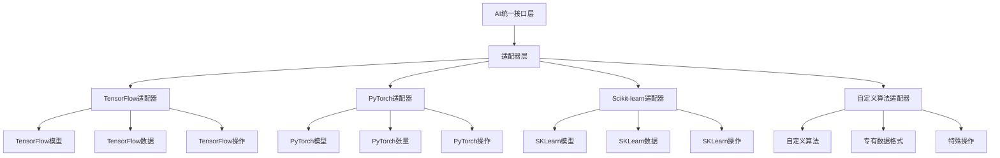

**AI算法适配策略图**：
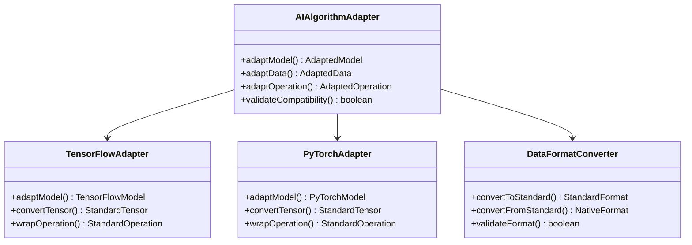

**32. 装饰器模式如何扩展AI模型功能？**

**面试场景**：AI框架架构师面试，考察装饰器模式

**口语化答案**：
装饰器模式在不修改原有AI模型的基础上，动态地添加新功能，如缓存、监控、日志等横切关注点。

**核心设计思路**：
AI模型的核心功能是推理或训练，但往往需要附加功能如性能监控、结果缓存、输入验证、日志记录等。装饰器模式通过包装原有模型，透明地添加这些功能。支持装饰器的组合使用，灵活构建功能增强链。保持模型接口的一致性，客户端代码无需修改。

**AI模型装饰器架构图**：
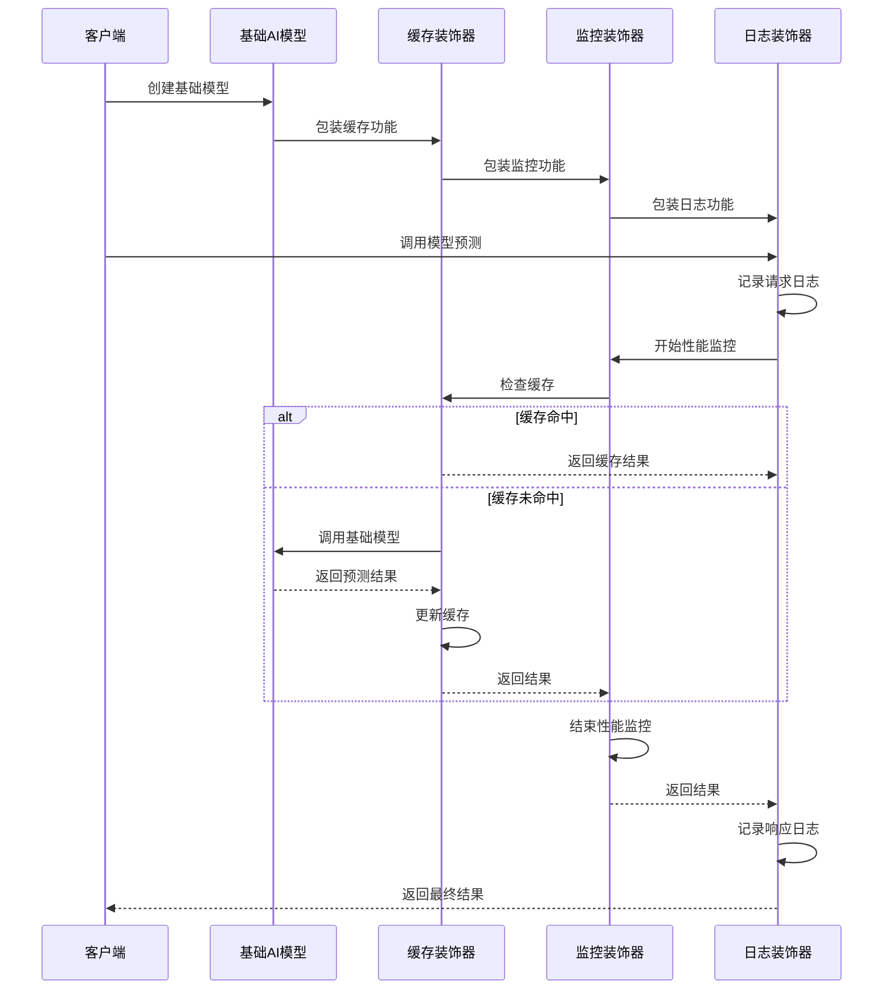

**AI模型装饰器功能组合图**：
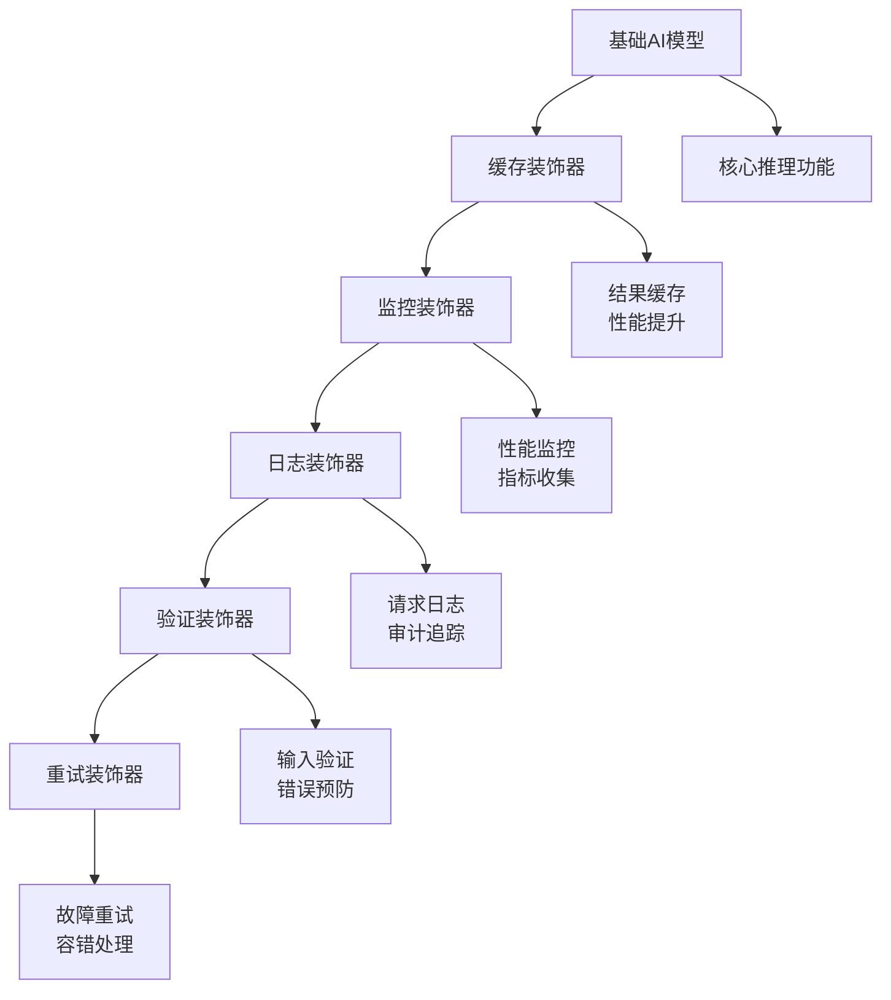

---

## 行为型模式与AI流程控制

### ⭐⭐⭐ 专家题 (71-100)

**71. 观察者模式如何实现AI训练过程的实时监控？**

**面试场景**：AI系统监控专家面试，考察观察者模式

**口语化答案**：
观察者模式在AI训练过程中实现事件驱动的监控机制，让多个监控组件能够实时响应训练状态变化。

**核心设计思路**：
AI训练过程会产生多种事件：训练开始、epoch结束、损失变化、模型保存、验证完成等。观察者模式定义主题-观察者关系，当训练状态发生变化时，自动通知所有注册的观察者。支持观察者的动态注册和注销，实现监控功能的灵活组合。解耦训练逻辑和监控逻辑，提高系统的模块化程度。

**AI训练监控架构图**：
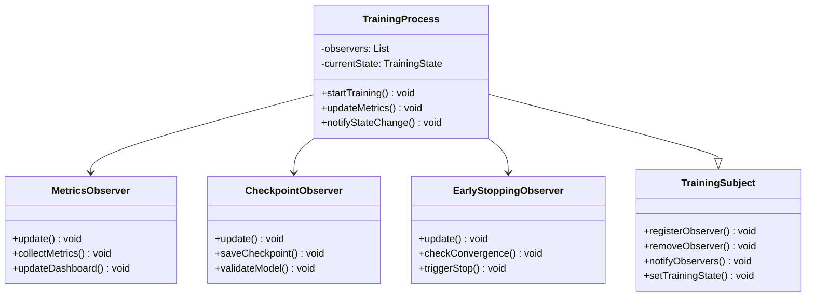

**AI训练事件流程图**：
```mermaid
flowchart TD
    A[训练过程开始] --> B[Epoch 1]
    B --> C[Batch 1-N]
    C --> D[Metrics Update]
    D --> E{Epoch结束?}

    E -->|否| C
    E -->|是| F[Epoch Metrics]
    F --> G[Validation]
    G --> H[Checkpoint Check]
    H --> I{Early Stop?}

    I -->|是| J[训练结束]
    I -->|否| K[Epoch N+1]
    K --> C

    D --> D1[通知Metrics观察者]
    F --> F1[通知Dashboard观察者]
    G --> G1[通知验证观察者]
    H --> H1[通知检查点观察者]

    Note over A,J: AI训练观察者事件流程
```

**72. 策略模式如何实现AI算法的动态切换？**

**面试场景**：AI算法架构师面试，考察策略模式

**口语化答案**：
策略模式将AI算法封装为独立的策略类，支持运行时动态切换算法，实现系统的灵活性和可扩展性。

**核心设计思路**：
AI系统中往往需要支持多种算法，如不同的优化器、正则化方法、特征选择算法等。策略模式定义算法接口，每种算法实现具体策略类。通过上下文类管理当前使用的策略，支持策略的动态切换。客户端与具体算法解耦，便于添加新算法而不影响现有代码。

**AI算法策略架构图**：
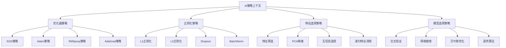

**AI策略切换决策流程图**：
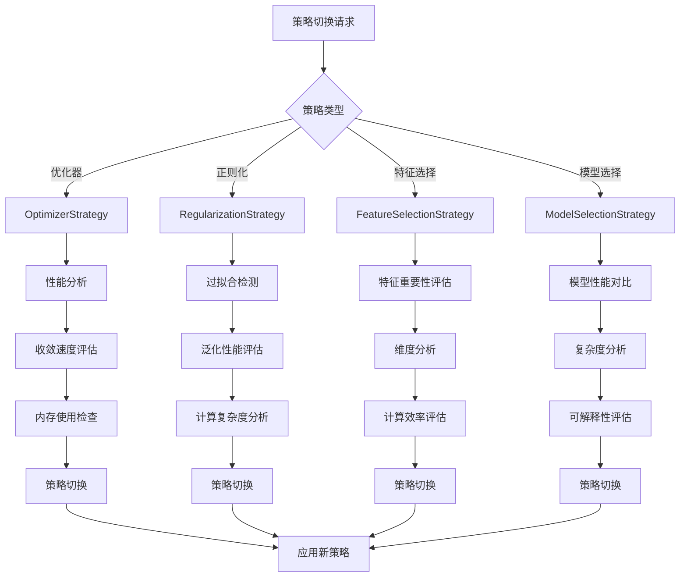

**80. 责任链模式如何构建AI数据处理流水线？**

**面试场景**：AI数据流水线架构师面试，考察责任链模式

**口语化答案**：
责任链模式在AI数据处理流水线中实现数据的链式处理，每个处理器负责特定的处理任务，支持灵活的流程配置。

**核心设计思路**：
AI数据处理包含多个步骤：数据清洗、特征提取、归一化、增强等。责任链模式将每个处理步骤封装为独立的处理器，形成处理链。数据在链上依次传递，每个处理器可以决定是否继续传递或直接返回。支持处理器的动态添加、移除和重排序，实现灵活的数据流水线配置。

**AI数据处理链架构图**：
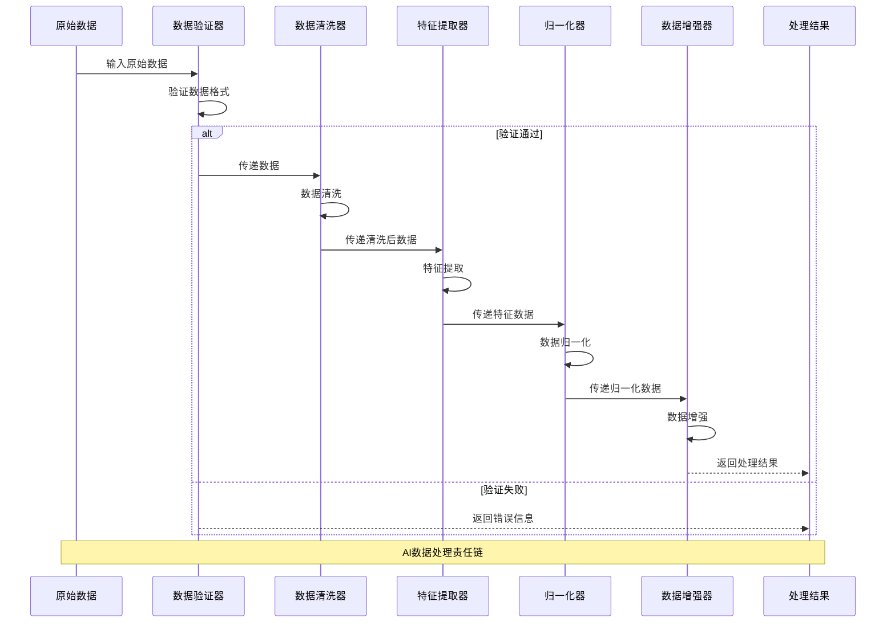

**AI处理链配置策略图**：
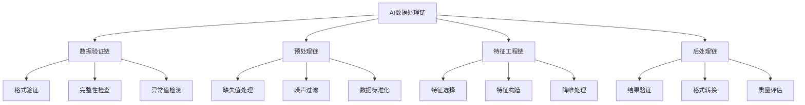

**81. 命令模式如何实现AI任务队列和批处理？**

**面试场景**：AI任务调度架构师面试，考察命令模式

**口语化答案**：
命令模式将AI任务封装为命令对象，支持任务的排队、批处理、撤销和重做，提高任务管理的灵活性。

**核心设计思路**：
AI系统中有各种类型的任务：训练任务、推理任务、数据预处理任务、模型评估任务等。命令模式将这些任务封装为命令对象，包含执行所需的所有信息。命令队列管理任务的排队和执行，支持优先级调度和批量处理。通过命令历史实现任务的撤销和重做功能，提供强大的任务管理能力。

**AI命令模式架构图**：
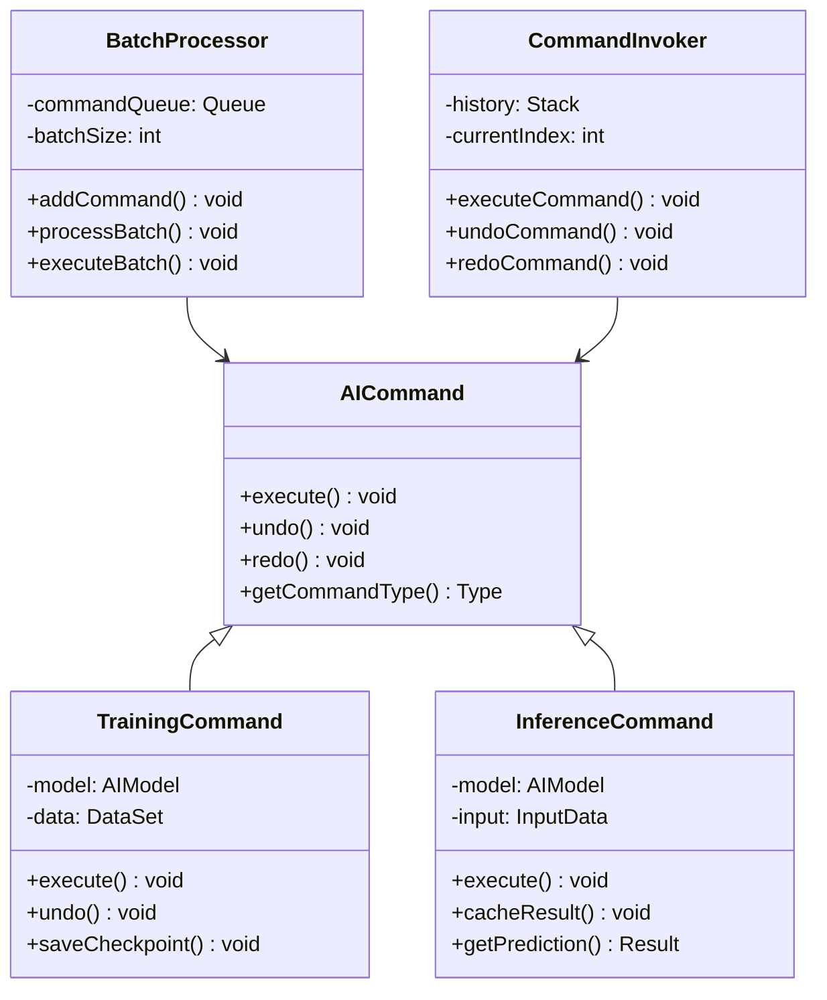

**AI任务批处理流程图**：
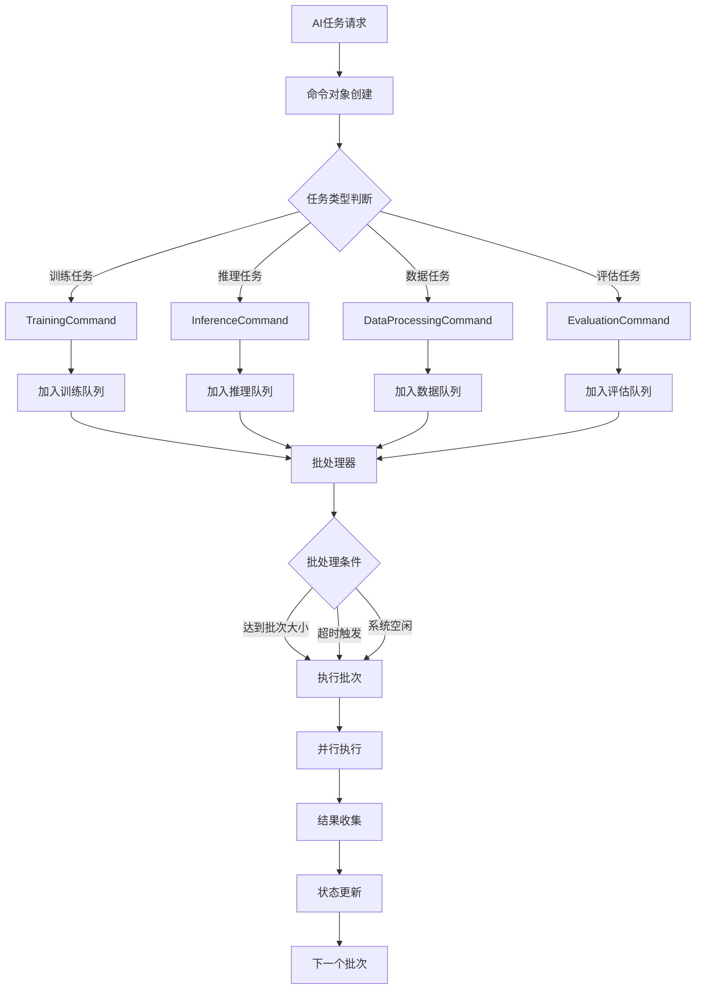

---

## 总结

设计模式在AI系统中的应用需要掌握：

1. **创建型模式**：优化AI组件的创建和管理，提高系统的灵活性
2. **结构型模式**：解决AI系统的集成和扩展问题，实现组件的透明组合
3. **行为型模式**：控制AI流程和行为，支持动态算法切换和事件驱动架构
4. **并发模式**：优化AI系统的并发性能和资源管理
5. **架构模式**：构建可扩展、可维护的AI系统架构

通过合理运用设计模式，AI系统能够获得更好的架构质量、扩展性和维护性。