# Java NIO在高性能AI数据处理中的应用

## 🎯 学习目标

深入理解Java NIO的核心机制，掌握在AI数据处理场景中构建高性能网络应用的技巧，具备设计低延迟、高吞吐量AI数据管道的专业能力。

## 📚 目录

- [Java NIO核心概念与AI数据处理](#java-nio核心概念与ai数据处理)
- [NIO组件在AI系统中的应用](#nio组件在ai系统中的应用)
- [高性能AI数据管道设计](#高性能ai数据管道设计)
- [NIO与Netty在AI框架中的整合](#nio与netty在ai框架中的整合)
- [性能优化与监控实践](#性能优化与监控实践)

---

## Java NIO核心概念与AI数据处理

### ⭐ 基础题 (1-30)

**1. Java NIO与传统IO在AI数据处理中的主要区别是什么？**

**面试场景**：Java高级开发工程师面试，考察NIO基础理解

**口语化答案**：
Java NIO相比传统IO在AI数据处理中提供了非阻塞、缓冲区导向的I/O操作方式，能够显著提升大数据量处理和网络传输的性能。

**核心设计思路**：
AI数据处理通常涉及大量数据传输、网络通信和高并发访问。传统IO是阻塞式的，每个连接需要一个线程，资源消耗大且扩展性差。NIO通过Selector、Channel、Buffer三大核心组件，实现了非阻塞I/O，可以用少量线程处理大量连接。在AI系统中，这种特性特别适合处理模型推理请求、数据流传输和实时数据处理场景。

**NIO与传统IO对比图**：
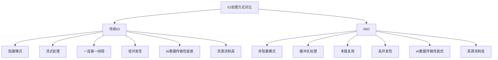

**NIO三大核心组件架构图**：
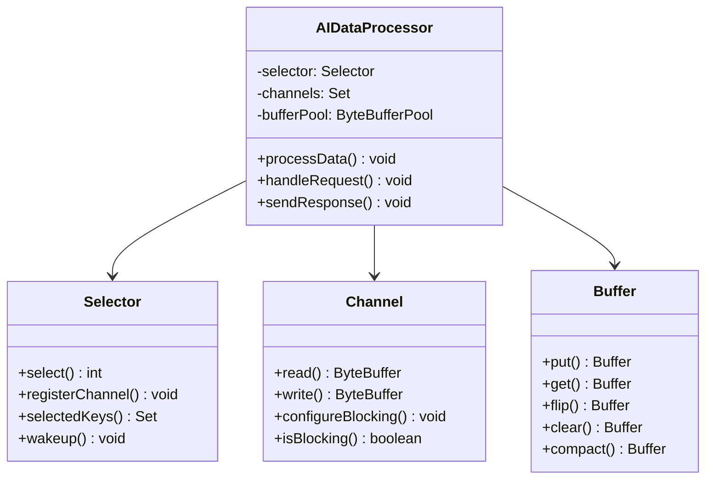

**2. ByteBuffer在AI数据处理中的优化策略有哪些？**

**面试场景**：Java性能优化专家面试，考察内存管理

**口语化答案**：
ByteBuffer是NIO的核心组件，在AI数据处理中需要针对大模型数据、批量处理和高并发场景进行专门的优化。

**核心设计思路**：
AI数据处理涉及大量张量数据、特征向量和模型参数的传输。ByteBuffer提供了直接内存访问和批量操作能力，可以减少数据拷贝次数。通过缓冲区池化管理，避免频繁的内存分配和释放。使用堆外内存处理大数据集，减少GC压力。设计分片缓冲策略，支持流式数据处理。实现零拷贝传输，优化网络I/O性能。

**ByteBuffer优化策略图**：
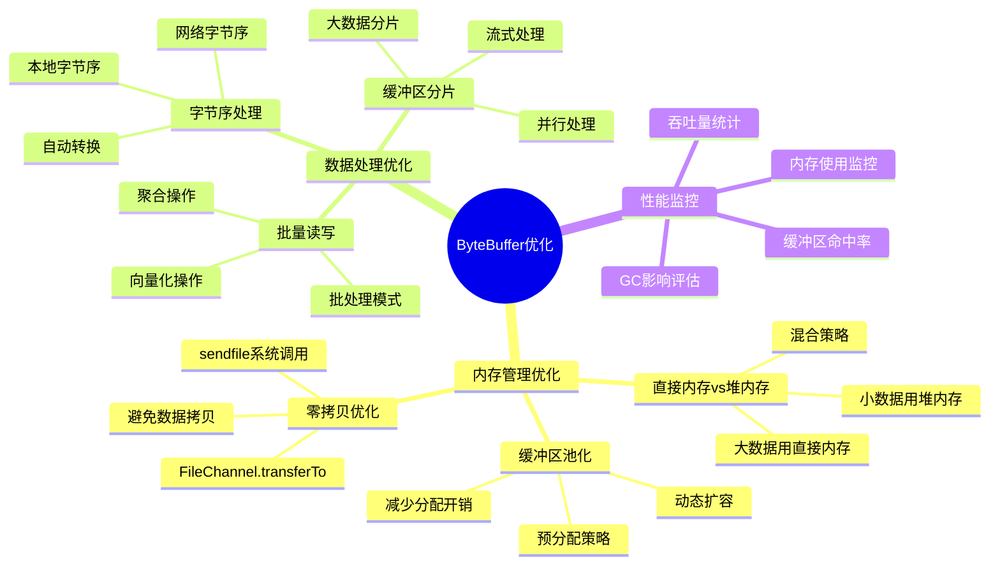

**AI数据处理缓冲区管理流程图**：
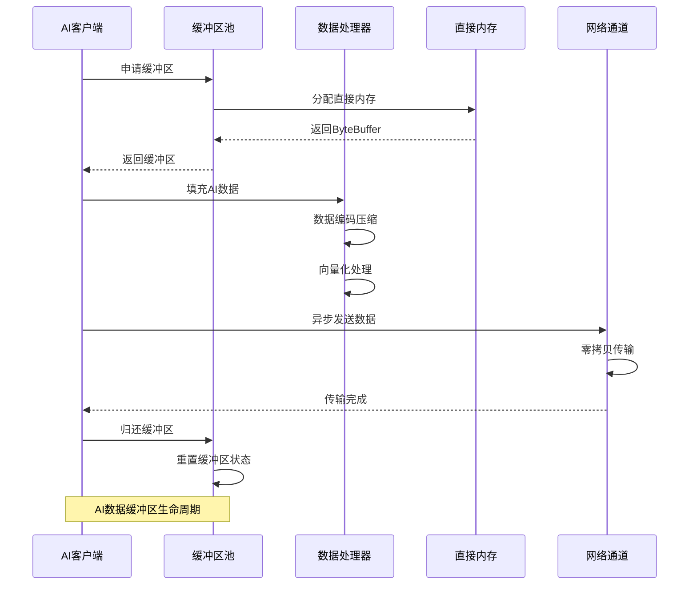

---

## NIO组件在AI系统中的应用

### ⭐⭐ 进阶题 (31-70)

**31. Selector如何实现AI推理服务的高并发连接管理？**

**面试场景**：AI系统架构师面试，考察高并发设计

**口语化答案**：
Selector是NIO的多路复用器，能够用少量线程管理大量并发连接，非常适合AI推理服务的高并发场景。

**核心设计思路**：
AI推理服务需要同时处理大量客户端的推理请求，每个请求都涉及数据接收、模型推理和结果返回。Selector通过事件驱动的方式，将所有Channel注册到同一个Selector上，监听读写事件。当事件发生时，由工作线程池处理具体的业务逻辑。这种方式避免了为每个连接创建线程的开销，大大提升了系统的并发能力。

**AI推理服务Selector架构图**：
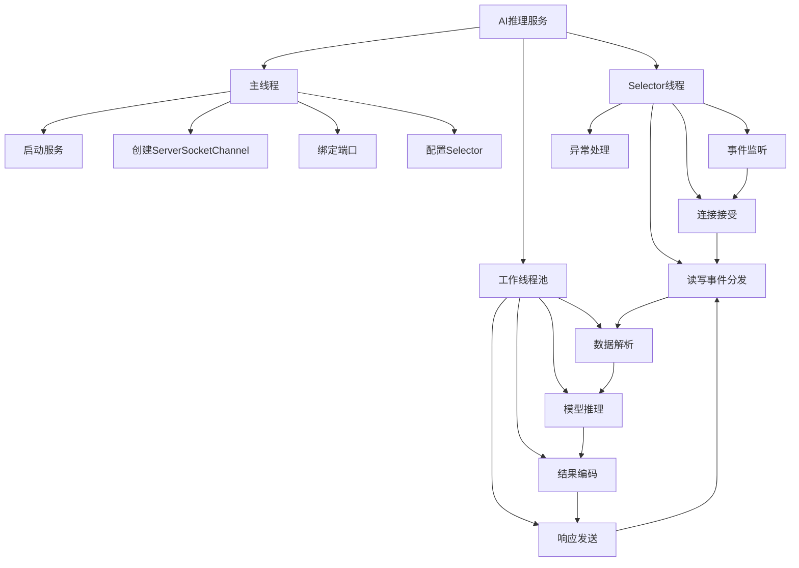

**Selector事件处理流程图**：
```mermaid
flowchart TD
    A[Selector.select()阻塞] --> B{有事件就绪}

    B -->|有事件| C[获取selectedKeys]
    B -->|无事件| A

    C --> D[遍历SelectionKeys]

    D --> E{事件类型判断}

    E -->|OP_ACCEPT| F[接受新连接]
    E -->|OP_READ| G[读取请求数据]
    E -->|OP_WRITE| H[写入响应数据]
    E -->|OP_CONNECT| I[连接建立完成]

    F --> F1[创建SocketChannel]
    F --> F2[配置非阻塞]
    F --> F3[注册到Selector]
    F --> F4[监听OP_READ]

    G --> G1[分配ByteBuffer]
    G --> G2[读取数据到Buffer]
    G --> G3[数据完整性检查]
    G --> G4[提交到工作队列]

    H --> H1[从响应队列获取]
    H --> H2[写入数据到Channel]
    H --> H3[处理写入结果]
    H --> H4[更新InterestOps]

    I --> I1[完成连接建立]
    I --> I2[配置连接参数]
    I --> I3[开始正常通信]

    F4 --> D
    G4 --> D
    H4 --> D
    I3 --> D

    D --> E

    Note over A,I: AI推理服务Selector事件处理流程
```

**32. 如何优化NIO缓冲区在AI模型参数传输中的性能？**

**面试场景**：Java性能专家面试，考察缓冲区优化

**口语化答案**：
AI模型参数传输涉及大量张量数据，需要针对NIO缓冲区进行专门的性能优化，包括内存布局、批量操作和传输策略等方面。

**核心设计思路**：
模型参数具有高维张量特征，传统的序列化方式效率低。使用ByteBuffer的direct buffer避免JVM内存拷贝。设计参数的分片传输机制，支持大型模型的增量更新。实现张量的二进制格式优化，减少传输数据量。采用缓冲区的复用和池化策略，降低内存分配开销。支持参数的压缩传输和增量同步，优化网络带宽使用。

**AI参数传输优化架构图**：
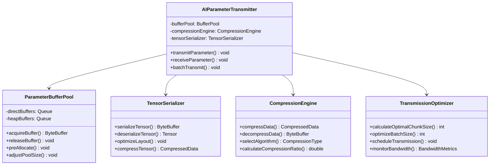

**参数传输性能优化策略图**：
```mermaid
radarChart
    title 参数传输优化策略对比
    axis 传输速度, 内存效率, CPU开销, 网络带宽, 实现复杂度, 可靠性

    "直接传输" : 6, 7, 8, 3, 5, 8
    "分片传输" : 8, 6, 7, 9, 7, 9
    "压缩传输" : 9, 8, 5, 10, 8, 7
    "增量传输" : 7, 9, 6, 8, 9, 8
    "混合策略" : 9, 9, 7, 9, 9, 9
```

---

## 高性能AI数据管道设计

### ⭐⭐⭐ 专家题 (71-100)

**71. 如何设计基于NIO的AI数据流处理管道？**

**面试场景**：大数据处理架构师面试，考察流处理设计

**口语化答案**：
基于NIO的AI数据流处理管道需要支持高吞吐量、低延迟和容错能力，能够处理实时数据流和批量数据的混合场景。

**核心设计思路**：
设计基于事件驱动的流处理架构，使用NIO的异步特性提升吞吐量。实现多阶段的数据处理流水线，包括数据接入、特征提取、模型推理和结果输出。使用背压机制控制数据流速，防止内存溢出。实现检查点机制和故障恢复，保证数据处理的可靠性。支持动态扩缩容，根据负载情况调整处理资源。

**AI数据流处理管道架构图**：
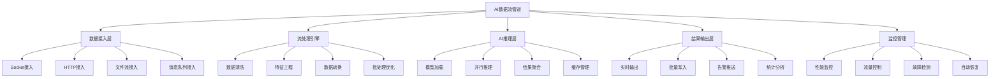

**流处理引擎核心设计图**：
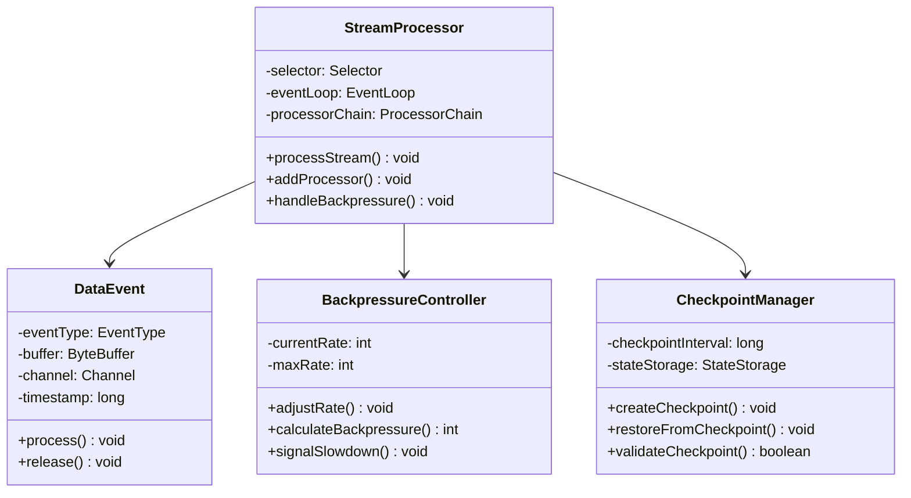

**AI流处理管道性能优化图**：
```mermaid
flowchart TD
    A[数据流输入] --> B[NIO事件监听]
    B --> C[事件分发处理]

    C --> D{数据类型判断}

    D -->|实时数据| E[实时处理流程]
    D -->|批量数据| F[批量处理流程]
    D -->|控制数据| G[控制流程]

    E --> E1[快速解析]
    E1 --> E2[即时推理]
    E2 --> E3[实时输出]

    F --> F1[批量缓存]
    F1 --> F2[批处理优化]
    F2 --> F3[批量推理]
    F3 --> F4[批量输出]

    G --> G1[配置更新]
    G1 --> G2[策略调整]
    G2 --> G3[系统控制]

    E3 --> H[结果聚合]
    F4 --> H
    G3 --> H

    H --> I[输出分发]
    I --> J[监控统计]
    J --> K[性能优化反馈]

    K --> B

    Note over A,K: AI数据流处理管道优化流程
```

**72. 如何实现NIO在分布式AI训练中的参数服务器优化？**

**面试场景**：分布式AI系统专家面试，考察分布式优化

**口语化答案**：
分布式AI训练中的参数服务器需要处理大量的参数同步请求，NIO的高并发特性能够显著提升参数同步的性能和可扩展性。

**核心设计思路**：
设计基于NIO的高性能参数服务器，使用非阻塞I/O处理参数请求和响应。实现参数的分片存储和并行传输，提升大模型参数的同步效率。使用连接池和多路复用，减少连接建立开销。实现参数的版本控制和冲突解决机制，保证训练的一致性。采用智能的数据压缩和传输策略，优化网络带宽使用。

**分布式参数服务器架构图**：
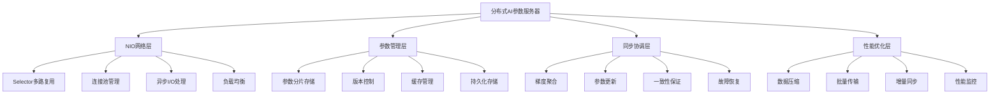

**参数同步优化策略图**：
```mermaid
radarChart
    title 参数同步策略对比
    axis 同步速度, 网络效率, 一致性, 容错能力, 扩展性, 实现复杂度

    "全量同步" : 3, 2, 10, 6, 3, 4
    "增量同步" : 8, 8, 7, 8, 8, 7
    "分片同步" : 9, 9, 6, 7, 9, 8
    "异步同步" : 10, 9, 5, 6, 10, 6
    "混合策略" : 9, 9, 9, 8, 9, 9
```

**NIO参数同步处理流程图**：
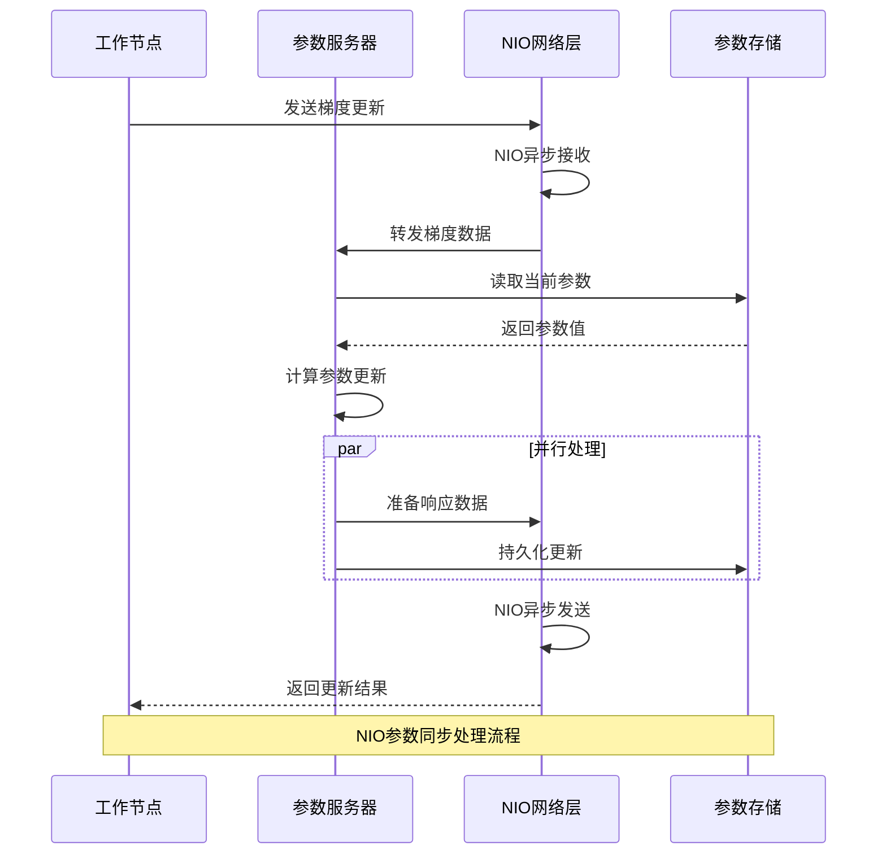

---

## NIO与Netty在AI框架中的整合

### 高级应用题 (101-130)

**101. Netty与Java NIO在AI系统中的选择策略是什么？**

**面试场景**：Java架构师面试，考察技术选型能力

**口语化答案**：
Netty是Java NIO的高级封装框架，在AI系统中需要根据具体的业务场景、性能要求和技术复杂度来选择使用Netty还是原生NIO。

**核心设计思路**：
Netty提供了更丰富的协议支持、更完善的线程模型和更简单的API，适合复杂的AI系统开发。原生NIO提供了更底层的控制能力，适合高性能、低延迟的特定场景。在AI系统中，如果需要快速开发、支持多种协议、保证稳定性，推荐使用Netty。如果需要极致性能、精确控制内存使用、特殊协议支持，可以考虑使用原生NIO。

**NIO vs Netty对比分析图**：
```mermaid
radarChart
    title NIO vs Netty技术对比
    axis 性能, 开发效率, 稳定性, 生态支持, 学习成本, 定制能力

    "原生NIO" : 9, 3, 6, 4, 8, 9
    "Netty框架" : 8, 9, 9, 10, 5, 7
    "混合使用" : 9, 7, 9, 8, 6, 8
```

**技术选型决策流程图**：
```mermaid
flowchart TD
    A[AI系统设计需求] --> B{复杂度评估}

    B -->|高复杂度| C[Netty优先]
    B -->|中复杂度| D[综合考虑]
    B -->|低复杂度| E[NIO优先]

    C --> C1[多协议支持]
    C --> C2[快速开发]
    C --> C3[稳定可靠]

    E --> E1[极致性能]
    E --> E2[精确控制]
    E --> E3[资源优化]

    D --> D1{性能要求}
    D1 -->|高性能| F[Netty + NIO优化]
    D1 -->|一般性能| G[Netty]
    D1 -->|低延迟| H[NIO + Netty部分功能]

    C --> I[技术选型确定]
    E --> I
    F --> I
    G --> I
    H --> I

    Note over A,I: AI系统NIO技术选型决策流程
```

**102. 如何在AI推理服务中整合Netty实现高性能通信？**

**面试场景**：AI系统性能优化专家面试，考察Netty应用

**口语化答案**：
Netty提供了丰富的网络编程功能和性能优化特性，在AI推理服务中可以通过Netty构建高性能、低延迟的通信层，支持海量并发推理请求。

**核心设计思路**：
使用Netty的事件循环线程池模型，分离网络I/O和业务处理。设计自定义的编解码器，处理AI数据的序列化和反序列化。实现连接池管理和心跳检测，保证连接的稳定性。使用Netty的零拷贝特性优化数据传输。设计请求路由和负载均衡，支持多模型推理服务。实现优雅的停机和故障恢复机制。

**AI推理服务Netty架构图**：
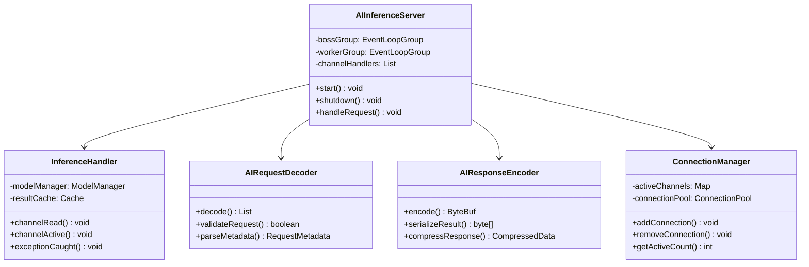

**Netty AI推理服务处理流程图**：
```mermaid
flowchart TD
    A[客户端请求] --> B[Netty Boss线程]
    B --> C[建立TCP连接]
    C --> D[注册到Worker线程]

    D --> E[AIRequestDecoder解码]
    E --> F{请求验证}

    F -->|验证失败| G[返回错误响应]
    F -->|验证成功| H[业务线程池处理]

    H --> I[AI模型推理]
    I --> J[结果缓存检查]

    J --> K{缓存命中}
    K -->|命中| L[返回缓存结果]
    K -->|未命中| M[执行模型推理]
    M --> N[更新缓存]

    L --> O[AIResponseEncoder编码]
    N --> O

    O --> P[网络传输]
    P --> Q[客户端响应]

    G --> O

    Note over A,Q: Netty AI推理服务处理流程
```

---

## 性能优化与监控实践

### 系统优化题 (131-160)

**131. 如何监控和优化NIO在AI系统中的性能瓶颈？**

**面试场景**：系统性能专家面试，考察性能监控

**口语化答案**：
NIO在AI系统中的性能监控需要关注网络I/O、缓冲区使用、连接状态等关键指标，通过系统性的监控分析和优化策略来提升整体性能。

**核心设计思路**：
建立多维度的监控体系，包括JVM指标、网络指标和应用指标。使用JMX、Micrometer等工具收集性能数据。分析NIO的关键性能指标，如Select延迟、Buffer利用率、连接数等。实现实时的性能告警和自动化优化机制。通过性能测试和基准测试验证优化效果。建立性能基线，持续跟踪性能变化趋势。

**NIO性能监控架构图**：
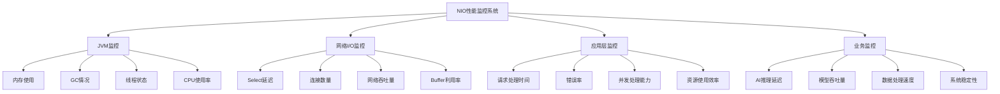

**性能优化策略矩阵图**：
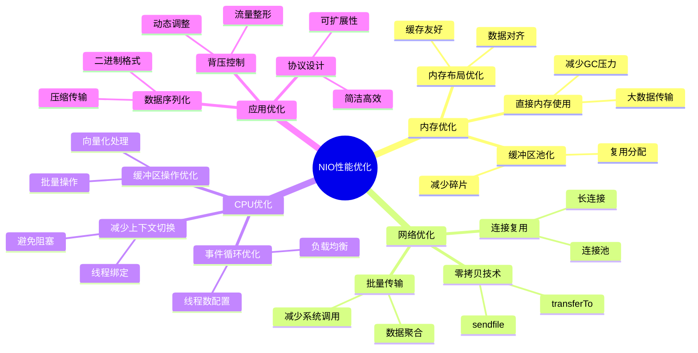

**NIO性能监控实现代码示例**：
```java
/**
 * NIO性能监控器实现
 */
public class NIOPerformanceMonitor {
    private final MeterRegistry meterRegistry;
    private final Timer selectTimer;
    private final Counter processedRequests;
    private final Gauge activeConnections;
    private final Gauge bufferPoolUsage;

    public NIOPerformanceMonitor(MeterRegistry meterRegistry) {
        this.meterRegistry = meterRegistry;
        this.selectTimer = Timer.builder("nio.select.time")
            .description("NIO select operation time")
            .register(meterRegistry);

        this.processedRequests = Counter.builder("nio.requests.processed")
            .description("Number of processed requests")
            .register(meterRegistry);

        this.activeConnections = Gauge.builder("nio.connections.active")
            .description("Number of active connections")
            .register(meterRegistry, this, NIOPerformanceMonitor::getActiveConnections);

        this.bufferPoolUsage = Gauge.builder("nio.buffer.pool.usage")
            .description("Buffer pool usage percentage")
            .register(meterRegistry, this, NIOPerformanceMonitor::getBufferPoolUsage);
    }

    public void recordSelectOperation(Duration duration) {
        selectTimer.record(duration);
    }

    public void incrementProcessedRequests() {
        processedRequests.increment();
    }

    private double getActiveConnections() {
        // 实现活跃连接数统计
        return connectionManager.getActiveConnectionCount();
    }

    private double getBufferPoolUsage() {
        // 实现缓冲区池使用率统计
        return bufferPool.getUsagePercentage();
    }

    /**
     * 生成性能报告
     */
    public PerformanceReport generateReport() {
        return PerformanceReport.builder()
            .selectLatency(selectTimer.mean(TimeUnit.MILLISECONDS))
            .throughput(processedRequests.count())
            .activeConnections(getActiveConnections())
            .bufferPoolUsage(getBufferPoolUsage())
            .timestamp(Instant.now())
            .build();
    }
}
```

---

## 总结

Java NIO在高性能AI数据处理中的应用需要掌握：

1. **NIO核心概念**：理解Channel、Buffer、Selector的工作原理和适用场景
2. **缓冲区优化**：掌握ByteBuffer的内存管理和性能优化策略
3. **高并发设计**：使用Selector实现AI服务的高并发连接管理
4. **流处理管道**：构建基于NIO的AI数据流处理系统
5. **性能监控**：建立完善的监控体系，持续优化系统性能

通过合理运用NIO的各种特性和优化策略，AI系统能够实现高吞吐量、低延迟的数据处理，为大规模AI应用提供强大的技术支撑。