# Netty在AI微服务架构中的高性能通信

## 🎯 学习目标

深入理解Netty网络框架在AI微服务架构中的核心应用，掌握构建高性能AI微服务通信系统的技巧，具备设计可扩展、高可用AI微服务架构的专业能力。

## 📚 目录

- [Netty核心架构与AI微服务通信](#netty核心架构与ai微服务通信)
- [AI微服务通信模式设计](#ai微服务通信模式设计)
- [Netty在AI推理服务中的应用](#netty在ai推理服务中的应用)
- [分布式AI系统网络优化](#分布式ai系统网络优化)
- [容错与监控体系建设](#容错与监控体系建设)

---

## Netty核心架构与AI微服务通信

### ⭐ 基础题 (1-30)

**1. Netty相比传统Web框架在AI微服务中的优势是什么？**

**面试场景**：Java架构师面试，考察Netty优势理解

**口语化答案**：
Netty提供了更底层、更高性能的网络通信能力，特别适合AI微服务中对低延迟、高吞吐量和复杂协议支持的需求。

**核心设计思路**：
AI微服务通常需要处理大量模型推理请求、参数同步和分布式训练通信。传统Web框架如Spring MVC虽然易用，但在网络I/O层面存在性能瓶颈。Netty基于NIO，提供了事件驱动、异步非阻塞的通信模型，能够用更少的线程处理更多的连接。支持自定义协议编解码，适合AI系统特有的数据格式。零拷贝技术减少内存开销，池化复用提升资源利用率。

**Netty与传统框架对比图**：
```mermaid
radarChart
    title Netty vs 传统框架性能对比
    axis 吞吐量, 延迟, 资源利用率, 协议灵活性, 开发复杂度, 生态系统

    "Netty" : 9, 9, 8, 10, 6, 7
    "Spring MVC" : 6, 5, 5, 3, 9, 10
    "Spring WebFlux" : 8, 7, 7, 5, 7, 9
    "Vert.x" : 9, 8, 8, 9, 7, 6
    "原生Servlet" : 4, 3, 3, 2, 8, 8
```

**Netty核心组件架构图**：
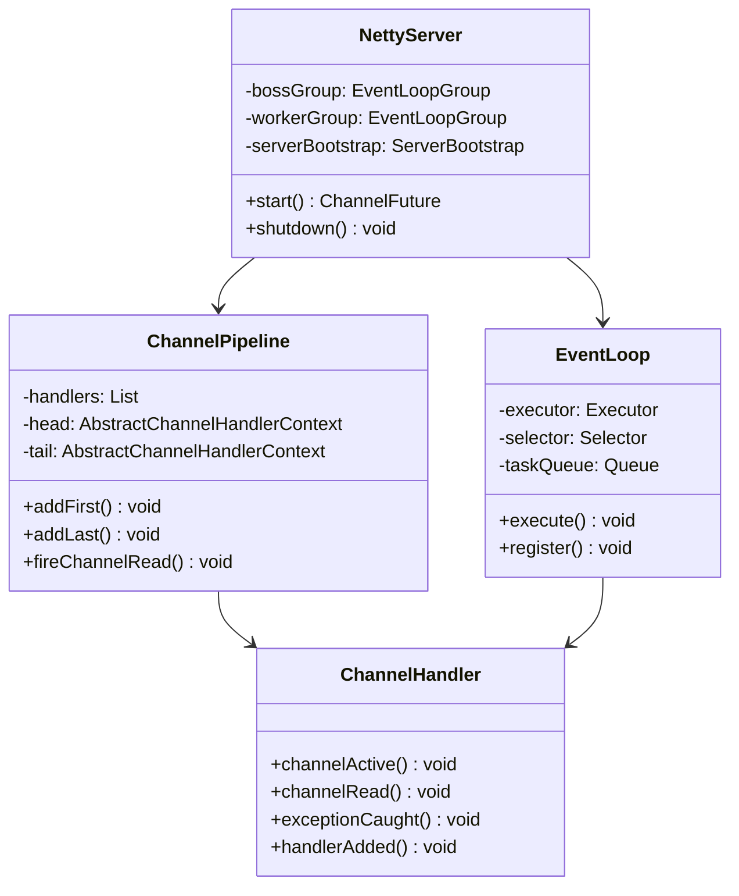

**2. Netty的线程模型如何支持AI微服务的高并发处理？**

**面试场景**：Java并发专家面试，考察Netty线程模型

**口语化答案**：
Netty的Reactor线程模型通过事件循环和非阻塞I/O，实现了高效的多线程并发处理，非常适合AI微服务的高并发场景。

**核心设计思路**：
Netty采用主从Reactor线程模型，Boss线程组负责处理连接建立，Worker线程组负责处理I/O操作。这种设计避免了传统一个连接一个线程的资源浪费。AI微服务可以利用这种模型，用少量线程处理大量并发推理请求。线程与Channel的绑定关系保证任务处理的线程安全性，避免锁竞争。通过合理的线程池配置和任务队列设计，最大化CPU利用率和系统吞吐量。

**Netty线程模型架构图**：
```mermaid
graph TB
    A[Netty线程模型] --> B[Boss EventLoopGroup]
    A --> C[Worker EventLoopGroup]
    A --> D[Business Thread Pool]

    B --> B1[接受新连接]
    B --> B2[注册到Worker]
    B --> B3[负载均衡分配]

    C --> C1[处理I/O事件]
    C --> C2[数据读写]
    C --> C3[协议编解码]
    C --> C4[事件分发]

    D --> D1[AI模型推理]
    D --> D2[业务逻辑处理]
    D --> D3[数据库操作]
    D --> D4[缓存操作]

    B1 --> B2
    B2 --> C1
    C4 --> D1

    note1 "1个Boss线程负责Accept"
    note2 "多个Worker线程负责I/O"
    note3 "业务线程处理CPU密集任务"
```

**AI微服务线程优化策略图**：
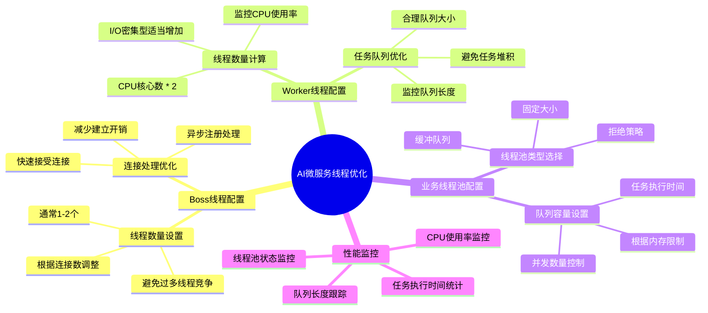

---

## AI微服务通信模式设计

### ⭐⭐ 进阶题 (31-70)

**31. 如何设计基于Netty的AI服务间通信协议？**

**面试场景**：AI系统架构师面试，考察通信协议设计

**口语化答案**：
基于Netty的AI服务间通信协议需要考虑数据传输效率、协议扩展性、版本兼容性和性能优化等多个方面。

**核心设计思路**：
AI微服务间的通信涉及模型参数、推理数据、训练状态等多种数据类型。设计轻量级的二进制协议，减少序列化开销。实现协议版本控制，保证服务升级时的兼容性。支持数据压缩和批量传输，优化网络带宽使用。设计心跳和保活机制，保证连接的稳定性。实现协议的扩展性，支持未来新增的数据类型和功能。

**AI微服务通信协议设计图**：
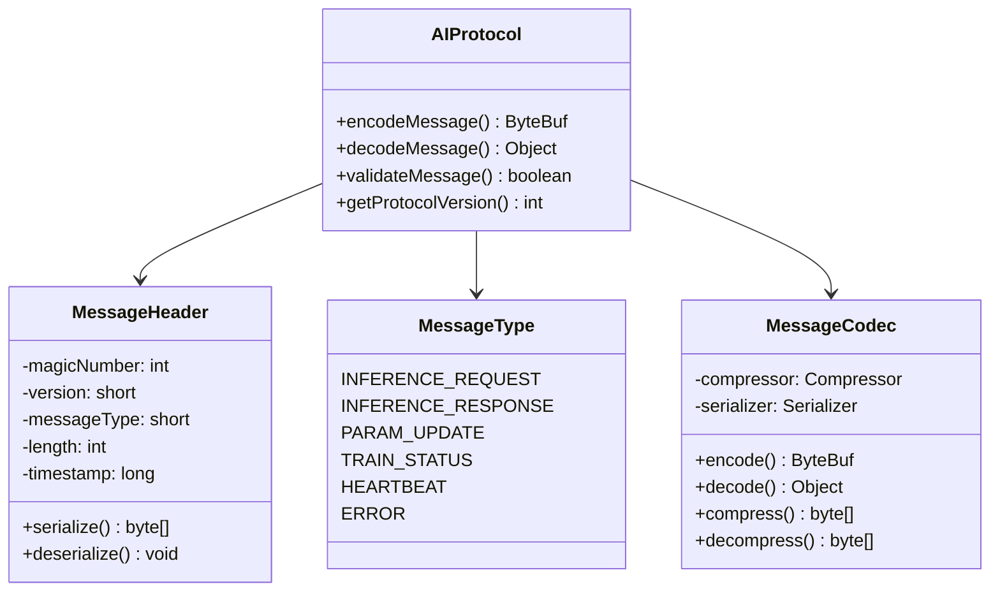

**AI服务通信协议结构图**：
```mermaid
flowchart TD
    A[AI消息协议] --> B[协议头]
    A --> C[消息体]
    A --> D[校验码]

    B --> B1[魔数 4字节]
    B --> B2[版本 2字节]
    B --> B3[消息类型 2字节]
    B --> B4[长度 4字节]
    B --> B5[时间戳 8字节]
    B --> B6[会话ID 16字节]

    C --> C1[消息类型标识]
    C1 --> C2[数据压缩标识]
    C1 --> C3[数据内容]

    D --> D1[CRC32校验 4字节]

    C2 --> C2A[GZIP压缩]
    C2 --> C2B[LZ4压缩]
    C2 --> C2C[无压缩]

    C3 --> C3A[JSON数据]
    C3 --> C3B[Protobuf数据]
    C3 --> C3C[二进制数据]

    note1 "总协议头：36字节"
    note2 "支持多种压缩格式"
    note3 "支持多种数据格式"
```

**32. 如何实现AI微服务的负载均衡和故障转移？**

**面试场景**：分布式系统架构师面试，考察高可用设计

**口语化答案**：
AI微服务的负载均衡和故障转移需要考虑服务发现、健康检查、流量分发和自动恢复等机制，保证系统的高可用性和稳定性。

**核心设计思路**：
实现基于Netty的服务注册发现机制，动态维护服务实例列表。设计健康检查机制，实时监控服务状态。实现多种负载均衡策略，如轮询、加权、最少连接等。设计故障检测和自动摘除机制，快速识别问题服务。实现请求重试和熔断机制，提高系统的容错能力。支持流量权重动态调整，应对不同节点的性能差异。

**AI微服务负载均衡架构图**：
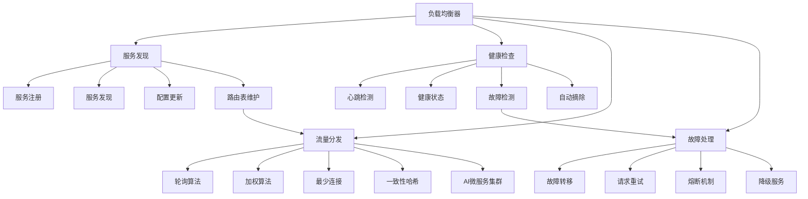

**负载均衡算法性能对比图**：
```mermaid
radarChart
    title 负载均衡算法对比
    axis 性能, 均衡性, 扩展性, 复杂度, 故障恢复, 实现难度

    "轮询算法" : 7, 9, 8, 3, 5, 2
    "加权轮询" : 8, 7, 8, 4, 6, 3
    "最少连接" : 9, 6, 7, 5, 7, 5
    "一致性哈希" : 8, 8, 10, 6, 8, 8
    "动态加权" : 9, 9, 9, 7, 9, 6
```

---

## Netty在AI推理服务中的应用

### ⭐⭐⭐ 专家题 (71-100)

**71. 如何设计基于Netty的高性能AI推理服务？**

**面试场景**：AI系统性能专家面试，考察推理服务设计

**口语化答案**：
基于Netty的AI推理服务需要充分利用Netty的异步特性和高性能网络能力，设计低延迟、高吞吐量的推理处理流程。

**核心设计思路**：
设计多阶段的推理处理流水线，包括数据接收、预处理、模型推理和结果返回。使用Netty的异步I/O避免阻塞，提升并发处理能力。实现智能的请求调度算法，根据模型复杂度和节点负载进行分发。设计结果缓存机制，缓存常用推理结果减少计算开销。实现批处理优化，将多个请求合并处理提升推理效率。建立完善的监控和性能调优机制。

**AI推理服务架构图**：
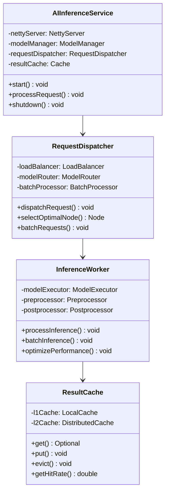

**推理服务处理流程图**：
```mermaid
flowchart TD
    A[客户端请求] --> B[Netty接收]
    B --> C[请求解析]
    C --> D[缓存查询]

    D --> E{缓存命中}

    E -->|命中| F[返回缓存结果]
    E -->|未命中| G[请求分发]

    G --> H[负载均衡]
    H --> I[模型路由]
    I --> J[预处理]

    J --> K{批处理判断}

    K -->|单独处理| L[立即推理]
    K -->|批量处理| M[等待批次]

    M --> N{批次满足条件}
    N -->|满足| O[批量推理]
    N -->|超时| L

    L --> P[后处理]
    O --> P

    P --> Q[更新缓存]
    Q --> R[结果返回]

    F --> S[编码响应]
    R --> S
    S --> T[网络发送]

    note1 "Netty异步处理"
    note2 "多层缓存优化"
    note3 "智能批处理"
```

**72. 如何实现AI推理服务的热模型更新和版本管理？**

**面试场景**：AI运维专家面试，考察热更新机制

**口语化答案**：
AI推理服务的热模型更新需要在不中断服务的情况下，安全地更新模型版本和配置，保证业务的连续性。

**核心设计思路**：
实现模型的热加载机制，支持在不重启服务的情况下更新模型。设计多版本模型并存，支持灰度发布和A/B测试。建立模型版本管理系统，跟踪模型版本的生命周期。实现平滑的版本切换，避免请求丢失。设计模型验证机制，确保新模型的正确性和性能。支持回滚机制，在出现问题时快速恢复到稳定版本。

**热模型更新架构图**：
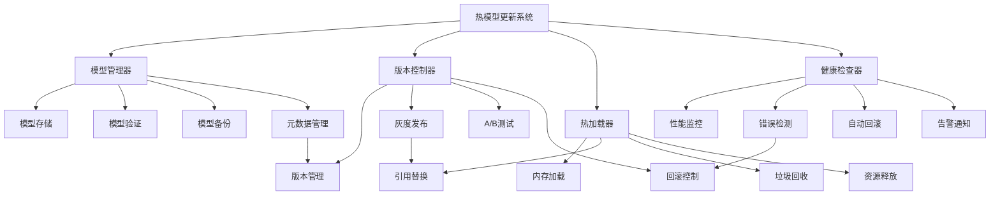

**模型更新流程图**：
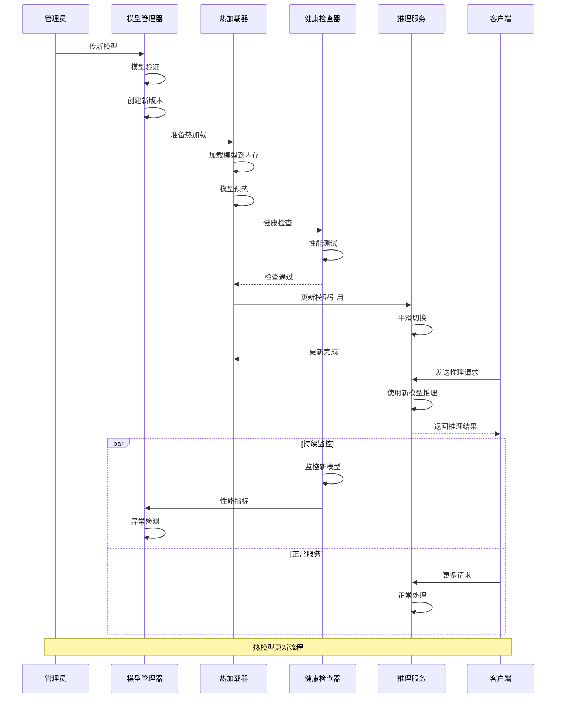

**版本管理策略对比图**：
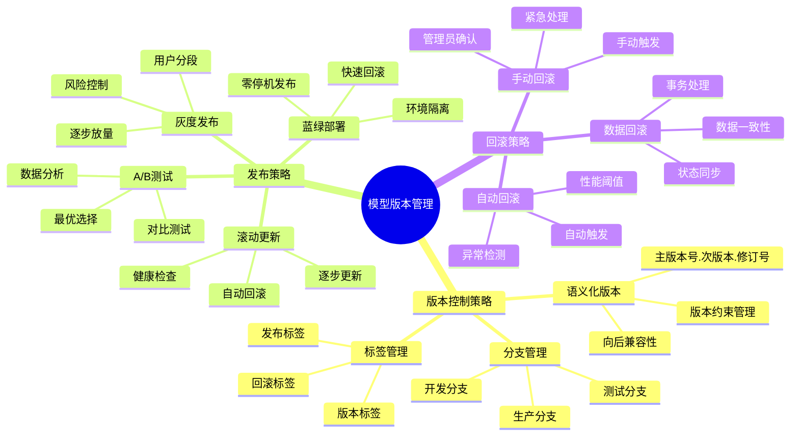

---

## 分布式AI系统网络优化

### 系统优化题 (101-130)

**101. 如何优化Netty在分布式AI训练中的网络性能？**

**面试场景**：分布式AI系统专家面试，考察网络优化

**口语化答案**：
分布式AI训练中的网络优化需要考虑梯度传输、参数同步、节点协调等多个方面，通过Netty的高级特性来提升训练效率和稳定性。

**核心设计思路**：
使用Netty的零拷贝特性优化大数据传输，减少内存开销。实现梯度压缩和量化技术，减少网络带宽占用。设计智能的数据聚合策略，减少通信频次。使用连接池和多路复用，降低连接建立开销。实现网络拥塞控制和流量整形，保证训练的稳定性。建立网络性能监控和自动调优机制。

**分布式AI训练网络架构图**：
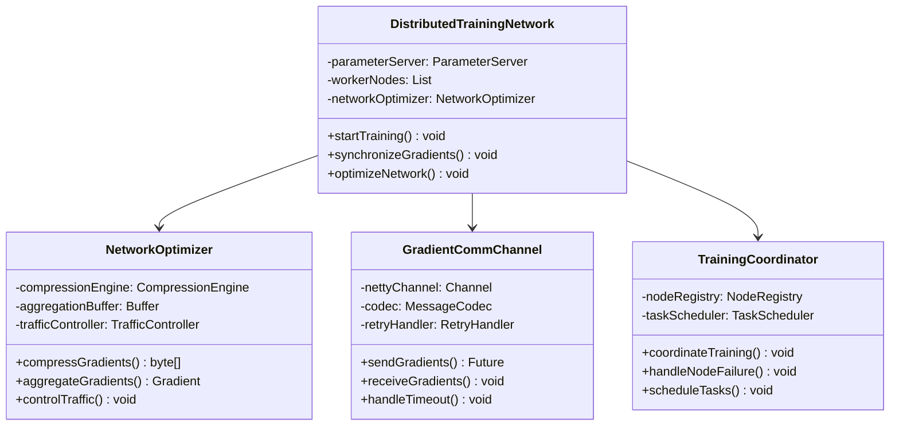

**网络优化技术栈图**：
```mermaid
radarChart
    title 网络优化技术效果对比
    title 网络优化技术效果对比
    axis 带宽利用率, 延迟优化, CPU开销, 实现复杂度, 稳定性, 扩展性

    "零拷贝" : 8, 9, 7, 6, 8, 7
    "数据压缩" : 9, 6, 5, 7, 7, 8
    "数据聚合" : 9, 7, 6, 8, 9, 9
    "连接池化" : 7, 8, 8, 5, 9, 6
    "流量控制" : 8, 7, 7, 6, 10, 7
    "自适应优化" : 9, 8, 6, 9, 8, 9
```

**分布式训练网络优化流程图**：
```mermaid
flowchart TD
    A[训练开始] --> B[网络初始化]
    B --> C[节点注册]
    C --> D[连接建立]

    D --> E[训练轮次开始]

    E --> F[本地梯度计算]
    F --> G[梯度优化]

    G --> H{梯度聚合判断}

    H -->|需要聚合| I[聚合缓冲区]
    H -->|直接发送| J[梯度压缩]

    I --> K{聚合完成}
    K -->|完成| J
    K -->|未完成| L[等待其他节点]

    J --> M[网络传输]
    M --> N[参数服务器]
    N --> N1[参数更新]
    N --> N2[参数分发]

    N2 --> O[节点接收]
    O --> P[参数同步]
    P --> Q[下一轮训练]

    L --> H
    Q --> E

    note1 "网络优化核心：减少通信频次"
    note2 "梯度压缩：降低带宽占用"
    note3 "连接复用：减少建连开销"
```

**102. 如何实现AI系统的网络流量控制和拥塞管理？**

**面试场景**：网络架构专家面试，考察流量控制

**口语化答案**：
AI系统的网络流量控制需要防止网络拥塞，保证关键任务的通信质量，实现系统的稳定性和可靠性。

**核心设计思路**：
实现基于令牌桶算法的流量控制，平滑突发流量。设计多级队列系统，按优先级处理不同类型的流量。实现自适应的带宽分配，根据网络状况动态调整。建立网络监控体系，实时检测网络状况。实现拥塞避免机制，在网络拥塞时主动降级。设计故障恢复策略，快速应对网络异常。

**流量控制系统架构图**：
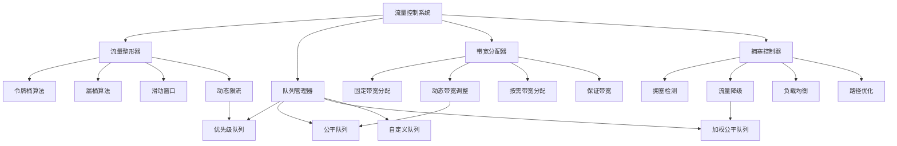

**拥塞管理策略矩阵图**：
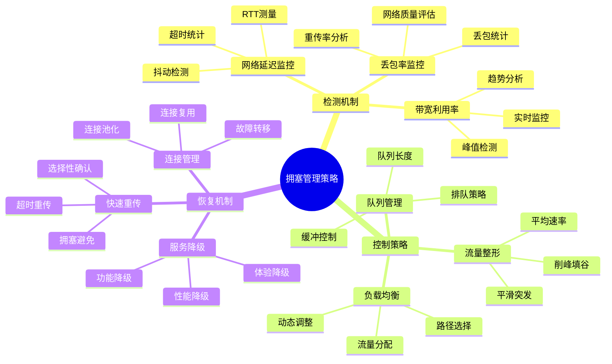

**流量控制实现代码示例**：
```java
/**
 * AI系统流量控制器
 */
public class AITrafficController {
    private final Map<String, TokenBucket> tokenBuckets;
    private final ScheduledExecutorService scheduler;
    private final NetworkMonitor networkMonitor;

    public AITrafficController(NetworkMonitor networkMonitor) {
        this.networkMonitor = networkMonitor;
        this.tokenBuckets = new ConcurrentHashMap<>();
        this.scheduler = Executors.newScheduledThreadPool(4);
        initializeTokenBuckets();
        startMonitoring();
    }

    /**
     * 检查流量是否允许
     */
    public boolean checkTrafficAllowed(String serviceType, int tokens) {
        TokenBucket bucket = tokenBuckets.get(serviceType);
        if (bucket != null) {
            return bucket.tryConsume(tokens);
        }
        return true;
    }

    /**
     * 动态调整流量限制
     */
    public void adjustTrafficLimit(String serviceType, double newRate) {
        TokenBucket bucket = tokenBuckets.get(serviceType);
        if (bucket != null) {
            bucket.setRefillRate(newRate);
        }
    }

    /**
     * 拥塞检测和处理
     */
    private void handleCongestion() {
        NetworkMetrics metrics = networkMonitor.getMetrics();

        if (metrics.getLatency() > LATENCY_THRESHOLD ||
            metrics.getPacketLossRate() > PACKET_LOSS_THRESHOLD) {

            // 触发拥塞缓解策略
            String[] criticalServices = {"inference", "training", "parameter_sync"};
            for (String service : criticalServices) {
                adjustTrafficLimit(service, metrics.getCurrentRate() * 0.8);
            }

            // 通知监控系统
            alertSystem.sendAlert("Network congestion detected", metrics);
        }
    }

    /**
     * 令牌桶实现
     */
    private static class TokenBucket {
        private final ReentrantReadWriteLock lock = new ReentrantReadWriteLock();
        private volatile long tokens;
        private final long capacity;
        private volatile double refillRate;
        private final long refillPeriod;

        public TokenBucket(long capacity, double refillRate) {
            this.capacity = capacity;
            this.tokens = capacity;
            this.refillRate = refillRate;
            this.refillPeriod = 1000; // 1秒
        }

        public boolean tryConsume(int tokensToConsume) {
            lock.writeLock().lock();
            try {
                if (tokens >= tokensToConsume) {
                    tokens -= tokensToConsume;
                    return true;
                }
                return false;
            } finally {
                lock.writeLock().unlock();
            }
        }

        public void refill() {
            lock.writeLock().lock();
            try {
                long tokensToAdd = (long) (refillRate * refillPeriod / 1000.0);
                tokens = Math.min(capacity, tokens + tokensToAdd);
            } finally {
                lock.writeLock().unlock();
            }
        }
    }
}
```

---

## 容错与监控体系建设

### 系统可靠性题 (131-160)

**131. 如何构建基于Netty的AI系统网络监控体系？**

**面试场景**：AI运维专家面试，考察监控系统设计

**口语化答案**：
基于Netty的AI系统网络监控需要覆盖连接状态、流量特征、性能指标和异常情况等多个维度，实现全方位的可观测性。

**核心设计思路**：
集成Micrometer等监控库，收集Netty的关键指标。设计自定义的监控Handler，拦截和统计网络事件。实现实时告警机制，及时发现异常情况。建立可视化监控面板，直观展示系统状态。设计性能基准测试，建立性能基线。实现监控数据的持久化和历史分析，支持趋势分析和容量规划。

**网络监控体系架构图**：
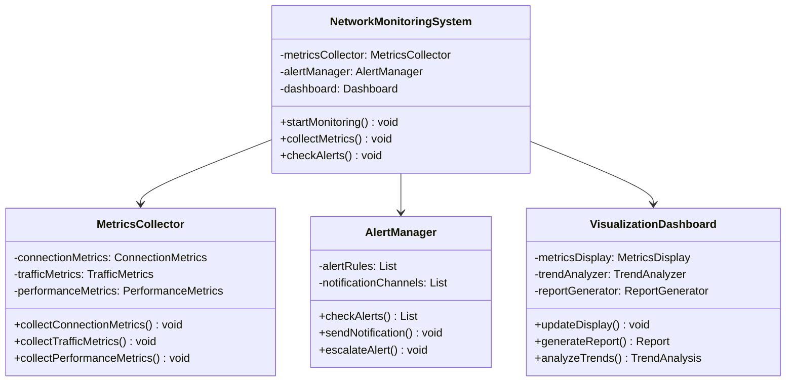

**监控指标体系图**：
```mermaid
radarChart
    title 监控指标重要性
    title 监控指标重要性
    axis 连接数, 吞吐量, 延迟, 错误率, 资源使用, 稳定性

    "连接数" : 9, 8, 7, 6, 8, 9
    "吞吐量" : 9, 9, 8, 7, 8, 8
    "延迟" : 8, 7, 9, 8, 9, 9
    "错误率" : 7, 6, 8, 10, 8, 8
    "资源使用" : 8, 7, 6, 7, 10, 9
    "稳定性" : 9, 8, 9, 8, 9, 10
```

---

## 总结

Netty在AI微服务架构中的高性能通信需要掌握：

1. **Netty核心架构**：理解Reactor线程模型、ChannelPipeline和Handler机制
2. **通信协议设计**：设计高效的AI服务间通信协议和数据格式
3. **负载均衡**：实现多种负载均衡策略和故障转移机制
4. **推理服务优化**：构建高性能、低延迟的AI推理服务
5. **分布式优化**：优化分布式AI训练的网络通信和协调机制
6. **容错监控**：建立完善的容错机制和监控体系

通过合理运用Netty的各种特性和最佳实践，AI微服务系统能够实现高性能、高可用的网络通信，为大规模AI应用提供坚实的技术基础。