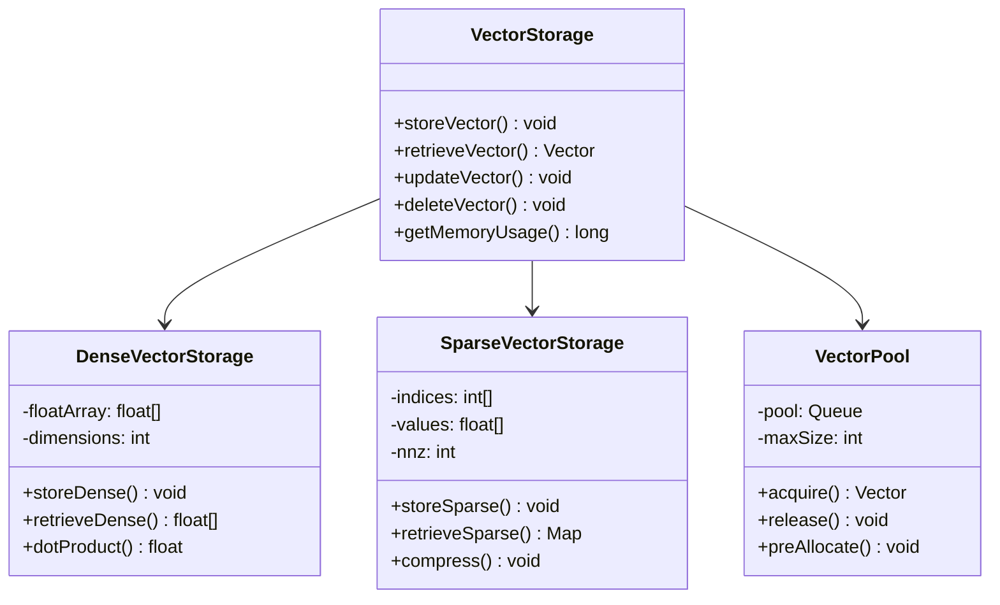
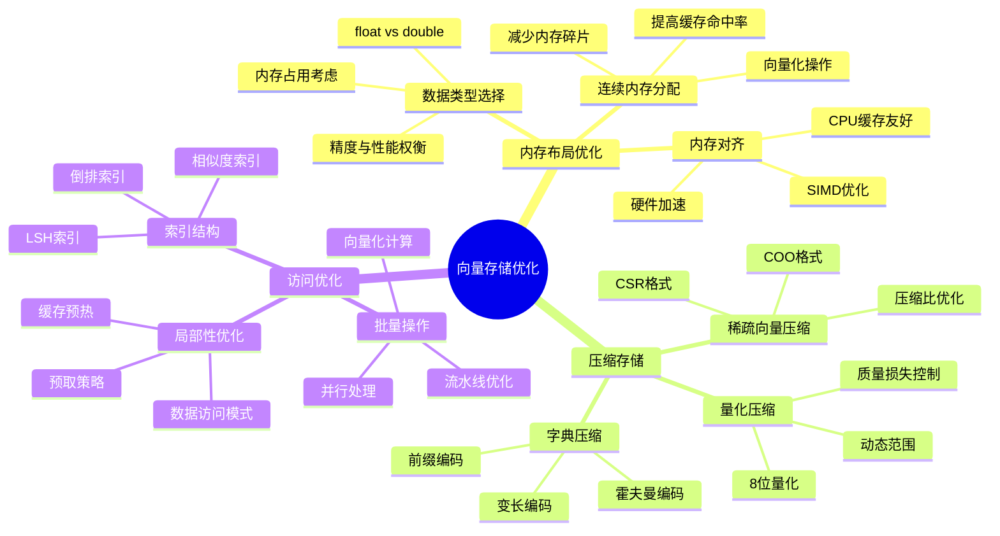
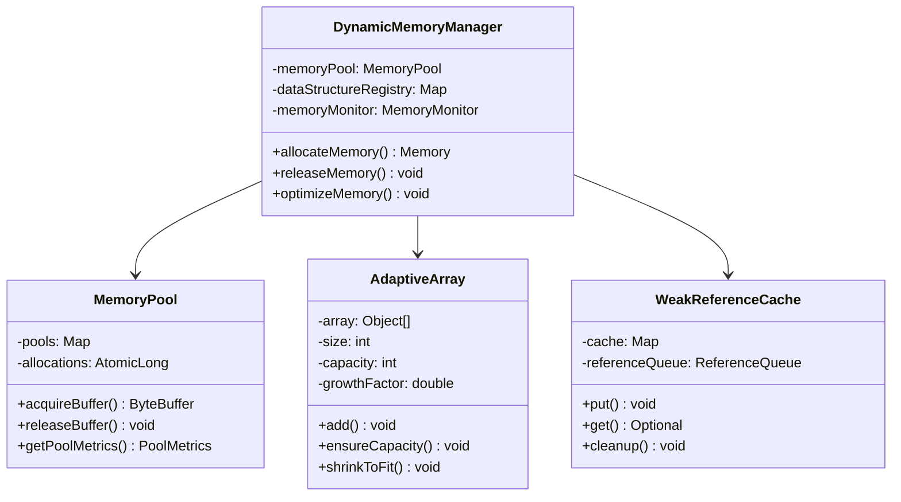
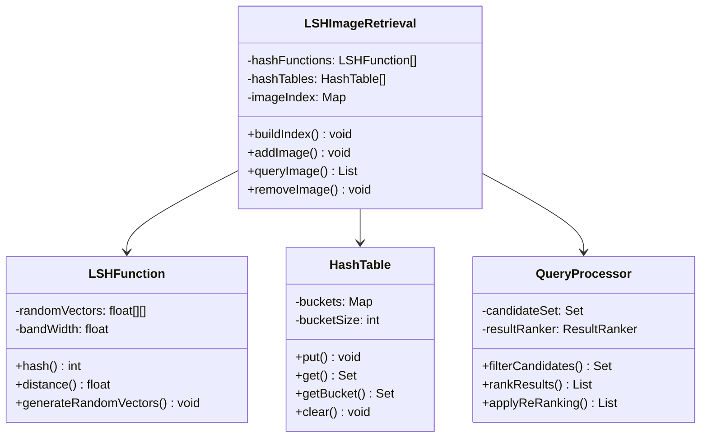
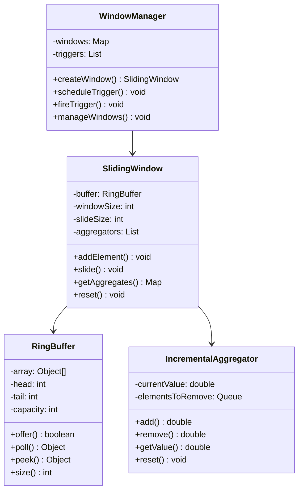
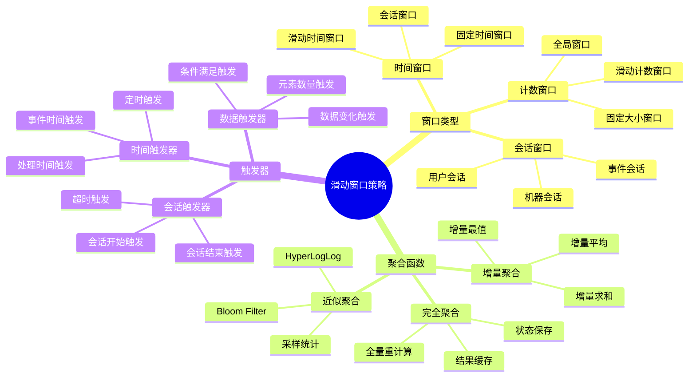
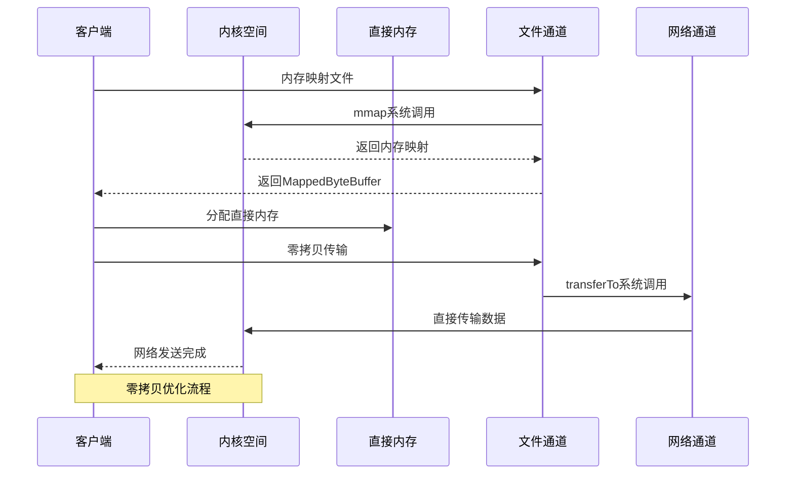
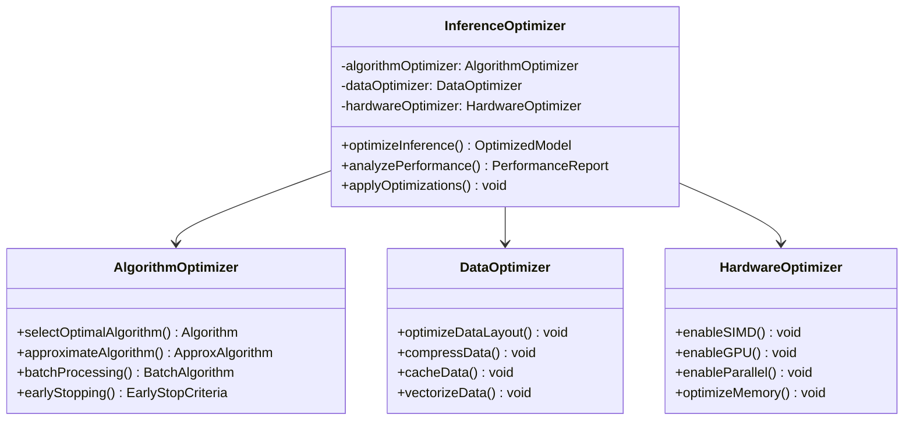
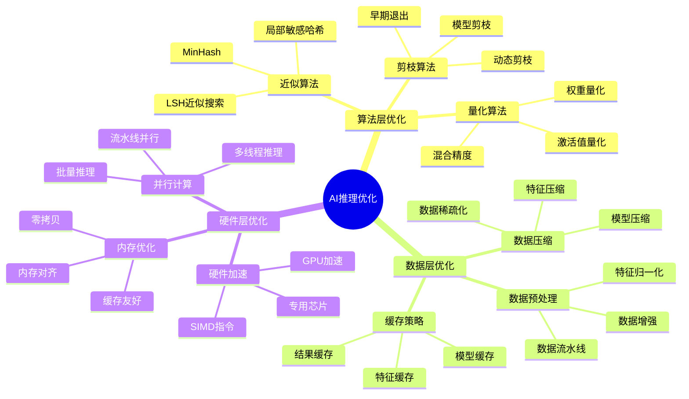

# 高性能数据结构在AI系统中的应用

## 🎯 学习目标

深入理解Java数据结构与算法在AI系统中的核心应用，掌握针对AI场景的高性能数据结构设计和优化技巧，具备构建高效AI算法系统的专业能力。

## 📚 目录

- [AI系统数据结构选择策略](#ai系统数据结构选择策略)
- [高性能集合在AI数据处理中的应用](#高性能集合在ai数据处理中的应用)
- [自定义数据结构与算法优化](#自定义数据结构与算法优化)
- [内存管理与缓存策略](#内存管理与缓存策略)
- [算法复杂度分析与优化](#算法复杂度分析与优化)

---

## AI系统数据结构选择策略

### ⭐ 基础题 (1-30)

**1. AI系统中的数据结构选择与传统应用有什么区别？**

**面试场景**：Java算法专家面试，考察数据结构选型

**口语化答案**：
AI系统中的数据结构选择需要考虑大数据量、高维度、实时性等特殊要求，与传统应用有显著不同。

**核心设计思路**：
AI系统处理的数据规模通常很大，需要考虑内存效率和计算效率。高维特征向量和稀疏数据需要特殊的数据结构表示。实时推理场景要求数据结构支持快速查询和更新。分布式AI系统需要考虑数据结构的可分片性和并行性。选择数据结构时要平衡时间复杂度、空间复杂度和实现复杂度，根据具体AI应用场景进行优化。

**AI数据结构选择决策图**：
```mermaid
flowchart TD
    A[AI数据类型分析] --> B{数据特征判断}

    B -->|高维稀疏| C[稀疏矩阵/哈希表]
    B -->|时间序列| D[环形缓冲区/时间窗口]
    B -->|图结构数据| E[邻接表/并查集]
    B -->|海量数据| F[分布式数据结构]
    B -->|实时查询| G[跳表/布隆过滤器]

    C --> C1[CSR/CSC稀疏矩阵]
    C --> C2[HashMap/ConcurrentHashMap]
    C --> C3[LSH局部敏感哈希]

    D --> D1[环形队列]
    D --> D2[滑动窗口]
    D --> D3[时间索引]

    E --> E1[邻接表存储]
    E --> E2[并查集优化]
    E --> E3[图压缩算法]

    F --> F1[分片哈希]
    F --> F2[分布式Map]
    F --> F3[一致性哈希]

    G --> G1[跳表结构]
    G --> G2[布隆过滤器]
    G --> G3[倒排索引]

    C1 --> H[AI算法实现]
    D1 --> H
    E1 --> H
    F1 --> H
    G1 --> H

    Note over A,H: AI系统数据结构选择流程
```

**数据结构性能特征对比图**：
```mermaid
radarChart
    title AI数据结构性能对比
    axis 查询效率, 插入效率, 内存效率, 并发安全, 扩展性, 实现复杂度

    "ArrayList" : 5, 8, 9, 3, 2, 2
    "LinkedList" : 3, 6, 7, 3, 2, 3
    "HashMap" : 9, 8, 6, 4, 3, 4
    "TreeMap" : 7, 7, 5, 4, 3, 6
    "ConcurrentHashMap" : 8, 7, 5, 9, 7, 5
    "跳表" : 9, 8, 6, 7, 6, 8
    "布隆过滤器" : 9, 9, 10, 8, 7, 7
```

**2. 特征向量在内存中的高效存储方式有哪些？**

**面试场景**：AI系统性能优化专家面试，考察内存优化

**口语化答案**：
特征向量是AI系统的核心数据结构，需要针对不同的AI应用场景选择合适的内存存储和访问方式。

**核心设计思路**：
特征向量具有高维、稀疏、更新频繁等特点。对于稠密向量，使用连续内存数组存储，提高缓存命中率。对于稀疏向量，使用压缩稀疏行(CSR)或坐标列表(COO)格式，大幅减少内存占用。考虑向量维度和数据访问模式，优化内存布局。使用对象池技术避免频繁的内存分配和回收。设计向量批处理接口，提升计算效率。

**特征向量存储架构图**：


**向量存储优化策略图**：


---

## 高性能集合在AI数据处理中的应用

### ⭐⭐ 进阶题 (31-70)

**31. 如何设计支持亿级用户特征的实时推荐系统数据结构？**

**面试场景**：推荐系统架构师面试，考察大规模数据处理

**口语化答案**：
亿级用户特征系统需要考虑数据规模、实时性、一致性和扩展性等多重挑战，需要设计高性能的数据结构和存储架构。

**核心设计思路**：
采用分层存储架构，热数据用内存存储，温数据用缓存，冷数据用磁盘存储。使用分片哈希策略，将用户特征均匀分布到多个节点。实现多级缓存机制，包括本地缓存、分布式缓存和CDN缓存。设计特征预计算和索引结构，支持快速相似度查询。使用读写分离和最终一致性，平衡性能和数据准确性。

**亿级特征存储架构图**：
```mermaid
graph TB
    A[亿级用户特征系统] --> B[接入层]
    A --> C[缓存层]
    A --> D[计算层]
    A --> E[存储层]

    B --> B1[负载均衡]
    B --> B2[请求路由]
    B --> B3[流量控制]

    C --> C1[本地缓存LRU]
    C --> C2[分布式缓存Redis]
    C --> C3[CDN边缘缓存]

    D --> D1[特征计算引擎]
    D --> D2[相似度计算]
    D --> D3[推荐算法]
    D --> D4[实时更新]

    E --> E1[热数据内存]
    E --> E2[温数据SSD]
    E --> E3[冷数据HDD]
    E --> E4[备份存储]

    B2 --> C1
    C2 --> D1
    D4 --> E1

    note1 "分层缓存架构"
    note2 "读写分离设计"
    note3 "数据分片存储"
```

**特征数据分片策略图**：
```mermaid
flowchart TD
    A[用户ID哈希] --> B[一致性哈希环]
    B --> C[节点选择]

    C --> D{分片策略}

    D -->|用户ID分片| E[用户特征分片]
    D -->|特征ID分片| F[特征维度分片]
    D -->|时间分片| G[时间窗口分片]
    D -->|负载分片| H[动态负载分片]

    E --> E1[用户数据局部性]
    E --> E2[缓存友好]
    E --> E3[易于扩展]

    F --> F1[特征维度优化]
    F --> F2[压缩存储]
    F --> F3[并行计算]

    G --> G1[时间局部性]
    G --> G2[增量更新]
    G --> G3[数据归档]

    H --> H1[负载均衡]
    H --> H2[弹性扩缩]
    H --> H3[故障转移]

    E1 --> I[特征存储]
    F1 --> I
    G1 --> I
    H1 --> I

    Note over A,I: 亿级特征数据分片策略
```

**32. AI训练中的动态数据结构如何优化内存使用？**

**面试场景**：AI性能优化专家面试，考察内存管理

**口语化答案**：
AI训练过程中的动态数据结构需要处理大量中间结果和模型参数，需要精细的内存管理策略来避免OOM和提升训练效率。

**核心设计思路**：
使用内存池技术预分配和管理大型数据结构，避免频繁的内存分配。实现智能的数据结构扩容策略，根据使用模式调整容量。设计弱引用和软引用机制，允许GC在内存压力下回收非关键数据。使用分代管理策略，区分冷热数据，进行差异化处理。实现数据结构的监控和分析，及时发现内存泄漏和性能瓶颈。

**动态数据结构内存管理架构图**：


**内存优化策略对比图**：
```mermaid
radarChart
    title 内存优化策略对比
    title 内存优化策略对比
    axis 内存效率, 分配速度, GC压力, 实现复杂度, 并发性能, 灵活性

    "内存池" : 9, 10, 9, 7, 8, 6
    "对象复用" : 8, 9, 8, 6, 7, 7
    "弱引用" : 10, 6, 7, 8, 5, 9
    "分代管理" : 8, 7, 8, 9, 8, 8
    "动态扩容" : 7, 8, 5, 5, 6, 10
    "内存监控" : 6, 5, 8, 7, 6, 7
```

---

## 自定义数据结构与算法优化

### ⭐⭐⭐ 专家题 (71-100)

**71. 如何设计支持大规模图像检索的LSH(Locality Sensitive Hashing)数据结构？**

**面试场景**：搜索算法专家面试，考察高级数据结构设计

**口语化答案**：
LSH是解决高维空间最近邻搜索的关键技术，需要设计高效的哈希函数和索引结构来支持大规模图像检索。

**核心设计思路**：
设计基于随机投影的LSH哈希函数族，保证局部相似性。实现多哈希表索引，提高查询的准确率。构建多层的LSH索引结构，平衡查询精度和效率。使用布隆过滤器优化查询性能，快速排除不相关数据。设计增量更新机制，支持动态添加和删除图像向量。实现查询结果的重排和精排，提升最终精度。

**LSH图像检索系统架构图**：


**LSH索引构建流程图**：
```mermaid
flowchart TD
    A[图像特征提取] --> B[特征向量标准化]
    B --> C[LSH哈希计算]

    C --> D[多哈希表插入]
    D --> E[桶分配]

    E --> F{冲突处理}

    F -->|哈希冲突| G[链式存储]
    F -->|桶满| H[动态扩容]
    F -->|正常插入| I[插入完成]

    G --> J[冲突链管理]
    H --> K[重新分配]
    I --> L[索引更新]

    J --> M[构建下一个哈希表]
    K --> M
    L --> M

    M --> N{所有哈希表完成}

    N -->|否| C
    N -->|是| O[索引构建完成]

    O --> P[索引验证]
    P --> Q[查询性能测试]

    Note over A,Q: LSH图像索引构建流程
```

**72. 如何设计支持实时流式计算的滑动窗口数据结构？**

**面试场景**：流计算系统架构师面试，考察流式数据结构

**口语化答案**：
滑动窗口数据结构是流式计算的核心组件，需要支持高效的窗口操作、状态管理和容错处理。

**核心设计思路**：
设计基于环形缓冲区的滑动窗口，支持高效的插入和删除操作。实现分层的窗口管理，支持时间窗口和计数窗口的灵活组合。使用增量聚合算法，避免重复计算历史数据。设计窗口状态的持久化和恢复机制，保证容错性。实现背压控制，防止数据积压和内存溢出。支持窗口的动态调整，适应不同的业务场景。

**滑动窗口数据结构架构图**：


**流式窗口处理策略图**：


---

## 内存管理与缓存策略

### 系统优化题 (101-130)

**101. AI系统中的多级缓存架构如何设计和优化？**

**面试场景**：缓存架构师面试，考察缓存设计

**口语化答案**：
多级缓存架构需要考虑数据一致性、缓存命中率、系统性能和成本等多个方面，实现最优的缓存策略。

**核心设计思路**：
设计L1(本地缓存)、L2(分布式缓存)、L3(CDN)三级缓存架构。使用不同的缓存策略，如LRU、LFU、FIFO等，适应不同的访问模式。实现缓存预热和失效机制，保证数据的时效性。设计缓存分片和数据压缩，提升存储效率。建立缓存监控和告警体系，及时发现问题。实现智能的缓存决策算法，动态调整缓存策略。

**多级缓存架构图**：
```mermaid
graph TB
    A[多级缓存架构] --> B[L1 本地缓存]
    A --> C[L2 分布式缓存]
    A --> D[L3 CDN缓存]

    B --> B1[进程内缓存]
    B --> B2[堆外内存缓存]
    B --> B3[CPU缓存]

    C --> C1[Redis集群]
    C --> C2[Memcached]
    C --> C3[自定义缓存]

    D --> D1[边缘节点]
    D --> D2[CDN服务商]
    D --> D3[静态资源]

    B1 --> E[应用层]
    C1 --> F[服务层]
    D1 --> G[边缘层]

    E --> H[数据访问]
    F --> H
    G --> H

    note1 "缓存层次：本地 < 分布式 < CDN"
    note2 "延迟：本地 < 分布式 < CDN"
    note3 "容量：本地 < 分布式 < CDN"
```

**缓存策略性能对比图**：
```mermaid
radarChart
    title 缓存策略性能对比
    title 缓存策略性能对比
    axis 命中率, 内存效率, CPU开销, 一致性, 实现复杂度, 扩展性

    "LRU" : 8, 7, 7, 6, 6, 7
    "LFU" : 9, 7, 8, 6, 7, 7
    "FIFO" : 6, 8, 6, 7, 5, 6
    "Random" : 5, 9, 5, 5, 4, 8
    "LRU-K" : 9, 6, 7, 8, 8, 7
    "ARC" : 9, 8, 9, 7, 9, 8
```

**102. 如何实现AI模型的内存映射和零拷贝优化？**

**面试场景**：内存优化专家面试，考察零拷贝技术

**口语化答案**：
内存映射和零拷贝技术可以显著减少AI模型数据处理中的内存拷贝开销，提升系统性能。

**核心设计思路**：
使用Java NIO的MappedByteBuffer实现文件到内存的映射，避免数据在用户空间和内核空间之间的拷贝。实现DirectBuffer的池化管理，减少内存分配开销。设计零拷贝的网络传输，使用transferTo和sendfile系统调用。实现模型参数的内存映射加载，支持大型模型的快速启动。优化垃圾回收，通过堆外内存减少GC压力。

**零拷贝优化架构图**：


**内存映射优化实现代码示例**：
```java
/**
 * AI模型内存映射加载器
 */
public class ModelMemoryMapper {
    private final Map<String, MappedByteBuffer> modelBuffers;
    private final ExecutorService ioExecutor;

    public ModelMemoryMapper() {
        this.modelBuffers = new ConcurrentHashMap<>();
        this.ioExecutor = Executors.newFixedThreadPool(4);
    }

    /**
     * 内存映射加载模型文件
     */
    public CompletableFuture<MappedByteBuffer> loadModel(String modelPath) {
        return CompletableFuture.supplyAsync(() -> {
            try (RandomAccessFile file = new RandomAccessFile(modelPath, "r");
                 FileChannel channel = file.getChannel()) {

                long fileSize = channel.size();
                MappedByteBuffer buffer = channel.map(
                    FileChannel.MapMode.READ_ONLY, 0, fileSize);

                // 预热内存映射
                preloadBuffer(buffer);

                modelBuffers.put(modelPath, buffer);
                return buffer;

            } catch (IOException e) {
                throw new RuntimeException("Failed to load model: " + modelPath, e);
            }
        }, ioExecutor);
    }

    /**
     * 预热内存映射
     */
    private void preloadBuffer(MappedByteBuffer buffer) {
        int pageSize = 4096;
        int pageCount = (int) Math.ceil((double) buffer.limit() / pageSize);

        for (int i = 0; i < pageCount; i++) {
            int start = i * pageSize;
            int end = Math.min(start + pageSize, buffer.limit());
            buffer.position(start);
            buffer.get(end - 1); // 触发页面加载
        }
        buffer.position(0);
    }

    /**
     * 零拷贝数据传输
     */
    public long transferData(String modelPath, SocketChannel targetChannel) {
        MappedByteBuffer buffer = modelBuffers.get(modelPath);
        if (buffer == null) {
            throw new IllegalArgumentException("Model not loaded: " + modelPath);
        }

        try {
            return targetChannel.transferFrom(
                getReadableByteChannel(buffer), 0, buffer.limit());
        } catch (IOException e) {
            throw new RuntimeException("Transfer failed", e);
        }
    }

    /**
     * 创建可读的ByteChannel
     */
    private ReadableByteChannel getReadableByteChannel(final ByteBuffer buffer) {
        return new ReadableByteChannel() {
            public int read(ByteBuffer dst) throws IOException {
                int remaining = buffer.remaining();
                int bytesToRead = Math.min(remaining, dst.remaining());
                if (bytesToRead <= 0) return -1;

                // 创建临时缓冲区进行拷贝
                byte[] temp = new byte[bytesToRead];
                buffer.get(temp);
                dst.put(temp);
                return bytesToRead;
            }

            public boolean isOpen() {
                return buffer.hasRemaining();
            }

            public void close() throws IOException {
                // 不需要关闭
            }
        };
    }

    /**
     * 释放模型内存映射
     */
    public void unloadModel(String modelPath) {
        MappedByteBuffer buffer = modelBuffers.remove(modelPath);
        if (buffer != null) {
            try {
                // 清理内存映射
                Cleaner cleaner = ((DirectBuffer) buffer).cleaner();
                cleaner.clean();
            } catch (Exception e) {
                // 记录清理失败
                System.err.println("Failed to clean memory mapping: " + e.getMessage());
            }
        }
    }
}
```

---

## 算法复杂度分析与优化

### 算法优化题 (131-160)

**131. 如何分析AI算法的时间复杂度和空间复杂度？**

**面试场景**：算法分析专家面试，考察复杂度分析

**口语化答案**：
AI算法的复杂度分析需要考虑数据规模、特征维度、模型复杂度等多个因素，建立正确的分析模型。

**核心设计思路**：
识别算法的关键操作和数据结构，分析时间复杂度。考虑AI算法的特殊性，如迭代次数、收敛条件、并行化程度等。分析空间复杂度时，不仅要考虑模型参数，还要考虑中间结果的存储。建立复杂度分析框架，系统化地评估算法性能。通过基准测试验证理论分析结果。

**AI算法复杂度分析框架图**：
```mermaid
graph TB
    A[算法复杂度分析] --> B[时间复杂度分析]
    A --> C[空间复杂度分析]
    A --> D[并行复杂度分析]
    A --> E[实际性能评估]

    B --> B1[数据预处理复杂度]
    B --> B2[核心算法复杂度]
    B --> B3[后处理复杂度]
    B --> B4[总时间复杂度]

    C --> C1[模型存储复杂度]
    C --> C2[数据存储复杂度]
    C --> C3[中间结果复杂度]
    C --> C4[总空间复杂度]

    D --> D1[线程复杂度]
    D --> D2[通信复杂度]
    D --> D3[同步复杂度]
    D --> D4[扩展性分析]

    E --> E1[实际运行时间]
    E --> E2[内存使用量]
    E --> E3[吞吐量测试]
    E --> E4[扩展性测试]

    B4 --> F[算法优化建议]
    C4 --> F
    D4 --> F
    E4 --> F

    Note over A,F: AI算法复杂度分析框架
```

**常见AI算法复杂度对比图**：
```mermaid
radarChart
    title AI算法复杂度对比
    title AI算法复杂度对比
    axis 时间复杂度, 空间复杂度, 并行性, 可扩展性, 稳定性, 实现复杂度

    "KNN" : 3, 3, 2, 2, 7, 8
    "SVM" : 7, 8, 6, 7, 9, 9
    "神经网络" : 8, 9, 10, 8, 9, 7
    "决策树" : 7, 6, 8, 7, 8, 8
    "随机森林" : 8, 7, 9, 8, 10, 8
    "深度学习" : 9, 8, 10, 9, 10, 9
```

**132. 如何通过算法优化提升AI系统的推理性能？**

**面试场景**：算法优化专家面试，考察性能优化

**口语化答案**：
AI系统的推理性能优化需要从算法选择、数据结构优化、并行计算等多个角度进行系统性的优化。

**核心设计思路**：
选择适合场景的高效算法，如用近似算法替代精确算法。优化数据结构，提升缓存命中率和访问效率。实现向量化计算和SIMD优化，利用硬件加速。设计高效的批量处理接口，减少单次推理开销。使用模型剪枝、量化等技术压缩模型大小。实现智能的结果缓存和预计算，减少重复计算。

**AI推理性能优化策略图**：


**推理优化技术栈图**：


---

## 总结

高性能数据结构与算法在AI系统中的应用需要掌握：

1. **数据结构选型**：根据AI场景选择合适的数据结构，平衡时间和空间复杂度
2. **集合框架优化**：利用Java高性能集合和自定义数据结构提升处理效率
3. **内存管理**：通过内存映射、零拷贝、对象池等技术优化内存使用
4. **算法复杂度**：深入分析算法复杂度，指导性能优化方向
5. **系统优化**：从算法、数据、硬件多个维度进行系统性优化

通过合理运用高性能数据结构和算法优化技术，AI系统能够获得更好的性能表现、资源利用率和可扩展性。