# Java算法在AI模型训练中的并行化优化

## 🎯 学习目标

深入理解Java算法在AI模型训练中的并行化优化技术，掌握多线程、分布式、GPU加速等优化策略，具备设计高性能AI训练系统的专业能力。

## 📚 目录

- [AI训练算法并行化基础](#ai训练算法并行化基础)
- [多线程模型训练优化](#多线程模型训练优化)
- [分布式训练算法设计](#分布式训练算法设计)
- [GPU加速与异构计算](#gpu加速与异构计算)
- [并行化性能监控与调优](#并行化性能监控与调优)

---

## AI训练算法并行化基础

### ⭐ 基础题 (1-30)

**1. AI模型训练中的并行化与串行化有什么区别？**

**面试场景**：Java并行计算专家面试，考察并行化基础

**口语化答案**：
并行化训练通过同时使用多个计算资源加速训练过程，而串行化训练则按顺序执行每个操作。在AI训练中，合理的并行化可以显著缩短训练时间。

**核心设计思路**：
AI模型训练涉及大量矩阵运算、梯度计算和参数更新。串行化训练受限于单核CPU性能，训练时间随模型复杂度线性增长。并行化训练通过多核CPU、GPU或分布式节点同时处理不同的计算任务，可以显著提升训练效率。但并行化也引入了通信开销、同步成本和负载均衡挑战。需要根据具体的算法特点和硬件环境选择合适的并行化策略。

**并行化vs串行化对比图**：
```mermaid
graph TB
    A[训练方式对比] --> B[串行化训练]
    A --> C[并行化训练]

    B --> B1[单线程执行]
    B --> B2[顺序处理数据]
    B --> B3[利用率低]
    B --> B4[时间复杂度高]

    C --> C1[多线程执行]
    C --> C2[并行处理数据]
    C --> C3[利用率高]
    C --> C4[时间复杂度低]

    B --> B5[训练时间：T]
    C --> C5[训练时间：T/n + 通信开销]
    C --> C6[加速比：n/(1+通信开销率)]
```

**AI训练并行化类型图**：
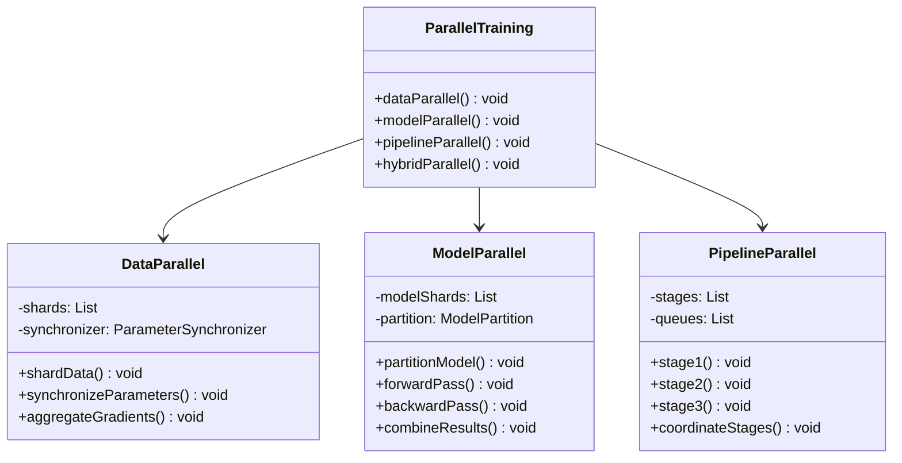

**2. 如何选择AI训练中的并行化策略？**

**面试场景**：AI系统架构师面试，考察并行策略选择

**口语化答案**：
AI训练的并行化策略选择需要考虑模型大小、数据规模、硬件资源和通信开销等因素，不同的策略适用于不同的场景。

**核心设计思路**：
数据并行适合大规模数据集和中等模型，通过数据分片实现并行。模型并行适合大型模型，通过模型分割减少内存限制。流水线并行适合多阶段训练流程，通过流水线提升吞吐量。混合并行可以结合多种策略的优势。选择策略时要考虑Amdahl定律，评估并行化效率。考虑硬件限制，如内存大小、GPU数量、网络带宽等。

**并行化策略选择决策图**：
```mermaid
flowchart TD
    A[AI训练需求分析] --> B{模型大小评估}

    B -->|小模型| C[数据并行优先]
    B -->|大模型| D{硬件资源评估}

    C --> C1[数据分片策略]
    C --> C2[参数同步机制]
    C --> C3[负载均衡]

    D --> E{硬件资源}
    E -->|单机多GPU| F[模型并行]
    E -->|多机多GPU| G[数据并行+模型并行]
    E -->|异构环境| H[流水线并行]

    F --> F1[模型分片]
    F --> F2[层间并行]
    F --> F3[设备通信优化]

    G --> G1[节点间数据并行]
    G --> G2[节点内模型并行]
    G --> G3[混合并行策略]

    H --> H1[CPU-GPU任务分配]
    H --> H2[异步执行]
    H --> H3[资源调度]

    C3 --> I[并行化实现]
    F3 --> I
    G3 --> I
    H3 --> I

    Note over A,I: AI训练并行化策略选择
```

**并行化策略性能对比图**：
```mermaid
radarChart
    title 并行化策略性能对比
    axis 可扩展性, 通信开销, 内存效率, 实现复杂度, 加速比上限, 适用场景

    "数据并行" : 10, 6, 8, 5, 9, 8
    "模型并行" : 6, 8, 4, 8, 6, 9
    "流水线并行" : 8, 4, 7, 7, 7, 7
    "混合并行" : 9, 7, 6, 9, 10, 10
    "单机并行" : 4, 2, 9, 4, 4, 6
```

---

## 多线程模型训练优化

### ⭐⭐ 进阶题 (31-70)

**31. 如何实现多线程下的神经网络前向传播优化？**

**面试场景**：深度学习框架开发专家面试，考查前向传播优化

**口语化答案**：
神经网络前向传播的多线程优化需要考虑层间依赖、负载均衡、内存访问模式等因素，设计高效的并行计算策略。

**核心设计思路**：
分析网络结构，识别可以并行执行的层和操作。实现层级的并行化，让不同层的计算在不同线程中执行。设计神经元级的并行化，将单个层的计算任务分配到多个线程。优化内存访问模式，提高缓存命中率。使用线程池管理线程资源，避免频繁创建销毁线程。实现任务调度和负载均衡，确保各线程工作量均衡。

**神经网络前向传播并行架构图**：
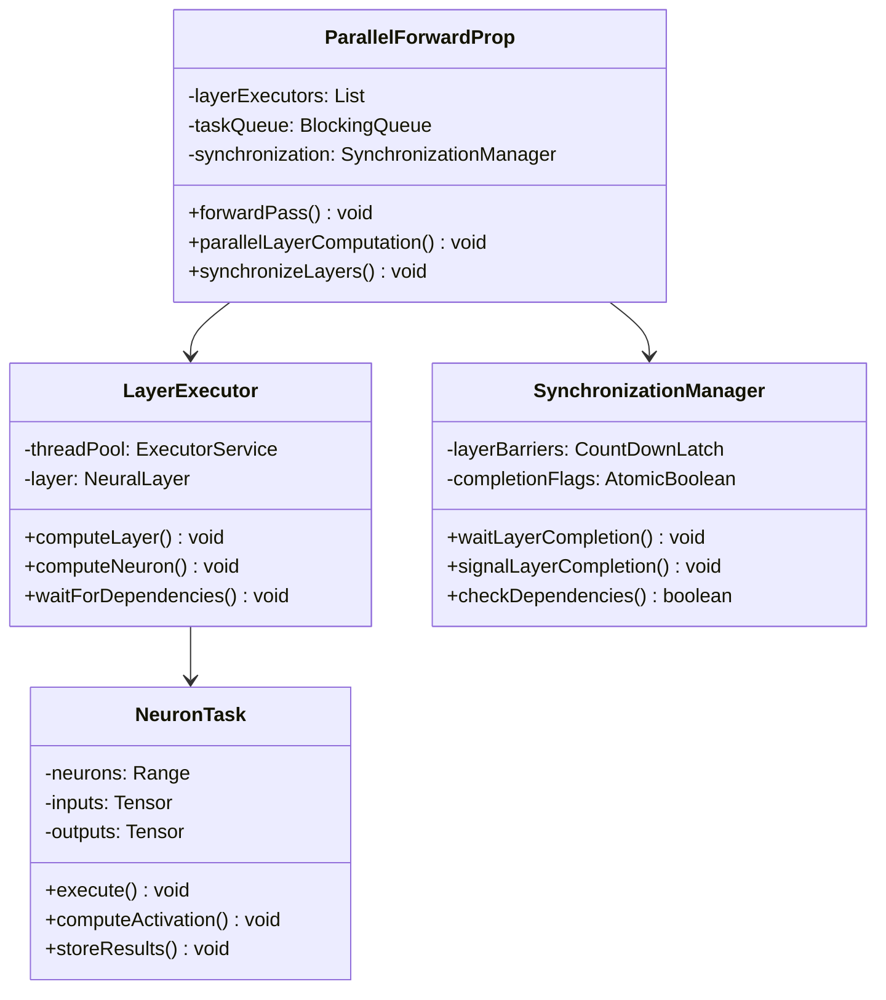

**前向传播并行化流程图**：
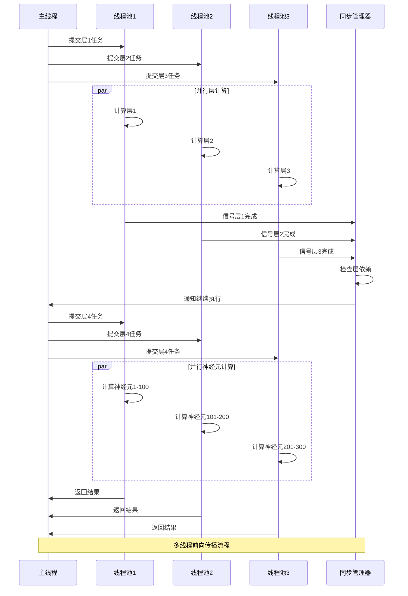

**32. 多线程梯度下降算法如何避免竞争条件？**

**面试场景**：并行算法专家面试，考查线程安全

**口语化答案**：
多线程梯度下降算法中，参数更新存在竞争条件，需要采用线程安全的技术来保证算法的正确性和收敛性。

**核心设计思路**：
使用原子操作更新参数，避免加锁带来的性能开销。实现无锁的梯度聚合，每个线程独立计算梯度，然后进行聚合。设计细粒度的锁策略，减少锁竞争范围。使用本地变量存储中间结果，减少共享状态。实现梯度延迟更新，允许一定的收敛误差以提升性能。设计版本化参数更新，检测和处理冲突。

**线程安全梯度下降实现图**：
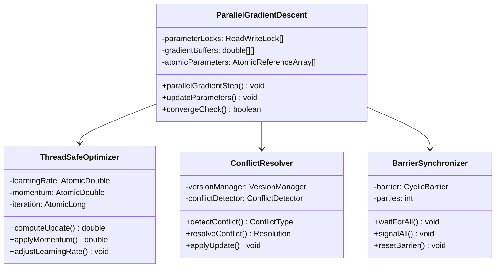

**梯度更新竞争避免策略图**：
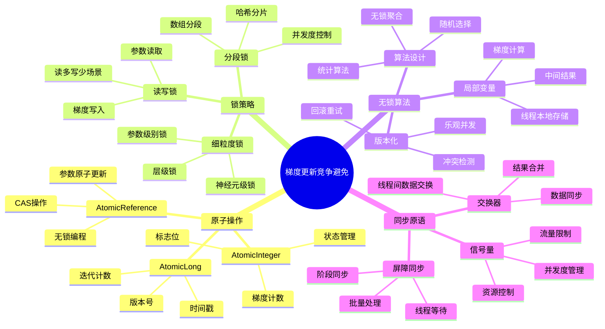

---

## 分布式训练算法设计

### ⭐⭐⭐ 专家题 (71-100)

**71. 如何设计可扩展的分布式随机梯度下降算法？**

**面试场景**：分布式AI系统架构师面试，考查分布式算法设计

**口语化答案**：
分布式随机梯度下降需要解决参数同步、通信开销、容错性和可扩展性等问题，设计一个高效可扩展的分布式算法架构。

**核心设计思路**：
设计参数服务器架构，集中管理模型参数。实现高效的梯度聚合算法，减少通信开销。采用异步参数更新，降低同步延迟。设计容错机制，处理节点故障和网络分区。实现动态的节点加入和退出机制，支持弹性扩展。优化网络通信协议，使用高效的数据压缩和传输格式。

**分布式SGD架构图**：
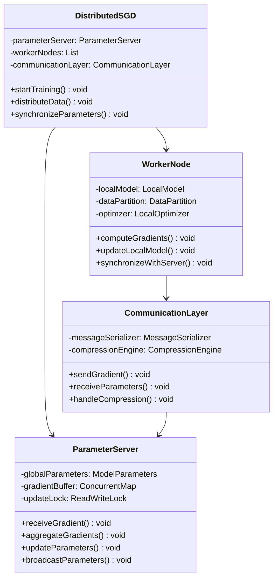

**分布式SGD通信协议图**：
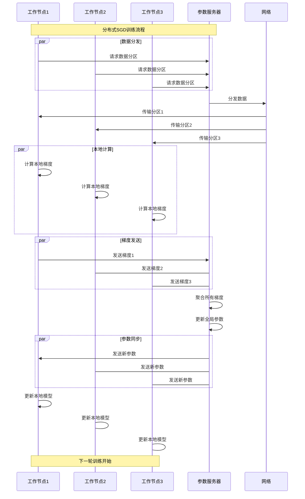

**72. 如何实现容错的分布式训练系统？**

**面试场景**：分布式系统专家面试，考查容错设计

**口语化答案**：
容错的分布式训练系统需要在节点故障、网络分区、数据损坏等异常情况下，保证训练的连续性和模型的正确性。

**核心设计思路**：
实现心跳检测机制，及时发现节点故障。设计参数备份和恢复机制，保证参数安全。实现检查点机制，支持训练状态的保存和恢复。设计故障转移策略，将故障节点的任务重新分配。实现最终一致性，允许临时的数据不一致。建立监控和告警系统，及时发现和处理异常。

**容错机制架构图**：
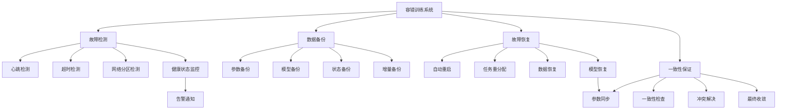

**容错策略决策图**：
```mermaid
flowchart TD
    A[故障检测] --> B{故障类型}

    B -->|节点故障| C[节点故障处理]
    B -->|网络故障| D[网络故障处理]
    B -->|数据故障| E[数据故障处理]
    B -->|软件故障| F[软件故障处理]

    C --> C1[节点下线]
    C --> C2[任务迁移]
    C --> C3[资源回收]

    D --> D1[网络重连]
    D --> D2[超时重试]
    D --> D3[备用链路]
    D --> D4[降级服务]

    E --> E1[数据校验]
    E --> E2[数据修复]
    E --> E3[数据重建]
    E --> E4[备份恢复]

    F --> F1[软件重启]
    F --> F2[状态重置]
    F --> F3[配置恢复]
    F --> F4[版本回滚]

    C2 --> G[训练继续]
    D2 --> G
    E3 --> G
    F3 --> G

    Note over A,G: 容错处理策略流程
```

---

## GPU加速与异构计算

### 高级应用题 (101-130)

**101. Java程序如何调用GPU进行加速计算？**

**面试场景**：异构计算专家面试，考查GPU编程

**口语化答案**：
Java程序可以通过JNI、CUDA、OpenCL等技术调用GPU进行并行计算，但需要考虑性能开销和开发复杂度。

**核心设计思路**：
使用JNI（Java Native Interface）调用C++/CUDA代码，实现GPU计算。设计Java到GPU的数据传输优化，减少内存拷贝。使用现有的GPU计算框架，如JCuda、TensorFlow Java API等。实现GPU内存管理和资源池化，提升效率。设计GPU-CPU的协同计算策略，合理分配计算任务。建立GPU性能监控和调优机制。

**Java GPU调用架构图**：
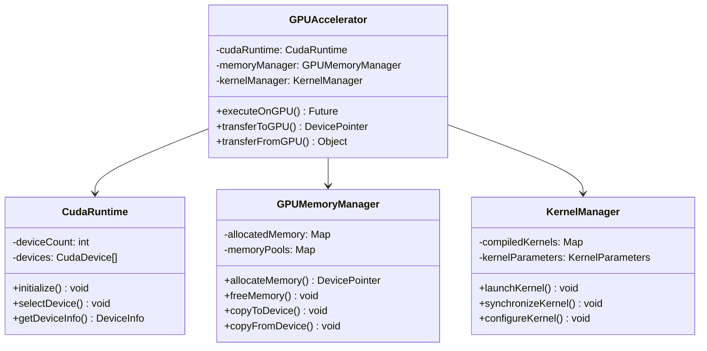

**Java-GPU数据传输优化图**：
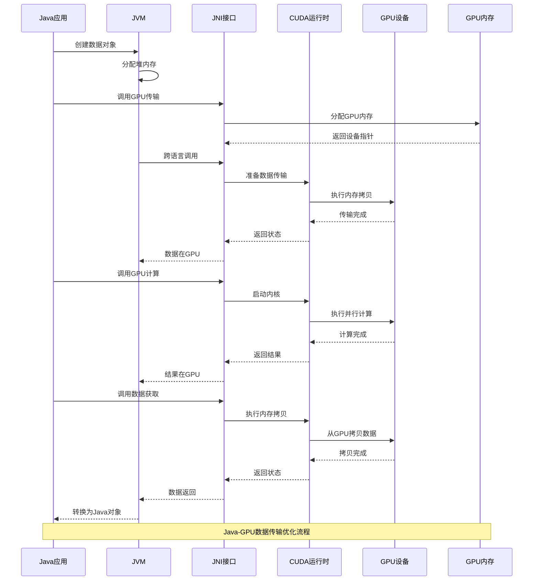

**GPU加速库选择对比图**：
```mermaid
radarChart
    title Java GPU加速库对比
    axis 性能, 易用性, 生态支持, 文档质量, 学习成本, 社区活跃度

    "JCuda" : 8, 6, 7, 6, 7, 6
    "TensorFlow Java" : 9, 9, 10, 9, 8, 10
    "PyTorch Java" : 9, 9, 10, 9, 8, 10
    "OpenCL" : 7, 6, 6, 7, 6, 5
    "自定义JNI" : 10, 3, 4, 3, 3, 2
    "DeepJava" : 6, 7, 5, 6, 7, 4
```

**GPU矩阵乘法优化实现代码示例**：
```java
/**
 * GPU加速的矩阵乘法实现
 */
public class GPUMatrixMultiplier {
    static {
        System.loadLibrary("gpucompute");
    }

    /**
     * 使用GPU执行矩阵乘法 C = A * B
     */
    public static float[][] multiply(float[][] a, float[][] b) {
        int m = a.length;
        int n = b[0].length;
        int p = b.length;

        if (a[0].length != p) {
            throw new IllegalArgumentException("Matrix dimensions not compatible");
        }

        float[][] result = new float[m][n];

        try (MemoryManager memoryManager = new MemoryManager()) {
            // 分配GPU内存
            DevicePointer deviceA = memoryManager.allocateDeviceMemory(m * p * 4);
            DevicePointer deviceB = memoryManager.allocateDeviceMemory(p * n * 4);
            DevicePointer deviceC = memoryManager.allocateDeviceMemory(m * n * 4);

            // 拷贝数据到GPU
            copyMatrixToDevice(a, deviceA);
            copyMatrixToDevice(b, deviceB);

            // 执行GPU矩阵乘法
            executeMatrixMultiplication(deviceA, deviceB, deviceC, m, n, p);

            // 拷贝结果回CPU
            copyDeviceToMatrix(deviceC, result);

            // 清理GPU内存
            memoryManager.freeDeviceMemory(deviceA);
            memoryManager.freeDeviceMemory(deviceB);
            memoryManager.freeDeviceMemory(deviceC);
        }

        return result;
    }

    private static native void executeMatrixMultiplication(
        DevicePointer a, DevicePointer b, DevicePointer c,
        int m, int n, int p
    );

    private static void copyMatrixToDevice(float[][] matrix, DevicePointer devicePtr) {
        int rows = matrix.length;
        int cols = matrix[0].length;
        float[] flatArray = new float[rows * cols];

        // 转换为一维数组
        for (int i = 0; i < rows; i++) {
            System.arraycopy(matrix[i], 0, flatArray, i * cols, cols);
        }

        // 复制到设备内存
        Pointer pointer = Pointer.toDevicePointer(devicePtr);
        pointer.setArray(flatArray);
    }

    private static void copyDeviceToMatrix(DevicePointer devicePtr, float[][] matrix) {
        int rows = matrix.length;
        int cols = matrix[0].length;
        float[] flatArray = new float[rows * cols];

        // 从设备内存拷贝
        Pointer pointer = Pointer.toDevicePointer(devicePtr);
        pointer.getArray(flatArray);

        // 转换为二维数组
        for (int i = 0; i < rows; i++) {
            System.arraycopy(flatArray, i * cols, matrix[i], 0, cols);
        }
    }
}

/**
 * GPU内存管理器
 */
class MemoryManager implements AutoCloseable {
    private final Map<String, DevicePointer> allocatedMemory = new HashMap<>();
    private long totalAllocated = 0;
    private static final long MAX_MEMORY = 1024 * 1024 * 1024; // 1GB

    public DevicePointer allocateDeviceMemory(long size) {
        if (totalAllocated + size > MAX_MEMORY) {
            throw new OutOfMemoryError("GPU memory limit exceeded");
        }

        DevicePointer devicePtr = allocateNativeMemory(size);
        allocatedMemory.put(UUID.randomUUID().toString(), devicePtr);
        totalAllocated += size;

        return devicePtr;
    }

    public void freeDeviceMemory(DevicePointer devicePtr) {
        // 实现实际的内存释放逻辑
        freeNativeMemory(devicePtr);
        totalAllocated -= devicePtr.size();
    }

    public void close() {
        // 释放所有分配的内存
        for (DevicePointer ptr : allocatedMemory.values()) {
            freeDeviceMemory(ptr);
        }
        allocatedMemory.clear();
    }

    private native DevicePointer allocateNativeMemory(long size);
    private native void freeNativeMemory(DevicePointer devicePtr);
}
```

---

## 并行化性能监控与调优

### 系统调优题 (131-160)

**131. 如何监控和优化AI训练的并行化性能？**

**面试场景**：性能调优专家面试，考查性能监控

**口语化答案**：
AI训练的并行化性能监控需要跟踪CPU/GPU利用率、通信开销、同步延迟等关键指标，通过数据驱动的优化策略提升训练效率。

**核心设计思路**：
建立多层次的监控系统，包括硬件层、系统层、算法层和应用层。收集并分析性能指标，识别性能瓶颈。实现自动化的性能调优机制，根据监控数据动态调整参数。设计性能基准测试，验证优化效果。建立性能分析和诊断工具，支持深度性能分析。创建性能监控仪表板，提供直观的可视化界面。

**并行化性能监控架构图**：
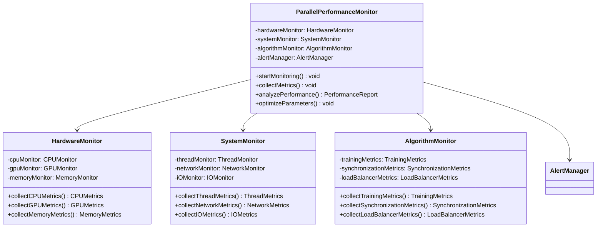

**性能监控指标体系图**：
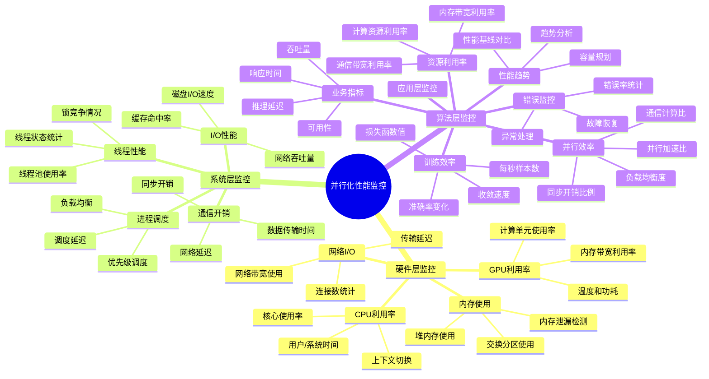

---

## 总结

Java算法在AI模型训练中的并行化优化需要掌握：

1. **并行化基础**：理解并行化原理和策略选择，评估并行化效果
2. **多线程优化**：实现线程安全的并行算法，避免竞争条件和死锁
3. **分布式算法**：设计可扩展的分布式训练架构，处理通信和同步问题
4. **异构计算**：利用GPU等异构设备加速计算，优化数据传输
5. **性能监控**：建立完善的监控体系，持续优化并行化性能

通过系统的并行化优化策略，AI模型训练可以获得显著的性能提升，大幅缩短训练时间，提高资源利用效率。