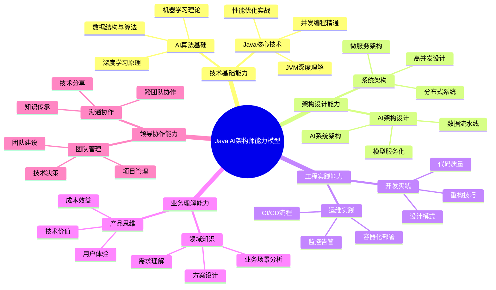
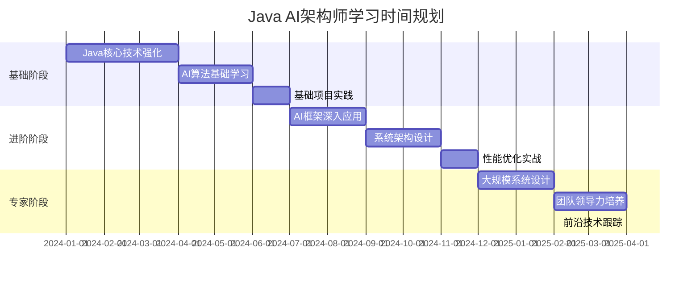
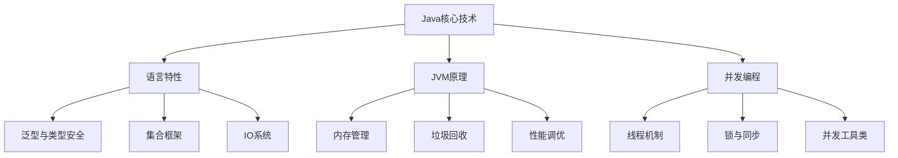
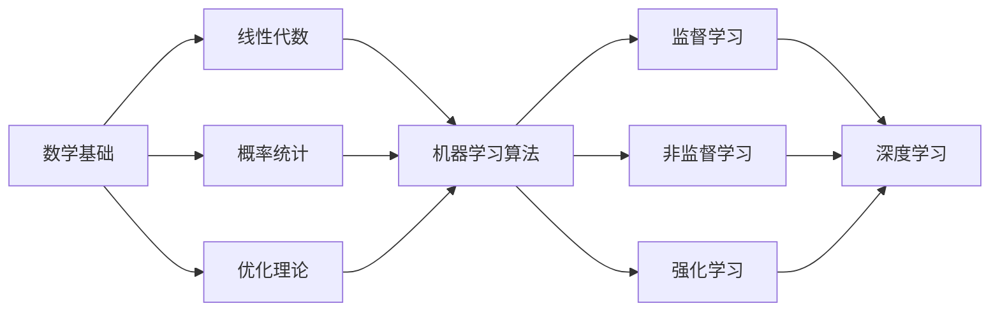
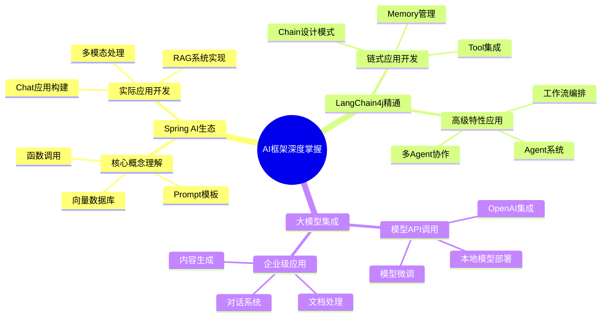
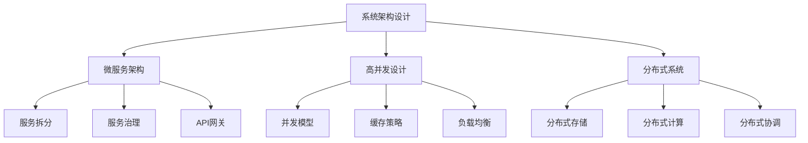
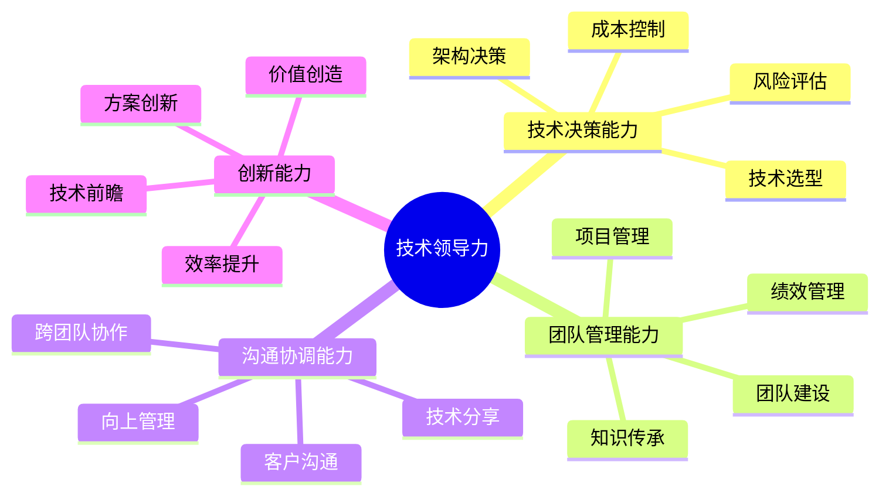
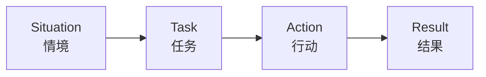

# Java AI架构师学习路径与使用指南

## 🎯 学习目标

为Java AI架构师候选人提供系统化的学习路径和详细的使用指南，帮助从基础到专家级全面发展，成功应对技术面试和实际工作挑战。

## 📚 目录

- [学习路径概览](#学习路径概览)
- [基础阶段学习指南](#基础阶段学习指南)
- [进阶阶段学习指南](#进阶阶段学习指南)
- [专家阶段学习指南](#专家阶段学习指南)
- [面试准备策略](#面试准备策略)
- [实战项目建议](#实战项目建议)
- [持续学习资源](#持续学习资源)

---

## 学习路径概览

### Java AI架构师能力模型



### 学习阶段时间规划



---

## 基础阶段学习指南

### 🎯 学习目标 (0-6个月)

建立扎实的Java基础和AI算法理论基础，能够独立完成简单的AI项目开发。

### 📖 核心学习内容

#### 1. Java核心技术深度掌握

**必读文档**：
- [01_Java基础语法与AI应用](01_Java核心技术篇/01_Java基础语法与AI应用/)
- [02_JVM与AI性能优化](01_Java核心技术篇/02_JVM与AI性能优化/)
- [05_Java并发编程与AI系统](01_Java核心技术篇/05_Java并发编程与AI系统/)

**学习重点**：


**实践项目**：
- 实现一个基于线程池的批量图片处理系统
- 开发一个支持高并发的数据缓存服务
- 构建一个JVM性能监控和调优工具

#### 2. AI算法基础理论

**必读文档**：
- [01_机器学习数学基础](02_AI基础理论篇/01_机器学习数学基础/)
- [02_深度学习理论](02_AI基础理论篇/02_深度学习理论/)

**学习路径**：


**实践练习**：
- 用Java实现基础机器学习算法（KNN、决策树、朴素贝叶斯）
- 构建简单的神经网络框架
- 完成 Kaggle 入门级竞赛项目

#### 3. AI框架入门

**必读文档**：
- [03_Java_AI框架篇](03_Java_AI框架篇/)

**框架学习优先级**：
1. **Deeplearning4j** - Java深度学习框架
2. **Weka** - 机器学习库
3. **Spring AI** - Spring生态AI集成

### 🎯 阶段目标检测

**技术能力清单**：
- [ ] 熟练掌握Java 8+新特性
- [ ] 深入理解JVM内存模型和GC机制
- [ ] 能够设计并发安全的多线程程序
- [ ] 掌握机器学习基本算法原理
- [ ] 能够使用至少一个Java AI框架
- [ ] 完成至少2个完整的AI项目

**面试准备重点**：
- Java并发编程面试题
- JVM内存管理和调优
- 基础算法题（排序、查找、动态规划）
- 机器学习算法原理和实现

---

## 进阶阶段学习指南

### 🎯 学习目标 (6-12个月)

掌握AI系统架构设计能力，能够设计和实现中等复杂度的AI服务系统。

### 📖 核心学习内容

#### 1. AI框架深度应用

**必读文档**：
- [01_Spring AI与OpenAI集成开发](03_Java_AI框架篇/01_Spring_AI实战/)
- [02_LangChain4j开发](03_Java_AI框架篇/02_LangChain4j开发/)
- [06_大语言模型LLM与Java集成](03_Java_AI框架篇/06_大语言模型LLM与Java集成/)

**深度学习目标**：


#### 2. 系统架构设计

**必读文档**：
- [01_基于Spring Cloud的AI微服务架构设计](05_系统架构设计篇/01_AI微服务架构/)
- [02_千万级并发AI推理架构设计](05_系统架构设计篇/02_高并发AI系统设计/)
- [04_低延迟实时AI推理系统设计](05_系统架构设计篇/04_实时AI推理架构/)

**架构能力培养**：


**实践项目**：
- 设计一个支持多租户的AI推理平台
- 构建一个实时推荐系统
- 开发一个分布式模型训练系统

#### 3. MLOps工程化

**必读文档**：
- [04_MLOps实战篇](04_MLOps实战篇/)

**核心技能**：
- 模型版本管理和部署
- 数据流水线构建
- 模型监控和A/B测试
- 自动化CI/CD流程

### 🎯 阶段目标检测

**技术能力清单**：
- [ ] 能够设计和实现微服务架构
- [ ] 掌握高并发系统设计原理
- [ ] 熟练使用Spring AI和LangChain4j
- [ ] 具备MLOps工程化能力
- [ ] 能够进行系统性能优化
- [ ] 完成至少1个中等复杂度AI系统

**面试准备重点**：
- 系统设计面试题
- 分布式系统原理
- 性能优化案例分析
- 项目架构设计经验

---

## 专家阶段学习指南

### 🎯 学习目标 (12-24个月)

成为能够领导大型AI项目、解决复杂技术难题的资深架构师。

### 📖 核心学习内容

#### 1. 大规模系统架构

**必读文档**：
- [06_项目实战与领导力篇](06_项目实战与领导力篇/)
- [07_2024年最新技术趋势](07_2024年最新技术趋势/)

**专家级能力**：
```mermaid
radarChart
    title 架构师核心能力评估
    axis 技术深度, 架构思维, 工程实践, 业务理解, 领导能力, 创新能力

    "初级工程师" : 3, 2, 3, 2, 1, 2
    "高级工程师" : 7, 6, 7, 5, 4, 5
    "架构师" : 9, 9, 8, 8, 7, 8
    "资深架构师" : 10, 10, 9, 9, 9, 9
```

#### 2. 前沿技术跟踪

**技术热点**：
- 大语言模型和企业级应用
- 多模态AI系统
- 边缘计算和TinyML
- AI安全与伦理
- 云原生AI架构

#### 3. 技术领导力培养

**领导能力维度**：


### 🎯 阶段目标检测

**技术能力清单**：
- [ ] 能够设计千万级并发的AI系统
- [ ] 具备技术团队管理经验
- [ ] 掌握前沿AI技术趋势
- [ ] 能够进行技术架构决策
- [ ] 具备跨团队协作能力
- [ ] 有成功的大型项目经验

---

## 面试准备策略

### 📋 面试类型分析

#### 1. 技术面试准备

**Java基础面试**：
- 集合框架源码分析
- 并发编程原理和实践
- JVM内存模型和调优
- 设计模式应用

**AI技术面试**：
- 机器学习算法原理
- 深度学习框架使用
- 模型优化和部署
- AI系统架构设计

**系统设计面试**：
- 需求分析和系统设计
- 架构选型和权衡
- 性能优化方案
- 扩展性设计

#### 2. 行为面试准备

**常见问题类型**：
- 项目经验分享
- 技术难点解决
- 团队协作案例
- 技术决策过程

**STAR原则应用**：


### 🎯 面试模拟练习

#### 技术面试模拟题

**初级题目**：
"请用Java实现一个简单的K近邻算法，并解释其时间复杂度。"

**中级题目**：
"设计一个支持高并发的AI推理服务，需要考虑哪些方面？请画出架构图。"

**高级题目**：
"如何设计一个支持千万级用户的推荐系统？请详细说明架构设计和技术选型。"

---

## 实战项目建议

### 🏗️ 项目复杂度分级

#### 入门级项目 (1-2个月)

1. **手写数字识别系统**
   - 技术栈：Java + MNIST数据集 + 神经网络
   - 学习目标：理解深度学习基本原理

2. **电影推荐系统**
   - 技术栈：Java + 协同过滤算法 + Spring Boot
   - 学习目标：掌握推荐算法基础

3. **情感分析工具**
   - 技术栈：Java + NLP + 机器学习
   - 学习目标：了解文本处理技术

#### 进阶级项目 (2-4个月)

1. **智能客服机器人**
   - 技术栈：Spring AI + LangChain4j + 向量数据库
   - 学习目标：掌握大模型应用开发

2. **实时图像识别服务**
   - 技术栈：Spring Cloud + 深度学习模型 + 微服务
   - 学习目标：学习AI系统架构设计

3. **分布式模型训练平台**
   - 技术栈：Java + Spark + 分布式计算
   - 学习目标：理解大规模AI系统

#### 专家级项目 (4-6个月)

1. **企业级AI平台**
   - 技术栈：微服务架构 + K8s + 多种AI框架
   - 学习目标：掌握大型AI系统设计

2. **多模态AI助手**
   - 技术栈：大模型 + 图像识别 + 语音处理
   - 学习目标：了解多模态AI技术

### 📊 项目评估标准

```mermaid
radarChart
    title 项目质量评估维度
    axis 技术难度, 创新性, 实用价值, 代码质量, 文档完整, 部署运维

    "入门项目" : 3, 2, 4, 5, 4, 3
    "进阶项目" : 6, 5, 7, 7, 6, 6
    "专家项目" : 9, 8, 9, 9, 8, 8
```

---

## 持续学习资源

### 📚 推荐书籍

**Java技术**：
- 《深入理解Java虚拟机》
- 《Java并发编程实战》
- 《Effective Java》

**AI技术**：
- 《深度学习》- Ian Goodfellow
- 《机器学习》- 周志华
- 《模式识别与机器学习》

**系统设计**：
- 《大型网站技术架构》
- 《分布式系统原理与范型》
- 《数据密集型应用系统设计》

### 🌐 在线资源

**技术博客**：
- Martin Fowler的博客
- Netflix技术博客
- AWS架构博客

**开源项目**：
- Apache Spark
- TensorFlow Java API
- Spring AI项目

**在线课程**：
- Coursera机器学习课程
- fast.ai深度学习课程
- Oracle Java官方教程

### 🤝 技术社区

**参与方式**：
- 技术会议和Meetup
- 开源项目贡献
- 技术博客写作
- 代码审查和学习

**建立影响力**：
- GitHub活跃贡献
- 技术分享演讲
- 专利和论文发表

---

## 总结

Java AI架构师的成长是一个持续学习的过程，需要：

1. **扎实的技术基础**：Java核心技术和AI理论基础
2. **丰富的实践经验**：通过项目实战提升能力
3. **系统性思维**：具备架构设计和问题解决能力
4. **持续学习能力**：跟踪技术前沿，保持技术敏感度
5. **软技能培养**：沟通协作和领导能力

通过本学习指南的系统性学习，结合实际项目的反复实践，相信每一位Java开发者都能够成长为优秀的AI架构师。

**记住：技术的深度决定了你能走多远，广度决定了你能看到多美的风景。**

---

*最后更新：2024年12月*
*版本：v1.0*
*作者：Java AI架构师团队*