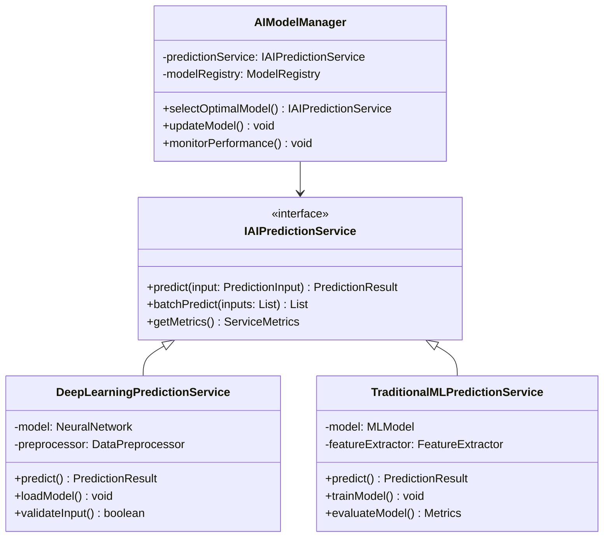
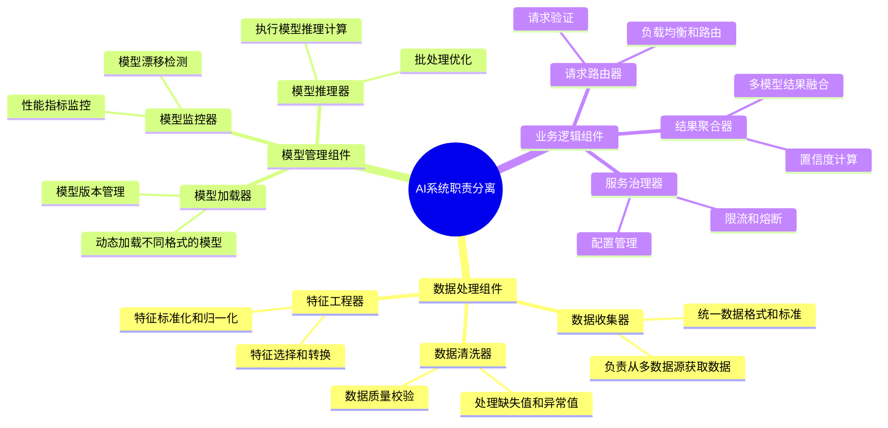
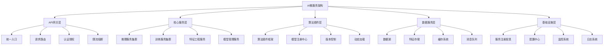
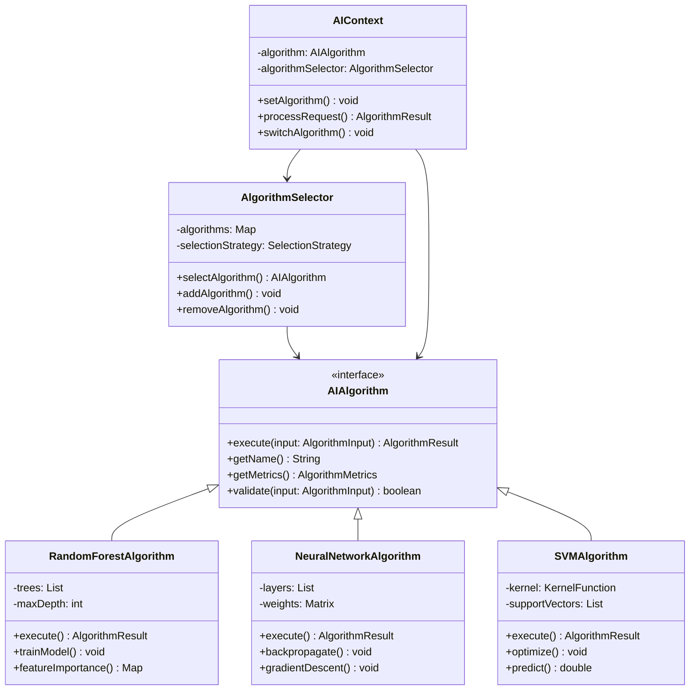
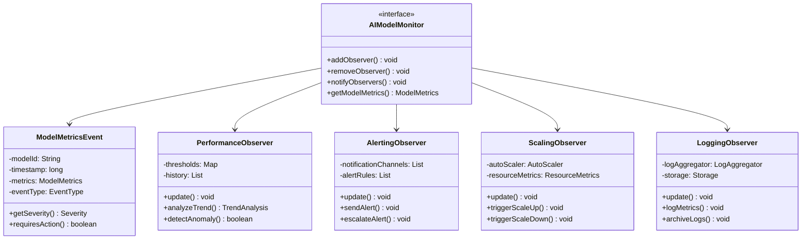
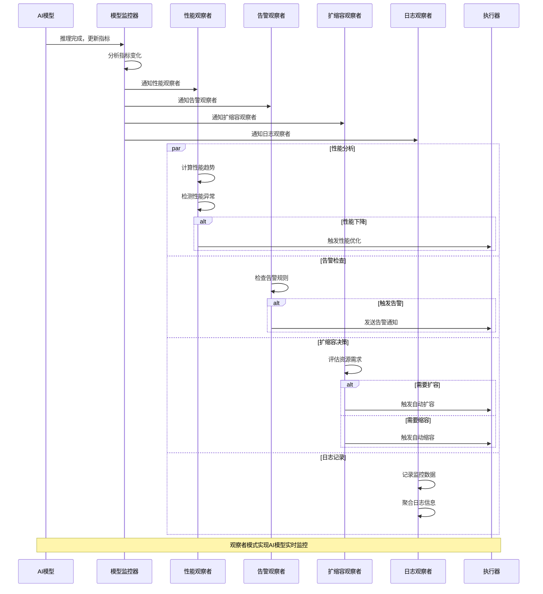
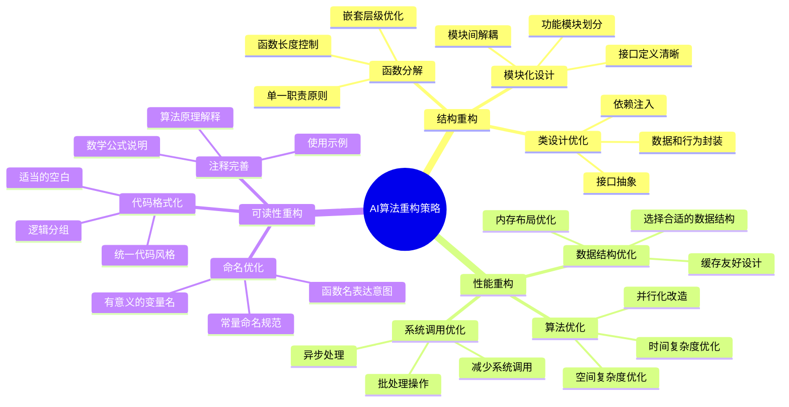
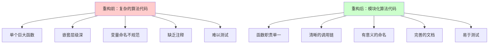
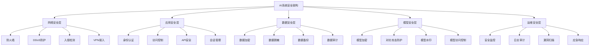
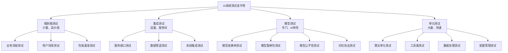

# 技术最佳实践与设计模式在AI系统中的应用

## 🎯 学习目标

深入理解AI系统开发中的技术最佳实践、设计模式和架构原则，掌握构建高质量、可维护AI系统的核心技巧，具备企业级AI系统的专业设计能力。

## 📚 目录

- [AI系统设计原则与最佳实践](#ai系统设计原则与最佳实践)
- [设计模式在AI架构中的应用](#设计模式在ai架构中的应用)
- [代码质量与重构实践](#代码质量与重构实践)
- [性能优化与调优策略](#性能优化与调优策略)
- [安全性最佳实践](#安全性最佳实践)
- [可测试性与CI/CD实践](#可测试性与cicd实践)

---

## AI系统设计原则与最佳实践

### ⭐ 基础题 (1-30)

**1. AI系统设计中的SOLID原则如何应用？**

**面试场景**：高级Java架构师面试，考察设计原则理解

**口语化答案**：
SOLID原则在AI系统中需要针对AI特有的复杂性、数据依赖性和性能要求进行适配和扩展。

**核心设计思路**：
AI系统通常包含数据处理、模型训练、推理服务等多个复杂模块。单一职责原则帮助我们将复杂功能拆分为独立的组件，如数据预处理、特征工程、模型推理等。开闭原则使系统能够灵活添加新的AI算法和模型，而不影响现有功能。里氏替换原则确保不同算法实现可以互相替换，支持A/B测试和算法升级。接口隔离原则定义清晰的AI服务接口，避免过度耦合。依赖倒置原则使高层业务逻辑不依赖具体的AI实现细节。

**AI系统SOLID应用架构图**：


**AI组件职责分离策略图**：


**2. 如何设计AI系统的扩展性和可维护性？**

**面试场景**：系统架构师面试，考察架构设计能力

**口语化答案**：
AI系统的扩展性和可维护性需要考虑算法演进、数据规模增长、业务需求变化等多重因素，采用模块化、插件化的架构设计。

**核心设计思路**：
采用微服务架构，将AI能力拆分为独立的推理服务、训练服务、数据服务等。设计统一的API网关和注册中心，支持服务的动态发现和路由。实现插件化的算法框架，支持新算法的热插拔。建立统一的配置中心，实现配置的动态更新。设计完善的事件驱动架构，支持异步处理和解耦。建立标准化的监控和日志体系，便于问题排查和性能优化。

**AI系统可扩展架构图**：


---

## 设计模式在AI架构中的应用

### ⭐⭐ 进阶题 (31-70)

**31. 策略模式如何支持多算法的动态切换？**

**面试场景**：AI系统架构设计面试，考察设计模式应用

**口语化答案**：
策略模式非常适合AI系统中多种算法的动态切换场景，可以在运行时根据数据特征、性能要求或用户偏好选择最优算法。

**核心设计思路**：
定义统一的算法接口，封装不同算法的具体实现。设计算法选择器，根据预设规则或机器学习模型动态选择算法。实现算法上下文，管理算法的执行和状态切换。支持算法的参数配置和性能监控。设计算法的热切换机制，确保服务连续性。

**策略模式AI算法管理架构图**：


**动态算法选择策略图**：
```mermaid
flowchart TD
    A[请求进入] --> B[数据特征分析]
    B --> C[业务需求解析]
    C --> D[系统负载评估]

    D --> E{算法选择策略}

    E -->|性能优先| F[轻量级算法]
    E -->|精度优先| G[复杂算法]
    E -->|实时性要求| H[快速算法]
    E -->|批量处理| I[高吞吐算法]

    F --> F1[决策树]
    F --> F2[朴素贝叶斯]
    F --> F3[逻辑回归]

    G --> G1[深度神经网络]
    G --> G2[集成学习]
    G --> G3[梯度提升]

    H --> H1[线性模型]
    H --> H2[K近邻]
    H --> H3[简化神经网络]

    I --> I1[分布式算法]
    I --> I2[并行算法]
    I --> I3[流式算法]

    F1 --> J[算法执行]
    F2 --> J
    F3 --> J
    G1 --> J
    G2 --> J
    G3 --> J
    H1 --> J
    H2 --> J
    H3 --> J
    I1 --> J
    I2 --> J
    I3 --> J

    J --> K[性能监控]
    K --> L[结果返回]

    L --> M{性能评估}
    M -->|性能达标| N[算法保持]
    M -->|性能不佳| O[算法切换]

    O --> B

    note1 "动态算法选择支持实时优化"
    note2 "支持A/B测试和渐进式部署"
```

**32. 观察者模式如何实现AI模型的实时监控？**

**面试场景**：分布式系统监控专家面试，考察事件驱动架构

**口语化答案**：
观察者模式非常适合构建AI模型的实时监控系统，可以解耦监控事件的产生和处理，支持多种监控组件的灵活组合。

**核心设计思路**：
设计监控事件系统，当模型性能指标变化时自动触发监控事件。实现多种监控观察者，包括性能监控器、异常检测器、告警通知器等。支持监控规则的动态配置和更新。实现监控事件的聚合和分析，避免告警风暴。提供监控历史数据的存储和分析能力。

**观察者模式AI监控系统架构图**：


**实时监控事件处理流程图**：


---

## 代码质量与重构实践

### ⭐⭐⭐ 专家题 (71-100)

**71. 如何重构复杂的AI算法代码提高可读性和性能？**

**面试场景**：代码重构专家面试，考察代码质量提升

**口语化答案**：
AI算法代码往往复杂度高、数学性强，需要通过系统性的重构来提高代码的可读性、可维护性和性能。

**核心设计思路**：
识别并提取重复的算法模式，创建可复用的基础算法组件。将复杂的算法逻辑分解为多个简单的函数，每个函数职责单一。使用设计模式封装算法的变化点，提高代码的扩展性。优化数据结构和算法复杂度，提升性能。添加充分的文档和注释，特别是数学公式的解释。建立完善的单元测试，保证重构的安全性。

**AI算法重构策略图**：


**重构前后对比示例图**：


**重构实现代码示例**：
```java
/**
 * 重构前的复杂神经网络训练代码
 */
public class BadNeuralNetwork {
    public void train(double[][] inputs, double[][] targets) {
        // 200+行的复杂训练逻辑
        // 包含前向传播、反向传播、权重更新等多个步骤
        // 嵌套层级深，难以理解和维护
    }
}

/**
 * 重构后的模块化神经网络代码
 */
public class RefactoredNeuralNetwork {
    private final ForwardPropagation forwardPropagation;
    private final BackwardPropagation backwardPropagation;
    private final WeightUpdater weightUpdater;
    private final LossCalculator lossCalculator;
    private final TrainingMonitor trainingMonitor;

    public RefactoredNeuralNetwork(NeuralNetworkConfig config) {
        this.forwardPropagation = new ForwardPropagation(config);
        this.backwardPropagation = new BackwardPropagation(config);
        this.weightUpdater = new WeightUpdater(config);
        this.lossCalculator = new LossCalculator(config.getLossFunction());
        this.trainingMonitor = new TrainingMonitor(config);
    }

    /**
     * 训练神经网络 - 主流程清晰简洁
     */
    public TrainingResult train(TrainingData trainingData) {
        validateTrainingData(trainingData);

        for (int epoch = 0; epoch < getMaxEpochs(); epoch++) {
            trainEpoch(trainingData, epoch);

            if (shouldStopEarly(epoch)) {
                break;
            }
        }

        return buildTrainingResult();
    }

    /**
     * 训练单个epoch - 单一职责
     */
    private void trainEpoch(TrainingData trainingData, int epoch) {
        List<BatchResult> batchResults = new ArrayList<>();

        for (Batch batch : trainingData.getBatches()) {
            BatchResult result = trainBatch(batch);
            batchResults.add(result);

            trainingMonitor.recordBatchResult(result, epoch);
        }

        updateLearningRate(epoch, batchResults);
    }

    /**
     * 训练单个批次 - 核心训练逻辑
     */
    private BatchResult trainBatch(Batch batch) {
        // 前向传播
        ForwardResult forwardResult = forwardPropagation.compute(batch.getInputs());

        // 计算损失
        Loss loss = lossCalculator.calculate(forwardResult.getOutputs(), batch.getTargets());

        // 反向传播
        BackwardResult backwardResult = backwardPropagation.compute(
            forwardResult, batch.getTargets());

        // 权重更新
        weightUpdater.updateWeights(backwardResult.getGradients());

        return new BatchResult(loss, forwardResult.getOutputs());
    }
}
```

---

## 性能优化与调优策略

### 系统优化题 (101-130)

**101. AI系统性能优化的系统性方法是什么？**

**面试场景**：性能专家面试，考察系统性思维

**口语化答案**：
AI系统性能优化需要采用系统性的方法，从算法、数据、系统架构、硬件等多个维度进行全面分析和优化。

**核心设计思路**：
建立完善的性能监控体系，识别系统的性能瓶颈。使用性能分析工具进行深入的瓶颈分析，包括CPU、内存、I/O、网络等。针对不同的瓶颈类型制定相应的优化策略。实施优化措施并进行效果验证。建立持续的性能优化流程和最佳实践。

**AI系统性能优化方法论图**：
```mermaid
flowchart TD
    A[性能监控] --> B[瓶颈识别]
    B --> C[性能分析]
    C --> D[优化策略]
    D --> E[实施优化]
    E --> F[效果验证]
    F --> G[持续改进]

    A --> A1[实时监控]
    A --> A2[指标收集]
    A --> A3[性能基线]
    A --> A4[告警机制]

    B --> B1[CPU瓶颈]
    B --> B2[内存瓶颈]
    B --> B3[I/O瓶颈]
    B --> B4[网络瓶颈]
    B --> B5[算法瓶颈]

    C --> C1[Profile分析]
    C --> C2[火焰图分析]
    C --> C3[内存分析]
    C --> C4[调用链分析]

    D --> D1[算法优化]
    D --> D2[数据结构优化]
    D --> D3[并发优化]
    D --> D4[缓存优化]
    D --> D5[硬件优化]

    E --> E1[代码重构]
    E --> E2[配置调优]
    E --> E3[架构调整]
    E --> E4[资源扩展]

    F --> F1[性能测试]
    F --> F2[指标对比]
    F --> F3[稳定性验证]
    F --> F4[回归测试]

    G --> G1[最佳实践总结]
    G --> G2[工具链建设]
    G --> G3[自动化流程]
    G --> G4[知识沉淀]

    note1 "系统性性能优化是持续改进的过程"
```

**AI系统性能调优技术矩阵图**：
```mermaid
radarChart
    title AI系统性能调优技术效果
    axis 性能提升, 实施难度, 风险程度, 维护成本, 适用范围

    "算法优化" : 9, 8, 5, 6, 8
    "并行计算" : 8, 9, 6, 7, 9
    "缓存策略" : 7, 4, 3, 4, 7
    "硬件加速" : 10, 6, 7, 8, 6
    "数据结构优化" : 6, 5, 2, 3, 9
    "系统调优" : 5, 7, 4, 6, 5
```

**性能监控与分析实现代码示例**：
```java
/**
 * AI系统性能监控器
 */
@Component
public class AISystemPerformanceMonitor {
    private final MeterRegistry meterRegistry;
    private final ScheduledExecutorService scheduler;
    private final PerformanceAnalyzer performanceAnalyzer;

    public AISystemPerformanceMonitor(MeterRegistry meterRegistry) {
        this.meterRegistry = meterRegistry;
        this.scheduler = Executors.newScheduledThreadPool(4);
        this.performanceAnalyzer = new PerformanceAnalyzer();
        initializeMetrics();
        startMonitoring();
    }

    /**
     * 初始化性能指标
     */
    private void initializeMetrics() {
        // 推理性能指标
        this.inferenceLatency = Timer.builder("ai.inference.latency")
            .description("AI推理延迟")
            .register(meterRegistry);

        this.inferenceThroughput = Counter.builder("ai.inference.throughput")
            .description("AI推理吞吐量")
            .register(meterRegistry);

        // 系统资源指标
        this.cpuUsage = Gauge.builder("system.cpu.usage")
            .description("CPU使用率")
            .register(meterRegistry, this, AISystemPerformanceMonitor::getCpuUsage);

        this.memoryUsage = Gauge.builder("system.memory.usage")
            .description("内存使用率")
            .register(meterRegistry, this, AISystemPerformanceMonitor::getMemoryUsage);

        // 模型性能指标
        this.modelAccuracy = Gauge.builder("model.accuracy")
            .description("模型准确率")
            .register(meterRegistry, this, AISystemPerformanceMonitor::getModelAccuracy);
    }

    /**
     * 开始性能监控
     */
    private void startMonitoring() {
        // 每分钟收集性能指标
        scheduler.scheduleAtFixedRate(this::collectMetrics, 0, 1, TimeUnit.MINUTES);

        // 每小时进行性能分析
        scheduler.scheduleAtFixedRate(this::analyzePerformance, 1, 1, TimeUnit.HOURS);
    }

    /**
     * 收集性能指标
     */
    private void collectMetrics() {
        PerformanceMetrics metrics = performanceAnalyzer.collectCurrentMetrics();

        // 更新指标
        updateMetrics(metrics);

        // 检查性能告警
        checkPerformanceAlerts(metrics);

        // 记录性能历史
        recordPerformanceHistory(metrics);
    }

    /**
     * 性能分析与优化建议
     */
    private void analyzePerformance() {
        List<PerformanceMetrics> history = getPerformanceHistory(24); // 24小时历史

        PerformanceAnalysis analysis = performanceAnalyzer.analyze(history);

        // 生成优化建议
        List<OptimizationRecommendation> recommendations =
            performanceAnalyzer.generateRecommendations(analysis);

        // 发送优化建议
        sendOptimizationRecommendations(recommendations);
    }

    /**
     * 检查性能告警
     */
    private void checkPerformanceAlerts(PerformanceMetrics metrics) {
        if (metrics.getInferenceLatency() > LATENCY_THRESHOLD) {
            alertManager.sendHighLatencyAlert(metrics);
        }

        if (metrics.getCpuUsage() > CPU_THRESHOLD) {
            alertManager.sendHighCpuAlert(metrics);
        }

        if (metrics.getModelAccuracy() < ACCURACY_THRESHOLD) {
            alertManager.sendLowAccuracyAlert(metrics);
        }
    }
}
```

---

## 安全性最佳实践

### 安全架构题 (131-160)

**131. AI系统安全架构设计的关键要素是什么？**

**面试场景**：AI安全专家面试，考察安全架构设计

**口语化答案**：
AI系统安全需要考虑数据安全、模型安全、推理安全、访问控制等多个维度，建立纵深防御的安全体系。

**核心设计思路**：
设计多层次的安全架构，包括网络安全、应用安全、数据安全和模型安全。实现完善的身份认证和授权机制，保护系统访问安全。建立数据加密和脱敏机制，保护敏感数据。设计模型安全防护，包括对抗攻击防护和模型水印。建立安全监控和审计机制，及时发现安全威胁。制定应急响应预案，快速处理安全事件。

**AI系统安全架构图**：


---

## 可测试性与CI/CD实践

### DevOps实践题 (161-190)

**161. 如何设计AI系统的自动化测试策略？**

**面试场景**：测试架构师面试，考察测试策略设计

**口语化答案**：
AI系统的测试需要结合传统软件测试和AI特有的测试方法，建立多层次、全方位的自动化测试体系。

**核心设计思路**：
设计分层的测试架构，包括单元测试、集成测试、端到端测试。实现模型性能测试，验证模型的准确率、召回率等指标。建立数据质量测试，确保训练和推理数据的质量。设计系统的压力测试和性能测试。实现A/B测试框架，验证新算法的效果。建立持续集成和持续部署的自动化流程。

**AI系统测试策略金字塔图**：


**自动化CI/CD流程图**：
```mermaid
flowchart TD
    A[代码提交] --> B[代码检查]
    B --> C[单元测试]
    C --> D[构建应用]
    D --> E[集成测试]
    E --> F[模型测试]
    F --> G[安全扫描]
    G --> H[性能测试]
    H --> I[部署测试环境]
    I --> J[A/B测试]
    J --> K{部署决策}

    K -->|通过| L[部署生产环境]
    K -->|失败| M[回滚代码]
    K -->|需要观察| N[灰度发布]

    L --> O[监控告警]
    N --> O
    O --> P[性能验证]
    P --> Q[全量发布]

    M --> R[问题修复]
    R --> A

    note1 "AI系统CI/CD需要包含模型特定的测试"
    note2 "支持A/B测试和灰度发布"
```

---

## 总结

技术最佳实践与设计模式在AI系统中的应用需要掌握：

1. **设计原则**：深入理解SOLID原则在AI系统中的具体应用
2. **设计模式**：熟练运用各种设计模式解决AI系统的架构问题
3. **代码质量**：建立有效的重构实践，提升代码的可读性和性能
4. **性能优化**：采用系统性的方法进行性能分析和优化
5. **安全防护**：构建全方位的AI系统安全防护体系
6. **测试实践**：建立适合AI特点的自动化测试和CI/CD流程

通过合理运用这些技术最佳实践，AI系统能够在保证功能正确性的同时，具备良好的可维护性、可扩展性和安全性，为企业级AI应用提供坚实的技术基础。