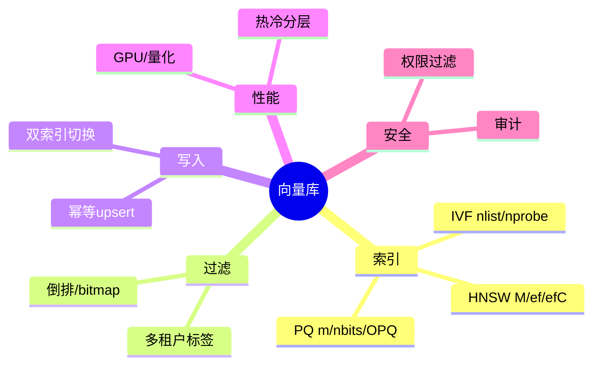
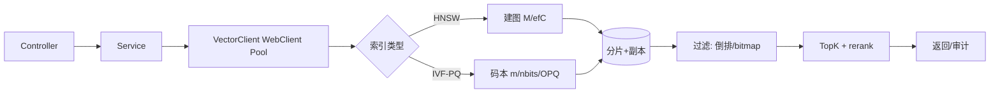

# 向量数据库与检索（Java 工程化版）

> 序号：0001 ｜ 主题：向量库/检索 ｜ 目标：提供可落地的 Java/Spring 实践、方案对比、代码示例、流程与答题模板。篇幅约 1200+ 字。

## 脑图（Mermaid）


## 流程图


## Java 代码示例（WebClient 客户端封装）
```java
@Component
public class VectorClient {
  private final WebClient client;

  public VectorClient(WebClient.Builder builder) {
    this.client = builder
        .baseUrl("http://vector-service")
        .clientConnector(new ReactorClientHttpConnector(
            HttpClient.create()
              .option(ChannelOption.CONNECT_TIMEOUT_MILLIS, 200)
              .responseTimeout(Duration.ofMillis(800))
              .doOnConnected(c -> c.addHandlerLast(new ReadTimeoutHandler(1)))
        ))
        .filter(ExchangeFilterFunctions.statusError(
            HttpStatusCode::is5xxServerError,
            resp -> new IllegalStateException("vector 5xx")))
        .build();
  }

  public Mono<SearchResult> search(VectorQuery q) {
    return client.post()
        .uri("/search")
        .bodyValue(q)
        .retrieve()
        .bodyToMono(SearchResult.class)
        .timeout(Duration.ofMillis(1000))
        .retryWhen(Retry.backoff(2, Duration.ofMillis(100))
          .filter(t -> t instanceof TimeoutException))
        .onErrorResume(e -> Mono.just(SearchResult.empty()));
  }
}
```

## 关键知识（按必会/进阶/加分）
- 必会：HNSW 参数 M/ef/efC；IVF nlist/nprobe；PQ m/nbits/OPQ；cosine/IP 归一化；幂等 upsert；倒排+ANN 混合过滤；P99、召回率、构建时长监控。
- 进阶：多租户分片/副本；冷热分层；异步重建+双索引切换；高基数标签过滤（bitmap+分桶）；权限过滤前置；跨 Region 副本。
- 加分：GPU HNSW/IVF；自动调参（动态 ef/nprobe）；OPQ 降误差；向量去重与相似度抑制；Speculative rerank（先粗召回后小重排）。

## 方案与对比
- HNSW vs IVF-PQ：高精度/内存占用 vs 压缩/大规模；延迟中 vs 低-中；热数据用 HNSW，冷数据用 IVF-PQ。
- 客户端 WebClient vs OkHttp：WebClient 适合响应式、池化与超时易调；OkHttp 简洁但需自管线程模型。
- 过滤策略：前置倒排缩候选；融合过滤与 ANN；候选不足可放宽阈值或切到高精度索引。

## 实战方案（示例）
1. 索引布局：租户+时间分片，副本≥2；热分片 HNSW，冷分片 IVF-PQ。
2. 写入：批量 upsert，写底层存储后再刷索引；幂等键；异步合并段；双索引灰度切换。
3. 查询：WebClient 池化、超时/重试；动态 ef/nprobe（高优先级请求提升）；过滤前置倒排；TopK 后 cross-encoder rerank。
4. 观测：QPS/P99/错误率；召回 A/B；索引构建与重建时长；热点分布；bitmap 大小；池耗尽指标。
5. 安全：权限标签过滤；审计日志；限速与配额；禁止敏感字段入向量。

## 问题与答案（Q&A）
1) 问：HNSW 参数如何平衡召回与资源？  
   答：M=16/32 控内存；efC 200-400 保建图质量；查询 ef 动态调，P99 高时先降 ef；热点分片多副本。  
   追问：内存紧张仍要召回高？→ 尾部数据切到 IVF-Flat/PQ，头部保 HNSW。

2) 问：IVF-PQ 召回掉了怎么办？  
   答：调 nprobe 曲线；检查码本误差与簇均衡；头部改 IVF-Flat；OPQ 降误差；必要时提高 m/nbits。  
   追问：不重建全量如何调码本？→ 增量训练+双索引灰度。

3) 问：高基数过滤怎么做？  
   答：倒排/bitmap 前置过滤分片；极端高基数可分桶；候选不足放宽阈值或切高精度；监控 bitmap 膨胀。  
   追问：bitmap 膨胀控内存？→ RoaringBitmap/分层 bitmap。

4) 问：写入一致性与可见性？  
   答：幂等 upsert；批量写+刷盘策略；多副本确认级别可配置；双索引切换灰度。  
   追问：读旧索引？→ 路由感知新版本，缓存穿透防护。

5) 问：Java 客户端可靠性？  
   答：池大小/超时/重试/熔断；幂等重试仅 GET/幂等 POST；序列化一致性；监控拒绝率。  
   追问：如何防雪崩？→ 限流+降级（返回缓存/兜底）。
