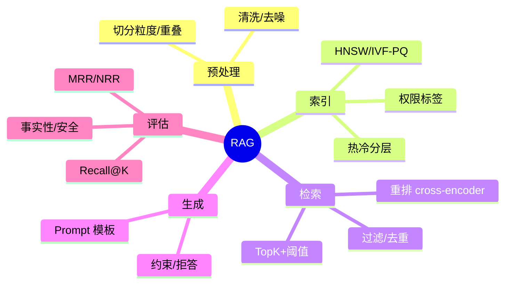

# RAG 设计与评估（Spring Boot 集成版）

> 序号：0002 ｜ 主题：RAG 设计/评估 ｜ 目标：Java/Spring 落地、评估基线、对比与问答，字数约 1200+。

## 脑图


## 流程
```mermaid
flowchart LR
  A[Ingest Job] --> B[Chunker]
  B --> C[Embedding + Normalize]
  C --> D[Index Builder (HNSW/IVF)]
  D --> E[(Index 分片/副本)]
  E --> F[Query API (Spring Boot)]
  F --> G[Filter + TopK]
  G --> H[Rerank (Cross-Encoder)]
  H --> I[Generator]
  I --> J[Safety Filter]
  J --> K[Logs/Trace for Eval]
```

## Java 代码示例（并行检索 + 生成）
```java
@Service
public class RagService {
  private final VectorClient vectorClient;
  private final LlmClient llmClient;

  public RagService(VectorClient vectorClient, LlmClient llmClient) {
    this.vectorClient = vectorClient;
    this.llmClient = llmClient;
  }

  public Mono<String> answer(String query) {
    Mono<SearchResult> retrieved = vectorClient.search(VectorQuery.of(query));
    return retrieved.flatMap(res -> {
      String context = Reranker.rerankAndJoin(res.getHits(), 8);
      return llmClient.generate(PromptTemplates.qa(context, query));
    }).timeout(Duration.ofMillis(1500))
      .onErrorResume(e -> Mono.just("当前繁忙，请稍后重试"));
  }
}
```

## 知识点（必会/进阶/加分）
- 必会：切分粒度+重叠；Embedding 归一化；TopK+阈值；去重/相似度抑制；cross-encoder rerank；评估 Recall@K/MRR；P99、成本监控。
- 进阶：双索引热冷分层；权限/时间过滤；日志回放评测；对抗集构造；Prompt/Logits 缓存；并行检索+生成。
- 加分：动态路由（小模型兜底）；Speculative + rerank；长上下文截断策略；自动化指标仪表板。

## 方案与对比
- RAG vs 纯生成：事实性、成本、更新频率、延迟；RAG 更可控但需索引维护。
- 切分策略：固定窗口 vs 语义分句；长文本推荐语义+适度重叠（50~100 token）。
- 重排：双塔 vs 交叉编码器；前者快，后者精度高；可分层（先双塔筛，后交叉编码器）。

## 实战方案
1. 数据管线：批量切分+清洗；Embedding 归一化；索引按租户/时间分片，热 HNSW，冷 IVF-PQ；权限标签入倒排。
2. 查询：Spring Boot WebFlux 并行检索+生成；过滤前置；TopK 后 rerank；相似度阈值+去重；Prompt/Logits 缓存。
3. 评估：离线集（Recall@K/MRR）；LLM-judge 事实性+安全；线上 A/B；日志回放；对抗集（提示注入、长尾）。
4. 观测：P50/95/99、召回、错误率、索引构建时长、缓存命中；安全命中/误杀率。
5. 灰度：双索引/双模型权重路由；失败回滚；缓存隔离。

## 问答
1) 问：切分粒度如何选？  
   答：语义分句 + 50~100 token 重叠；代码/规范保持结构边界；监控重复率与召回。追问：重叠过大影响？→ 增存储/重复召回，需阈值去重。

2) 问：召回与精度怎么平衡？  
   答：TopK 取 20~50，阈值过滤；重排用 cross-encoder；相似度抑制防重复。追问：长文本场景？→ 按章节分桶，独立索引。

3) 问：评估体系如何搭？  
   答：标注对照集，Recall@K/MRR；事实性/安全 LLM-judge+人工；对抗集；线上 A/B；日志回放。追问：无标注集？→ 半自动评分+抽检。

4) 问：双索引切换怎么做？  
   答：旧/新双写；路由权重灰度；一致性检查（召回曲线、P99）；回滚开关；缓存分域。追问：缓存污染？→ 版本号隔离。

5) 问：Spring 性能优化？  
   答：WebClient 池、超时/重试、熔断；并行检索+生成；背压；GZip；监控池耗尽。追问：如何限制下游放大？→ 限流+舱壁。
