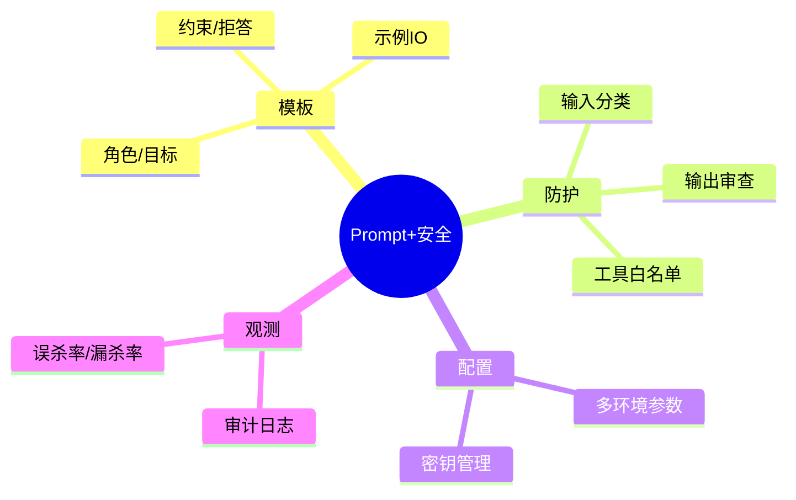

# 提示工程与安全防护（多环境/审计版）

> 序号：0003 ｜ 主题：提示工程 + 安全 ｜ 目标：模板、策略、审计、对抗与 Java 接入，篇幅约 1100+ 字。

## 脑图


## 流程
```mermaid
flowchart LR
  A[Controller] --> B[Input Guard (越狱/PII 分类)]
  B --> C[Prompt Builder (角色+示例+约束)]
  C --> D[LLM 调用]
  D --> E[Output Safety (规则+分类器)]
  E --> F[审计/告警]
```

## 提示模板示例（Markdown）
```
系统: 你是企业合规助理，必须拒绝敏感/违法/PII 请求。
任务: 根据提供的上下文回答，未命中则拒答。
输入:
- 上下文: {{context}}
- 问题: {{query}}
约束:
- 只用中文，简洁分点。
- 无上下文或命中敏感时，回复“无法提供”并提示合规流程。
- 禁止编造来源。
示例:
问: 公司 WiFi 密码？
答: 无法提供。请按 IT 合规流程申请。
```

## Java 代码示例（输入分类 + 输出审查）
```java
public Mono<String> safeAnswer(String query, String context) {
  if (Guard.isUnsafeInput(query)) {
    return Mono.just("无法提供。请按合规流程申请。");
  }
  String prompt = PromptTemplates.safeQa(context, query);
  return llm.generate(prompt)
      .map(OutputGuard::filter) // 规则/分类器
      .onErrorResume(e -> Mono.just("服务繁忙，请稍后重试"));
}
```

## 知识点
- 必会：提示结构（角色/目标/示例/约束/拒答）；输入越狱/敏感/PII 分类；输出审查（规则+模型）；多环境配置；日志审计。
- 进阶：工具白名单；策略灰度；安全网关；指标（误杀/漏杀）；对抗集回归；限流与配额。
- 加分：安全模型微调；分级响应；多通道审查（文本+URL+附件）；自动化阈值优化。

## 对比
- 系统提示 vs 用户提示：系统高优先级，定义边界；用户提示内容需被约束。
- 规则过滤 vs 分类器：规则快但易漏判；分类器更稳需算力。

## 实战方案
1. 输入防护：regex/词典 + 分类器；命中直接拒答或降级；记录审计。
2. Prompt 构建：模板参数化；示例 IO；显式拒答；标明语言/风格。
3. 输出审查：规则（敏感词、链接）+ 分类器；命中→拒答/替换；留痕。
4. 配置：多环境 .env；密钥用密管；不同环境限流配额。
5. 评估：对抗集；误杀/漏杀；A/B；日志回放。

## 问答
1) 问：如何降低误杀率？  
   答：规则白名单；分类器阈值调优；命中后可“二次判别”再拒答；灰度策略。追问：日志如何帮助？→ 标注误杀样本回归。

2) 问：提示注入防护？  
   答：系统指令显式优先；隔离分隔符；拒绝修改安全策略的请求；输入分类；输出审查。追问：工具调用如何防注入？→ 工具白名单+参数校验。

3) 问：输出审查怎么做？  
   答：规则+分类器；敏感命中→拒答；审计；对抗集回归。追问：性能影响？→ 异步/批量审查或轻量模型前置。

4) 问：多环境配置重点？  
   答：分环境密钥；不同限流；安全策略可灰度；日志分环境存储。追问：如何防密钥泄露？→ 不写日志，不入前端。

5) 问：对抗集如何构造？  
   答：越狱模板、提示注入、敏感问法变体；来自线上误判样本；定期回归。追问：如何自动更新？→ 采集告警样本，人工复核后入集。
