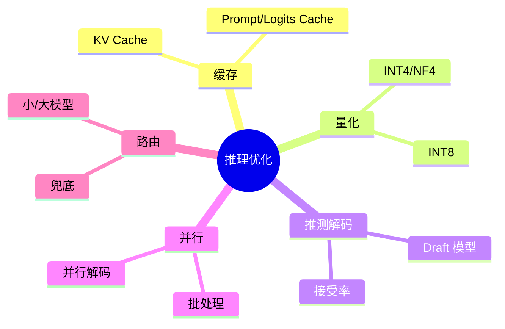
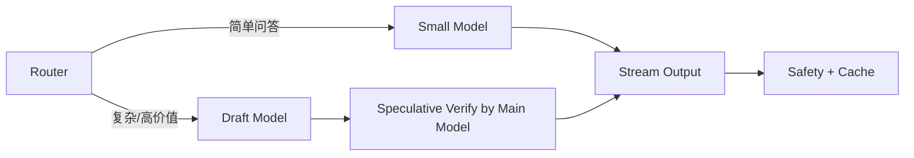

# 推理优化（KV/Speculative/量化，Java 落地）

> 序号：0004 ｜ 主题：推理性能 ｜ 目标：KV Cache、Speculative、量化、批处理与 Java 工程实践，篇幅约 1200 字。

## 脑图


## 流程


## Java 代码示例（路由 + 超时 + 熔断）
```java
@Service
public class InferenceRouter {
  private final LlmClient small;
  private final LlmClient main;

  public Mono<String> handle(String query) {
    if (isSimple(query)) {
      return small.generate(query)
          .timeout(Duration.ofMillis(600))
          .onErrorResume(e -> fallback());
    }
    return main.generateSpeculative(query)
        .timeout(Duration.ofMillis(1200))
        .onErrorResume(e -> small.generate(query));
  }
}
```

## 知识点
- 必会：KV Cache 命中率影响延迟；Prompt/Logits 缓存；批处理 vs 延迟折中；Speculative 解码流程；INT8/INT4 量化影响精度。
- 进阶：动态批大小；多路复用；路由策略；并行解码；监控 tokens/s、P99、拒绝率。
- 加分：GPU 多流；张量/流水并行；草稿模型蒸馏；多模型成本-延迟 Pareto。

## 对比
- KV Cache vs Prompt 缓存：KV 复用上下文加速生成；Prompt 缓存减少重复前缀推理。
- INT8 vs INT4：INT8 精度高影响小；INT4 显存省但需校准，可能损质。

## 实战方案
1. KV 管理：长对话截断；租户配额；命中率监控。
2. Speculative：draft 模型生成，主模型验证；记录接受率；一致性低场景禁用。
3. 量化：INT8 默认；INT4 用 NF4/AWQ，灰度上线；质量回归。
4. 路由：规则/分类路由小模型；失败兜底；A/B 评估成本-延迟。
5. 并发控制：线程池隔离；有界队列；背压；流式输出；压测基线。

## 问答
1) 问：KV Cache 命中率低怎么办？  
   答：检查截断策略；对话聚类提升复用；热门 Prompt 缓存；统计 miss 原因。追问：缓存污染？→ 带租户/会话键。

2) 问：Speculative 何时不适用？  
   答：草稿与主模型一致性低、长上下文、输出强约束场景；接受率低会放大延迟。追问：如何提升接受率？→ 近似蒸馏、调 draft 温度。

3) 问：量化上线怎么控风险？  
   答：先离线对齐指标，再灰度；监控事实性/安全；回滚开关；分模型分任务。追问：INT4 导致质量降如何兜底？→ 路由回 INT8。

4) 问：批处理与延迟如何权衡？  
   答：设置最大延迟窗口；动态 batch；区分高优先级请求不 batch；监控排队时间。追问：并行解码带来的收益？→ tokens/s 提升但需显存。

5) 问：Java 层如何防止雪崩？  
   答：舱壁隔离、熔断、限流、超时；重试幂等；流式减压；指标告警。追问：线程池如何设？→ 按 CPU/IO 分池，监控拒绝率。
