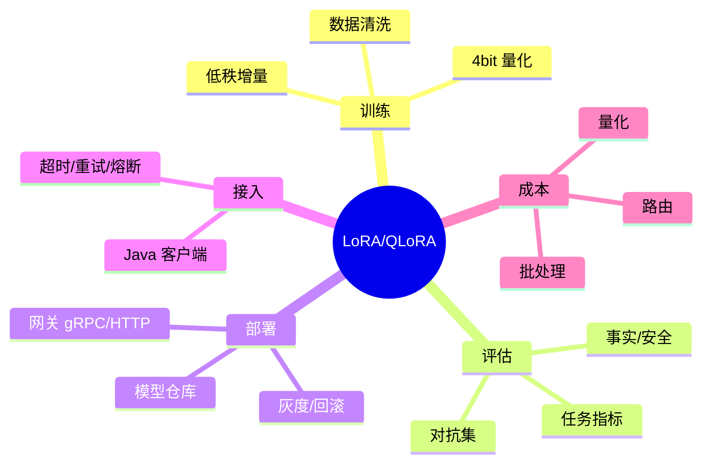

# LoRA/QLoRA 微调与部署（Java 服务接入）

> 序号：0005 ｜ 主题：微调与部署 ｜ 目标：LoRA/QLoRA 流程、评估、网关与 Java 客户端，篇幅约 1200 字。

## 脑图


## 流程
```mermaid
flowchart LR
  A[Data Prep] --> B[Train LoRA/QLoRA]
  B --> C[Eval(任务+安全+对抗)]
  C --> D[Registry 版本化]
  D --> E[Deploy Gateway (HTTP/gRPC)]
  E --> F[Java Client 调用]
  F --> G[监控/回滚]
```

## Java 代码示例（gRPC 客户端）
```java
public class LlmGrpcClient {
  private final ManagedChannel channel;
  private final LlmServiceGrpc.LlmServiceBlockingStub stub;

  public LlmGrpcClient(String target) {
    this.channel = ManagedChannelBuilder.forTarget(target)
        .usePlaintext()
        .keepAliveTime(30, TimeUnit.SECONDS)
        .build();
    this.stub = LlmServiceGrpc.newBlockingStub(channel)
        .withDeadlineAfter(800, TimeUnit.MILLISECONDS);
  }

  public String generate(String prompt) {
    GenerateRequest req = GenerateRequest.newBuilder()
        .setPrompt(prompt)
        .build();
    try {
      return stub.generate(req).getText();
    } catch (StatusRuntimeException e) {
      return "当前繁忙，请稍后重试";
    }
  }
}
```

## 知识点
- 必会：LoRA 低秩增量；QLoRA 4bit 量化 + LoRA；校准与正则；评估集构建；模型仓库版本化；灰度/回滚。
- 进阶：混合精度、Adapter 合并/选择；对抗集；多通道指标（任务+事实性+安全）；推理网关（HTTP/gRPC）与流式。
- 加分：在线热更新；路由分群（高价值走主模型，低价值走小模型/旧模型）；Speculative 与 LoRA 结合。

## 对比
- LoRA vs QLoRA：显存/成本 vs 潜在精度损失；QLoRA 需更严格校准；LoRA 部署可合并权重或在线加载 Adapter。
- HTTP vs gRPC：gRPC 延迟低、流式好；HTTP 简单兼容性高。

## 实战方案
1. 数据：清洗、去重、去个人敏感；格式统一；添加拒答示例防幻觉。
2. 训练：QLoRA 4bit + LoRA；冻结 Embedding/LayerNorm；梯度裁剪；早停；混合精度。
3. 评估：任务指标（BLEU/ROUGE/任务正确率）、事实性/安全 LLM-judge + 人工抽检；对抗集；长上下文测试。
4. 部署：模型仓库存元数据（版本/日期/指标/配置）；网关支持流式；灰度权重路由；失败回滚；监控 P99/错误率。
5. 接入：Java gRPC/WebClient 配置池/超时/重试/熔断；DTO 契约；流式处理；限流。

## 问答
1) 问：QLoRA 何时首选？  
   答：显存紧张/成本敏感；中等任务；需严格校准量化误差；上线灰度。追问：长上下文影响？→ 可能更大误差，需要专门测试。

2) 问：如何回滚？  
   答：模型仓库版本化；灰度权重；开关快速切回旧版本；缓存失效策略。追问：一致性校验？→ 对比指标/小流量对照。

3) 问：安全评估？  
   答：敏感/越狱对抗集；输出审查；LLM-judge + 人工；上线后告警。追问：如何降误杀？→ 阈值调优+二次判别。

4) 问：成本优化？  
   答：量化/LoRA；路由小模型；批处理；KV/Prompt 缓存；监控 GPU 利用率。追问：质量损失监控？→ 在线 A/B + 标注抽检。

5) 问：Java 调用容错？  
   答：超时、重试（幂等）、熔断、限流；有界线程池；回退响应；指标告警。追问：流式输出注意？→ 控制 backpressure，及时 flush。
