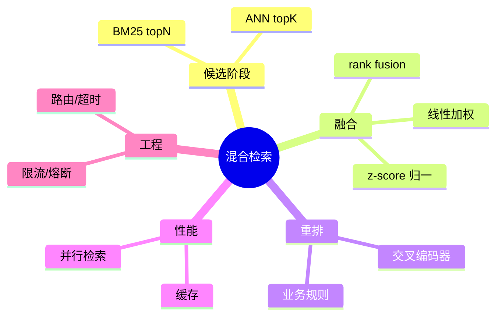

# 混合检索（BM25 + ANN + 重排，Java 工程化）

> 序号：0006 ｜ 主题：混合检索 ｜ 目标：文本/向量融合、对比分值、Java 路由与稳定性，约 1100+ 字。

## 脑图


## 流程图
```mermaid
flowchart LR
  A[Query] --> B[BM25 候选 topN]
  A --> C[向量检索 topK]
  B --> D[融合/归一化]
  C --> D
  D --> E[Rerank (cross-encoder)]
  E --> F[规则过滤/去重]
  F --> G[结果]
```

## Java 代码示例（并行 BM25+ANN）
```java
public Mono<List<Document>> hybridSearch(String q) {
  Mono<List<DocScore>> bm25 = bm25Client.search(q, 50);
  Mono<List<DocScore>> ann = vectorClient.search(q, 50);
  return Mono.zip(bm25, ann)
      .map(tuple -> Fusion.linearZScore(tuple.getT1(), tuple.getT2(), 0.4, 0.6))
      .map(docs -> Reranker.crossEncode(docs, 10))
      .timeout(Duration.ofMillis(1200))
      .onErrorReturn(List.of());
}
```

## 知识点
- 必会：BM25 适合短文本关键字；向量适合语义；融合需归一化（z-score/Min-Max）；交叉编码器重排提升精度；TopN/K 选择影响延迟。
- 进阶：多路召回（标签/规则）；rank fusion(Borda/Reciprocal Rank)；高基数过滤前置倒排；动态权重（短文本偏 BM25，长文本偏向量）。
- 加分：自适应权重学习；多向量字段；GPU 重排；去重/相似度抑制；缓存热点 Query。

## 对比
- 线性加权 vs rank fusion：线性简单可调；rank fusion 对尺度稳健但需全排序。
- 交叉编码器 vs 双塔重排：交叉精度高、延迟高；双塔快、适合第一层重排。

## 实战方案
1. 候选：BM25 topN=50；ANN topK=50；并行调用，合并时归一化。
2. 融合：z-score 后线性加权；短 query 提升 BM25 权重，长 query 提升向量权重。
3. 重排：交叉编码器 rerank 取前 10~20；业务规则再过滤（时间/权限）。
4. 性能：WebClient 并行；超时/重试；缓存热门 query；限流。
5. 观测：P95/99，融合后点击/满意度；召回覆盖率；权重 A/B。

## 问答
1) 问：为何要归一化？  
   答：BM25 与向量分数尺度不同，不归一会偏某一侧；常用 z-score 或 Min-Max。追问：归一化后仍偏？→ 动态权重或 rank fusion。

2) 问：短文本/长文本权重如何调？  
   答：按长度或词数分桶；短文本提升 BM25，长文本提升向量；A/B 验证。追问：语义含糊的怎么办？→ 增加重排模型权重。

3) 问：重排带来高延迟怎么控？  
   答：只重排 top20；批量输入；轻量 cross-encoder；超时降级到双塔。追问：如何避免重排 OOM？→ 控 batch，大模型分片。

4) 问：高基数过滤？  
   答：倒排/bitmap 先裁剪；再融合；候选不足可放宽或走高精度索引。追问：过滤耗时？→ 预建索引，bitmap 压缩。

5) 问：如何避免重复/相似答案？  
   答：相似度抑制/NMS；业务规则去重；rerank 时加惩罚项。追问：相似度阈值怎么选？→ grid search + 线上观测。
