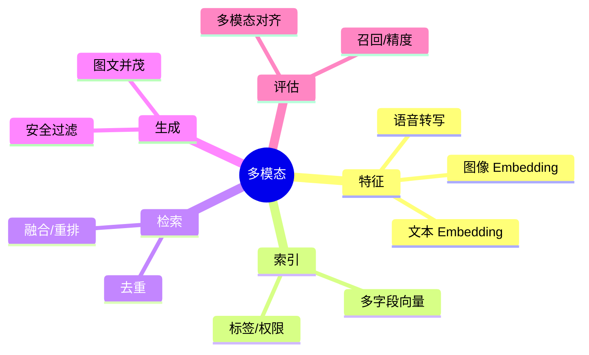

# 多模态 RAG（图文/语音，Java 接入）

> 序号：0007 ｜ 主题：多模态 RAG ｜ 目标：图文并茂检索、对齐、评估与安全，约 1100+ 字。

## 脑图


## 流程
```mermaid
flowchart LR
  A[图/文/音输入] --> B[清洗+转写(音)]
  B --> C[Embed 文本/图像]
  C --> D[(多字段索引 text_vec/image_vec)]
  D --> E[检索融合]
  E --> F[Rerank/去重]
  F --> G[生成多模态响应]
  G --> H[安全/审查]
```

## Java 代码示例（多字段检索请求）
```java
record MultiQuery(String text, byte[] imageVec, Map<String, String> filters) {}

public Mono<List<Result>> search(MultiQuery q) {
  return client.post()
      .uri("/multi-search")
      .bodyValue(q)
      .retrieve()
      .bodyToFlux(Result.class)
      .collectList()
      .timeout(Duration.ofMillis(1500));
}
```

## 知识点
- 必会：文本/图像独立 Embedding；多字段向量索引；融合策略（加权/交叉重排）；去重；安全过滤（NSFW/版权）。
- 进阶：跨模态对齐评估；图像特征量化与压缩；多模态生成（caption + 段落）；语音转写质量对召回影响。
- 加分：多模态对比学习；CLIP/ALIGN；图像检索 + 文本重排；GPU 加速重排；细粒度检测（OCR+实体）。

## 对比
- 单模态 vs 多模态：覆盖面、算力；多模态需更多预处理与安全审查。
- 融合：简单加权 vs 交叉重排；后者更准但耗时。

## 实战方案
1. 预处理：图像分辨率标准化；音频转写；文本清洗；敏感检测（NSFW/版权）。
2. 索引：text_vec、image_vec 分字段；标签/权限；热数据在内存。
3. 检索：文本/图像并行召回；z-score 归一化后加权；交叉重排 top20；去重。
4. 生成：模板化回应（含图片描述）；安全过滤；必要时只返回文本描述。
5. 评估：召回@K、MRR；多模态对齐人工抽检；安全命中/误杀；时延 P99。

## 问答
1) 问：图像特征量化如何控精度？  
   答：IVF-PQ/OPQ；热图用全精度；评估重建误差与召回；必要时双索引。追问：GPU 资源不够？→ 冷数据下盘，热数据上 GPU。

2) 问：多模态安全策略？  
   答：NSFW/版权/暴恐模型；文本敏感/PII；输出审查；命中降级为文本描述或拒答。追问：误杀率怎么控？→ 阈值调优+人工抽检。

3) 问：融合权重如何调？  
   答：按任务/样本集 grid search；短文本偏文本；视觉主导任务偏图像；线上 A/B。追问：对齐误差高？→ 用交叉重排或专用对齐模型。

4) 问：语音转写质量差影响？  
   答：前置 ASR 质量监控；低置信度走文本检索降权；可用关键词补召回。追问：方言/噪声？→ 选对域模型或语音增强。

5) 问：如何避免重复与幻觉？  
   答：去重/相似度抑制；生成时引用来源；缺上下文时拒答；安全审查。追问：多模态生成合规？→ 不返回受限图片，转文本描述。
