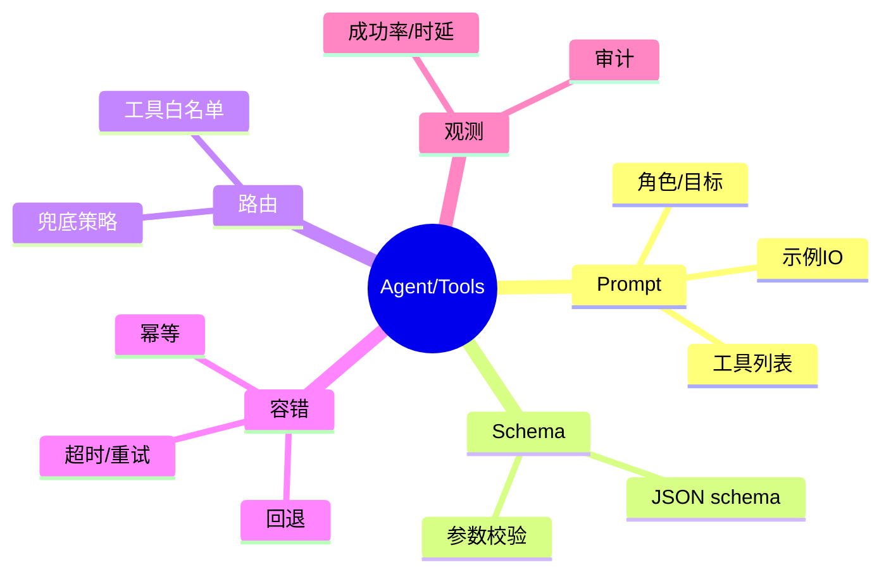
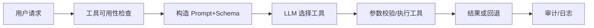

# 工具/函数调用与代理路由（Java 服务视角）

> 序号：0008 ｜ 主题：工具调用/Agent ｜ 目标：Prompt 设计、Schema、容错、路由与安全，约 1100+ 字。

## 脑图


## 流程


## Prompt 片段示例
```
系统: 你是企业助手，只能调用提供的工具。
工具列表(JSON Schema):
- getWeather: {city: string, unit: ["C","F"]}
约束: 未在列表的工具名一律拒绝；参数不全则请求补充；回答用中文。
示例:
问: 上海天气？
答: 调用 getWeather {city:"上海", unit:"C"}
```

## Java 代码示例（工具执行网关）
```java
public Mono<String> invokeTool(ToolCall call) {
  if (!whitelist.contains(call.name())) return Mono.just("拒绝：未知工具");
  return toolClient.execute(call)
      .timeout(Duration.ofMillis(800))
      .onErrorResume(e -> Mono.just("工具暂不可用，已回退"));
}
```

## 知识点
- 必会：工具白名单；JSON Schema 校验；参数注入防护；超时/重试/熔断；回退策略；审计日志。
- 进阶：动态工具集合（按租户/权限）；多步工具调用链；幂等与重放防护；结果缓存；安全过滤（禁止任意命令）。
- 加分：智能路由（根据意图挑工具）；多 Agent 协作；计划-执行-反思模式；对话状态机。

## 对比
- 直连工具 vs 经网关：网关可做鉴权、限流、审计；直连简单但风险高。
- 单步 vs 多步计划：多步更灵活但时延高；需设置步数/时间限制。

## 实战方案
1. Prompt：列清单、Schema、示例；拒绝未知工具；限制语言与格式；明确补充信息策略。
2. 校验：执行前校验 name/参数类型/范围；高风险字段白名单。
3. 路由：按租户/权限过滤工具；按意图选择；失败回退（静态回答/二选一模型）。
4. 观测：工具调用成功率、延迟、错误码；异常告警；审计记录。
5. 安全：禁止 exec/文件写；敏感信息不入日志；对外调用加签。

## 问答
1) 问：如何防止“幻造”工具？  
   答：白名单匹配；未知工具直接拒绝；Schema 校验；示例约束。追问：若模型返回多余字段？→ 严格解析过滤。

2) 问：工具超时/失败怎么办？  
   答：超时/重试（幂等）；回退响应；熔断；告警。追问：非幂等工具？→ 禁止自动重试，改人工或补偿。

3) 问：如何避免参数注入？  
   答：Schema 校验；限制类型/长度/枚举；拒绝包含命令/URL 的字段；转义特殊字符。追问：用户恶意构造 JSON？→ 先解析再验证，异常直接拒绝。

4) 问：多步工具链的时延问题？  
   答：限制步数/时间；并行可并行的调用；中途失败直接回退。追问：如何观测链路？→ Trace 每步 span。

5) 问：审计要记录什么？  
   答：用户/租户、工具名、参数、结果状态、耗时、错误码；敏感字段脱敏。追问：合规要求？→ 保留期、访问控制、加密存储。
