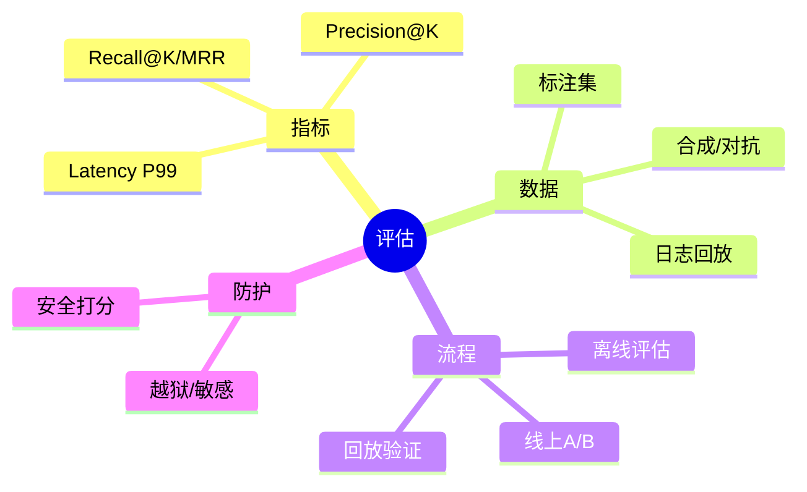
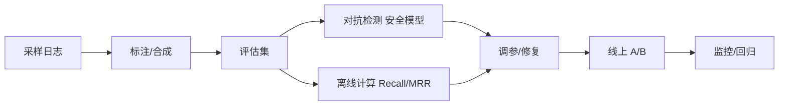

# 召回评估与对抗测试（Java 体系）

> 序号：0009 ｜ 主题：评估/对抗 ｜ 目标：评估指标、对抗集、回放、自动化管线，约 1100+ 字。

## 脑图


## 流程


## Java 代码示例（回放评估）
```java
public Metrics replayAndEval(List<QuerySample> samples) {
  int hit = 0; int total = samples.size();
  for (QuerySample s : samples) {
    List<String> res = ragService.search(s.query(), 20);
    if (res.contains(s.gold())) hit++;
  }
  double recall = hit * 1.0 / total;
  return new Metrics(recall, total);
}
```

## 知识点
- 必会：Recall@K、Precision@K、MRR/NRR；延迟 P95/99；事实性/安全判分；对抗样本（提示注入、越狱、敏感词）。
- 进阶：日志回放；A/B 实验；标签高基数过滤对召回影响；自动化评估管线；长尾/冷启动样本构造。
- 加分：LLM-as-judge 偏差控制；多指标加权；持续对抗生成；安全与事实性双通道。

## 对比
- 人工标注 vs 合成：人工准但慢；合成快但偏差需校正。
- 离线 vs 线上 A/B：离线可控、快；线上真实但风险需灰度。

## 实战方案
1. 数据：采样线上日志，脱敏；人工标注核心集，合成扩充；对抗集（越狱/敏感/提示注入）。
2. 评估：离线算 Recall@K/MRR；安全/事实性用 LLM-judge+抽检；延迟 P99；记录版本。
3. 回放：定期回放固定集；对比基线；异常告警。
4. A/B：小流量灰度；监控指标；显著性检验。
5. 报告：召回曲线、时延、成本；安全命中/误杀；调参建议。

## 问答
1) 问：没有标注集怎么办？  
   答：半自动：LLM 生成答案 + 人工抽检；用用户点击/满意度作为弱标签；对抗集手工。追问：偏差怎么控？→ 交叉验证 + 抽检。

2) 问：对抗集如何持续更新？  
   答：收集安全命中/漏检样本；定期生成变体；上线前回归。追问：如何防遗忘？→ 固定基准集长期保留。

3) 问：A/B 如何评估显著性？  
   答：采样量、置信区间；二项检验/非参检验；指标包括召回、延迟、成本。追问：多指标冲突？→ Pareto 视角，权重或分层决策。

4) 问：LLM 评审偏差？  
   答：多裁判投票；不同提示；校准集；人工抽检对比。追问：成本过高？→ 采样评估 + 重要场景全评。

5) 问：回放结果波动大？  
   答：固定版本、固定硬件；控制并发；多次运行取均值；关注冷/热缓存差异。追问：如何定位波动来源？→ 分解索引/重排/生成耗时与召回。
