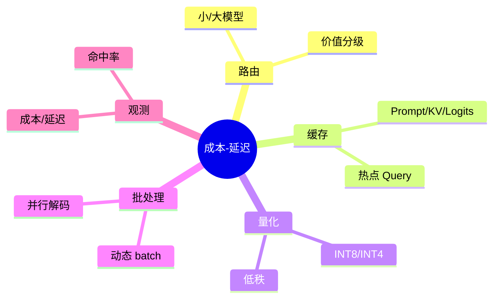
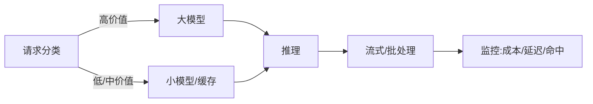

# 成本-延迟 Pareto 优化（Java 落地）

> 序号：0010 ｜ 主题：成本与延迟 ｜ 目标：路由、量化、缓存、批处理与监控，约 1100+ 字。

## 脑图


## 流程


## Java 代码示例（分级路由）
```java
public Mono<String> route(String query, Importance level) {
  if (cache.hit(query)) return Mono.just(cache.get(query));
  LlmClient target = (level == Importance.HIGH) ? main : small;
  return target.generate(query)
      .doOnSuccess(resp -> cache.put(query, resp))
      .timeout(Duration.ofMillis(level == Importance.HIGH ? 1200 : 800))
      .onErrorResume(e -> Mono.just("稍后再试"));
}
```

## 知识点
- 必会：价值分级路由；缓存类型（Prompt/KV/Logits）；量化对质量的影响；批处理与延迟折中；指标：P95/99、tokens/s、成本/请求。
- 进阶：动态 batch；Speculative + 路由；GPU 利用率监控；成本 A/B；分租户/业务配额。
- 加分：自动策略调度（根据指标调整路由/批大小）；多模型并行竞速取最快；多云成本对比。

## 对比
- 小模型兜底 vs 全部大模型：前者省成本但可能降质；需监控质量。
- 缓存层级：Prompt 缓存命中高，KV 缓存长上下文，Logits 缓存重复续写。

## 实战方案
1. 路由：按意图/价值分级；高价值走大模型，低价值先小模型，失败再升一级；工具/检索可复用缓存。
2. 缓存：热点 Query；Prompt/KV/Logits 组合；租户隔离键；过期策略；命中监控。
3. 量化/低秩：INT8 默认；INT4 灰度；LoRA 适配任务；质量回归。
4. 批处理：动态 batch，设最大延迟窗口；区分高优先级不 batch；监控排队。
5. 观测：成本/请求，P95/99，命中率，tokens/s，GPU 利用；异常告警。

## 问答
1) 问：如何评估路由收益？  
   答：A/B 对比成本-延迟-质量；高价值保质，低价值省钱；记录命中与回退。追问：误判怎么办？→ 失败重试大模型。

2) 问：缓存污染怎么防？  
   答：租户/上下文键；短 TTL；命中计数；异常清理。追问：敏感数据？→ 不缓存或加密存储。

3) 问：量化带来的质量损失如何监控？  
   答：对照集回归；线上抽样 LLM 评审；异常回滚；只对低价值流量量化。追问：INT4 上线步骤？→ 先灰度，再放量。

4) 问：批处理与延迟冲突？  
   答：设最大等待窗口；动态调整；高优先级单独通道；监控排队时间。追问：并行解码价值？→ 提升吞吐，需显存与模型支持。

5) 问：多云/多节点成本怎么控？  
   答：按时价/利用率调度；冷热分层；低峰训练，高峰推理；流量调度。追问：网络费用？→ 同区优先，跨区慎用。
