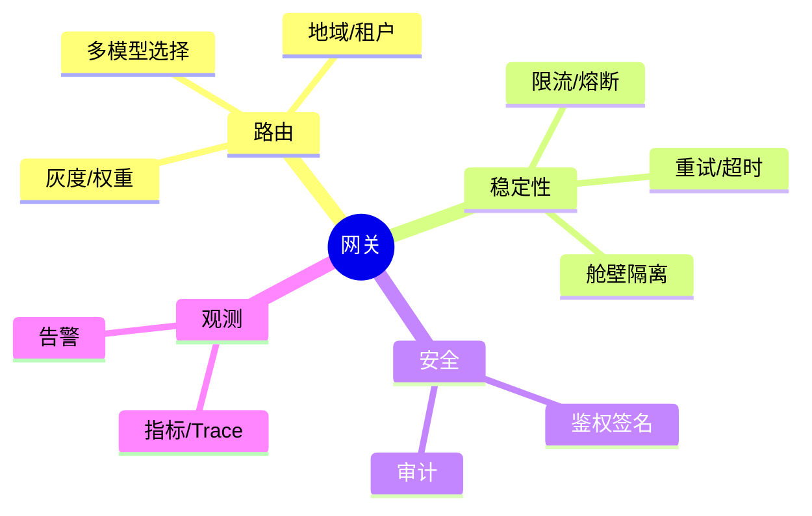
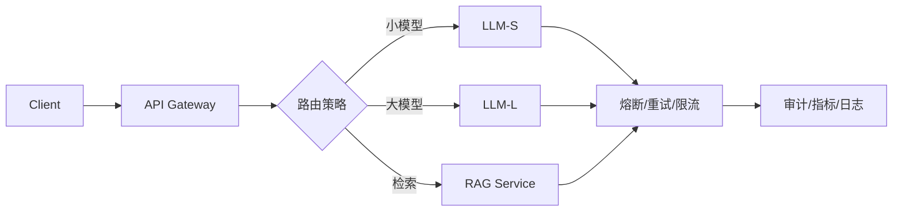

# 微服务 + AI 网关与路由设计（Java 实践）

> 序号：0011 ｜ 主题：微服务/网关/路由 ｜ 目标：多模型/多后端路由、熔断限流、灰度发布，含脑图、流程、Java 代码、方案、Q&A，约 1200+ 字。

## 脑图


## 流程


## Java 代码示例（网关路由与熔断）
```java
public Mono<String> route(Request req) {
  Backend target = strategy.pick(req); // 按租户/地域/价值
  return client.invoke(target, req)
      .timeout(Duration.ofMillis(target.timeout()))
      .transform(CircuitBreakerOperator.of(cb))
      .onErrorResume(e -> fallback(req));
}
```

## 知识点
- 必会：路由维度（租户/地域/价值/模型能力）；限流（令牌桶/滑窗）；超时/重试（幂等）；熔断+降级；签名/鉴权；审计。
- 进阶：灰度/权重路由；多后端健康检查；舱壁隔离；RAG/工具调用单独路径；多租户配额。
- 加分：多云/多 Region 调度；自动故障切换；按成本/延迟动态调度；对话粘性（同会话路由一致）。

## 方案与对比
- 熔断策略：错误率阈值 vs 慢调用比例；滑动窗口 vs 固定窗口。
- 限流：令牌桶平滑、漏桶更稳；本地 vs 分布式（Redis/Sidecar）。
- 路由：静态权重 vs 动态（基于延迟/成本）；哈希粘性保持上下文。

## 实战方案
1. 路由：按租户/地域/价值分级；小模型兜底，大模型处理复杂；检索型请求转 RAG 服务；会话用哈希粘性。
2. 稳定：连接池+超时+重试（仅幂等）；熔断；限流（本地+网关）；舱壁隔离不同后端。
3. 灰度：权重路由；小流量探活；回滚开关；配置中心统一管理。
4. 安全：鉴权签名、时间戳防重放；审计日志；敏感字段脱敏；配额。
5. 观测：指标（QPS/P95/错误率/熔断次数/限流数）；Trace；日志采样；告警。

## 问答
1) 问：如何避免重试风暴？  
   答：幂等检查；指数退避；限流；熔断后快速失败；区分客户端/服务端错误。追问：非幂等怎么办？→ 禁重试或补偿。

2) 问：灰度发布怎么做？  
   答：权重/标签路由；小流量探测；指标对比；异常回滚。追问：缓存污染？→ 缓存按版本/后端隔离。

3) 问：跨 Region 路由？  
   答：优先同区，跨区仅容灾；成本/时延权衡；数据合规考虑。追问：健康检查？→ 定期探测延迟+错误率。

4) 问：如何防止单后端拖垮整体？  
   答：舱壁隔离线程池/连接；限流；熔断；快速失败降级。追问：降级内容？→ 缓存回复/模板答复。

5) 问：审计记录要点？  
   答：租户、路由目标、耗时、结果码、限流/熔断事件、签名校验；敏感信息脱敏。追问：存储周期？→ 依合规规定。
