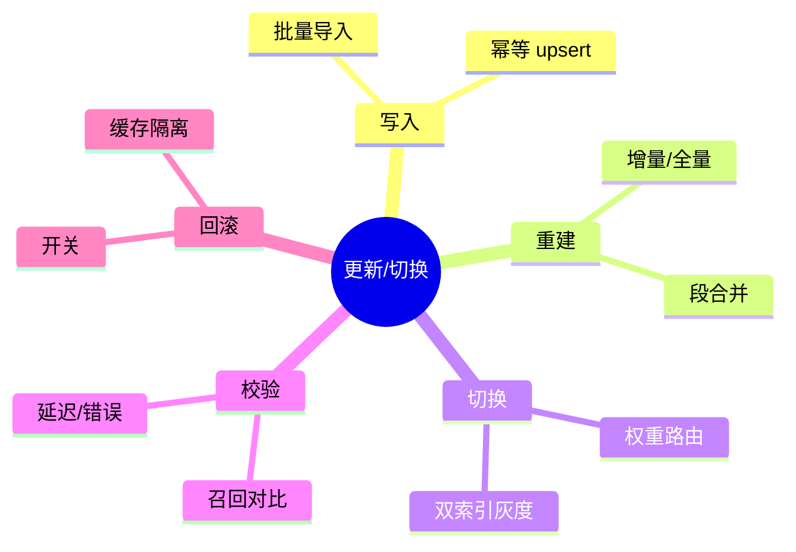
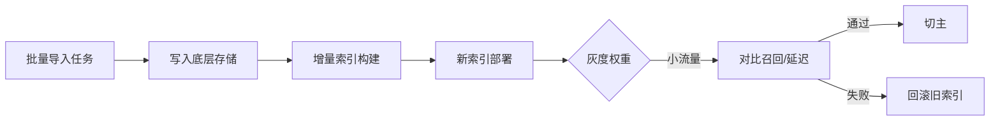

# 数据更新、索引重建与无损切换（Java 落地）

> 序号：0012 ｜ 主题：数据/索引更新 ｜ 目标：批量导入、增量重建、双索引切换、回滚，含脑图/流程/代码/Q&A，约 1100+ 字。

## 脑图


## 流程


## Java 代码示例（灰度权重路由）
```java
public class IndexRouter {
  private volatile double newWeight = 0.1; // 灰度权重

  public IndexClient pick() {
    return ThreadLocalRandom.current().nextDouble() < newWeight ? newIndex : oldIndex;
  }
}
```

## 知识点
- 必会：幂等 upsert；批量导入+刷盘；增量重建；段合并；双索引灰度；缓存隔离；回滚。
- 进阶：标签/权限索引一致性；高基数过滤索引更新；重建窗口选择；对比基线（召回/延迟/错误率）。
- 加分：在线增量合并；版本化元数据；多 Region 同步；自动探测坏分片。

## 对比
- 全量重建 vs 增量：全量稳但慢；增量快但需合并一致性；可组合（周期全量+日常增量）。
- 切换策略：硬切 vs 权重灰度；灰度安全、可回滚。

## 实战方案
1. 写入：批量 upsert，记录 offset；失败重试幂等；写底层存储后触发索引。
2. 重建：增量构建+段合并；定期全量校验；坏分片自动重建。
3. 切换：旧/新双索引；路由权重灰度；缓存按版本分域；监控召回/延迟。
4. 校验：对照集召回、P95/99；错误率；构建/合并耗时；数据覆盖率。
5. 回滚：开关即时回旧；清理新索引缓存；记录原因；重试重建。

## 问答
1) 问：如何保证写入幂等？  
   答：全局 ID；upsert；批次重放不重复；日志追踪 offset。追问：批量部分失败？→ 记录失败清单，重试单元。

2) 问：重建期间如何保持可用？  
   答：旧索引用；新索引并行构建；双写可选；灰度对比后切；失败回滚。追问：写放大怎么办？→ 批次控制 + 限速。

3) 问：高基数过滤索引更新？  
   答：倒排/bitmap 分桶；增量追加；周期合并；监控膨胀。追问：膨胀过大？→ 重建压缩。

4) 问：切换如何验证？  
   答：召回曲线、延迟、错误；小流量灰度；A/B；缓存隔离。追问：缓存污染？→ 缓存 key 带索引版本。

5) 问：坏分片检测？  
   答：健康探测（延迟/错误/召回异常）；自动重建；路由避开坏分片。追问：监控指标？→ 分片级 P95/错误率/召回对比。
