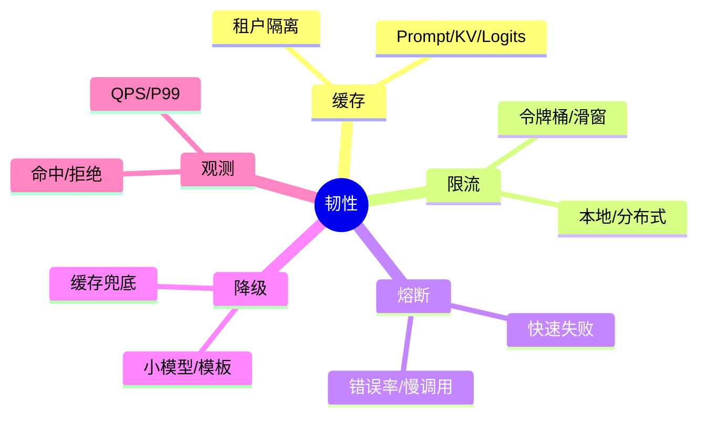
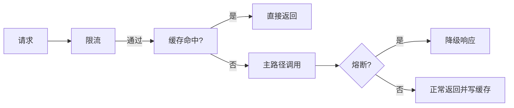

# 高并发场景的缓存/限流/降级（Java 实践）

> 序号：0013 ｜ 主题：高并发韧性 ｜ 目标：缓存策略、限流熔断、降级兜底，含脑图/流程/代码/Q&A，约 1100+ 字。

## 脑图


## 流程


## Java 代码示例（缓存 + 限流 + 降级）
```java
public Mono<String> handle(String key, Supplier<Mono<String>> main) {
  if (!rateLimiter.tryAcquire()) return Mono.just("请求过多，请稍后");
  String cached = cache.get(key);
  if (cached != null) return Mono.just(cached);
  return main.get()
      .timeout(Duration.ofMillis(1000))
      .transform(CircuitBreakerOperator.of(cb))
      .doOnSuccess(v -> cache.put(key, v, Duration.ofSeconds(30)))
      .onErrorResume(e -> Mono.just("当前繁忙，稍后再试"));
}
```

## 知识点
- 必会：缓存层级（Prompt/KV/Logits/结果）；租户隔离；TTL；热点保护；限流（本地+分布式）；熔断；降级兜底。
- 进阶：旁路缓存击穿保护；单飞/舱壁；排队超时；流式减压；回源抖动控制（随机退避）。
- 加分：多级缓存（本地+Redis）；异步刷新；小模型兜底；动态限流阈值；自适应批处理。

## 对比
- 本地限流 vs 分布式：本地轻量，分布式全局；可组合。
- 缓存策略：Cache Aside vs Write Through；高并发读场景优先 Cache Aside+互斥锁防击穿。

## 实战方案
1. 缓存：Prompt/KV/结果；租户+上下文键；热点加锁防击穿；TTL 按数据时效；敏感数据不缓存。
2. 限流/熔断：令牌桶+慢调用熔断；本地快速；分布式用于多实例协同；过载时快速失败。
3. 降级：缓存兜底/模板答复；小模型快速回答；必要时空响应提示稍后。
4. 观测：QPS、P95/99、限流/熔断次数、缓存命中/击穿、错误率；告警。
5. 压测：对限流阈值、熔断参数回放；验证过载行为。

## 问答
1) 问：如何防止缓存击穿？  
   答：热点加锁/单飞；预热；过期随机化；限流。追问：缓存污染？→ key 带租户/上下文，敏感不缓存。

2) 问：限流与熔断区别？  
   答：限流控制并发/速率；熔断防雪崩（错误/慢调用）；组合使用。追问：阈值如何定？→ 基于压测和历史 P99。

3) 问：降级策略？  
   答：缓存兜底、小模型、模板；流式输出减压；告知用户稍后。追问：如何避免静默失败？→ 明确返回原因。

4) 问：流式如何减压？  
   答：边生成边推送，前端背压；超时切断；避免长队。追问：长连接过多？→ 限制并发流，超时关闭。

5) 问：多实例如何统一限流？  
   答：分布式令牌桶/滑窗（Redis）；本地兜底；高可用存储。追问：Redis 崩溃？→ 本地降级限流，保护后端。
