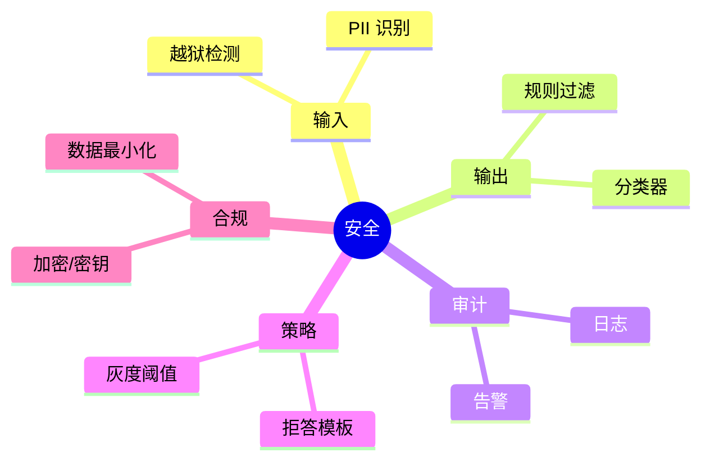

# 安全与合规：越狱、敏感信息、审计（Java 实践）

> 序号：0014 ｜ 主题：安全合规 ｜ 目标：输入/输出防护、审计、PII 处理、越狱对抗，约 1100+ 字。

## 脑图


## 流程
```mermaid
flowchart LR
  A[用户输入] --> B[越狱/PII 分类]
  B -->|命中| C[拒答/转人工]
  B -->|通过| D[构造 Prompt]
  D --> E[LLM 调用]
  E --> F[输出审查(规则+模型)]
  F -->|命中| G[拒答/脱敏]
  F -->|通过| H[返回]
  H --> I[审计/告警]
```

## Java 代码示例（输入/输出双过滤）
```java
public Mono<String> secureAnswer(String query, String context) {
  if (Guard.isJailbreak(query) || Guard.containsPII(query)) {
    return Mono.just("无法提供，需按合规流程申请");
  }
  String prompt = PromptTemplates.safeQa(context, query);
  return llm.generate(prompt)
      .map(OutputGuard::filter) // 规则+分类器
      .timeout(Duration.ofMillis(1200))
      .onErrorResume(e -> Mono.just("服务暂不可用"));
}
```

## 知识点
- 必会：输入越狱/敏感/PII 检测；输出规则+分类器；拒答模板；审计日志；密钥管理；数据最小化。
- 进阶：灰度阈值；多级风险标签；对抗集回归；误杀/漏杀评估；合规要求（保留期/访问控制）。
- 加分：安全微调；多模型审查链；URL/附件扫描；地域合规（数据不出境）。

## 对比
- 规则 vs 分类器：规则快但易漏判；分类器稳但耗时；组合使用。
- 单通道 vs 双通道（输入+输出）：双通道覆盖更全，延迟略高。

## 实战方案
1. 输入：正则/词典 + 分类器（越狱/敏感/PII）；命中拒答或转人工；审计。
2. 输出：规则（敏感词/链接/命令）+ 分类器；命中拒答或脱敏；记录。
3. 策略：拒答模板简洁；灰度阈值；高风险强拒；低风险警告。
4. 合规：密钥不入日志；访问控制；数据最小化；加密存储；保留期。
5. 评估：对抗集；误杀/漏杀；线上告警；周期回归。

## 问答
1) 问：如何降低误杀？  
   答：阈值调优；白名单；二次判别；人工抽检；对抗样本更新。追问：性能影响？→ 轻量模型前置，重模型抽样。

2) 问：PII 如何处理？  
   答：识别并脱敏；拒绝存储；日志不含原文；必要时加密。追问：跨境合规？→ 数据留境，跨区需脱敏/匿名化。

3) 问：越狱注入防护？  
   答：输入检测；系统 Prompt 隔离；禁止修改安全策略；输出再审查。追问：工具调用风险？→ 白名单+参数校验。

4) 问：审计要记录什么？  
   答：租户/用户/时间/策略命中/模型版本/响应；脱敏存储；权限管控。追问：告警触发？→ 高风险命中/误杀率异常。

5) 问：安全微调的价值？  
   答：提升拒绝一致性；减少越狱；但需高质量负例；上线前评估误杀。追问：成本？→ 用小模型做安全侧评审，主模型保持能力。
