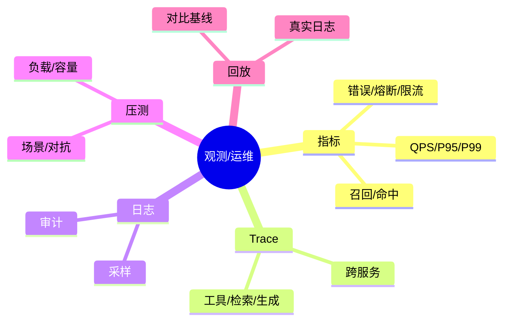

# 观测与运维：指标、Trace、压测与回放（Java 实践）

> 序号：0015 ｜ 主题：观测/运维 ｜ 目标：指标/日志/Trace 体系，压测与回放，含脑图/流程/代码/Q&A，约 1100+ 字。

## 脑图


## 流程


## Java 代码示例（Micrometer 指标）
```java
Counter errors = Counter.builder("app.errors").register(meterRegistry);
Timer timer = Timer.builder("app.llm.latency").publishPercentiles(0.5,0.95,0.99).register(meterRegistry);

public Mono<String> callLlm(String prompt) {
  return Mono.defer(() -> {
    long start = System.nanoTime();
    return llm.generate(prompt)
      .doOnSuccess(r -> timer.record(System.nanoTime() - start, TimeUnit.NANOSECONDS))
      .doOnError(e -> {
        errors.increment();
        timer.record(System.nanoTime() - start, TimeUnit.NANOSECONDS);
      });
  });
}
```

## 知识点
- 必会：指标分层（业务/系统/模型/检索）；P50/95/99；错误率；限流/熔断次数；召回/命中；日志采样；Trace 跨服务。
- 进阶：压测场景设计（峰值/稳态/对抗）；回放真实日志；基线对比；资源视图（CPU/内存/IO/GPU）；多租户隔离指标。
- 加分：自适应告警（异常检测）；合成用户；混沌演练；容量规划。

## 对比
- 压测 vs 回放：压测可控、合成；回放更贴近真实但需脱敏；两者结合。
- 日志全量 vs 采样：全量贵；采样配合审计与指标。

## 实战方案
1. 指标：Micrometer/OpenTelemetry；业务（召回/命中/满意度）、系统（QPS/P99/错误率）、资源（CPU/内存/IO/GPU）、安全（命中/误杀）。
2. Trace：跨服务 span，标注检索/重排/生成/工具调用；查看瓶颈。
3. 日志：结构化；采样；脱敏；审计分级；错误聚合。
4. 压测：场景库（高并发、长文本、对抗）；容量曲线；限流/熔断参数校准；观察 P99/错误率。
5. 回放：采样脱敏日志；控制并发；对比基线（延迟/召回/错误）；异常告警。

## 问答
1) 问：压测指标看什么？  
   答：P95/99、错误率、吞吐、资源利用、限流/熔断次数；检索召回；生成成功率。追问：如何定容量？→ 拐点与 SLO。

2) 问：Trace 如何帮助排障？  
   答：定位慢链路（检索/重排/生成/工具）；查看下游错误；分布式延迟分解。追问：采样率？→ 高优先级全采样，普通低采样。

3) 问：回放怎么做？  
   答：采样真实日志，脱敏；重放到预生产/压测环境；对比基线；监控差异。追问：风险？→ 严禁生产调用，隔离网络。

4) 问：告警如何设置？  
   答：阈值+异常检测；P99、错误率、限流/熔断、召回骤降；多级告警。追问：减少噪音？→ 抑制、合并、分级。

5) 问：日志与隐私？  
   答：脱敏/匿名化；不存敏感原文；访问控制；保留期。追问：审计需求？→ 按法规保存与稽核。
