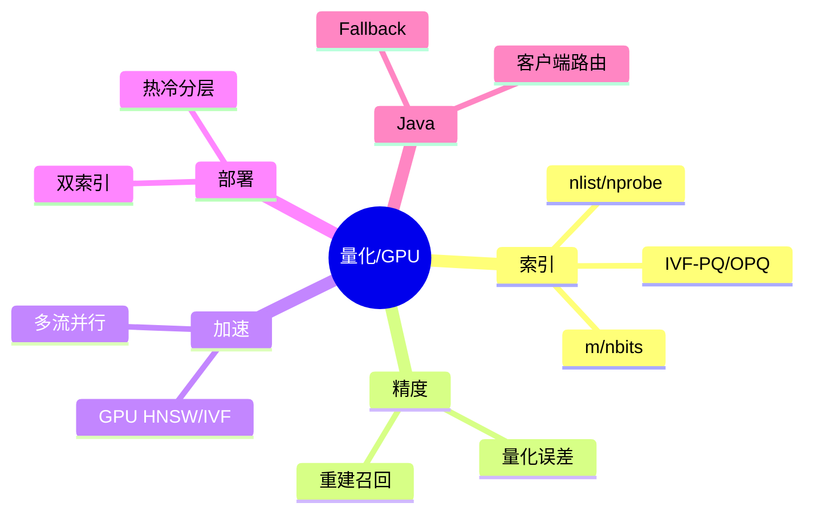
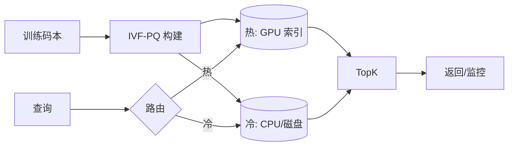

# 向量量化与 GPU 加速（Java 接入）

> 序号：0016 ｜ 主题：量化/GPU ｜ 目标：IVF-PQ/OPQ、量化误差、GPU 加速、混合部署，含脑图/流程/Java 代码/方案/Q&A，约 1100+ 字。

## 脑图


## 流程


## Java 代码示例（热冷路由）
```java
public Mono<SearchResult> search(VectorQuery q) {
  Backend target = q.isHot() ? gpuIndex : cpuIndex;
  return target.search(q)
      .timeout(Duration.ofMillis(target == gpuIndex ? 500 : 900))
      .onErrorResume(e -> fallback.search(q));
}
```

## 知识点
- 必会：IVF nlist/nprobe；PQ m/nbits；OPQ 降误差；召回与延迟折中；量化误差评估（Recall@K）。
- 进阶：热冷分层（热 GPU、冷 CPU/PQ）；双索引（全精度与量化并存）；动态调 nprobe；多流并行。
- 加分：GPU HNSW；自适应路由（高精度请求走全精度）；批处理；码本增量更新。

## 对比
- IVF-Flat vs IVF-PQ：前者精度高但占存储；后者压缩大幅省存储/延迟，精度下降需权衡。
- GPU vs CPU：GPU 吞吐/延迟优但成本高；可用热数据或高优先级请求。

## 实战方案
1. 码本训练：用代表性数据；监控重建误差；OPQ 旋转。
2. 索引布局：热 HNSW/IVF-Flat（GPU），冷 IVF-PQ（CPU/磁盘）；双索引灰度。
3. 查询路由：高价值/高精度 → 全精度；普通 → PQ；失败回退。
4. 调参：nprobe 曲线，m/nbits 与召回；GPU 多流；批处理。
5. 观测：召回、P95/99、GPU 利用、成本；码本版本；切换告警。

## 问答
1) 问：量化误差过大怎么办？  
   答：提高 m/nbits，或用 OPQ；头部用全精度；调大 nprobe；评估召回曲线。追问：不想全重建？→ 增量码本+双索引。

2) 问：GPU 资源紧张？  
   答：热数据/高优先级用 GPU，冷走 CPU；限流；批处理；夜间重建。追问：GPU 失败回退？→ 自动路由 CPU 索引。

3) 问：nlist/nprobe 如何选？  
   答：nlist≈sqrt(N) 起步；nprobe 通过离线曲线+线上 A/B；高精度请求临时升。追问：倾斜簇？→ 重训或分桶。

4) 问：双索引切换风险？  
   答：权重灰度；缓存隔离；监控召回/延迟；回滚开关。追问：缓存污染？→ key 带索引版本。

5) 问：Java 客户端注意？  
   答：池/超时/重试；区分热/冷目标；熔断；指标拆分 GPU/CPU。追问：如何避免过载？→ 限流+舱壁。
