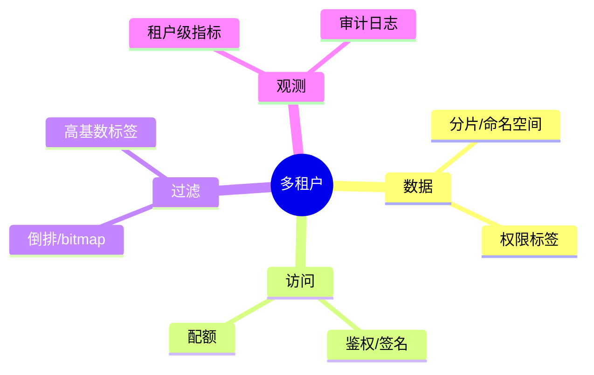

# 多租户隔离与权限过滤（Java 实践）

> 序号：0017 ｜ 主题：多租户/权限 ｜ 目标：分片、标签过滤、鉴权、审计，含脑图/流程/代码/Q&A，约 1100+ 字。

## 脑图


## 流程
```mermaid
flowchart LR
  A[鉴权/签名] --> B[租户解析]
  B --> C{路由分片/命名空间}
  C --> D[向量检索/过滤(标签/权限)]
  D --> E[结果去重/规则]
  E --> F[审计/配额计数]
```

## Java 代码示例（租户路由 + 权限过滤）
```java
public Mono<SearchResult> search(String tenant, Query q) {
  if (!authz.allowed(tenant, q.token())) return Mono.error(new ForbiddenException());
  String ns = namespaceOf(tenant);
  q.addFilter("tenant", tenant);
  return client.search(ns, q)
      .timeout(Duration.ofMillis(900))
      .onErrorResume(e -> Mono.just(SearchResult.empty()));
}
```

## 知识点
- 必会：租户隔离（分片/命名空间）；鉴权/签名；权限标签过滤；配额/限流；审计。
- 进阶：高基数标签 bitmap；多 Region 租户路由；缓存隔离；日志脱敏。
- 加分：租户级 SLO；自动热分片；租户配额动态调节；权限变更的索引同步。

## 对比
- 物理分片 vs 逻辑命名空间：物理隔离好但成本高；逻辑灵活但需防越权。
- 鉴权：JWT vs 签名；前者易用，后者适合服务端间安全。

## 实战方案
1. 路由：租户→命名空间/分片；同租户粘性；跨区合规控制。
2. 权限过滤：标签/bitmap 前置；高基数分桶；权限变更触发索引更新。
3. 配额/限流：租户级 QPS/并发/带宽；超限拒绝或降级。
4. 审计：记录租户/资源/耗时/结果码；脱敏；合规保留期；告警异常模式。
5. 安全：签名/鉴权；防重放；敏感字段不入日志；缓存隔离。

## 问答
1) 问：如何防越权？  
   答：每请求鉴权；过滤条件强制注入租户标签；服务器端验证；审计。追问：缓存越权？→ 缓存 key 带租户。

2) 问：高基数标签性能问题？  
   答：bitmap/倒排分桶；过滤前置；候选不足放宽或切高精度；监控膨胀。追问：膨胀过大？→ 重建压缩。

3) 问：配额怎么定？  
   答：按套餐/租户历史；QPS/并发/带宽；超限限流或降级；告警。追问：动态调整？→ 自动/人工调配额。

4) 问：跨 Region 租户？  
   答：本地优先；合规要求不出境；跨区容灾慎用；元数据同步。追问：数据一致性？→ 异步复制+版本。

5) 问：权限变更如何生效？  
   答：更新权限标签索引；缓存失效；记录审计。追问：延迟窗口风险？→ 提前刷新+短 TTL。
