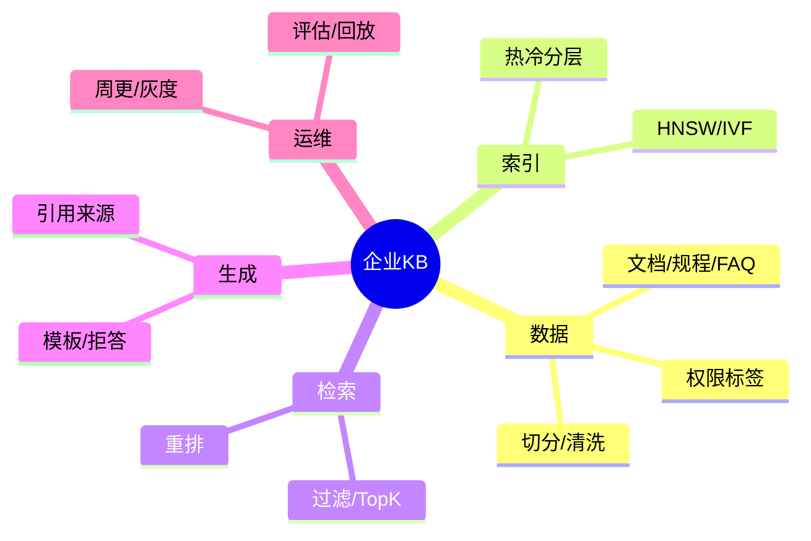
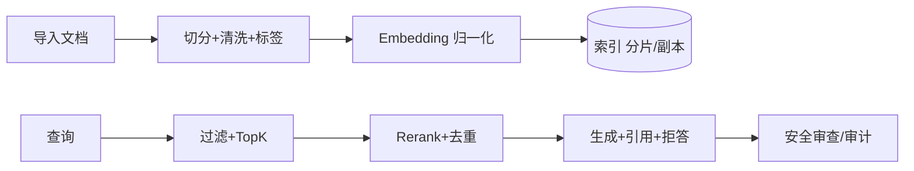

# 企业知识库 RAG 场景（Java 工程化）

> 序号：0018 ｜ 主题：企业知识库 ｜ 目标：面向企业文档/规程/FAQ 的 RAG 实施，含脑图/流程/Java 代码/方案/Q&A，约 1100+ 字。

## 脑图


## 流程


## Java 代码示例（引用来源的回答）
```java
public Mono<String> answer(String query) {
  return rag.searchWithSources(query, 30)
      .map(hits -> Reranker.topWithSources(hits, 8))
      .flatMap(ctx -> llm.generate(PromptTemplates.qaWithSources(ctx, query)))
      .map(OutputGuard::filter)
      .timeout(Duration.ofMillis(1500));
}
```

## 知识点
- 必会：语义切分+重叠；归一化；TopK+阈值；重排；引用来源；权限标签；周更索引。
- 进阶：多格式文档解析（PDF/表格）；热冷分层；日志回放；对抗集（提示注入、越权问法）。
- 加分：部门/角色定制模板；多语言；自动摘要；多模态（图表）；成本优化（缓存/路由）。

## 对比
- 纯生成 FAQ vs RAG：RAG 事实性强，需索引维护；纯生成易幻觉。
- HNSW vs IVF：HNSW 高精度，IVF 适合大规模；可组合热冷。

## 实战方案
1. 数据：清洗去冗余；OCR/表格结构化；标签（部门/机密级）；敏感脱敏。
2. 索引：租户/部门分片；热 HNSW，冷 IVF-PQ；权限标签入倒排；周更批量导入。
3. 检索：TopK 20~50；相似度阈值；重排 cross-encoder；去重；引用来源。
4. 生成：模板化（引用列表）；无上下文拒答；安全审查；多语言可选。
5. 评估：召回/事实性；对抗集；日志回放；P99/成本；灰度新索引。

## 问答
1) 问：如何保证回答引用真实来源？  
   答：生成模板强制列出处；阈值不足拒答；安全审查；抽样校验。追问：引用过多冗长？→ 只取 topN 去重。

2) 问：周更流程？  
   答：批量导入→增量索引→灰度对比召回/延迟→切换→回滚预案。追问：旧缓存？→ 按索引版本失效。

3) 问：越权提问如何防？  
   答：权限标签过滤；鉴权/签名；审计告警；缓存隔离。追问：高基数标签？→ 分桶/bitmap。

4) 问：PDF/表格处理？  
   答：OCR/表格解析；保持结构；切分时保行列上下文；评估效果。追问：图片内敏感？→ NSFW/敏感检测。

5) 问：如何降成本？  
   答：缓存 Prompt/Logits；路由小模型；冷数据 PQ；批处理；监控成本/请求。追问：质量损失监控？→ A/B 与抽检。
