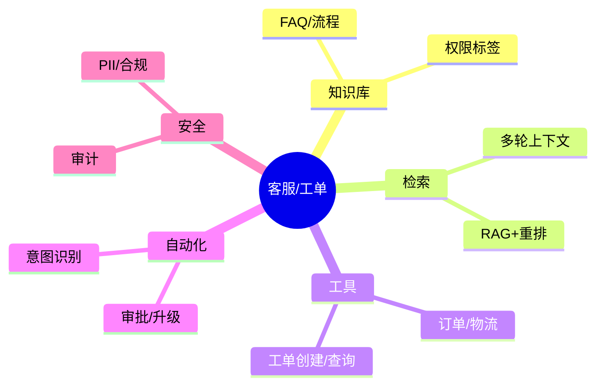
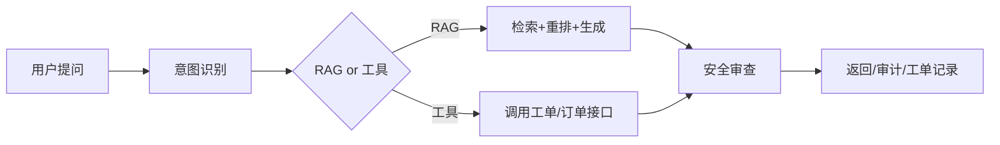

# 客服/工单自动化（RAG + 工具调用，Java 实践）

> 序号：0019 ｜ 主题：客服/工单 ｜ 目标：场景化 RAG、工单系统集成、工具调用，含脑图/流程/代码/Q&A，约 1100+ 字。

## 脑图


## 流程


## Java 代码示例（意图路由 + 工单调用）
```java
public Mono<String> handle(Request req) {
  Intent intent = intentService.classify(req.text());
  switch (intent) {
    case RAG: return rag.answer(req.text());
    case CREATE_TICKET: return ticketClient.create(req.userId(), req.text())
        .map(id -> "已为您创建工单：" + id);
    default: return Mono.just("请提供更多信息");
  }
}
```

## 知识点
- 必会：意图分类；RAG 召回；权限/PII 过滤；工单/订单工具调用；审计；多轮上下文管理。
- 进阶：多通道（语音/文本）；自动升级与分派；模板化回复；日志回放；满意度指标。
- 加分：多模态（截图识别）；自动摘要工单；对抗与敏感检测；成本优化（小模型优先）。

## 对比
- 纯 FAQ vs RAG vs 工具：FAQ 快但覆盖有限；RAG 事实性强；工具提供实时状态/写操作。
- 人工 vs 自动：自动节省成本但需审计/回退。

## 实战方案
1. 意图/槽位：分类器+规则；抽取订单号/设备号；缺信息引导补充。
2. RAG：知识库切分/标签；TopK+重排；引用来源；拒答模板。
3. 工具：工单创建/查询、订单/物流；参数校验；幂等；失败回退。
4. 安全：PII 识别与脱敏；合规日志；权限过滤；防越权工具调用。
5. 评估：召回/满意度；自动化率；转人工率；时延；对抗样本（恶意修改工单）。

## 问答
1) 问：如何防止越权创建/查看工单？  
   答：鉴权/签名；用户-工单绑定校验；审计；参数校验。追问：缓存？→ 缓存带租户/用户。

2) 问：RAG 回答不准怎么办？  
   答：优化切分与重排；增加引用；阈值不足拒答转人工；日志回放改进索引。追问：长尾问题？→ 对抗样本与长尾收集。

3) 问：多轮上下文如何保持？  
   答：会话 ID；截断策略；上下文缓存；安全过滤。追问：防提示注入？→ 系统指令固定，用户上下文隔离。

4) 问：工单自动化率怎么提升？  
   答：覆盖高频意图；工具稳定性；失败回退转人工；满意度闭环。追问：质量监控？→ 随机抽检与评分。

5) 问：PII 合规？  
   答：输入检测+脱敏；存储加密；日志不含原文；区域合规。追问：语音/截图？→ ASR/OCR 后再做 PII 检测。
