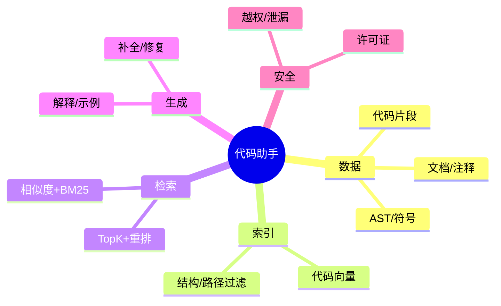

# 代码助手 / RAG for Code（Java 场景）

> 序号：0020 ｜ 主题：代码助手 ｜ 目标：面向代码搜索/解释/修复的 RAG，含脑图/流程/Java 代码/方案/Q&A，约 1100+ 字。

## 脑图


## 流程
```mermaid
flowchart LR
  A[代码/文档采集] --> B[切分+AST/符号抽取]
  B --> C[Embedding(归一化)]
  C --> D[(索引: 路径/语言标签)]
  E[查询: 自然语言/代码] --> F[过滤(语言/路径)]
  F --> G[TopK + rerank]
  G --> H[生成解释/补全]
  H --> I[安全审查(许可证/敏感)]
```

## Java 代码示例（路径过滤检索）
```java
public Mono<List<CodeHit>> searchCode(String q, String pathPrefix) {
  Query query = new Query(q).addFilter("path_prefix", pathPrefix);
  return codeIndex.search(query, 40)
      .map(hits -> Reranker.rerank(hits, 10))
      .timeout(Duration.ofMillis(1200));
}
```

## 知识点
- 必会：代码切分保结构；AST/符号/路径标签；向量+BM25 融合；重排；引用来源；许可证/敏感信息过滤。
- 进阶：语言检测；多仓/多分支；差异补丁对齐；补全/修复模板；对抗（恶意代码）检测。
- 加分：编译/单测回放；安全规则注入；本地缓存（依赖、常用代码）；增量索引。

## 对比
- 纯 Embedding vs 混合（BM25+向量）：混合对符号/关键词更稳；纯向量语义强但可能忽略标识符精确。
- 片段 vs 文件级：片段精度高，文件级上下文全；可分级检索。

## 实战方案
1. 数据：按函数/类切分；记录路径/包名/语言；过滤生成代码；脱敏凭证。
2. 索引：代码向量（归一化）；BM25 辅助；标签（language/path/module）；增量更新。
3. 检索：过滤语言/路径；TopK 50；重排；相似度阈值；引用来源。
4. 生成：解释/示例/修复；模板化输出；不确定时拒答；安全审查（许可证/敏感）。
5. 评估：匹配率、BLEU/CodeBLEU；人工抽检；对抗样本（恶意注入）；延迟/成本。

## 问答
1) 问：如何防止泄漏内部敏感代码？  
   答：权限过滤；仓库/路径白名单；脱敏；审计。追问：缓存？→ 带租户/仓库键。

2) 问：长文件如何处理？  
   答：按函数/类切分；保上下文窗口；路径过滤；重排；必要时层级检索。追问：跨文件依赖？→ 索引依赖关系或提供跳转。

3) 问：混合检索权重？  
   答：短 query 提高 BM25；长语义提高向量；A/B 调参；对照集验证。追问：符号精确度？→ 增加符号匹配特征。

4) 问：生成建议不可靠？  
   答：引用来源；阈值不足拒答；提示安全/测试建议；人工审查。追问：自动修复？→ 需在沙箱跑测试。

5) 问：多分支/多仓库支持？  
   答：索引带 repo/branch 标签；查询过滤；缓存隔离；增量更新。追问：分支漂移？→ 定期重建或合并差异索引。
