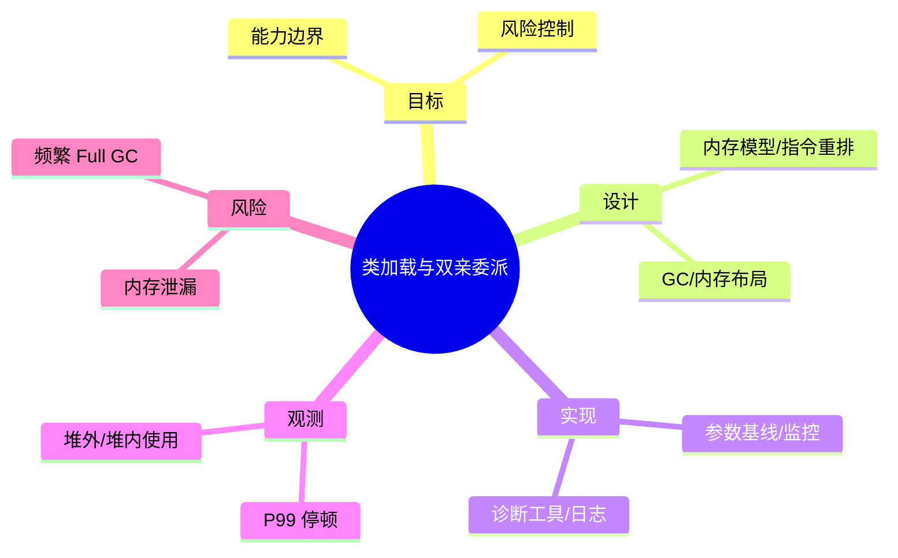

# 类加载与双亲委派

> 序号：0025 ｜ 主题：类加载与双亲委派 ｜ 目标：面向 类加载与双亲委派 的面试复习与工程化落地 ｜ 关键词：类加载与双亲委派、内存模型/指令重排、参数基线/监控、P99 停顿

## 脑图


## 流程


## 关键知识
- 必会：可见性/有序性；GC 算法与参数；类加载/字节码。
- 进阶：JIT/逃逸分析；Safepoint 诊断；堆转储分析。
- 加分：自定义 GC 日志解析；生产灰度调参；堆外内存治理。

## 关键指标
- P99 停顿：基线/阈值/趋势。
- 堆外/堆内使用：与容量/成本联动。

## 常见故障与排查
1. Full GC 频发 → 检查晋升失败/老年代碎片
2. STW 停顿高 → 降低晋升或切换收集器
3. 内存飙升 → 定位泄漏/缓存上限

## Java 代码示例（GC 日志与指标采集）
```java
public class GcMetrics {
  public static void install() {
    ManagementFactory.getGarbageCollectorMXBeans()
        .forEach(gc -> gc.getNotificationInfo());
  }
}
```

## 对比与取舍
- G1 vs ZGC：吞吐优先 vs 低延迟
- 串行 GC vs 并行 GC：简单稳定 vs 多核收益

|方案|优点|缺点|适用|
|---|---|---|---|
|G1|吞吐与可控停顿平衡|配置复杂|混合负载|
|ZGC|超低停顿|内存开销高|低延迟服务|

## 实战方案
1. 目标：明确业务目标与约束（延迟/成本/合规）。
2. 设计：按 内存模型/指令重排 与 GC/内存布局 拆分能力边界。
3. 实现：落地 参数基线/监控 与 诊断工具/日志，设置保护策略（超时/降级/限流）。
4. 观测：围绕 P99 停顿 与 堆外/堆内使用 建指标/告警。
5. 验证：压测+回放验证，灰度发布，必要时双写/回滚。

## 问答
1) 问：类加载与双亲委派中最关键的约束是什么？
   答：以目标指标为先（P99 停顿），同时控制 内存泄漏。追问：如何量化？→ 指标阈值+告警基线。

2) 问：如何做容量/性能基线？
   答：先压测得到吞吐/延迟曲线，再选 参数基线/监控 的安全水位。追问：压测不足？→ 回放生产流量。

3) 问：出现 频繁 Full GC 怎么定位？
   答：先看 堆外/堆内使用 与链路日志，再定位临界路径。追问：快速止损？→ 降级/限流。

4) 问：方案取舍怎么解释？
   答：依据 G1 vs ZGC：吞吐优先 vs 低延迟 的业务目标选择，确保可回滚。追问：怎么回滚？→ 灰度+双写策略。

5) 问：如何保证演进可控？
   答：持续评估与 A/B，对核心指标做防回归。追问：指标抖动？→ 稳态窗口+采样。

## 思路模板
- 场景题：1) 目标与约束；2) 方案与取舍；3) 关键参数；4) 观测与压测；5) 风险与缓解；6) 演进路径。
- 排查题：资源 → 参数 → 依赖 → 拓扑/分片 → 日志/链路 → 降级/应急。

## 示例与命令
```bash
java -Xms4g -Xmx4g -XX:+UseG1GC \
  -Xlog:gc*:file=gc.log:time,level,tags
```
