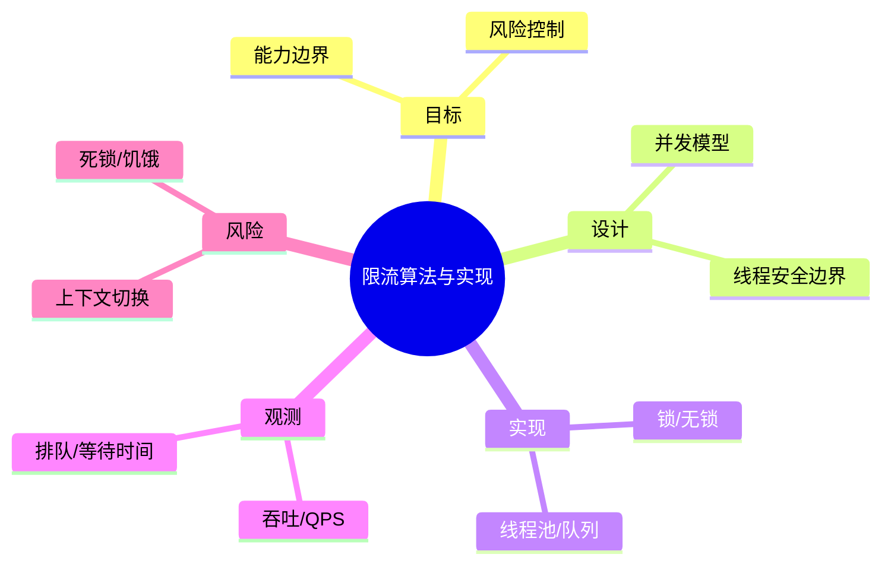

# 限流算法与实现

> 序号：0040 ｜ 主题：限流算法与实现 ｜ 目标：面向 限流算法与实现 的面试复习与工程化落地 ｜ 关键词：限流算法与实现、并发模型、锁/无锁、吞吐/QPS

## 脑图


## 流程


## 关键知识
- 必会：AQS/锁语义；线程池参数；可见性与原子性。
- 进阶：无锁结构；任务编排；竞争剖析。
- 加分：自适应并发；热点 Key 保护；限流与隔离。

## 关键指标
- 吞吐/QPS：基线/阈值/趋势。
- 排队/等待时间：与容量/成本联动。

## 常见故障与排查
1. 线程堆积 → 调整队列/拒绝策略
2. 锁竞争高 → 减少共享/分段
3. 响应抖动 → 限制并发

## Java 代码示例（线程池治理）
```java
ThreadPoolExecutor executor = new ThreadPoolExecutor(
  16, 64, 60, TimeUnit.SECONDS,
  new ArrayBlockingQueue<>(2000),
  new ThreadPoolExecutor.CallerRunsPolicy()
);
```

## 对比与取舍
- ReentrantLock vs synchronized：灵活性 vs 简单性
- LongAdder vs AtomicLong：高并发吞吐 vs 精确计数

|方案|优点|缺点|适用|
|---|---|---|---|
|锁|实现简单|可伸缩性一般|低并发|
|无锁|高吞吐|复杂/可见性要求|高并发|

## 实战方案
1. 目标：明确业务目标与约束（延迟/成本/合规）。
2. 设计：按 并发模型 与 线程安全边界 拆分能力边界。
3. 实现：落地 锁/无锁 与 线程池/队列，设置保护策略（超时/降级/限流）。
4. 观测：围绕 吞吐/QPS 与 排队/等待时间 建指标/告警。
5. 验证：压测+回放验证，灰度发布，必要时双写/回滚。

## 问答
1) 问：限流算法与实现中最关键的约束是什么？
   答：以目标指标为先（吞吐/QPS），同时控制 死锁/饥饿。追问：如何量化？→ 指标阈值+告警基线。

2) 问：如何做容量/性能基线？
   答：先压测得到吞吐/延迟曲线，再选 锁/无锁 的安全水位。追问：压测不足？→ 回放生产流量。

3) 问：出现 上下文切换 怎么定位？
   答：先看 排队/等待时间 与链路日志，再定位临界路径。追问：快速止损？→ 降级/限流。

4) 问：方案取舍怎么解释？
   答：依据 ReentrantLock vs synchronized：灵活性 vs 简单性 的业务目标选择，确保可回滚。追问：怎么回滚？→ 灰度+双写策略。

5) 问：如何保证演进可控？
   答：持续评估与 A/B，对核心指标做防回归。追问：指标抖动？→ 稳态窗口+采样。

## 思路模板
- 场景题：1) 目标与约束；2) 方案与取舍；3) 关键参数；4) 观测与压测；5) 风险与缓解；6) 演进路径。
- 排查题：资源 → 参数 → 依赖 → 拓扑/分片 → 日志/链路 → 降级/应急。

## 示例与命令
```bash
jcmd <pid> Thread.print
```
