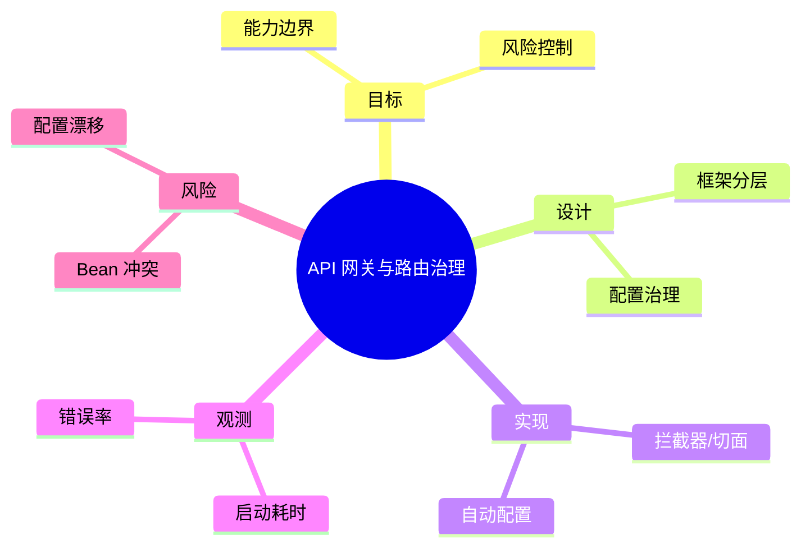

# API 网关与路由治理

> 序号：0048 ｜ 主题：API 网关与路由治理 ｜ 目标：面向 API 网关与路由治理 的面试复习与工程化落地 ｜ 关键词：API 网关与路由治理、框架分层、拦截器/切面、启动耗时

## 脑图


## 流程


## 关键知识
- 必会：生命周期/依赖注入；事务传播；异常处理。
- 进阶：AOP/拦截；条件装配；配置热更新。
- 加分：Starter 复用；治理面板；灰度配置。

## 关键指标
- 启动耗时：基线/阈值/趋势。
- 错误率：与容量/成本联动。

## 常见故障与排查
1. Bean 循环依赖 → 设计拆分/懒加载
2. 配置不一致 → 统一源+回滚
3. 启动慢 → 精简自动配置

## Java 代码示例（统一异常处理）
```java
@RestControllerAdvice
public class ErrorHandler {
  @ExceptionHandler(Exception.class)
  public ResponseEntity<?> onError(Exception e) {
    return ResponseEntity.status(500).body(Map.of("msg", e.getMessage()));
  }
}
```

## 对比与取舍
- MVC vs WebFlux：线程模型/背压
- 配置中心 vs 本地配置：一致性 vs 简单

|方案|优点|缺点|适用|
|---|---|---|---|
|MVC|生态成熟|阻塞线程|传统请求|
|WebFlux|高并发|学习成本|IO 密集|

## 实战方案
1. 目标：明确业务目标与约束（延迟/成本/合规）。
2. 设计：按 框架分层 与 配置治理 拆分能力边界。
3. 实现：落地 拦截器/切面 与 自动配置，设置保护策略（超时/降级/限流）。
4. 观测：围绕 启动耗时 与 错误率 建指标/告警。
5. 验证：压测+回放验证，灰度发布，必要时双写/回滚。

## 问答
1) 问：API 网关与路由治理中最关键的约束是什么？
   答：以目标指标为先（启动耗时），同时控制 Bean 冲突。追问：如何量化？→ 指标阈值+告警基线。

2) 问：如何做容量/性能基线？
   答：先压测得到吞吐/延迟曲线，再选 拦截器/切面 的安全水位。追问：压测不足？→ 回放生产流量。

3) 问：出现 配置漂移 怎么定位？
   答：先看 错误率 与链路日志，再定位临界路径。追问：快速止损？→ 降级/限流。

4) 问：方案取舍怎么解释？
   答：依据 MVC vs WebFlux：线程模型/背压 的业务目标选择，确保可回滚。追问：怎么回滚？→ 灰度+双写策略。

5) 问：如何保证演进可控？
   答：持续评估与 A/B，对核心指标做防回归。追问：指标抖动？→ 稳态窗口+采样。

## 思路模板
- 场景题：1) 目标与约束；2) 方案与取舍；3) 关键参数；4) 观测与压测；5) 风险与缓解；6) 演进路径。
- 排查题：资源 → 参数 → 依赖 → 拓扑/分片 → 日志/链路 → 降级/应急。

## 示例与命令
```bash
./mvnw spring-boot:run
```
