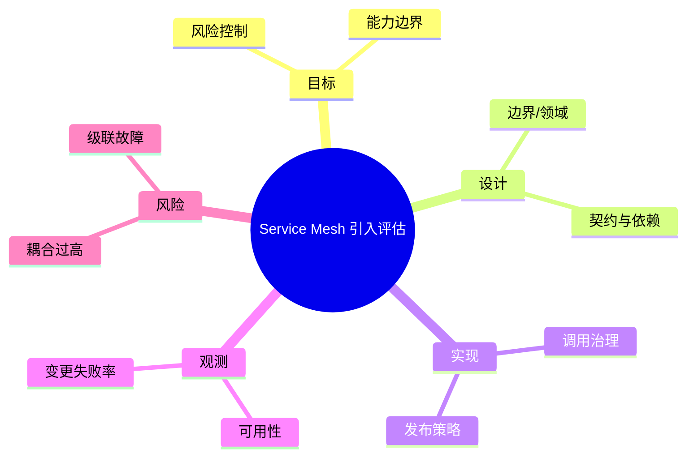

# Service Mesh 引入评估

> 序号：0056 ｜ 主题：Service Mesh 引入评估 ｜ 目标：面向 Service Mesh 引入评估 的面试复习与工程化落地 ｜ 关键词：Service Mesh 引入评估、边界/领域、调用治理、可用性

## 脑图


## 流程


## 关键知识
- 必会：拆分原则；分布式事务；容错与降级。
- 进阶：SLO/错误预算；多活策略；流量治理。
- 加分：服务网格；全链路治理；多租户隔离。

## 关键指标
- 可用性：基线/阈值/趋势。
- 变更失败率：与容量/成本联动。

## 常见故障与排查
1. 调用链过深 → 合并/缓存
2. 故障扩散 → 熔断隔离
3. 版本不兼容 → 协议治理

## Java 代码示例（服务降级示例）
```java
public String fallback() {
  return "degraded";
}
```

## 对比与取舍
- TCC vs Saga：强一致 vs 最终一致
- 蓝绿 vs 金丝雀：风险控制

|方案|优点|缺点|适用|
|---|---|---|---|
|TCC|强一致|实现复杂|资金类|
|Saga|高可用|补偿复杂|业务流程|

## 实战方案
1. 目标：明确业务目标与约束（延迟/成本/合规）。
2. 设计：按 边界/领域 与 契约与依赖 拆分能力边界。
3. 实现：落地 调用治理 与 发布策略，设置保护策略（超时/降级/限流）。
4. 观测：围绕 可用性 与 变更失败率 建指标/告警。
5. 验证：压测+回放验证，灰度发布，必要时双写/回滚。

## 问答
1) 问：Service Mesh 引入评估中最关键的约束是什么？
   答：以目标指标为先（可用性），同时控制 耦合过高。追问：如何量化？→ 指标阈值+告警基线。

2) 问：如何做容量/性能基线？
   答：先压测得到吞吐/延迟曲线，再选 调用治理 的安全水位。追问：压测不足？→ 回放生产流量。

3) 问：出现 级联故障 怎么定位？
   答：先看 变更失败率 与链路日志，再定位临界路径。追问：快速止损？→ 降级/限流。

4) 问：方案取舍怎么解释？
   答：依据 TCC vs Saga：强一致 vs 最终一致 的业务目标选择，确保可回滚。追问：怎么回滚？→ 灰度+双写策略。

5) 问：如何保证演进可控？
   答：持续评估与 A/B，对核心指标做防回归。追问：指标抖动？→ 稳态窗口+采样。

## 思路模板
- 场景题：1) 目标与约束；2) 方案与取舍；3) 关键参数；4) 观测与压测；5) 风险与缓解；6) 演进路径。
- 排查题：资源 → 参数 → 依赖 → 拓扑/分片 → 日志/链路 → 降级/应急。

## 示例与命令
```bash
curl -X POST http://gateway/api/v1/health
```
